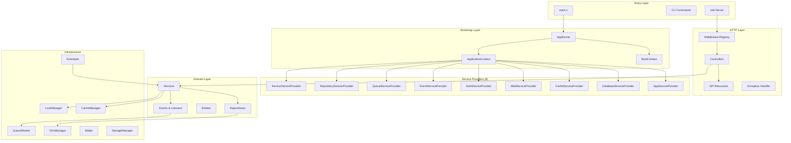

# PhotonBlog

> A production-grade blog/CMS API skeleton built with [Photon Framework](../) — the enterprise-grade V language framework inspired by Spring Boot and Laravel.

PhotonBlog is designed as a **skeleton project** demonstrating best practices for building V language applications with Photon Framework. It showcases all 17 framework modules with Laravel-level code quality and encapsulation: ServiceProvider-based DI, annotation-driven routing, repository pattern, API Resources, factories, seeders, migrations, and a complete CLI toolkit.

---

## Features

- **ServiceProvider Architecture** — 9 service providers with `register()` + `boot()` lifecycle (Laravel-style)
- **Authentication & Authorization** — JWT-based auth with configurable role hierarchy (ADMIN > EDITOR > USER)
- **Blog Content Management** — Posts, categories, tags, and nested comments with full CRUD + soft delete
- **Repository Pattern** — Type-safe data access with filter structs (PostFilter, UserFilter, CommentFilter)
- **API Resources** — Laravel-style response transformation layer with field masking (password hidden)
- **Database Migrations** — Versioned schema migrations with rollback/fresh/refresh/reset
- **Factories & Seeders** — Builder-pattern factories + idempotent seeders for test data
- **Caching** — Singleflight cache stampede prevention + tag-based bulk invalidation
- **Locking** — RAII LockGuard for concurrent post updates and stats aggregation
- **Event-Driven Architecture** — Domain events (user.registered, post.published) with async listeners
- **Background Jobs** — Queue-based email delivery and statistics aggregation
- **Scheduled Tasks** — Cron-style periodic jobs (stats aggregation, cache warmup)
- **Security** — CSRF protection (Double-Submit Cookie), JWT validation, Bcrypt hashing, rate limiting
- **API Documentation** — Runtime interactive docs at `/__docs` + static doc generation (`make docs`)
- **CLI Toolkit** — 22+ commands including `make:*` code generators (controller/model/migration/middleware/provider/command/resource/seeder/factory)
- **Unified Response Format** — `web.Result` envelope with success/code/message/data/timestamp/path
- **Exception Handling** — HttpException hierarchy (400/401/403/404/422/500) with registry
- **Transaction Management** — RAII TransactionGuard for atomic operations

---

## Quick Start

### Prerequisites

- [V language](https://vlang.io/) compiler (>= 0.4.x, recommended 0.5.x)
- Photon Framework (located at `../` relative to this directory)
- Make, Docker (optional)

### One-Command Setup

```bash
make setup    # Build + migrate + seed in one step
```

### Manual Setup

```bash
make build          # Compile the binary
make migrate        # Run database migrations
make seed           # Insert seed data (1 admin + 2 editors + 5 users + 10 posts + 20 comments)
make serve          # Start HTTP server (default: 0.0.0.0:8080)
```

### Development Mode

```bash
make dev            # Build + run with hot-reload-friendly settings
make test           # Run all tests
make docs           # Generate static API docs to docs/api/
```

### Verify

```bash
curl http://localhost:8080/health
curl http://localhost:8080/ping
curl http://localhost:8080/              # API info
open http://localhost:8080/__docs        # Interactive API docs (dev only)
```

---

## Configuration

PhotonBlog supports three profiles: **dev** (default), **prod**, and **test**.

| Profile | Debug | Log Level | Database       | Port | API Docs |
|---------|-------|-----------|----------------|------|----------|
| dev     | true  | debug     | SQLite :memory:| 8080 | Enabled  |
| prod    | false | info      | SQLite file    | 80   | Disabled |
| test    | true  | error     | SQLite :memory:| 0    | Disabled |

### Environment Files

| File              | Purpose                                      |
|-------------------|----------------------------------------------|
| `.env`            | Development environment (auto-loaded)        |
| `.env.example`    | Template with all variables documented       |
| `.env.prod.example`| Production template (copy to `.env.prod`)   |
| `.env.testing`    | Test environment (in-memory DB, error logs)  |

### Key Environment Variables

| Env Var                | Default              | Description                     |
|------------------------|----------------------|---------------------------------|
| `APP_PROFILE`          | dev                  | Profile (dev/prod/test)         |
| `APP_DEBUG`            | true                 | Debug mode                      |
| `APP_SERVER_HOST`      | 0.0.0.0              | Listen address                  |
| `APP_SERVER_PORT`      | 8080                 | Listen port                     |
| `APP_DATABASE_PATH`    | :memory:             | SQLite database path            |
| `APP_JWT_SECRET`       | (required in prod)   | JWT signing secret              |
| `APP_CACHE_TTL`        | 3600                 | Default cache TTL (seconds)     |
| `APP_MAIL_DRIVER`      | log                  | Mail driver (log/smtp)          |
| `APP_STORAGE_BASE_PATH`| storage/uploads      | File upload directory           |

Example:

```bash
APP_PROFILE=prod APP_SERVER_PORT=3000 APP_JWT_SECRET=my-secret ./demo serve
```

---

## API Endpoints

### System

| Method | Path             | Auth | Description         |
|--------|------------------|------|---------------------|
| GET    | `/`              | -    | API info            |
| GET    | `/health`        | -    | Health check        |
| GET    | `/ping`          | -    | Connectivity test   |
| GET    | `/stats`         | -    | Blog statistics     |
| GET    | `/__docs`        | -    | Interactive API docs (dev) |

### Auth

| Method | Path                          | Auth | Description          |
|--------|-------------------------------|------|----------------------|
| POST   | `/api/v1/auth/register`       | -    | User registration    |
| POST   | `/api/v1/auth/login`          | -    | Login (returns JWT)  |
| POST   | `/api/v1/auth/refresh`        | JWT  | Refresh token        |
| GET    | `/api/v1/auth/profile`        | JWT  | Current user profile |
| POST   | `/api/v1/auth/logout`         | JWT  | Logout               |

### Users (ADMIN)

| Method | Path                   | Auth  | Description       |
|--------|------------------------|-------|-------------------|
| GET    | `/api/v1/users`        | ADMIN | List users (paged)|
| GET    | `/api/v1/users/:id`    | ADMIN | User detail       |
| POST   | `/api/v1/users`        | ADMIN | Create user       |
| PUT    | `/api/v1/users/:id`    | ADMIN | Update user       |
| DELETE | `/api/v1/users/:id`    | ADMIN | Delete user       |

### Posts

| Method | Path                          | Auth     | Description           |
|--------|-------------------------------|----------|-----------------------|
| GET    | `/api/v1/posts`               | -        | List posts (paged)    |
| GET    | `/api/v1/posts/:id`           | -        | Post detail           |
| POST   | `/api/v1/posts`               | EDITOR+  | Create post           |
| PUT    | `/api/v1/posts/:id`           | EDITOR+  | Update post           |
| DELETE | `/api/v1/posts/:id`           | ADMIN    | Delete post           |

### Comments

| Method | Path                                  | Auth         | Description        |
|--------|---------------------------------------|--------------|--------------------|
| GET    | `/api/v1/posts/:id/comments`          | -            | List comments      |
| POST   | `/api/v1/posts/:id/comments`          | USER+        | Create comment     |
| DELETE | `/api/v1/comments/:id`                | ADMIN/Owner  | Delete comment     |

### Categories & Tags

| Method | Path                        | Auth     | Description       |
|--------|-----------------------------|----------|-------------------|
| GET    | `/api/v1/categories`        | -        | List categories   |
| POST   | `/api/v1/categories`        | ADMIN    | Create category   |
| GET    | `/api/v1/tags`              | -        | List tags         |
| POST   | `/api/v1/tags`              | EDITOR+  | Create tag        |

### File Uploads

| Method | Path                        | Auth     | Description          |
|--------|-----------------------------|----------|----------------------|
| POST   | `/api/v1/uploads/avatar`    | USER+    | Upload avatar (2MB)  |
| POST   | `/api/v1/uploads/image`     | EDITOR+  | Upload image (5MB)   |
| GET    | `/api/v1/uploads/:file`     | -        | Access uploaded file |

### Response Format

All API responses use the unified envelope:

```json
{
  "success": true,
  "code": 200,
  "message": "OK",
  "data": { ... },
  "timestamp": 1719000000,
  "path": "/api/v1/..."
}
```

Paginated responses include metadata:

```json
{
  "success": true,
  "code": 200,
  "data": [...],
  "meta": {
    "current_page": 1,
    "per_page": 15,
    "total": 42,
    "last_page": 3,
    "from": 1,
    "to": 15
  }
}
```

---

## Architecture



### Directory Structure

```
PhotonBlog/
├── main.v                    # Application entry point
├── app.v                     # veb App struct + Context
├── bootstrap.v               # Thin wrapper → AppKernel
├── config.v                  # Root config (load_config + validation)
├── controllers.v             # HTTP controllers (33+ endpoints)
├── models.v                  # Entity definitions (User, Post, Comment, etc.)
├── repositories.v            # Repository layer (BaseRepository)
├── repository_filters.v      # Filter structs (PostFilter, UserFilter)
├── services.v                # Business logic services
├── events.v                  # Domain events + listeners
├── jobs.v                    # Queue jobs (email, stats, cleanup)
├── middleware.v              # Middleware implementations (7 middlewares)
├── commands.v                # CLI commands (22+ commands)
├── scheduler.v               # Scheduled task registration
├── database.v                # DB connection + migration manager
├── helpers.v                 # Utility functions
├── transactional.v           # TransactionGuard RAII
├── emails.v                  # Email templates
├── Makefile                  # 40+ build targets
├── Dockerfile                # Multi-stage container build
├── docker-compose.yml        # Development orchestration
├── docker-compose.prod.yml   # Production orchestration
│
├── bootstrap/                # Application kernel
│   ├── app.v                 # AppKernel (ServiceProvider orchestration)
│   └── console.v             # Banner + route printing
│
├── config/                   # Per-concern config files
│   ├── app.v                 # AppConfig
│   ├── database.v            # DatabaseConfig
│   ├── jwt.v                 # JwtConfig (+ production validation)
│   ├── cache.v               # CacheConfig
│   ├── mail.v                # MailConfig
│   ├── storage.v             # StorageConfig
│   ├── logging.v             # LoggingConfig
│   ├── web.v                 # WebConfig (CORS, rate limit)
│   └── auth.v                # AuthConfig (role hierarchy)
│
├── providers/                # 9 ServiceProviders + BootContext
│   ├── boot_context.v        # Shared mutable state container
│   ├── app_service_provider.v
│   ├── database_service_provider.v
│   ├── cache_service_provider.v
│   ├── web_service_provider.v
│   ├── auth_service_provider.v
│   ├── event_service_provider.v
│   ├── queue_service_provider.v
│   ├── repository_service_provider.v
│   └── service_service_provider.v
│
├── app/Http/                 # HTTP layer
│   ├── Kernel.v              # HTTP kernel (response helpers)
│   ├── Middleware/
│   │   └── registry.v        # MiddlewareGroupRegistry (named groups)
│   └── Resources/            # API Resource transformers
│       ├── user_resource.v
│       ├── post_resource.v
│       ├── comment_resource.v
│       ├── category_tag_resource.v
│       └── collection.v       # ResourceCollection[T]
│
├── database/                 # Database layer
│   ├── migrations/           # Versioned migration files
│   ├── seeders/              # Database seeders
│   └── factories/            # Model factories (Builder pattern)
│
├── routes/                   # Route group metadata
│   ├── api.v                 # API route group (/api/v1)
│   └── web.v                 # Web route group
│
└── tests/                    # Test base classes (Task 24)
```

### Module Coverage

PhotonBlog integrates all 17 Photon Framework modules:

| Module    | Usage in PhotonBlog                                    |
|-----------|--------------------------------------------------------|
| core      | ApplicationContext, ServiceProvider, EventBus          |
| config    | Multi-source config (Map + Env), profile-based loading |
| log       | Structured logging with levels and request ID tracing  |
| cache     | Singleflight + TaggedCache for posts, stats            |
| orm       | Entity mapping, repositories, migrations, transactions|
| pool      | Database connection pooling                            |
| lock      | LockGuard RAII for concurrent post updates             |
| web       | veb routing, middleware, validation, uploads, Result   |
| security  | JWT auth, Bcrypt, RoleHierarchy, CsrfManager           |
| http      | RestTemplate (GitHub avatar fetch with timeout/retry)  |
| mailer    | Welcome emails, comment notifications (SMTP/Log)       |
| storage   | Local file storage for uploads                         |
| queue     | Background jobs (email, stats aggregation)             |
| ticker    | Scheduled tasks (cron-style periodic jobs)             |
| cli       | CLI command system + make:* code generators            |
| apidoc    | Runtime API docs collector + OpenAPI export            |
| support   | Pagination, collections, sorting utilities             |

---

## CLI Commands

### Business Commands

```bash
./demo serve                # Start HTTP server (--port/--host)
./demo migrate              # Run database migrations
./demo migrate:rollback     # Rollback last batch
./demo migrate:status       # Show migration status
./demo migrate:fresh        # Drop all tables + re-migrate (--seed)
./demo migrate:refresh      # Rollback all + re-migrate (--seed)
./demo migrate:reset        # Rollback all migrations
./demo seed                 # Seed data (--only=users|posts|comments)
./demo queue:work           # Start queue worker
./demo scheduler:run        # Start scheduler
./demo stats                # Print blog statistics
./demo routes               # Print route table
./demo docs                 # Generate API docs (--format=markdown|html)
```

### Code Generation (make:*)

```bash
./demo make:controller PostController        # Generate controller
./demo make:model Post                       # Generate entity + repository
./demo make:migration create_posts_table     # Generate migration
./demo make:middleware AuthMiddleware         # Generate middleware
./demo make:provider CacheServiceProvider    # Generate service provider
./demo make:command SendEmailCommand         # Generate CLI command
./demo make:resource PostResource            # Generate API resource
./demo make:seeder PostSeeder                # Generate seeder
./demo make:factory PostFactory              # Generate factory
./demo make:entity Post                      # Generate entity only
```

### Make Aliases

All `make:*` commands have Make aliases: `make make-controller NAME=PostController`

---

## Make Targets

### Quick Reference

| Target                    | Description                          |
|---------------------------|--------------------------------------|
| `make setup`              | One-command init (build + migrate + seed) |
| `make dev`                | Development mode (build + run)       |
| `make build`              | Compile binary                       |
| `make run`                | Run without rebuilding               |
| `make test`               | Run all tests                        |
| `make migrate-fresh-seed` | Reset DB + seed (one command)        |
| `make docs`               | Generate API documentation           |
| `make docker-up`          | Start Docker containers              |
| `make help`               | Show all targets                     |

---

## Deployment

### Docker

```bash
# Development
make docker-up              # Start with docker-compose.yml

# Production
make docker-prod-up         # Start with docker-compose.prod.yml
```

### Binary

```bash
make release                # Build optimized release binary
scp demo user@server:/opt/photonblog/
APP_PROFILE=prod APP_JWT_SECRET=your-secret ./demo serve
```

---

## Testing

```bash
make test                   # Run all tests
make test-verbose           # Run with verbose output
make coverage               # Generate coverage report
```

### Test Categories

- **Unit Tests** — Services, repositories, models, middleware
- **Integration Tests** — Full request lifecycle, controller endpoints
- **Validation Tests** — DTO validation rules (required/email/min_len/max_len)
- **Exception Tests** — HttpException hierarchy and status codes
- **Resource Tests** — API Resource field masking (password hidden)
- **Pagination Tests** — LengthAwarePaginator metadata
- **Transaction Tests** — TransactionGuard RAII commit/rollback

---

## Development

### Project Conventions

- **V Style**: `snake_case` for files/variables, `PascalCase` for structs/traits
- **Compile Flag**: All builds use `-enable-globals`
- **No Hardcoding**: All configurable values read from config system
- **Error Handling**: V's `!` error propagation with `or` blocks
- **DI Pattern**: ServiceProvider `register()` + `boot()` lifecycle
- **Response Format**: Unified `web.Result` envelope via `ctx.send_result()`
- **Validation**: `@[validate]` attributes on DTO structs

### Contributing

See [CONTRIBUTING.md](CONTRIBUTING.md) for development setup, code standards, and PR process.

### Architecture Details

See [docs/architecture.md](docs/architecture.md) for request lifecycle, DI container, data flow, and design decisions.

### Changelog

See [CHANGELOG.md](CHANGELOG.md) for version history.

---

## License

MIT — Part of the Photon Framework project.
