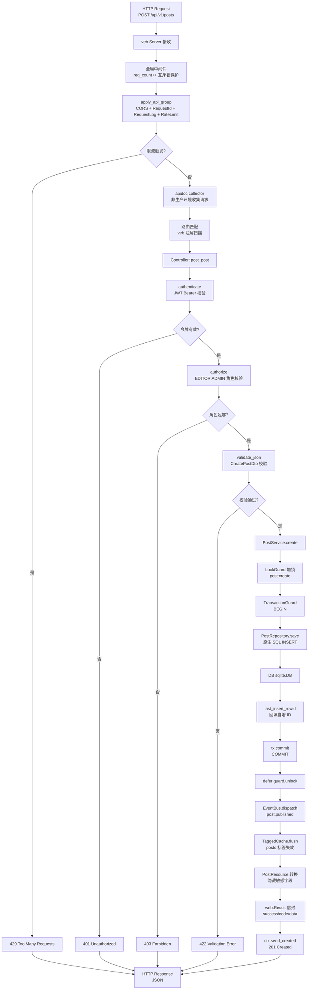
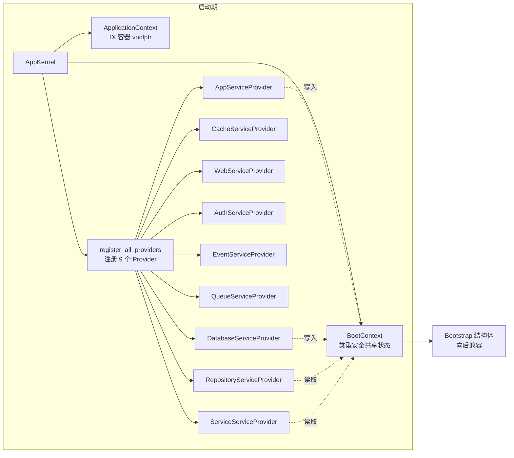
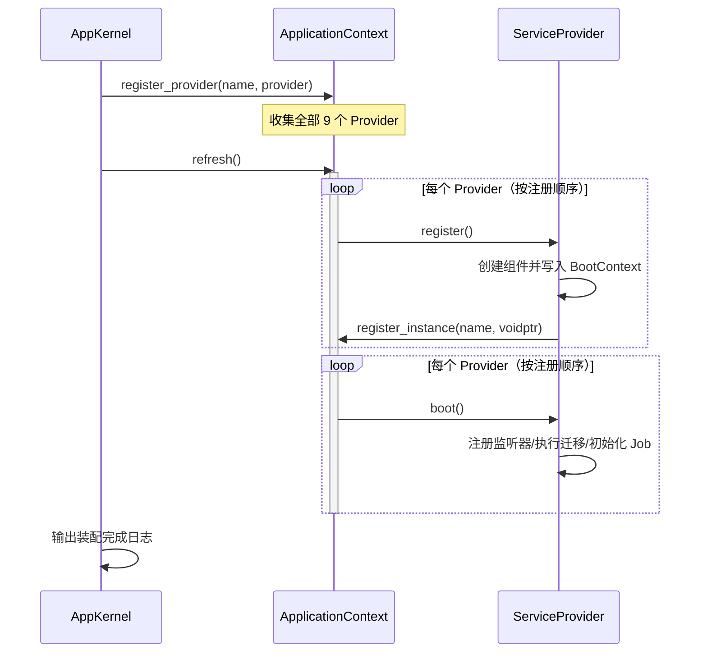
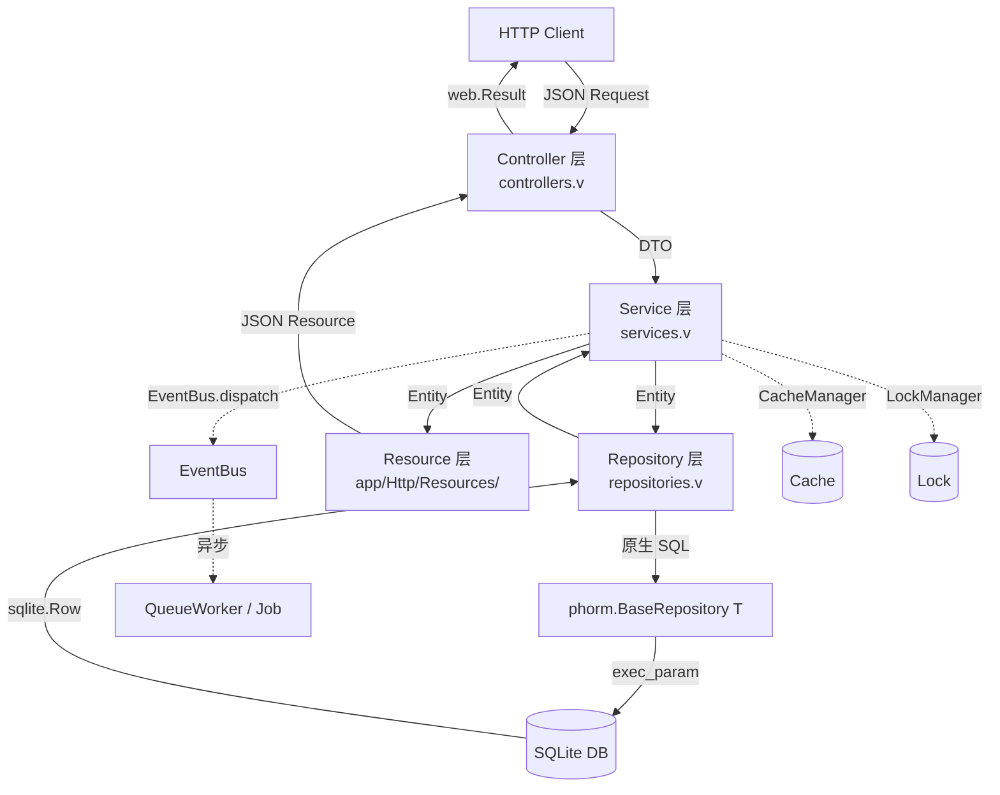
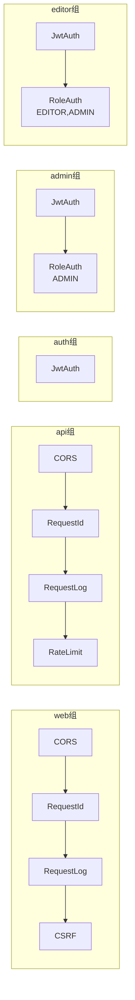
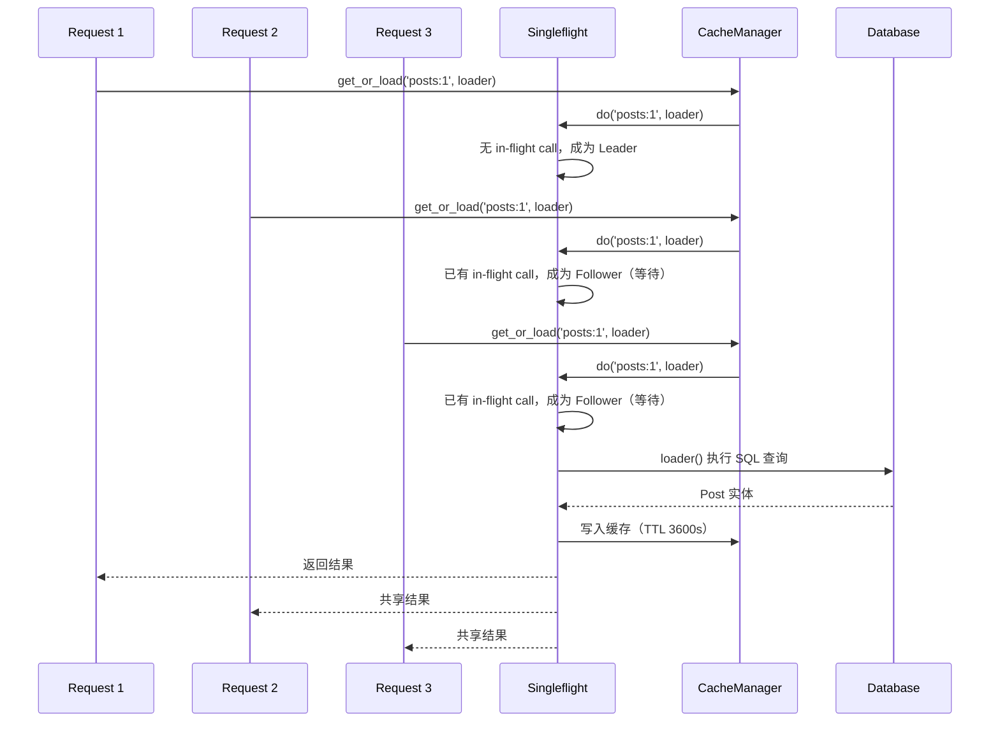
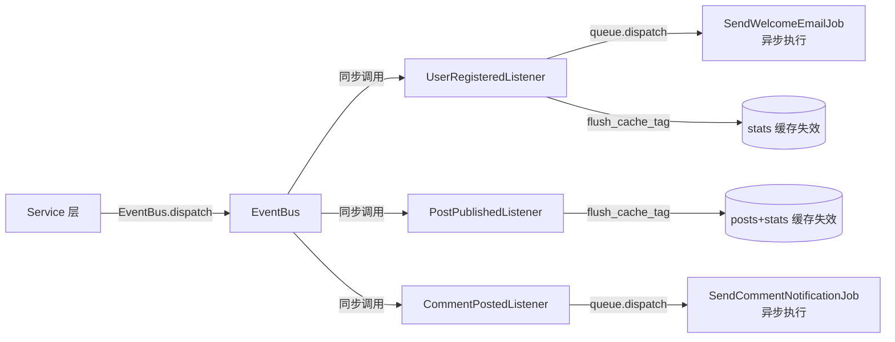
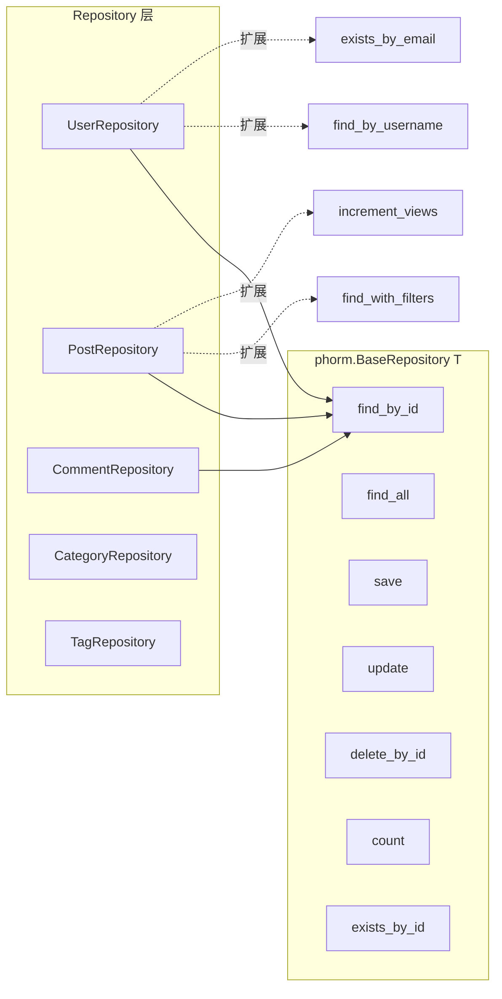

# PhotonBlog 架构文档

> **版本**：0.1.0 · **状态**：GA（Skeleton Grade）· **最后更新**：2026-06-20
>
> 本文档描述 PhotonBlog Demo 项目的整体架构、模块拓扑、数据流与关键设计决策，
> 面向希望基于本项目二次开发的工程师与架构师。所有代码引用均对应 `Demo/` 目录下的实际实现。

---

## 目录

1. [Overview（项目概览）](#1-overview项目概览)
2. [Request Lifecycle（请求生命周期）](#2-request-lifecycle请求生命周期)
3. [Dependency Injection Container（依赖注入容器）](#3-dependency-injection-container依赖注入容器)
4. [Service Provider Lifecycle（服务提供者生命周期）](#4-service-provider-lifecycle服务提供者生命周期)
5. [Data Flow（数据流）](#5-data-flow数据流)
6. [Middleware Chain（中间件链）](#6-middleware-chain中间件链)
7. [Caching Strategy（缓存策略）](#7-caching-strategy缓存策略)
8. [Locking Strategy（锁策略）](#8-locking-strategy锁策略)
9. [Event-Driven Architecture（事件驱动架构）](#9-event-driven-architecture事件驱动架构)
10. [Security Architecture（安全架构）](#10-security-architecture安全架构)
11. [Database Layer（数据库层）](#11-database-layer数据库层)
12. [API Resource Pattern（API 资源模式）](#12-api-resource-patternapi-资源模式)
13. [Design Decisions（设计决策）](#13-design-decisions设计决策)
14. [Module Dependency Graph（模块依赖图）](#14-module-dependency-graph模块依赖图)

---

## 1. Overview（项目概览）

### 1.1 项目定位

PhotonBlog 是基于 [Photon Framework](../) 构建的**生产级博客 / CMS API 骨架项目**（Skeleton Project）。
它的核心使命不是"做一个博客"，而是**作为 V 语言企业级应用的最佳实践模板**——开发者 fork 本项目后，
通过替换领域模型即可快速搭建自己的后端服务。

项目对标 Spring Boot Initializr 生成的参考实现与 Laravel 官方示例应用，覆盖一个真实业务系统所需的全部横切关注点：

| 关注点 | 实现方式 | 对标框架 |
|--------|----------|----------|
| 依赖注入 | 9 个 ServiceProvider + BootContext | Laravel Service Provider / Spring @Configuration |
| HTTP 路由 | veb 注解驱动（`@[get]` / `@['/path']`） | Spring MVC @RequestMapping |
| 认证授权 | JWT Bearer + RoleHierarchy（RBAC） | Spring Security / Laravel Sanctum |
| 数据访问 | Repository 模式 + Filter 结构体 | Spring Data JPA / Laravel Eloquent |
| 响应转换 | API Resource（字段脱敏） | Laravel API Resources |
| 缓存 | Singleflight 削峰 + TaggedCache 批量失效 | Laravel Cache Tags |
| 并发控制 | LockGuard RAII | Java synchronized / Redis Lock |
| 事件驱动 | EventBus + 领域事件 + 异步 Job | Spring ApplicationEvent / Laravel Events |
| 数据库迁移 | 版本化 Migration（up/down） | Laravel Migrations / Flyway |
| API 文档 | 运行时 `/__docs` + OpenAPI 导出 | Springdoc OpenAPI / Swagger |

### 1.2 技术栈

- **语言**：V 0.4.x+（推荐 0.5.x），零运行时反射
- **Web 框架**：veb（V 官方 HTTP 框架）+ Photon web 模块增强
- **数据库**：SQLite（默认，可切换），通过 Photon ORM 抽象
- **配置**：多 profile（dev / prod / test）+ `.env` 环境变量
- **部署**：Docker + docker-compose（含 prod 编排）

### 1.3 项目结构

```
Demo/
├── app/
│   ├── Http/
│   │   ├── Kernel.v              # HTTP 内核（统一响应 + 异常处理）
│   │   ├── Middleware/
│   │   │   └── registry.v        # MiddlewareGroupRegistry（5 个命名组）
│   │   └── Resources/            # API Resource（响应转换层）
│   │       ├── post_resource.v
│   │       ├── user_resource.v
│   │       ├── comment_resource.v
│   │       ├── category_tag_resource.v
│   │       └── collection.v      # 泛型 ResourceCollection[T]
├── bootstrap/
│   └── app.v                     # AppKernel（应用内核）
├── config/                       # 配置块（app/auth/cache/database/jwt/web/...）
├── database/
│   ├── migrations/               # 6 个版本化迁移
│   ├── factories/                # 测试数据工厂
│   └── seeders/                  # 数据填充器
├── providers/                    # 9 个 ServiceProvider
│   ├── boot_context.v            # BootContext（类型安全共享状态）
│   ├── app_service_provider.v
│   ├── database_service_provider.v
│   ├── cache_service_provider.v
│   ├── web_service_provider.v
│   ├── auth_service_provider.v
│   ├── event_service_provider.v
│   ├── queue_service_provider.v
│   ├── repository_service_provider.v
│   └── service_service_provider.v
├── routes/
│   ├── api.v                     # API 路由组元数据
│   └── web.v                     # Web 路由组元数据
├── main.v                        # 应用入口
├── controllers.v                 # 27 个控制器端点
├── services.v                    # 8 个业务服务
├── repositories.v                # 5 个仓储
├── repository_filters.v          # PostFilter/UserFilter/CommentFilter
├── models.v                      # 实体 + DTO
├── events.v                      # 领域事件 + 监听器
├── jobs.v                        # 异步任务
├── middleware.v                  # 6 个中间件实现
├── transactional.v               # TransactionGuard RAII
└── helpers.v                     # 集中式工具函数
```

---

## 2. Request Lifecycle（请求生命周期）

一个 HTTP 请求从到达 veb 服务器到返回响应，经历以下阶段。以 `POST /api/v1/posts`（创建文章，需 EDITOR+ 角色）为例：



### 2.1 阶段详解

#### 阶段 1：全局中间件（`main.v`）

每个请求首先经过 `web_app.use()` 注册的全局中间件：

1. **请求计数**：通过 `sync.Mutex` 保护 `req_count` 自增（修复数据竞争）
2. **`apply_api_group`**：应用 API 组中间件链（CORS → RequestId → RequestLog → RateLimit）
3. **apidoc 收集**：非生产环境下，`apidoc.collector.collect()` 记录请求元数据

若 RateLimit 触发，直接返回 `429` 响应，不进入控制器。

#### 阶段 2：路由匹配（veb 框架）

veb 通过 comptime `$for` 扫描 `App` 结构体上带 `@[get]`/`@[post]` 等注解的方法，编译期生成路由表。
路径参数（如 `:id`）作为方法参数注入。

#### 阶段 3：控制器（`controllers.v`）

控制器职责严格限定为：
- 调用 `middleware_registry.authenticate()` / `authorize()` 完成认证授权
- 调用 `ctx.validate_json[T]()` 校验请求体
- 调用 Service 层执行业务逻辑
- 通过 `ctx.send_result()` / `ctx.send_created()` 等发送统一响应

控制器**不直接拼接 JSON**，也不直接访问 Repository——这是强制的分层约束。

#### 阶段 4：Service 层（`services.v`）

业务逻辑所在层。以 `PostService.create()` 为例：
- `LockGuard` 加锁防止并发创建冲突
- `TransactionGuard` 开启事务保证原子性
- 调用 `PostRepository.save()` 持久化
- `tx.commit()` 后分发领域事件、失效缓存

#### 阶段 5：Repository 层（`repositories.v`）

数据访问层。由于 V ORM 的 `sql db { ... }` 编译期语法在跨模块嵌入结构体场景下存在限制，
所有 CRUD 回调使用**原生 SQL**（`db.exec_param` / `exec_param_many`）实现，通过 `phorm.BaseRepository[T]` 统一管理生命周期。

#### 阶段 6：响应转换（`app/Http/Resources/`）

`PostResource` 将 `Post` 实体转换为 API 响应格式，自动隐藏敏感字段（如 `User.password`），
时间戳格式化为 ISO 8601 字符串。

#### 阶段 7：统一响应（`web.Result`）

所有响应通过 `web.Result` 信封封装：

```json
{
  "success": true,
  "code": 201,
  "message": "Created",
  "data": {...},
  "timestamp": 1718800000,
  "path": ""
}
```

---

## 3. Dependency Injection Container（依赖注入容器）

PhotonBlog 的 DI 体系由三个核心组件协作：**AppKernel** + **BootContext** + **ServiceProvider**。



### 3.1 AppKernel（应用内核）

`bootstrap/app.v` 中的 `AppKernel` 是应用启动的核心，替代了原始的 God Function `new_bootstrap()`：

```v
pub struct AppKernel {
pub:
    cfg AppConfig
    ctx &BootContext
}
```

**职责**：
1. 创建 `BootContext`（共享可变状态）与 `ApplicationContext`（DI 容器）
2. 设置 profile（`dev` / `prod` / `test`）
3. 注册全部 ServiceProvider（按依赖顺序）
4. 调用 `refresh()` 触发 `register()` + `boot()` 生命周期
5. 提供 `to_bootstrap()` 向后兼容构造 `Bootstrap` 结构体

### 3.2 BootContext（类型安全共享状态容器）

`providers/boot_context.v` 中的 `BootContext` 是 PhotonBlog 的**关键设计创新**：

```v
pub struct BootContext {
pub mut:
    cfg AppConfig
    log            &logger.Logger
    app_context    &core.ApplicationContext
    event_bus      &core.EventBus
    cache_mgr      &cache.CacheManager
    orm_mgr        &phorm.OrmManager
    lock_mgr       &locking.LockManager
    // ... 仓储与服务
    user_repo      &UserRepository
    user_svc       &UserService
    // ...
}
```

**为什么需要 BootContext？**

Photon 框架的 `ApplicationContext` 使用 `voidptr` 注册实例（`register_instance('Logger', unsafe { voidptr(log) })`），
缺乏类型安全——读取时需要 `unsafe` 强转，编译器无法校验类型。

`BootContext` 作为**类型安全的共享可变状态容器**，各 Provider 在 `register()` 阶段创建组件并写入 `BootContext`，
后续 Provider 通过类型安全的字段访问前序 Provider 写入的组件。这样：
- **写入端**：`sp.ctx.log = log`（类型安全赋值）
- **读取端**：`log := sp.ctx.log`（类型安全读取，无需 `unsafe`）
- **ApplicationContext**：仍保留 `voidptr` 注册，供框架内部生命周期管理与未来 comptime 注入使用

### 3.3 ApplicationContext（DI 容器）

`core.ApplicationContext` 是 Photon 框架提供的 DI 容器，负责：
- 管理 ServiceProvider 的注册与生命周期回调
- 维护 singleton 实例池（`singleton_count()`）
- 触发 `refresh()` 执行所有 Provider 的 `register()` + `boot()`

---

## 4. Service Provider Lifecycle（服务提供者生命周期）

### 4.1 两阶段生命周期

每个 ServiceProvider 实现 `register()` 与 `boot()` 两个方法，遵循 Laravel 风格的两阶段生命周期：



- **`register()` 阶段**：创建组件实例，写入 `BootContext`，注册到 `ApplicationContext`。
  此阶段**只创建不连接**——例如 `DatabaseServiceProvider.register()` 创建 `OrmManager` 但不执行迁移。
- **`boot()` 阶段**：所有 Provider 注册完成后调用。此阶段可安全读取其他 Provider 创建的组件，
  执行需要跨 Provider 依赖的初始化（如注册事件监听器、执行数据库迁移、初始化 Job 全局依赖）。

### 4.2 9 个 ServiceProvider 的依赖顺序

注册顺序即为依赖顺序（`register_all_providers()`）：

| # | Provider | register() 创建 | boot() 执行 | 依赖 |
|---|----------|----------------|-------------|------|
| 1 | **AppServiceProvider** | Logger, Mailer, Scheduler, LockManager | （无） | 无 |
| 2 | **DatabaseServiceProvider** | OrmManager | 执行数据库迁移 | Logger |
| 3 | **CacheServiceProvider** | CacheManager（memory 驱动） | （无） | Logger |
| 4 | **WebServiceProvider** | StorageManager, UploadHandler | （无） | Logger |
| 5 | **AuthServiceProvider** | JwtManager, RoleHierarchy, CsrfManager | （无） | Logger, Config |
| 6 | **EventServiceProvider** | EventBus | 注册事件监听器（依赖 CacheManager） | Logger, CacheManager |
| 7 | **QueueServiceProvider** | QueueWorker | 初始化 Job 全局依赖 + 注册 Job 工厂 | Logger, Mailer, Cache, Repositories |
| 8 | **RepositoryServiceProvider** | 5 个 Repository（User/Post/Comment/Category/Tag） | （无） | OrmManager |
| 9 | **ServiceServiceProvider** | 8 个 Service（User/Auth/Post/Comment/Category/Tag/Stats/Upload） | （无） | 全部前序组件 |

**关键依赖关系**：
- `EventServiceProvider.boot()` 依赖 `CacheServiceProvider.register()` 创建的 `CacheManager`（用于监听器内的缓存失效）
- `QueueServiceProvider.boot()` 依赖 `RepositoryServiceProvider.register()` 创建的 Repositories（注入到 Job 全局变量）
- `ServiceServiceProvider.register()` 依赖几乎所有前序 Provider（构造器注入 Repository/EventBus/CacheManager/LockManager/JwtManager 等）

### 4.3 为什么 boot() 在所有 register() 之后？

`refresh()` 的实现保证：**先执行全部 Provider 的 `register()`，再执行全部 Provider 的 `boot()`**。
这解决了循环依赖问题——例如 `EventServiceProvider` 的监听器需要操作缓存，而 `CacheServiceProvider` 可能也需要发布缓存事件。
两阶段分离确保 `register()` 阶段所有组件都已就位，`boot()` 阶段可安全跨 Provider 访问。

---

## 5. Data Flow（数据流）

数据在各层之间单向流动，严格遵循分层架构：



### 5.1 各层数据结构

| 层 | 数据结构 | 职责 | 示例 |
|----|----------|------|------|
| **Controller** | DTO（`CreatePostDto`） | 接收/校验请求体 | `username`, `email`, `password` + `@[validate]` 注解 |
| **Service** | Entity（`Post`） | 业务逻辑、事务、事件 | `Post{ id, title, content, author_id, status }` |
| **Repository** | Entity + Filter | 数据访问、SQL 构造 | `PostFilter{ keyword, status, category_id }` |
| **ORM** | `sqlite.Row` | 底层 DB 交互 | `row.get_int('id')`, `row.get_string('title')` |
| **Resource** | Resource（`PostResource`） | 响应转换、字段脱敏 | 隐藏 `password`，时间戳格式化 |

### 5.2 数据流示例：创建文章

```
1. Client → POST /api/v1/posts  (JSON body)
2. Controller.post_post()
   ├── authenticate() → (username, roles)  // 从 JWT 提取
   ├── authorize(['EDITOR','ADMIN'], roles) // 角色校验
   ├── validate_json[CreatePostDto]() → dto  // 请求体校验
   └── post_svc.create(dto)
3. PostService.create()
   ├── LockGuard('post:create')             // 并发控制
   ├── TransactionGuard BEGIN               // 开启事务
   ├── repo.save(mut post)                  // 持久化
   │   └── db.exec_param_many(INSERT...)    // 原生 SQL
   ├── tx.commit()                          // 提交事务
   ├── defer guard.unlock()                 // 释放锁
   ├── EventBus.dispatch(post.published)    // 分发事件
   └── return post                          // 返回 Entity
4. Controller
   └── new_post_resource(&post).to_json()   // 转换为 Resource
5. ctx.send_created(json)                   // 201 响应
6. Client ← HTTP 201  (web.Result 信封)
```

---

## 6. Middleware Chain（中间件链）

### 6.1 5 个命名中间件组

`app/Http/Middleware/registry.v` 中的 `MiddlewareGroupRegistry` 定义了 5 个命名组，
按 Laravel 风格组织中间件链：

| 组名 | 中间件链 | 用途 |
|------|----------|------|
| **web** | `cors` → `request_id` → `request_log` → `csrf` | Web 表单路由（含 CSRF 保护） |
| **api** | `cors` → `request_id` → `request_log` → `rate_limit` | API 路由（跳过 CSRF，因使用 JWT Bearer） |
| **auth** | `jwt_auth` | JWT 认证，写回 `user_id`/`username`/`role` 到 Context |
| **admin** | `jwt_auth` → `role:ADMIN` | 管理员专属（用户管理） |
| **editor** | `jwt_auth` → `role:EDITOR,ADMIN` | 编辑者及以上（文章/分类/标签写入） |



### 6.2 6 个中间件实现

| 中间件 | 文件 | 职责 |
|--------|------|------|
| `RequestLogMiddleware` | middleware.v | 记录请求日志（方法/路径/IP/状态/耗时） |
| `CorsMiddleware` | middleware.v | CORS 跨域，参数从 `config/web.v` 读取 |
| `RequestIdMiddleware` | middleware.v | 生成 UUID v4 风格 `request_id`，注入 logger MDC + 写回 Context |
| `RateLimitMiddleware` | middleware.v | 基于 IP 的滑动窗口限流（默认 60 次/分钟） |
| `JwtAuthMiddleware` | middleware.v | 提取 Bearer token，调用 `AuthService.validate_token` |
| `RoleAuthMiddleware` | middleware.v | 基于 `RoleHierarchy` 的角色校验 |
| `CsrfMiddleware` | middleware.v | Double-Submit Cookie 模式 CSRF 校验（仅状态变更方法） |

### 6.3 组合应用

- **全局中间件**（`main.v`）：每个请求执行 `apply_api_group`（CORS + RequestId + RequestLog + RateLimit）
- **路由级中间件**（控制器内调用）：`authenticate()` + `authorize()` 完成 JWT 认证与角色校验

**设计说明**：框架的 `web.MiddlewareGroupRegistry` 基于 `web.MiddlewareContext`（包装 `&veb.Context`），
其参数化中间件签名与 Demo 基于 `veb.Context` 的中间件链不兼容。因此 Demo 自研 `MiddlewareGroupRegistry`，
直接操作 `veb.Context`，仅在 `CsrfMiddleware` 内部复用 `security.CsrfManager` 的 token 生成与校验能力。
这保留了单一中间件编排入口与类型安全的 Demo Context 访问。

### 6.4 CSRF 策略

- **web 组**：对状态变更方法（POST/PUT/PATCH/DELETE）校验 CSRF Token，安全方法（GET/HEAD/OPTIONS/TRACE）放行
- **api 组**：跳过 CSRF（API 使用 JWT Bearer 令牌，天然免疫 CSRF）

---

## 7. Caching Strategy（缓存策略）

PhotonBlog 采用 **Singleflight 削峰 + TaggedCache 批量失效** 的缓存策略，防止缓存击穿与简化失效管理。

### 7.1 Singleflight 防止缓存击穿（Cache Stampede）

`CacheManager.get_or_load(key, ttl, loader)` 内部使用 Singleflight 机制：
当多个并发请求查询同一缓存键且缓存未命中时，**只有第一个请求执行回源加载**，其余请求等待并共享结果。



**应用场景**（`services.v`）：
- `PostService.find_by_id(id)` — 文章详情缓存（TTL 1 小时）
- `PostService.find_published()` — 已发布文章列表缓存
- `StatsService.get_blog_stats()` — 博客统计聚合缓存
- `StatsService.get_user_count()` / `get_post_count()` / `get_comment_count()` — 计数缓存

**缓存损坏自愈**：解码缓存失败时，删除脏键并回源重新加载，避免脏数据长期驻留。

### 7.2 TaggedCache 批量失效

`flush_cache_tag(cm, tag)` 使用 `TaggedCache.flush()` 批量删除以 tag 为前缀的所有键。
例如 `flush_cache_tag(cm, 'posts')` 会删除 `posts:1`、`posts:published` 等所有以 `posts:` 开头的键。

**两个核心标签**：
- `posts` — 文章相关缓存（文章详情、已发布列表）
- `stats` — 统计相关缓存（用户数、文章数、评论数、综合统计）

**失效时机**（事件驱动）：
- 文章创建/更新/删除/发布 → `flush_cache_tag(cm, 'posts')`
- 用户注册/文章发布/评论创建 → `flush_cache_tag(cm, 'stats')`

### 7.3 缓存配置

```v
// config/cache.v
pub struct CacheConfigBlock {
    driver string  // 'memory'（默认）
    ttl    int     // 3600 秒（1 小时）
    prefix string  // 'photonblog:'
}
```

当前使用内存缓存驱动（`cache.new_memory_cache('default')`），架构上预留 Redis 后端扩展点。

---

## 8. Locking Strategy（锁策略）

PhotonBlog 使用 **LockGuard RAII 模式** 进行并发控制，防止并发操作导致的数据竞争。

### 8.1 LockGuard RAII 模式

```v
// 典型用法（PostService.update）
mut lm := s.lock_mgr
guard := locking.new_lock_guard(mut lm, 'post:update:${id}')
defer {
    guard.unlock()
}
// ... 临界区操作 ...
```

`LockGuard` 通过 `defer { guard.unlock() }` 保证锁在函数返回时（无论正常返回还是异常）自动释放，
实现 RAII（Resource Acquisition Is Initialization）语义。

### 8.2 锁的粒度

锁键采用**资源类型 + 操作 + 资源 ID** 的命名约定，确保不同操作互不阻塞：

| 锁键 | 场景 | 防止的冲突 |
|------|------|-----------|
| `post:update:${id}` | 文章更新 | 并发更新同一文章导致版本丢失 |
| `post:delete:${id}` | 文章删除 | 并发删除导致重复操作 |
| `post:publish:${id}` | 文章发布 | 并发发布导致状态不一致 |
| `post:views:${id}` | 浏览数自增 | 并发自增导致计数丢失 |
| `post:create` | 文章创建 | （预留）防止并发创建重复 |
| `stats:aggregate` | 统计聚合 | 并发聚合导致重复计算 |

### 8.3 底层实现

`LockManager` 基于 `LocalMutex`（本地互斥锁），使用指数退避（100us → 50ms cap）平衡低延迟与 CPU 消耗。
框架提供 `DistributedLock` trait 接口，可扩展为 Redis 分布式锁后端（企业版特性）。

### 8.4 与 TransactionGuard 的协作

`PostService.update()` 同时使用锁与事务：

```v
guard := locking.new_lock_guard(mut lm, 'post:update:${id}')  // 1. 加锁
defer { guard.unlock() }

mut tx := begin_transaction(s.repo.db)!                        // 2. 开启事务
defer { tx.auto_rollback() }

// 3. 临界区 + 事务内操作
post = repo.update(mut post)!

tx.commit()!                                                   // 4. 提交事务
// 5. defer 释放锁
```

**顺序原则**：先加锁后开事务，先提交事务后释放锁。这确保：
- 事务回滚时锁仍持有（避免回滚期间被其他请求读取中间状态）
- 锁的持有时间覆盖整个事务生命周期

---

## 9. Event-Driven Architecture（事件驱动架构）

PhotonBlog 采用**领域事件 + 同步监听器 + 异步 Job 分发**的事件驱动架构，实现业务逻辑解耦。

### 9.1 领域事件清单

| 事件常量 | 触发时机 | 监听器行为 |
|----------|----------|-----------|
| `user.registered` | 用户注册成功（事务提交后） | 分发 `SendWelcomeEmailJob` + 失效 `stats` 缓存 |
| `user.logged_in` | 用户登录成功 | 记录登录日志 |
| `post.published` | 文章发布（或创建即为 published） | 失效 `posts` + `stats` 缓存 + 推送通知 |
| `post.updated` | 文章更新 | 失效 `posts` 缓存 |
| `comment.posted` | 评论创建 | 分发 `SendCommentNotificationJob` + 失效 `stats` 缓存 |

### 9.2 事件分发流程



### 9.3 事件分发时机：事务提交后

**关键设计**：领域事件在 `tx.commit()` **之后**分发，而非事务内。

```v
// PostService.create（简化）
mut tx := begin_transaction(s.repo.db)!
defer { tx.auto_rollback() }
post = repo.save(mut post)!
tx.commit()!                          // ← 先提交事务

// 事务后副作用：事件分发
s.dispatch_published_event(post)      // ← 后分发事件
```

**原因**：事件监听器可能执行不可回滚的副作用（如发送邮件、调用外部 API）。
若在事务内分发事件，监听器失败会导致事务回滚，但已发送的邮件无法撤回。
将事件分发放在 commit 之后，确保只有持久化成功的状态变更才触发副作用。

### 9.4 异步 Job 分发

监听器内部通过 `queue.dispatch(job)` 将耗时操作分发到队列异步执行：

| Job | 触发事件 | 行为 |
|-----|----------|------|
| `SendWelcomeEmailJob` | `user.registered` | 发送欢迎邮件 |
| `SendCommentNotificationJob` | `comment.posted` | 通知文章作者 |
| `StatsAggregationJob` | 定时调度 | 聚合统计数据到缓存 |
| `CleanupExpiredTokensJob` | 定时调度 | 清理过期 JWT Token（演示） |

Job 通过 `__global` 全局变量访问依赖（Mailer/Cache/Repository），由 `QueueServiceProvider.boot()` 调用
`init_job_globals()` 完成注入。这种设计是 V 语言闭包捕获限制下的折衷方案。

### 9.5 监听器注册

`EventServiceProvider.boot()` 调用 `register_event_listeners(event_bus, cache_mgr, log)` 注册全部监听器。
监听器通过闭包捕获 `cm`（CacheManager）与 `log`（Logger），在事件触发时执行缓存失效与日志记录。

---

## 10. Security Architecture（安全架构）

PhotonBlog 的安全架构覆盖认证、授权、CSRF 防护、限流、密码哈希五个维度。

### 10.1 JWT 认证

**令牌体系**：
- **Access Token**：短期令牌（默认配置 `expiration_minutes`），用于 API 请求认证
- **Refresh Token**：长期令牌（默认配置 `refresh_hours`），用于刷新 Access Token

**认证流程**（`JwtAuthMiddleware.authenticate`）：
1. 从 `Authorization` 头提取 `Bearer <token>`
2. 调用 `AuthService.validate_token(token)` 验证签名与有效期
3. 返回 `(username, roles)`，写回 Context 供控制器使用

**令牌刷新**：`AuthService.refresh_token(refresh_token)` 解析刷新令牌 → 查询用户当前角色 → 生成新令牌对。
刷新时会重新查询用户角色，确保角色变更后立即生效。

### 10.2 角色层级（RBAC）

角色层级从 `config/auth.v` 读取（非硬编码），通过 `parse_role_hierarchy()` 解析：

```v
// config/auth.v
role_hierarchy: env_or('AUTH_ROLE_HIERARCHY', 'ADMIN>EDITOR>USER')
```

解析结果：`[('ADMIN', ['EDITOR', 'USER']), ('EDITOR', ['USER']), ('USER', [])]`

`RoleHierarchy` 提供 `has_role` / `has_any_role` / `has_all_roles` 方法，支持角色继承：
- ADMIN 自动拥有 EDITOR 和 USER 的所有权限
- EDITOR 自动拥有 USER 的所有权限

**角色校验**（`RoleAuthMiddleware.authorize`）：
- `admin` 组：要求 `ADMIN` 角色
- `editor` 组：要求 `EDITOR` 或 `ADMIN` 角色（任一即可）

### 10.3 CSRF 保护（Double-Submit Cookie）

`security.CsrfManager` 实现 Double-Submit Cookie 模式：

1. 服务器生成随机 CSRF Token，设置到 `XSRF-TOKEN` Cookie（`HttpOnly: false`，前端 JS 可读取）
2. 客户端在状态变更请求中通过 `X-CSRF-TOKEN` 头或 `_csrf` 表单字段回传 Token
3. 服务器校验 Cookie 中的 Token 与请求头/表单中的 Token 是否一致

**配置**（`AuthServiceProvider.register`）：
```v
csrf_mgr := security.new_csrf_manager(security.CsrfConfig{
    enabled:          true
    cookie_name:      'XSRF-TOKEN'
    header_name:      'X-CSRF-TOKEN'
    form_field_name:  '_csrf'
    token_length:     32
    cookie_secure:    cfg.profile == 'prod'  // 生产环境强制 HTTPS
    cookie_same_site: 'Lax'
    ignored_methods:  ['GET', 'HEAD', 'OPTIONS', 'TRACE']
})
```

**应用范围**：
- **Web 表单路由**（web 组）：启用 CSRF 校验
- **API 路由**（api 组）：跳过 CSRF（JWT Bearer 令牌天然免疫 CSRF）

### 10.4 限流（Rate Limiting）

`RateLimitMiddleware` 实现基于 IP 的滑动窗口限流：
- 默认 60 次/分钟（可配置 `WEB_RATE_LIMIT_MAX_REQUESTS` / `WEB_RATE_LIMIT_WINDOW_SECS`）
- 清理过期记录 → 检查阈值 → 记录本次请求时间戳
- 触发限流返回 `429 Too Many Requests`

### 10.5 密码哈希

`UserService` 使用 `security.BcryptHasher` 进行密码哈希：
- `hasher.make(password)` — 生成 bcrypt 哈希
- `hasher.check(password, hash)` — 校验密码

`User.password` 字段标注 `@[skip]`，不序列化到 JSON；`UserResource` 也不包含 `password` 字段，双重保障脱敏。

### 10.6 HttpException 层级

`web.HttpException` 提供标准化的 HTTP 异常层级，由 `ExceptionHandlerRegistry` 统一处理：

| 异常类型 | HTTP 状态码 | 场景 |
|----------|-------------|------|
| `BadRequestException` | 400 | 请求参数错误 |
| `UnauthorizedException` | 401 | 未认证 / 令牌无效 |
| `ForbiddenException` | 403 | 已认证但权限不足 |
| `NotFoundException` | 404 | 资源不存在 |
| `MethodNotAllowedException` | 405 | HTTP 方法不允许 |
| `ConflictException` | 409 | 资源冲突 |
| `ValidationException` | 422 | 请求体校验失败（含字段级错误） |
| `InternalServerErrorException` | 500 | 服务器内部错误 |
| `ServiceUnavailableException` | 503 | 服务不可用 |

`HttpKernel.handle_exception()` 通过 `ExceptionHandlerRegistry` 查找对应处理器，自动设置 HTTP 状态码并返回 JSON 响应。

---

## 11. Database Layer（数据库层）

### 11.1 迁移系统

PhotonBlog 使用 Photon ORM 的 `MigrationManager` 实现版本化迁移，6 个迁移按版本号顺序执行：

| 版本 | 迁移文件 | 创建表 |
|------|----------|--------|
| v1 | `20260101000001_create_users_table.v` | `users` |
| v2 | `20260101000002_create_posts_table.v` | `posts` |
| v3 | `20260101000003_create_comments_table.v` | `comments` |
| v4 | `20260101000004_create_categories_table.v` | `categories` |
| v5 | `20260101000005_create_tags_table.v` | `tags` |
| v6 | `20260101000006_create_post_tags_table.v` | `post_tags`（关联表） |

每个迁移实现 `version()` / `name()` / `up()` / `down()` 方法，使用 `phorm.Schema` 构建器声明表结构：

```v
fn (m CreateUsersTable) up(mut manager phorm.OrmManager) ! {
    db := get_db(&manager)!
    mut schema := phorm.new_schema(.sqlite)
    schema.create_table('users', fn (mut t phorm.TableDef) {
        t.id()
        t.string_('username', 255); t.not_null()
        t.string_('email', 255); t.not_null()
        t.string_('password', 255); t.not_null()
        // ... 索引、唯一约束
        t.unique_(['username'], 'idx_users_username')
    })
    execute_schema(db, schema)!
}
```

**迁移执行时机**：`DatabaseServiceProvider.boot()` 阶段调用 `run_migrations(mm)`，在所有 Provider 注册完成后执行。

**CLI 命令**：支持 `migrate` / `migrate:rollback` / `migrate:reset` / `migrate:fresh` / `migrate:refresh` / `migrate:status`。

### 11.2 Repository 模式

每个实体对应一个 Repository，包装 `phorm.BaseRepository[T]` 并扩展派生查询：



**原生 SQL 回调**：由于 V ORM 的 `sql db { ... }` 编译期语法在跨模块嵌入结构体场景下存在限制
（where 子句无法引用嵌入字段、insert 会包含 id=0 破坏自增主键），所有 CRUD 回调使用原生 SQL 实现：

```v
fn user_exec_insert(conn voidptr, u User) ! {
    db := unsafe { &sqlite.DB(conn) }
    params := [u.username, u.email, u.password, ...]
    db.exec_param_many('INSERT INTO users (...) VALUES (?, ?, ...)', params)!
}
```

**自增 ID 回填**：`UserRepository.save()` 在 insert 后通过 `db.last_insert_rowid()` 回填自增 ID。

### 11.3 Filter 结构体（SQL 级过滤）

`repository_filters.v` 定义三个 Filter 结构体，将过滤/排序/分页下沉到 SQL 层：

| Filter | 字段 | 用途 |
|--------|------|------|
| `PostFilter` | `keyword`, `status`, `category_id`, `tag_id`, `author_id` | 文章过滤 |
| `UserFilter` | `keyword`, `status`, `role` | 用户过滤 |
| `CommentFilter` | `status` | 评论过滤 |

`PostRepository.find_with_filters(filter, sort_str, page, page_size)` 动态构建 WHERE 子句：

```v
// 关键词过滤（标题或摘要模糊匹配）
if filter.keyword.len > 0 {
    where_clauses << '(title LIKE ? OR summary LIKE ?)'
    params << '%${filter.keyword}%'
}
// 标签过滤（子查询）
if filter.tag_id > 0 {
    where_clauses << 'id IN (SELECT post_id FROM post_tags WHERE tag_id = ?)'
}
```

**排序**：`SortSpec` 解析排序字符串（如 `created_at_desc`），生成 `ORDER BY` 子句。
**分页**：`LIMIT ${page_size} OFFSET ${offset}`，返回 `(当前页数据, 总数)`。

### 11.4 软删除

User/Post/Comment 使用 `status` 字段实现软删除（非物理删除）：
- User: `status = -1` 表示已删除（`1=active, 0=disabled, -1=deleted`）
- Post: `status = 'archived'` 表示归档
- Comment: `status = 'deleted'` 表示已删除

迁移中预留 `deleted_at` 列，为未来框架级 `SoftDeletableEntity` 自动过滤预留。

### 11.5 事务管理（TransactionGuard RAII）

`transactional.v` 提供 `TransactionGuard` RAII 守卫，与方法上的 `@[transactional]` 注解配合：

```v
@[transactional]
pub fn (mut s PostService) update(id int, dto UpdatePostDto) !Post {
    mut tx := begin_transaction(s.repo.db)!   // BEGIN
    defer { tx.auto_rollback() }              // 异常时自动 ROLLBACK

    // ... 事务内操作 ...

    tx.commit()!                              // COMMIT（标记 committed，defer 不再 ROLLBACK）
    return post
}
```

**幂等性**：`commit()` / `rollback()` / `auto_rollback()` 均幂等，已提交的事务不会被回滚。
**设计说明**：Photon 框架的 `orm.TransactionManager` 仅维护事务状态标志，不直接驱动底层 DB 的 BEGIN/COMMIT/ROLLBACK；
框架的 `@[transactional]` 注解扫描器尚未通过 comptime 织入。因此 Demo 提供显式的事务封装确保原子性。

---

## 12. API Resource Pattern（API 资源模式）

API Resource 层负责将 Entity 转换为 API 响应格式，实现响应转换与字段脱敏。

### 12.1 Resource 类型

| Resource | 对应 Entity | 隐藏字段 | 嵌套关联 |
|----------|-------------|----------|----------|
| `UserResource` | User | `password`, `version` | 无 |
| `PostResource` | Post | `version` | `author` (UserResource), `category` (CategoryResource), `tags` ([]TagResource) |
| `CommentResource` | Comment | `version` | `user` (UserResource), `replies` ([]CommentResource) |
| `CategoryResource` | Category | `version` | 无 |
| `TagResource` | Tag | `version` | 无 |

### 12.2 字段脱敏

`UserResource` 不包含 `password` 字段，从结构上杜绝密码泄露：

```v
pub struct UserResource {
pub:
    id         int
    username   string
    email      string
    nickname   string
    avatar     string
    role       string
    status     int
    created_at string  // ISO 8601 格式
    updated_at string
    // 注意：无 password 字段
}
```

**双重保障**：`User.password` 字段标注 `@[skip]`（不序列化到 JSON），`UserResource` 也不包含该字段。

### 12.3 时间戳格式化

`format_timestamp(ts)` 将 Unix 时间戳格式化为 ISO 8601 字符串（`time.unix(ts).format_ss()`），
零值返回空字符串。

### 12.4 集合与分页

**具体集合类型**：每个 Resource 提供对应的 `XxxResourceCollection`，包含 `data` 数组与 `meta` 元数据：

```v
pub struct PostResourceCollection {
pub:
    data []PostResource
    meta ResourceMeta  // { total, page, page_size, has_more }
}
```

**泛型集合**：`collection.v` 提供泛型 `ResourceCollection[T]` 与 `PaginatedResource[T]`（含 HATEOAS 风格分页链接）：

```v
pub struct PaginatedResource[T] {
pub:
    data  []T
    meta  ResourceMeta
    links ResourceLinks  // { self, first, last, prev, next }
}
```

### 12.5 嵌套关联加载

`PostResource` 支持两种构造方式：
- `new_post_resource(p)` — 不含关联（列表场景，减少响应体积）
- `new_post_resource_with_relations(p, author, category, tags)` — 含关联（详情场景）

`CommentResource` 同理支持 `new_comment_resource_with_replies(c, user, replies)` 用于嵌套评论树。

### 12.6 与 web.Result 的协作

Resource 转换为 JSON 字符串后，嵌入 `web.Result.data` 字段，通过 `ctx.send_result()` 发送：

```v
return ctx.send_created(new_post_resource(&post).to_json())
// → { "success": true, "code": 201, "data": {...PostResource...}, ... }
```

---

## 13. Design Decisions（设计决策）

### 13.1 BootContext vs ApplicationContext

**决策**：引入 `BootContext` 作为类型安全共享状态容器，而非直接使用 `ApplicationContext` 的 `voidptr` 注册。

**原因**：
- `ApplicationContext.register_instance(name, voidptr)` 缺乏类型安全，读取需 `unsafe` 强转
- V 语言的编译期类型检查无法校验 `voidptr` 的实际类型
- `BootContext` 通过强类型字段提供编译期类型保障

**对比**：
- **Laravel**：容器使用 `bind()` / `make()` 字符串键，运行时解析，无类型安全
- **Spring**：`@Autowired` 注入 + 泛型 `ApplicationContext<T>`，编译期类型安全
- **PhotonBlog**：`BootContext` 强类型字段 + `ApplicationContext` 生命周期管理，兼顾类型安全与框架集成

### 13.2 原生 SQL vs V ORM 编译期语法

**决策**：Repository 层使用原生 SQL（`db.exec_param`），而非 V ORM 的 `sql db { ... }` 编译期语法。

**原因**：
- V ORM 的 `sql db { ... }` 在跨模块嵌入 `phorm.BaseEntity` 时存在限制：
  - where 子句无法引用嵌入字段（如 `id`）
  - insert 会包含 `id=0` 破坏自增主键
- 原生 SQL 通过 `BaseRepository[T]` 的回调机制统一管理，保留生命周期钩子（`touch()` 自动时间戳）

**对比**：
- **Laravel Eloquent**：运行时查询构造器，灵活但牺牲性能
- **Spring Data JPA**：编译期方法名解析 + `@Query`，类型安全
- **PhotonBlog**：原生 SQL + 参数化查询（防 SQL 注入）+ 回调钩子，性能与安全兼顾

### 13.3 事件分发在事务提交后

**决策**：领域事件在 `tx.commit()` 之后分发，而非事务内。

**原因**：事件监听器可能执行不可回滚的副作用（邮件发送、外部 API 调用）。
事务内分发会导致：监听器失败 → 事务回滚 → 但副作用已发生 → 数据不一致。

**对比**：
- **Spring**：`@TransactionalEventListener(phase = AFTER_COMMIT)` 显式声明提交后监听
- **Laravel**：事件默认同步分发，需手动配合 DB Transaction
- **PhotonBlog**：约定事件分发在 commit 后，简单明确

### 13.4 自研 MiddlewareGroupRegistry vs 框架 web.MiddlewareGroupRegistry

**决策**：Demo 自研 `MiddlewareGroupRegistry`，而非使用框架的 `web.MiddlewareGroupRegistry`。

**原因**：
- 框架的 `web.MiddlewareGroupRegistry` 基于 `web.MiddlewareContext`（包装 `&veb.Context`）
- 其参数化中间件签名 `fn(mut &MiddlewareContext) !bool` 与 Demo 基于 `veb.Context` 的中间件链不兼容
- `security.SecurityFilterChain` 的内置 CSRF/JWT/角色校验与 Demo 注册表职责重叠

**权衡**：保留单一中间件编排入口与类型安全的 Demo Context 访问，仅在 `CsrfMiddleware` 内部复用 `security.CsrfManager`。

### 13.5 Job 全局变量注入 vs 构造器注入

**决策**：Job 通过 `__global` 全局变量访问依赖，而非构造器注入。

**原因**：V 语言的闭包捕获限制使得 Job 实例化时无法优雅地注入依赖。
`queue.dispatch(job)` 需要序列化/反序列化 Job（用于持久化队列），构造器注入的依赖无法序列化。

**权衡**：`init_job_globals()` 在 `QueueServiceProvider.boot()` 阶段完成注入，全局变量在应用生命周期内稳定。

### 13.6 与 Laravel / Spring Boot 的整体对比

| 维度 | Laravel | Spring Boot | PhotonBlog |
|------|---------|-------------|-----------|
| DI 机制 | 运行时反射容器 | 编译期 + 运行时反射 | 编译期 + BootContext 类型安全 |
| 路由 | 运行时路由表 | 注解驱动（运行时反射） | 注解驱动（comptime 编译期） |
| 配置 | .env + config/*.php | application.yml + @Value | .env + config/*.v + profile |
| 迁移 | PHP 迁移类 | Flyway / Liquibase | V 迁移类 + Schema 构建器 |
| 事件 | Event::dispatch | ApplicationEventPublisher | EventBus.dispatch |
| 队列 | Queue::push | @Async / TaskExecutor | queue.dispatch |
| 缓存 | Cache::remember | @Cacheable | get_or_load + Singleflight |
| 事务 | DB::transaction | @Transactional | TransactionGuard RAII |
| 响应 | JsonResource | @ResponseBody + DTO | API Resource + web.Result |

**PhotonBlog 的核心优势**：零运行时反射开销（编译期完成 DI 与路由）、显式优于隐式（事务/锁通过 RAII 显式管理）、
类型安全（BootContext 强类型字段，避免 voidptr 强转）。

---

## 14. Module Dependency Graph（模块依赖图）

PhotonBlog 使用 Photon Framework 的多个模块，按职责分层依赖：

```mermaid
flowchart TD
    subgraph Demo 应用层
        Main[main.v<br/>入口]
        Ctrl[controllers.v<br/>控制器]
        Svc[services.v<br/>服务]
        Repo[repositories.v<br/>仓储]
        Rsrc[Resources<br/>响应转换]
        MW[middleware.v<br/>中间件]
        Prov[providers/<br/>9 个 ServiceProvider]
    end

    subgraph Photon 框架层
        Core[photon.core<br/>DI/事件/生命周期]
        Web[photon.web<br/>veb 增强/Result/异常]
        ORM[photon.orm<br/>ORM/迁移/事务]
        Cache[photon.cache<br/>缓存/Singleflight/Tags]
        Lock[photon.locking<br/>锁/LockGuard]
        Sec[photon.security<br/>JWT/CSRF/角色/哈希]
        Queue[photon.queue<br/>队列/Worker]
        Log[photon.logger<br/>日志/MDC]
        Conf[photon.config<br/>配置/环境]
        Store[photon.storage<br/>文件存储]
        Mail[photon.mailer<br/>邮件]
        Tick[photon.ticker<br/>定时任务]
        HTTP[photon.http<br/>HTTP 客户端]
        CLI[photon.cli<br/>CLI 框架]
        APIDoc[photon.apidoc<br/>API 文档]
    end

    Main --> Core
    Main --> Web
    Main --> CLI
    Main --> APIDoc
    Ctrl --> Web
    Ctrl --> Sec
    Svc --> Core
    Svc --> Cache
    Svc --> Lock
    Svc --> Sec
    Svc --> Store
    Svc --> Log
    Svc --> HTTP
    Repo --> ORM
    Rsrc --> Web
    MW --> Web
    MW --> Sec
    MW --> Log
    Prov --> Core
    Prov --> ORM
    Prov --> Cache
    Prov --> Lock
    Prov --> Sec
    Prov --> Queue
    Prov --> Store
    Prov --> Mail
    Prov --> Tick
    Prov --> Log
    Prov --> Web
```



### 14.1 模块使用矩阵

| Photon 模块 | 使用位置 | 核心能力 |
|-------------|----------|----------|
| `photon.core` | AppKernel, ServiceProvider, Service | ApplicationContext, EventBus, ServiceProvider 生命周期 |
| `photon.web` | Controller, Middleware, Kernel | web.Result, ExceptionHandlerRegistry, validate_body, UploadHandler |
| `photon.orm` | Repository, Migration, Transaction | OrmManager, BaseRepository[T], MigrationManager, Schema 构建器 |
| `photon.cache` | PostService, StatsService, EventListener | CacheManager, get_or_load (Singleflight), TaggedCache |
| `photon.locking` | PostService, StatsService | LockManager, LockGuard RAII |
| `photon.security` | AuthService, Middleware, UserService | JwtManager, RoleHierarchy, CsrfManager, BcryptHasher |
| `photon.queue` | EventListener, Job | QueueWorker, dispatch, Job trait |
| `photon.logger` | 全局 | Logger, MDC (request_id 注入) |
| `photon.config` | config/*.v | 多源配置, profile, 属性绑定 |
| `photon.storage` | UploadService | StorageManager, local/S3 adapter |
| `photon.mailer` | SendWelcomeEmailJob | Mailer, EmailBuilder |
| `photon.ticker` | Scheduler | 定时任务（StatsAggregationJob 等） |
| `photon.http` | UserService (GitHub 头像) | RestTemplate, 超时/重试 |
| `photon.cli` | main.v | CLI 框架, serve/list/help/make:* 命令 |
| `photon.apidoc` | main.v, controllers.v | 运行时 API 文档 /__docs, OpenAPI 导出 |

### 14.2 apidoc 模块

`photon.apidoc` 提供运行时 API 文档能力：
- **交互式面板**：`GET /__docs` 提供 Swagger UI 风格的交互式文档
- **静态资源**：`GET /__docs/static/:file` 提供前端资源
- **API 条目**：`GET /__docs/api/entries` 返回所有已记录的 API 端点
- **OpenAPI 导出**：`GET /__docs/api/export` 导出 OpenAPI 3.0 JSON

**集成方式**：
1. `main.v` 中 `photon.apidoc.enable()` 初始化（非生产环境）
2. 全局中间件中 `collector.collect(mut ctx)` 收集请求元数据
3. after 中间件中 `collector.collect_response(mut ctx)` 收集响应元数据
4. 控制器中定义 `/__docs*` 路由的薄包装方法

**生产环境**：`apidoc_handler` 为 `nil`，避免请求收集开销，`/__docs` 返回 404。

---

## 附录：关键文件索引

| 文件 | 职责 |
|------|------|
| `bootstrap/app.v` | AppKernel — 应用内核，编排 ServiceProvider |
| `providers/boot_context.v` | BootContext — 类型安全共享状态容器 |
| `providers/*.v` | 9 个 ServiceProvider 实现 |
| `app/Http/Kernel.v` | HttpKernel — 统一响应与异常处理 |
| `app/Http/Middleware/registry.v` | MiddlewareGroupRegistry — 5 个命名中间件组 |
| `app/Http/Resources/*.v` | API Resource — 响应转换层 |
| `controllers.v` | 27 个控制器端点 |
| `services.v` | 8 个业务服务 |
| `repositories.v` | 5 个仓储 |
| `repository_filters.v` | PostFilter/UserFilter/CommentFilter |
| `models.v` | 实体 + DTO |
| `events.v` | 领域事件 + 监听器 |
| `jobs.v` | 异步任务 |
| `middleware.v` | 6 个中间件实现 |
| `transactional.v` | TransactionGuard RAII |
| `helpers.v` | 集中式工具函数（含 flush_cache_tag） |
| `database.v` | 数据库连接与迁移管理 |
| `database/migrations/*.v` | 6 个版本化迁移 |
| `config/*.v` | 配置块（app/auth/cache/database/jwt/web/...） |
| `main.v` | 应用入口 |

---

> 本文档随项目演进持续更新。如需了解框架本身的架构细节，参阅 [ARCHITECTURE.md](../ARCHITECTURE.md)；
> 如需实战教程，参阅 [TUTORIAL.md](../TUTORIAL.md)。
