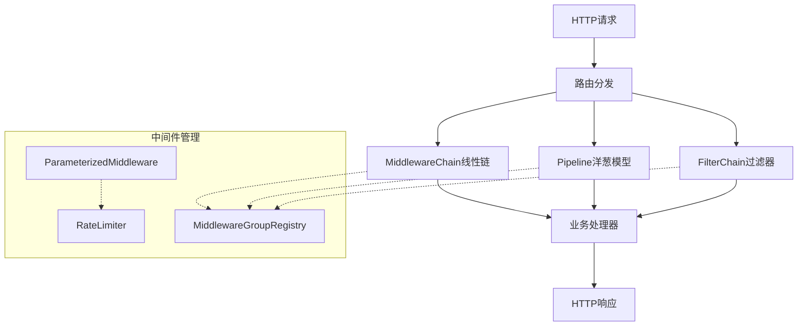
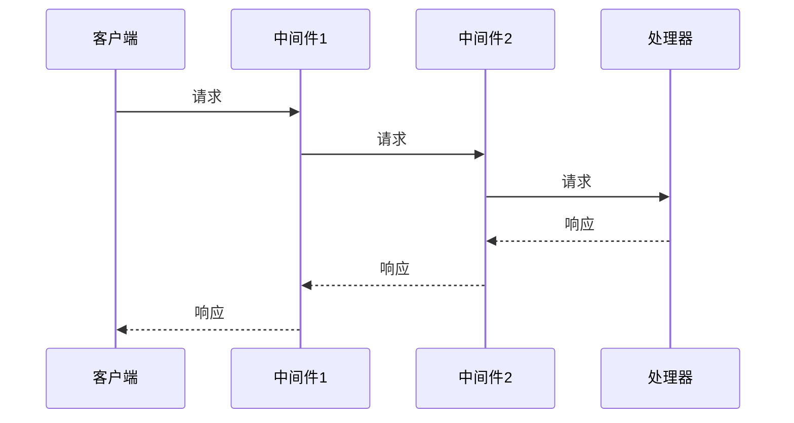

# 中间件链

## 架构概述

Photon框架的中间件系统采用了多层次、多模式的架构设计，提供了灵活且高性能的请求处理管道。该系统集成了线性链式执行、洋葱模型管道、双向过滤器链以及中间件组管理等多种中间件模式，满足不同场景下的请求处理需求[^1]。

### 核心设计理念

中间件系统的设计遵循了现代Web框架的最佳实践，主要体现在以下几个方面：

1. **多模式支持**：提供线性链、洋葱模型和过滤器三种执行模式，开发者可以根据具体需求选择最适合的模式
2. **高性能优化**：采用分片锁机制和原子操作，确保在高并发场景下的性能表现
3. **上下文传递**：通过MiddlewareContext实现中间件间的数据共享和状态传递
4. **参数化配置**：支持运行时参数配置，提供灵活的中间件定制能力

### 系统架构图


图：Photon中间件系统整体架构（类型：系统架构图）

## MiddlewareChain线性链

### 核心实现

MiddlewareChain是Photon框架中最基础的中间件执行模式，采用线性顺序执行的方式处理请求。每个中间件按注册顺序依次执行，如果某个中间件返回false或抛出异常，链式执行将立即终止[^2]。

```v
pub struct MiddlewareChain {
pub mut:
    middlewares []MiddlewareFunc
}

pub type MiddlewareFunc = fn (ctx &MiddlewareContext) !bool
```

### 上下文传递机制

MiddlewareContext是中间件链中的核心数据结构，负责在中间件之间传递请求上下文和共享数据：

```v
pub struct MiddlewareContext {
pub mut:
    ctx    &veb.Context
    data   map[string]string // 共享数据存储
    logger &RequestLogger = unsafe { nil }
pub:
    route_path   string
    route_method string
}
```

data字段是中间件间数据传递的主要机制，支持存储request_id、user_id等关键信息。logger字段提供了请求级别的日志上下文注入能力[^3]。

### 执行流程

MiddlewareChain的执行过程非常直观，通过简单的循环遍历实现：

```v
pub fn (mc &MiddlewareChain) execute(ctx &MiddlewareContext) !bool {
    for mw in mc.middlewares {
        if !mw(ctx)! {
            return false
        }
    }
    return true
}
```

这种设计确保了中间件的执行顺序严格遵循注册顺序，同时提供了早期终止机制，提高了系统的响应效率。

### 内置中间件

框架提供了丰富的内置中间件，覆盖了常见的Web开发需求：

#### 请求ID中间件
```v
pub fn request_id_middleware(mut ctx &MiddlewareContext) !bool {
    mut request_id := ctx.ctx.get_custom_header('X-Request-ID') or { '' }
    if request_id.len == 0 {
        request_id = generate_request_id()
    }
    
    ctx.data['request_id'] = request_id
    
    if ctx.logger != unsafe { nil } {
        ctx.logger.put('request_id', request_id)
    }
    
    ctx.ctx.set_custom_header('X-Request-ID', request_id) or {}
    return true
}
```

该中间件实现了请求追踪功能，自动生成或传播请求ID，并将其注入到日志上下文中，便于分布式系统中的请求追踪。

#### CORS中间件
```v
pub fn cors_middleware(mut ctx &MiddlewareContext) !bool {
    ctx.ctx.set_custom_header('Access-Control-Allow-Origin', '*') or {
        eprintln('[CORS] Failed to set Allow-Origin header')
    }
    ctx.ctx.set_custom_header('Access-Control-Allow-Methods',
        'GET, POST, PUT, DELETE, PATCH, OPTIONS') or {}
    ctx.ctx.set_custom_header('Access-Control-Allow-Headers',
        'Content-Type, Authorization, X-Requested-With') or {}
    ctx.ctx.set_custom_header('Access-Control-Max-Age', '86400') or {}

    if ctx.route_method == 'OPTIONS' {
        ctx.ctx.send_response_to_client('text/plain', '')
        return false
    }
    return true
}
```

CORS中间件处理跨域请求，支持预检请求(OPTIONS)的直接响应，简化了前后端分离架构的开发。

#### 认证中间件
```v
pub fn auth_middleware(mut ctx &MiddlewareContext) !bool {
    token := ctx.ctx.get_custom_header('Authorization') or { '' }
    if token.len == 0 {
        ctx.ctx.send_response_to_client('application/json', '{"error":"Unauthorized"}')
        return false
    }
    ctx.data['user_id'] = 'extracted_user_id'
    return true
}
```

认证中间件验证请求的Authorization头，提取用户信息并存储到上下文中，供后续中间件和处理器使用。

## Pipeline洋葱模型

### 设计原理

Pipeline实现了Laravel风格的洋葱中间件模式，支持请求和响应的双向处理。在这种模式下，每个中间件都会在请求处理前和处理后各执行一次，形成类似洋葱层的嵌套结构[^4]。


图：洋葱模型执行流程（类型：序列图）

### 核心实现

Pipeline的核心在于闭包链的构建，通过反向遍历中间件数组，将每个中间件包装成闭包：

```v
pub struct Pipeline {
mut:
    pipes    []PipeFunc
    passable voidptr
}

pub type PipeFunc = fn (passable voidptr, next fn (voidptr) voidptr) voidptr
```

### 闭包链构建

Pipeline的then方法负责构建闭包链，这是洋葱模型实现的关键：

```v
pub fn (p &Pipeline) then(destination fn (voidptr) voidptr) voidptr {
    mut carry := destination

    for i := p.pipes.len; i > 0; i-- {
        pipe := p.pipes[i - 1]
        prev := carry
        carry = fn [pipe, prev] (passable voidptr) voidptr {
            return pipe(passable, prev)
        }
    }

    return carry(p.passable)
}
```

这种设计确保了中间件的嵌套执行，每个中间件都可以在调用next()前后执行逻辑，实现了真正的双向处理。

### 使用场景

洋葱模型特别适合需要在请求和响应阶段都进行处理的场景，例如：

1. **请求/响应日志记录**：在请求前记录开始时间，在响应后计算总耗时
2. **数据转换**：在请求前进行数据预处理，在响应后进行格式化
3. **事务管理**：在请求前开始事务，在响应后提交或回滚

## FilterChain过滤器链

### 架构设计

FilterChain提供了更细粒度的请求/响应拦截机制，将请求过滤器和响应过滤器分离管理。这种设计允许开发者针对请求和响应分别定义不同的处理逻辑[^5]。

```v
pub struct FilterChain {
pub mut:
    request_filters  []RequestFilterFn
    response_filters []ResponseFilterFn
}

pub type RequestFilterFn = fn (ctx &veb.Context) !bool
pub type ResponseFilterFn = fn (ctx &veb.Context, body string) !string
```

### 双向过滤机制

请求过滤器在处理器执行前运行，主要用于请求验证、预处理等场景：

```v
pub fn (fc &FilterChain) apply_request(ctx &veb.Context) !bool {
    for filter in fc.request_filters {
        if !filter(ctx)! {
            return false
        }
    }
    return true
}
```

响应过滤器在处理器执行后运行，可以对响应内容进行修改或增强：

```v
pub fn (fc &FilterChain) apply_response(ctx &veb.Context, body string) !string {
    mut result := body
    for filter in fc.response_filters {
        result = filter(ctx, result)!
    }
    return result
}
```

### 内置过滤器

#### 安全头过滤器
```v
pub fn security_headers_filter(mut ctx veb.Context, body string) !string {
    ctx.set_custom_header('X-Content-Type-Options', 'nosniff') or {
        eprintln('[SecurityFilter] Failed to set X-Content-Type-Options')
    }
    ctx.set_custom_header('X-Frame-Options', 'DENY') or {}
    ctx.set_custom_header('X-XSS-Protection', '1; mode=block') or {}
    ctx.set_custom_header('Referrer-Policy', 'strict-origin-when-cross-origin') or {}
    ctx.set_custom_header('Permissions-Policy', 'geolocation=(), microphone=(), camera=()') or {}
    ctx.set_custom_header('Strict-Transport-Security', 'max-age=31536000; includeSubDomains') or {}
    return body
}
```

安全头过滤器自动添加OWASP推荐的安全HTTP头，提升应用的安全性。

#### 请求体大小限制过滤器
```v
pub fn body_size_filter(max_bytes int) RequestFilterFn {
    return fn [max_bytes] (mut ctx veb.Context) !bool {
        content_length := ctx.get_custom_header('Content-Length') or { '' }
        if content_length.len > 0 {
            size := content_length.int()
            if size > max_bytes {
                ctx.send_response_to_client('application/json',
                    '{"error":"Request entity too large"}')
                return error('request body too large: ${size} > ${max_bytes}')
            }
        }
        return true
    }
}
```

该过滤器支持参数化配置，可以根据不同的路由或用户角色设置不同的请求体大小限制。

## 中间件组管理

### MiddlewareGroupRegistry

中间件组管理提供了批量管理和复用中间件的能力，通过命名分组简化中间件的配置和管理[^6]。

```v
pub struct MiddlewareGroupRegistry {
pub mut:
    groups map[string][]MiddlewareFunc
mut:
    mu sync.RwMutex
}
```

注册表使用读写锁确保线程安全，支持高并发场景下的中间件组注册和查询：

```v
pub fn (mut mgr MiddlewareGroupRegistry) register(name string, middlewares []MiddlewareFunc) {
    mgr.mu.@lock()
    defer { mgr.mu.unlock() }
    mgr.groups[name] = middlewares
}

pub fn (mut mgr MiddlewareGroupRegistry) get(name string) []MiddlewareFunc {
    mgr.mu.rlock()
    defer { mgr.mu.runlock() }
    return mgr.groups[name] or { []MiddlewareFunc{} }
}
```

### 参数化中间件

参数化中间件允许在运行时动态配置中间件行为，提供了更大的灵活性：

```v
pub struct ParameterizedMiddleware {
pub:
    name   string
    params map[string]string
}

pub fn parse_middleware_params(spec string) ParameterizedMiddleware {
    parts := spec.split(':')
    name := parts[0]
    mut params := map[string]string{}

    if parts.len > 1 {
        param_list := parts[1].split(',')
        for i, p in param_list {
            params['${i}'] = p
            kv := p.split('=')
            if kv.len == 2 {
                params[kv[0]] = kv[1]
            }
        }
    }

    return ParameterizedMiddleware{
        name:   name
        params: params
    }
}
```

### 限流中间件实现

限流中间件是参数化中间件的典型实现，支持基于用户ID或IP的智能限流：

```v
pub fn throttle_middleware(max_attempts int, decay_minutes int) fn (mut MiddlewareContext) !bool {
    mut state := new_throttle_state(max_attempts, i64(decay_minutes) * 60)
    return fn [mut state] (mut ctx MiddlewareContext) !bool {
        mut key := ctx.data['user_id'] or { 'anonymous' }
        key = 'throttle_${key}'

        allowed := state.limiter.hit_and_record(key, state.max_attempts, state.decay_seconds)
        if !allowed {
            retry := state.limiter.retry_after(key, state.decay_seconds)
            return error('rate limit exceeded: ${state.max_attempts} requests per ${state.decay_seconds / 60} minutes, retry after ${retry}s')
        }
        return true
    }
}
```

## 高性能限流器

### 分片锁设计

RateLimiter采用了分片锁的设计，将全局锁拆分为64个分片，每个键通过哈希算法映射到特定分片，大幅提升了并发性能[^7]。

```v
@[heap]
pub struct RateLimiter {
pub mut:
    attempts map[string][]i64
mut:
    shards []sync.Mutex
}

const shard_count = 64

@[inline]
fn (r &RateLimiter) shard_for(key string) int {
    return int(support.fnv1a_str(key) & u64(shard_count - 1))
}
```

### 原子性操作

hit_and_record方法将记录点击和检查限流合并为一个原子操作，避免了竞态条件：

```v
pub fn (mut r RateLimiter) hit_and_record(key string, max_attempts int, decay_seconds i64) bool {
    idx := r.shard_for(key)
    r.shards[idx].@lock()
    defer { r.shards[idx].unlock() }

    now := time.now().unix()

    // 记录点击
    mut attempts := r.attempts[key] or { []i64{} }
    attempts << now
    if attempts.len > max_attempts_per_key {
        attempts = attempts[attempts.len - max_attempts_per_key..].clone()
    }
    r.attempts[key] = attempts

    // 检查是否超限（过滤过期记录）
    mut valid := []i64{cap: attempts.len}
    for ts in attempts {
        if now - ts < decay_seconds {
            valid << ts
        }
    }
    if valid.len > 0 {
        r.attempts[key] = valid
    }

    return valid.len < max_attempts
}
```

### 双算法支持

除了滑动窗口算法，框架还提供了固定窗口限流器，适用于不同的业务场景：

```v
pub struct FixedWindowLimiter {
pub mut:
    windows map[string]FixedWindowEntry
mut:
    shards []sync.Mutex
}

pub fn (mut fw FixedWindowLimiter) check(key string, max_requests int, window_seconds i64) bool {
    idx := fw.shard_for(key)
    fw.shards[idx].@lock()

    now := time.now().unix()
    mut entry := fw.windows[key] or { FixedWindowEntry{} }

    // 窗口过期重置
    if now >= entry.expires {
        entry.count = 0
        entry.expires = now + window_seconds
    }

    entry.count++
    result := entry.count <= max_requests
    fw.windows[key] = entry

    fw.shards[idx].unlock()
    return result
}
```

## 自定义中间件开发

### 基础中间件模板

开发自定义中间件需要遵循MiddlewareFunc的函数签名：

```v
pub fn custom_middleware(mut ctx &MiddlewareContext) !bool {
    // 前置处理逻辑
    start_time := time.ticks()
    
    // 从上下文获取数据
    request_id := ctx.data['request_id'] or { 'unknown' }
    
    // 执行业务逻辑
    // ...
    
    // 设置响应数据
    ctx.data['custom_data'] = 'processed'
    
    // 记录处理时间
    elapsed := time.ticks() - start_time
    eprintln('[Custom] Request ${request_id} processed in ${elapsed}ms')
    
    return true // 继续执行下一个中间件
}
```

### 参数化中间件模板

对于需要配置的中间件，可以使用闭包工厂模式：

```v
pub fn configurable_middleware(config Config) fn (mut MiddlewareContext) !bool {
    return fn [config] (mut ctx MiddlewareContext) !bool {
        // 使用配置参数
        if config.enable_logging {
            eprintln('[Configurable] Processing request')
        }
        
        // 验证配置条件
        if config.max_body_size > 0 {
            content_length := ctx.ctx.get_custom_header('Content-Length') or { '0' }
            size := content_length.int()
            if size > config.max_body_size {
                return error('body size exceeds limit: ${size} > ${config.max_body_size}')
            }
        }
        
        return true
    }
}
```

### 中间件组合模式

通过中间件组可以实现复杂的中间件组合：

```v
// 注册中间件组
mut registry := new_middleware_group_registry()

// Web中间件组
registry.register('web', [
    request_id_middleware,
    timing_start_middleware,
    cors_middleware,
    auth_middleware,
    timing_end_middleware,
    request_id_cleanup_middleware
])

// API中间件组
registry.register('api', [
    request_id_middleware,
    throttle_middleware(60, 1), // 60次/分钟
    auth_middleware,
    api_version_middleware,
    request_id_cleanup_middleware
])

// 使用中间件组
web_middlewares := registry.get('web')
api_middlewares := registry.get('api')
```

## 最佳实践

### 性能优化建议

1. **合理使用中间件顺序**：将轻量级、高频执行的中间件放在前面，重量级中间件放在后面
2. **避免重复计算**：利用MiddlewareContext的data字段缓存计算结果
3. **使用参数化中间件**：避免为不同配置创建多个中间件实例
4. **及时清理资源**：在中间件链末尾添加清理中间件，释放临时资源

### 错误处理策略

```v
pub fn error_handling_middleware(mut ctx &MiddlewareContext) !bool {
    // 设置错误处理标记
    ctx.data['_error_handling'] = 'active'
    
    return true
}

pub fn error_cleanup_middleware(mut ctx &MiddlewareContext) !bool {
    // 清理错误处理相关资源
    if '_error_handling' in ctx.data {
        ctx.data.delete('_error_handling')
    }
    
    return true
}
```

### 监控和调试

利用请求ID中间件和日志中间件实现完整的请求追踪：

```v
// 完整的监控中间件链
monitoring_chain := [
    request_id_middleware,      // 生成请求ID
    timing_start_middleware,    // 开始计时
    logging_middleware,         // 记录请求日志
    metrics_middleware,         // 收集指标
    business_middlewares...,    // 业务中间件
    timing_end_middleware,      // 结束计时
    request_id_cleanup_middleware // 清理请求ID
]
```

## 参考文献

[^1]: [中间件系统架构设计](src/web/middleware.v#L1-L10)
[^2]: [MiddlewareChain核心实现](src/web/middleware.v#L60-L84)
[^3]: [MiddlewareContext上下文传递](src/web/middleware.v#L42-L58)
[^4]: [Pipeline洋葱模型实现](src/web/pipeline.v#L38-L55)
[^5]: [FilterChain双向过滤器](src/web/filter.v#L12-56)
[^6]: [中间件组注册管理](src/web/middleware_groups.v#L17-69)
[^7]: [RateLimiter分片锁设计](src/web/ratelimit.v#L25-48)