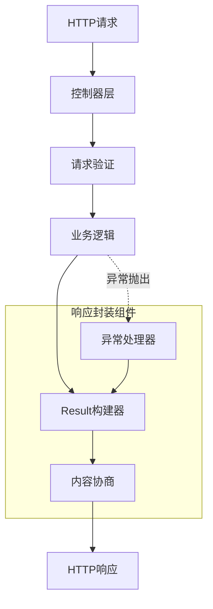

# 响应封装

## 架构概述

Photon框架的响应封装机制提供了一套完整的统一API响应解决方案，涵盖了状态码管理、内容协商、分页响应和错误处理等核心功能。该机制借鉴了Spring Boot和Laravel的设计理念，为开发者提供了类型安全、易于使用的响应构建工具。

响应封装系统由三个核心组件构成：Result结构体负责标准化响应格式，ContentNegotiationManager处理内容类型协商，ExceptionHandlerRegistry提供统一的异常处理机制。这些组件协同工作，确保所有API端点都能返回一致、规范的响应格式[^1]。


图：响应封装架构流程（类型：流程图）

## Result结构设计

### 核心数据结构

Result结构体是响应封装的核心，定义了标准化的API响应格式。该结构体包含成功状态、HTTP状态码、消息内容、数据载荷、时间戳和请求路径等关键字段[^2]。

```v
pub struct Result {
pub mut:
    success   bool
    code      int
    message   string
    data      string // JSON string or raw value
    timestamp i64
    path      string
}
```

这种设计确保了所有API响应都具有统一的结构，便于前端客户端处理和解析。success字段明确标识操作是否成功，code字段对应HTTP状态码，data字段承载实际的业务数据，timestamp提供了请求处理的时间信息。

### 分页响应支持

针对列表数据的分页需求，框架提供了PageResult结构体，它在Result基础上扩展了分页元数据。由于V语言编译器的限制，PageResult采用组合而非嵌入的方式包含Result字段[^3]。

```v
pub struct PageResult {
    Result
pub:
    pagination Pagination
}

pub struct Pagination {
pub:
    page        int
    page_size   int
    total       int
    total_pages int
    has_next    bool
    has_prev    bool
}
```

Pagination结构体提供了完整的分页信息，包括当前页码、页面大小、总记录数、总页数以及是否有下一页/上一页的布尔标识。这种设计使得客户端能够轻松实现分页导航功能。

### 响应构建器

框架提供了丰富的响应构建器方法，简化了各种常见响应场景的创建：

```v
// 成功响应
pub fn success(data string) Result
pub fn success_with_msg(data string, msg string) Result
pub fn ok(data string) Result
pub fn created(data string) Result
pub fn no_content() Result

// 错误响应
pub fn fail(code int, msg string) Result
pub fn bad_request(msg string) Result
pub fn not_found(msg string) Result
pub fn unauthorized(msg string) Result
pub fn forbidden(msg string) Result
pub fn internal_error(msg string) Result
pub fn conflict(msg string) Result

// 分页响应
pub fn page(data string, page int, page_size int, total int) PageResult
```

这些构建器方法自动设置适当的状态码和消息，开发者只需提供业务数据或错误信息即可。例如，`created()`方法自动设置201状态码和"Created"消息，`not_found()`方法设置404状态码[^4]。

## HTTP状态码映射

### 状态码管理策略

框架采用语义化的状态码管理，每个HTTP状态码都有对应的构建器方法和异常类型。这种设计确保了状态码使用的一致性和正确性[^5]。

```v
// 2xx 成功状态码
200 OK           → success(), ok()
201 Created      → created()
204 No Content   → no_content()

// 4xx 客户端错误
400 Bad Request      → bad_request()
401 Unauthorized     → unauthorized()
403 Forbidden        → forbidden()
404 Not Found        → not_found()
405 Method Not Allowed → method_not_allowed()
409 Conflict         → conflict()
422 Unprocessable Entity → validation_exception()

// 5xx 服务器错误
500 Internal Server Error → internal_error()
503 Service Unavailable   → service_unavailable()
```

### 状态码与异常的对应关系

每个HTTP异常类型都携带对应的状态码，实现了类型安全的状态码管理。这种设计避免了字符串匹配的脆弱性，提供了编译时的类型检查[^6]。

```v
pub fn (e &HttpException) code() int {
    return e.status_code
}

pub fn extract_http_status(err IError) int {
    return err.code()
}
```

通过`code()`方法，框架能够从异常对象中提取正确的HTTP状态码，无需依赖字符串匹配或反射机制。这种方式既安全又高效。

## 内容协商机制

### 策略模式实现

内容协商采用策略模式，支持多种内容类型解析策略。ContentNegotiationManager按优先级尝试各个策略，直到找到合适的响应格式[^7]。

```v
pub interface ContentNegotiationStrategy {
    resolve_content_type(accept_header string, params map[string]string) !string
}

pub struct ContentNegotiationManager {
pub mut:
    strategies []ContentNegotiationStrategy
}
```

### Accept头策略

AcceptHeaderStrategy解析HTTP Accept头部，支持质量值(q值)优先级排序。该策略能够处理复杂的内容类型偏好表达式[^8]。

```v
pub fn (s AcceptHeaderStrategy) resolve_content_type(accept_header string, params map[string]string) !string {
    // 解析 "text/html,application/json;q=0.9,*/*;q=0.8"
    parts := accept_header.split(',')
    mut best_type := ''
    mut best_q := f64(0.0)
    
    for part in parts {
        // 提取媒体类型和质量值
        mut media_type := p
        mut q := f64(1.0)
        
        if p.contains(';q=') {
            segments := p.split(';q=')
            if segments.len >= 2 {
                media_type = segments[0].trim_space()
                q = segments[1].trim_space().f64()
            }
        }
        
        // 选择质量值最高的类型
        if q > best_q {
            best_q = q
            best_type = media_type
        }
    }
    
    return best_type.len > 0 ? best_type : s.default_media_type
}
```

### 参数策略

ParameterStrategy通过URL参数（如?format=xml）确定响应格式，支持自定义媒体类型映射[^9]。

```v
pub fn (mut s ParameterStrategy) add_media_type(param_value string, media_type string) {
    s.media_types[param_value] = media_type
}

pub fn (s ParameterStrategy) resolve_content_type(accept_header string, params map[string]string) !string {
    param_name := s.param_name
    param_value := params[param_name] or { 
        return error('parameter "${param_name}" not found') 
    }
    return s.media_types[param_value] or {
        return error('no media type mapped for parameter value "${param_value}"')
    }
}
```

### 固定策略

FixedStrategy始终返回预定义的内容类型，适用于需要强制特定格式的场景[^10]。

```v
pub fn (s FixedStrategy) resolve_content_type(accept_header string, params map[string]string) !string {
    return s.media_type
}
```

## 错误处理系统

### 异常层次结构

框架建立了完整的HTTP异常层次结构，所有异常都继承自HttpException基类。这种设计提供了类型安全的异常处理机制[^11]。

```v
pub struct HttpException {
pub:
    status_code int
    message     string
    details     map[string]string
}

// 具体异常类型
pub struct BadRequestException { HttpException }
pub struct UnauthorizedException { HttpException }
pub struct ForbiddenException { HttpException }
pub struct NotFoundException { HttpException }
pub struct ValidationException { 
    HttpException 
pub:
    validation_errors map[string][]string 
}
```

### 全局异常处理器

ExceptionHandlerRegistry提供全局异常处理功能，支持按异常类型注册特定的处理逻辑[^12]。

```v
pub struct ExceptionHandlerRegistry {
pub mut:
    handlers        map[string]ExceptionHandlerFunc
    default_handler ExceptionHandlerFunc = unsafe { nil }
}

pub fn (mut r ExceptionHandlerRegistry) handle_with_status(err IError) (int, string) {
    err_type := typeof(err).name
    
    // 尝试特定类型处理器
    if handler := r.handlers[err_type] {
        mut status := extract_http_status(err)
        if status == 0 {
            status = 500
        }
        return status, handler(err)
    }
    
    // 尝试从HttpException提取状态码
    status := extract_http_status(err)
    if status > 0 {
        return status, text_response_for_error(status, err.msg())
    }
    
    // 使用默认处理器或返回500
    if !isnil(r.default_handler) {
        return 500, r.default_handler(err)
    }
    
    return 500, text_response_for_error(500, err.msg())
}
```

### @ControllerAdvice模式

框架提供了类似Spring @ControllerAdvice的全局异常处理机制，通过ExceptionHandler接口实现类型安全的异常分发[^13]。

```v
pub interface ExceptionHandler {
    handles(err IError) bool
    handle_exception(err IError) !(int, string)
}

pub struct ExceptionResolver {
mut:
    mu sync.RwMutex
    handlers        []HandlerEntry
    global_handlers []ExceptionHandler
}

pub fn (mut r ExceptionResolver) resolve(err IError) !(int, string) {
    // 快照处理器列表
    r.mu.rlock()
    entries := r.handlers.clone()
    globals := r.global_handlers.clone()
    r.mu.runlock()
    
    // 尝试特定处理器
    for entry in entries {
        if entry.handler.handles(err) {
            return entry.handler.handle_exception(err)!
        }
    }
    
    // 尝试全局处理器
    if globals.len > 0 {
        return globals[0].handle_exception(err)!
    }
    
    // 回退到默认状态映射
    status := r.extract_status(err)
    if status > 0 {
        return status, text_response_for_error(status, err.msg())
    }
    
    return 500, text_response_for_error(500, err.msg())
}
```

## 客户端友好的错误信息

### 结构化错误响应

ErrorResponse结构体提供了标准化的错误响应格式，包含成功状态、错误代码、消息和详细信息[^14]。

```v
pub struct ErrorResponse {
pub:
    success bool
    code    int
    message string
    details map[string]string
}

fn text_response_for_error(status int, message string) string {
    resp := ErrorResponse{
        code:    status
        message: message
    }
    return json.encode(resp)
}
```

### 验证错误处理

ValidationException专门处理表单验证失败的场景，提供字段级别的错误信息[^15]。

```v
pub struct ValidationException {
    HttpException
pub:
    validation_errors map[string][]string // field → error messages
}

pub fn new_validation_exception(message string, errors map[string][]string) ValidationException {
    return ValidationException{
        HttpException:     new_http_exception(422, message)
        validation_errors: errors
    }
}
```

### 错误响应示例

典型的错误响应格式如下：

```json
{
  "success": false,
  "code": 422,
  "message": "Validation failed",
  "details": {
    "username": ["Username is required", "Username must be at least 3 characters"],
    "email": ["Email format is invalid"]
  }
}
```

这种结构化的错误信息便于前端客户端进行精确的错误处理和用户提示。

## 集成使用模式

### 控制器集成

在控制器中，通过Context扩展方法可以轻松发送统一格式的响应[^16]。

```v
pub fn (mut app App) create_user(mut ctx Context) veb.Result {
    // 验证请求体
    dto := ctx.validate_json[CreateUserDto]() or {
        return ctx.send_bad_request(err.msg())
    }
    
    // 业务逻辑处理
    user := app.user_service.create(dto) or {
        return ctx.send_internal_error(err.msg())
    }
    
    // 返回成功响应
    return ctx.send_created(json.encode(user))
}

pub fn (mut app App) list_users(mut ctx Context) veb.Result {
    page := ctx.get_query_param('page').int() or { 1 }
    page_size := ctx.get_query_param('page_size').int() or { 10 }
    
    users, total := app.user_service.list(page, page_size)
    page_result := web.page(json.encode(users), page, page_size, total)
    
    return ctx.send_page_result(page_result)
}
```

### 中间件集成

异常处理器可以集成到HTTP内核中，提供全局的异常捕获和处理[^17]。

```v
pub fn (mut k HttpKernel) handle_exception(mut ctx veb.Context, err_msg string) veb.Result {
    err := error(err_msg)
    status, body := k.exception_handler.handle_with_status(err)
    ctx.res.set_status(unsafe { http.Status(status) })
    ctx.set_content_type('application/json')
    return ctx.text(body)
}
```

### 内容协商集成

内容协商可以与响应发送结合，根据客户端偏好自动选择响应格式[^18]。

```v
pub fn (mut ctx Context) send_negotiated(data string) veb.Result {
    accept_header := ctx.get_header('Accept')
    params := extract_query_params(ctx.req.url)
    
    content_type := ctx.content_negotiation_manager.resolve_content_type(
        accept_header, params
    ) or { 'application/json' }
    
    ctx.set_content_type(content_type)
    return ctx.text(data)
}
```

## 性能优化考虑

### JSON序列化优化

针对V语言编译器的限制，PageResult采用手动JSON构建而非自动序列化，避免了嵌入结构体的序列化问题[^19]。

```v
pub fn (r &PageResult) to_json() string {
    p := r.pagination
    return '{"success":${r.success},"code":${r.code},"message":${json.encode(r.message)},"data":${r.data},"timestamp":${r.timestamp},"path":${json.encode(r.path)},"pagination":{"page":${p.page},"page_size":${p.page_size},"total":${p.total},"total_pages":${p.total_pages},"has_next":${p.has_next},"has_prev":${p.has_prev}}}'
}
```

### 异常处理性能

异常处理器采用类型安全的分发机制，避免了字符串匹配的性能开销。通过快照处理器列表，减少了锁竞争[^20]。

```v
pub fn (mut r ExceptionResolver) resolve(err IError) !(int, string) {
    // 快照处理器列表，避免长时间持锁
    r.mu.rlock()
    entries := r.handlers.clone()
    globals := r.global_handlers.clone()
    r.mu.runlock()
    
    // 在锁外进行分发，避免阻塞其他请求
    for entry in entries {
        if entry.handler.handles(err) {
            return entry.handler.handle_exception(err)!
        }
    }
    // ...
}
```

### 内存管理

响应构建器采用值语义，避免了不必要的内存分配。时间戳使用Unix时间戳，减少了字符串格式化的开销[^21]。

```v
pub fn success(data string) Result {
    return Result{
        success:   true
        code:      200
        message:   'OK'
        data:      data
        timestamp: time.now().unix()
    }
}
```

## 扩展性设计

### 自定义异常类型

开发者可以轻松扩展异常层次结构，添加业务特定的异常类型[^22]。

```v
pub struct BusinessRuleException {
    HttpException
pub:
    rule_name string
}

pub fn new_business_rule_violation(rule string, message string) BusinessRuleException {
    return BusinessRuleException{
        HttpException: new_http_exception(400, message)
        rule_name:     rule
    }
}
```

### 自定义内容协商策略

可以实现自定义的内容协商策略，支持特殊的内容类型选择逻辑[^23]。

```v
pub struct CustomStrategy {
pub:
    custom_logic fn(string, map[string]string) !string
}

pub fn (s CustomStrategy) resolve_content_type(accept_header string, params map[string]string) !string {
    return s.custom_logic(accept_header, params)
}
```

### 响应拦截器

可以通过HTTP内核的事件机制实现响应拦截和修改[^24]。

```v
pub fn (mut k HttpKernel) add_response_interceptor() {
    k.on(.response, fn [event_name string, data voidptr] {
        ctx := unsafe { &veb.Context(data) }
        // 添加通用响应头
        ctx.set_header('X-Response-Time', time.now().str())
    })
}
```

## 最佳实践

### 状态码使用指南

- **200 OK**: 成功的GET、PUT、PATCH请求
- **201 Created**: 成功的POST请求，创建了新资源
- **204 No Content**: 成功的DELETE请求或PUT请求但不返回内容
- **400 Bad Request**: 客户端请求格式错误或参数验证失败
- **401 Unauthorized**: 未认证或认证失败
- **403 Forbidden**: 已认证但权限不足
- **404 Not Found**: 请求的资源不存在
- **409 Conflict**: 资源冲突，如重复创建
- **422 Unprocessable Entity**: 请求格式正确但语义错误
- **500 Internal Server Error**: 服务器内部错误

### 错误消息设计

- 提供清晰、具体的错误描述
- 包含足够的调试信息但不泄露敏感数据
- 支持国际化，便于多语言环境
- 使用一致的错误代码体系

### 分页响应设计

- 总是提供完整的分页元数据
- 包含总记录数和总页数
- 提供has_next和has_prev布尔标识
- 支持自定义页面大小限制

### 内容协商策略

- 优先使用Accept头策略，尊重客户端偏好
- 提供参数策略作为备选方案
- 设置合理的默认内容类型
- 避免过度复杂的内容类型逻辑

## 参考文献

[^1]: [统一响应封装核心实现](src/web/result.v#L11-L20)
[^2]: [Result结构体定义](src/web/result.v#L12-L20)
[^3]: [PageResult分页结构设计](src/web/result.v#L25-L29)
[^4]: [响应构建器方法实现](src/web/result.v#L42-L159)
[^5]: [HTTP状态码映射策略](src/web/result.v#L105-L159)
[^6]: [异常状态码提取机制](src/web/exception.v#L34-L36)
[^7]: [内容协商策略接口](src/web/content_negotiation.v#L10-L12)
[^8]: [Accept头解析实现](src/web/content_negotiation.v#L26-L72)
[^9]: [参数策略实现](src/web/content_negotiation.v#L99-L105)
[^10]: [固定策略实现](src/web/content_negotiation.v#L121-L123)
[^11]: [HTTP异常层次结构](src/web/exception.v#L50-L73)
[^12]: [全局异常处理器](src/web/exception.v#L16-L79)
[^13]: [@ControllerAdvice模式实现](src/web/exception.v#L54-L66)
[^14]: [结构化错误响应](src/web/exception.v#L76-L92)
[^15]: [验证异常处理](src/web/exception.v#L159-L172)
[^16]: [控制器响应集成示例](demo/context_helpers.v#L7-L61)
[^17]: [中间件异常处理集成](demo/app/http/Kernel.v#L24-L31)
[^18]: [内容协商集成模式](demo/context_helpers.v#L72-L76)
[^19]: [PageResult JSON序列化优化](src/web/result.v#L96-L101)
[^20]: [异常处理性能优化](src/web/exception.v#L28-L34)
[^21]: [响应构建器内存优化](src/web/result.v#L43-L51)
[^22]: [自定义异常类型扩展](src/web/exception.v#L147-L157)
[^23]: [自定义内容协商策略](src/web/content_negotiation.v#L10-L12)
[^24]: [响应拦截器扩展](src/web/kernel.v#L78-L90)