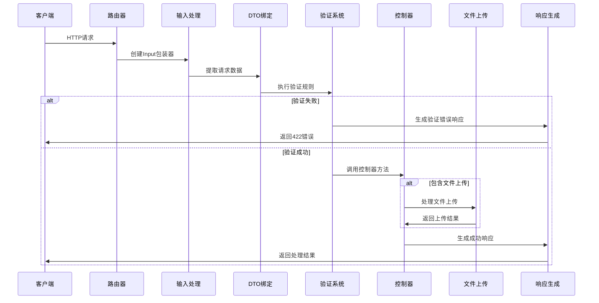
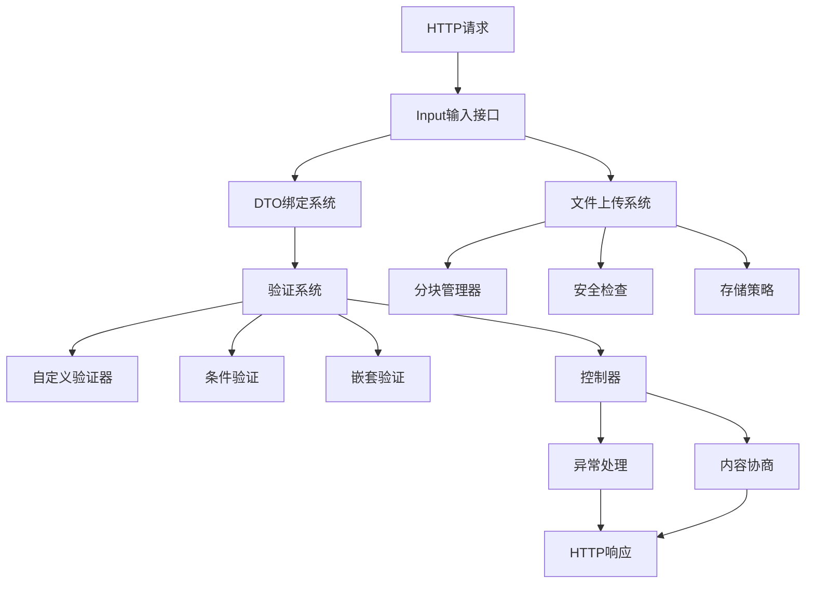

# 请求处理

## HTTP请求处理架构概述

Photon框架的请求处理系统采用了现代化的分层架构设计，融合了Laravel的开发友好性和Spring的企业级特性。该系统通过统一的输入接口、类型安全的DTO绑定、声明式验证、安全的文件上传处理以及标准化的异常响应机制，为开发者提供了完整而强大的HTTP请求处理能力[^1]。

整个请求处理流程遵循"输入-绑定-验证-处理-响应"的标准模式，每个环节都经过精心设计以确保安全性、性能和开发效率的平衡。

## 输入访问与数据提取

### 统一输入接口设计

Input结构体作为请求输入的统一访问入口，封装了veb.Context并提供了Laravel风格的流畅API。它能够透明地访问查询参数、表单数据、JSON请求体、路由参数、HTTP头部和Cookie等多种数据源[^2]。

```v
// Input结构体提供统一的输入访问接口
pub struct Input {
    ctx &veb.Context
}

// 创建Input包装器
pub fn input(ctx &veb.Context) Input {
    return Input{ctx: ctx}
}
```

### 多源数据合并策略

Input接口采用智能的数据合并策略，按照优先级顺序处理不同来源的数据：

1. **查询参数**：URL中的?key=value参数
2. **表单数据**：POST/PUT请求中的表单字段
3. **JSON body**：application/json请求体
4. **路由参数**：URL路径中的动态参数

表单数据具有最高优先级，会覆盖同名的查询参数，这种设计符合HTTP语义和开发者预期[^3]。

```v
// all()方法展示数据合并逻辑
pub fn (i Input) all() map[string]string {
    mut result := map[string]string{}
    // 首先合并查询参数
    for k, v in i.ctx.query {
        result[k] = v
    }
    // 表单参数覆盖查询参数
    for k, v in i.ctx.form {
        result[k] = v
    }
    // URL查询字符串作为后备
    if result.len == 0 {
        // 解析URL查询字符串...
    }
    return result
}
```

### 便捷的数据访问方法

Input接口提供了丰富的便捷方法来满足不同的数据访问需求：

- **基础访问**：`get()`, `all()`, `only()`, `except()`
- **存在性检查**：`has()`, `filled()`, `missing()`
- **类型特定访问**：`query()`, `form_key()`, `json_body()`
- **元数据访问**：`method()`, `path()`, `url()`, `header()`, `cookie()`

这些方法都支持默认值参数，避免了繁琐的空值检查，提升了开发体验[^4]。

## DTO绑定与类型转换

### Spring风格的自动绑定机制

Photon框架实现了类似Spring的自动绑定机制，支持将HTTP请求数据自动绑定到类型化的结构体。系统提供了三种绑定方式以应对不同的使用场景[^5]：

```v
// 查询参数和表单数据绑定（类似Spring @ModelAttribute）
pub fn bind[T](ctx &veb.Context) !T

// JSON请求体绑定（类似Spring @RequestBody）  
pub fn bind_json[T](ctx &veb.Context) !T

// 路径变量绑定（类似Spring @PathVariable）
pub fn bind_path[T](ctx &veb.Context) !T
```

### 编译时代码生成

绑定系统采用编译时代码生成技术，通过V语言的编译时反射能力，为每个DTO结构体生成高效的绑定代码。这种方式避免了运行时反射的性能开销，同时保证了类型安全[^6]。

```v
// 编译时字段遍历和类型转换
$for field in T.fields {
    mut key := field.name
    // 处理@[form: 'field_name']属性映射
    for attr in field.attrs {
        if attr.starts_with('form:') {
            key = extract_attr_arg(attr)
        }
    }
    
    val := params[key] or { '' }
    
    // 基于类型的自动转换
    $if field.typ is string {
        result.$(field.name) = val
    } $else $if field.typ is int {
        if val != '' && is_numeric(val) {
            result.$(field.name) = val.int()
        }
    }
    // 其他类型处理...
}
```

### 验证注解支持

绑定系统集成了验证注解支持，允许在DTO字段上声明验证规则：

```v
struct CreateUserDto {
    username string @[required] @[form: 'user_name']
    email    string @[required]
    age      int    @[required]
    active   bool
}
```

`@[required]`注解会在绑定时进行必填验证，`@[form: 'field_name']`注解支持自定义字段映射，这种设计提供了灵活的数据绑定能力[^7]。

### 类型安全转换

系统支持多种基础类型的自动转换，包括：
- **字符串类型**：直接赋值
- **数值类型**：int、i64、f64，包含数值验证
- **布尔类型**：支持多种真值表示（1、true、on、yes）

所有类型转换都包含错误处理，无效数据会返回详细的错误信息而不是导致程序崩溃[^8]。

## 请求验证系统

### Laravel风格的声明式验证

验证系统提供了Laravel FormRequest风格的声明式验证能力，支持通过注解在DTO字段上声明验证规则。系统在编译时解析验证规则并生成高效的内联验证代码[^9]。

```v
struct CreateUserDto {
    username string @[validate: 'required|min_len:3|max_len:20|alpha_num']
    email    string @[validate: 'required|email']
    age      int    @[validate: 'required|between:18,120']
    role     string @[validate: 'required|in:ADMIN,USER,GUEST']
}
```

### 丰富的内置验证规则

系统提供了37种内置验证规则，涵盖了常见的验证需求：

- **基础验证**：required、min、max、min_len、max_len
- **格式验证**：email、url、alpha、alpha_num、numeric、ip、uuid
- **比较验证**：in、not_in、between、different、same
- **字符串验证**：starts_with、ends_with、regex、digits
- **高级验证**：confirmed、password_strength、date、timezone、phone、vjson

每个验证规则都有对应的验证函数和错误消息生成逻辑[^10]。

### 编译时规则解析

验证规则在编译时被解析和优化，生成高效的验证代码。这种设计避免了运行时字符串解析的开销，同时提供了类型安全的验证体验[^11]。

```v
// 编译时规则解析和应用
pub fn parse_rules(validate_str string) []string {
    return validate_str.split('|')
}

pub fn parse_rule(rule string) (string, string) {
    parts := rule.split_nth(':', 2)
    if parts.len == 2 {
        return parts[0], parts[1]
    }
    return parts[0], ''
}
```

### 条件验证支持

系统支持条件验证，允许根据其他字段的值来决定是否应用特定验证规则。这种功能在复杂的表单验证场景中非常有用[^12]。

```v
// 条件验证示例
conditions := [
    web.required_if('account_type', 'business'),  // 当account_type为business时，business_name必填
    web.required_unless('account_type', 'personal')  // 除非account_type为personal，否则tax_id必填
]

dto, errors := web.validate_with_conditions[CreateAccountDto](ctx, conditions)
```

### 嵌套对象验证

对于复杂的嵌套结构，系统提供了嵌套验证支持，能够验证嵌套对象的字段并生成带路径的错误信息[^13]。

```v
// 嵌套验证错误结构
pub struct NestedValidationError {
    path   string // "address.street"
    errors ValidationErrors
}

// 错误消息示例："address.street: street is required"
```

### 自定义验证器扩展

系统支持注册自定义验证器，允许开发者添加业务特定的验证逻辑：

```v
// 注册自定义验证器
pub fn register_validator(name string, validator ValidatorFunc, msg MsgFunc) {
    custom_validators[name] = CustomValidator{
        name:           name
        validator_func: validator
        msg_func:       msg
    }
}

// 使用示例
web.register_validator('custom_id', validate_custom_id, custom_id_error_msg)
```

## 文件上传处理

### 安全优先的文件上传设计

文件上传系统采用了安全优先的设计理念，提供了多层安全防护机制：

1. **危险文件名检测**：阻止双重扩展名攻击（如shell.php.jpg）
2. **路径遍历防护**：清理文件名中的路径组件
3. **可执行文件拦截**：内置危险扩展名黑名单
4. **文件大小限制**：防止大文件攻击
5. **MIME类型验证**：确保文件类型符合预期[^14]

```v
// 危险文件名检测逻辑
fn is_dangerous_filename(original_name string) bool {
    lower := original_name.to_lower()
    // 检查每个点分隔的段
    for segment in lower.split('.') {
        ext := '.' + segment
        if ext in dangerous_extensions {
            return true
        }
    }
    // 路径遍历检测
    if original_name.contains('..') || original_name.contains('/') || original_name.contains('\\') {
        return true
    }
    return false
}
```

### 灵活的存储策略

系统提供了多种文件命名和路径组织策略：

**命名策略**：
- **original**：保持原始文件名（可能冲突）
- **hash**：基于SHA-256哈希的唯一命名
- **sequential**：基于时间戳的顺序命名
- **uuid**：随机UUID风格命名

**路径策略**：
- **flat**：所有文件存储在同一目录
- **date**：按日期分层（YYYY/MM/DD）
- **hash_dir**：按哈希前缀分层[^15]

```v
// 哈希命名策略实现
pub fn (h &UploadHandler) generate_name(original_name string, content string) string {
    ext := os.file_ext(original_name)
    
    if h.naming_strategy == .hash {
        full_hash := sha256_hex(content.bytes())
        return full_hash[..16] + ext
    }
    // 其他策略实现...
}
```

### 分块上传支持

对于大文件上传，系统提供了完整的分块上传解决方案：

1. **UploadChunkManager**：管理分块上传会话
2. **并发安全**：使用sync.RwMutex保证线程安全
3. **后台GC**：自动清理废弃的上传会话
4. **断点续传**：支持上传中断后的恢复

```v
// 分块上传管理器
pub struct UploadChunkManager {
    pub mut:
        chunks   map[string]&ChunkInfo
        temp_dir string
    mut:
        mu         sync.RwMutex
        stop_gc    chan bool
        gc_started bool
        wg         sync.WaitGroup
}
```

### 二进制安全的文件处理

系统区分文本和二进制文件的处理方式：
- **文本文件**：使用`os.write_file()`处理
- **二进制文件**：使用`os.write_bytes()`处理，避免0x00字节截断

这种设计确保了各种类型文件都能正确处理[^16]。

## 内容协商机制

### Spring风格的内容协商

内容协商系统实现了Spring ContentNegotiationManager的功能，支持多种内容类型解析策略：

1. **AcceptHeaderStrategy**：基于HTTP Accept头解析
2. **ParameterStrategy**：基于URL参数协商（如?format=xml）
3. **FixedStrategy**：固定内容类型

系统支持q值权重计算，能够根据客户端偏好选择最佳的内容类型[^17]。

```v
// Accept头解析逻辑
pub fn (s AcceptHeaderStrategy) resolve_content_type(accept_header string, params map[string]string) !string {
    parts := accept_header.split(',')
    mut best_type := ''
    mut best_q := f64(0.0)
    
    for part in parts {
        p := part.trim_space()
        mut media_type := p
        mut q := f64(1.0)
        
        // 解析q值权重
        if p.contains(';q=') {
            segments := p.split(';q=')
            if segments.len >= 2 {
                media_type = segments[0].trim_space()
                q = segments[1].trim_space().f64()
            }
        }
        
        // 选择最高权重的类型
        if q > best_q {
            best_q = q
            best_type = media_type
        }
    }
    
    return best_type.len > 0 ? best_type : s.default_media_type
}
```

## 异常处理与错误响应

### 统一的异常处理架构

异常处理系统提供了Spring @ControllerAdvice风格的统一异常处理机制。所有HTTP处理器都可以返回错误，这些错误会被自动捕获并转换为适当的HTTP响应[^18]。

```v
// HttpException基类
pub struct HttpException {
    pub:
        status_code int
        message     string
        details     map[string]string
}

// 常用异常类型
pub struct BadRequestException {
    HttpException
}

pub struct UnauthorizedException {
    HttpException
}
```

### 结构化错误响应

系统提供了结构化的错误响应格式，包含状态码、错误消息和详细信息。验证错误会返回字段级别的详细错误信息，便于前端处理和显示[^19]。

```v
// ValidationError结构
pub struct ValidationError {
    pub:
        field   string // 失败的字段名
        rule    string // 失败的规则
        message string // 人类可读的错误消息
        value   string // 实际提供的值
}

// 验证错误集合
pub type ValidationErrors = map[string][]ValidationError
```

### 全局异常处理器

系统支持注册全局异常处理器，允许开发者自定义特定异常类型的处理逻辑：

```v
// 异常处理器注册
mut handler := new_exception_handler()
handler.register('NotFoundError', fn (err IError, mut ctx veb.Context) veb.Result {
    return ctx.json_error(404, err.msg())
})

handler.register('ValidationError', fn (err IError, mut ctx veb.Context) veb.Result {
    return ctx.json_error(422, err.msg())
})
```

## 请求处理流程图



图：HTTP请求处理的完整流程（类型：序列图）

## 核心组件架构图



图：请求处理核心组件架构（类型：流程图）

## 性能优化特性

### 编译时优化

Photon框架在编译时进行大量优化工作：
- **验证规则解析**：在编译时解析验证规则，生成内联验证代码
- **DTO绑定代码生成**：编译时生成类型安全的绑定逻辑
- **字符串常量优化**：错误消息和验证规则在编译时优化

这些优化显著提升了运行时性能，避免了传统框架中运行时反射的开销[^20]。

### 内存管理

系统采用了智能的内存管理策略：
- **分块上传**：避免大文件一次性加载到内存
- **流式处理**：支持流式文件处理，减少内存占用
- **后台GC**：自动清理临时文件和废弃的上传会话

### 并发安全

关键组件都考虑了并发安全：
- **UploadChunkManager**：使用sync.RwMutex保护共享状态
- **验证器注册**：线程安全的自定义验证器管理
- **异常处理器**：支持并发的异常处理

## 安全特性总结

### 输入验证安全
- **类型安全转换**：防止类型转换攻击
- **数值范围验证**：防止数值溢出攻击
- **格式验证**：防止注入攻击（email、URL等）

### 文件上传安全
- **扩展名白名单**：只允许特定类型文件
- **危险扩展名黑名单**：阻止可执行文件上传
- **路径遍历防护**：防止目录遍历攻击
- **双重扩展名检测**：防止文件类型伪装攻击

### 错误信息安全
- **敏感信息过滤**：错误响应中不包含敏感信息
- **结构化错误**：避免信息泄露的同时提供有用的调试信息
- **日志记录**：详细的安全事件日志记录

这套完整的请求处理系统展现了现代Web框架的设计理念，在保证开发效率的同时，提供了企业级的安全性和性能表现。

## 参考文献

[^1]: [HTTP请求处理架构设计](src/web/input.v#L1-L25)
[^2]: [Input结构体统一接口设计](src/web/input.v#L21-L32)
[^3]: [多源数据合并策略实现](src/web/input.v#L34-L58)
[^4]: [便捷数据访问方法集合](src/web/input.v#L60-L200)
[^5]: [Spring风格自动绑定机制](src/web/bind.v#L27-L128)
[^6]: [编译时代码生成技术](src/web/bind.v#L37-L98)
[^7]: [验证注解支持实现](src/web/bind.v#L48-L58)
[^8]: [类型安全转换逻辑](src/web/bind.v#L60-L96)
[^9]: [Laravel风格声明式验证](src/web/validation.v#L6-L50)
[^10]: [内置验证规则集合](src/web/validation.v#L12-L37)
[^11]: [编译时规则解析机制](src/web/validation.v#L128-L146)
[^12]: [条件验证支持实现](src/web/validation.v#L191-111)
[^13]: [嵌套对象验证机制](src/web/validation.v#L113-185)
[^14]: [安全优先文件上传设计](src/web/upload.v#L131-180)
[^15]: [灵活存储策略实现](src/web/upload.v#L103-212)
[^16]: [二进制安全文件处理](src/web/upload.v#L67-109)
[^17]: [Spring风格内容协商](src/web/content_negotiation.v#L3-72)
[^18]: [统一异常处理架构](src/web/exception.v#L3-43)
[^19]: [结构化错误响应格式](src/web/validation.v#L52-127)
[^20]: [编译时性能优化特性](src/web/bind.v#L37-L98)