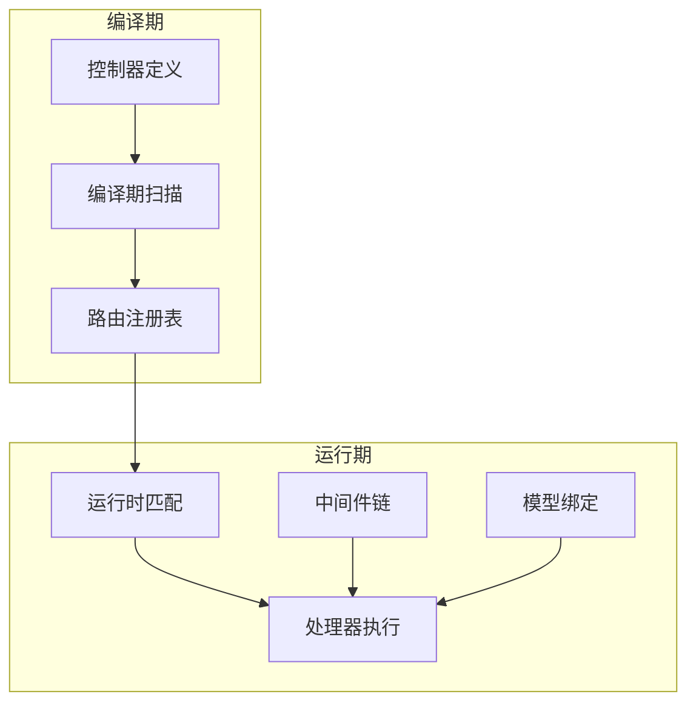
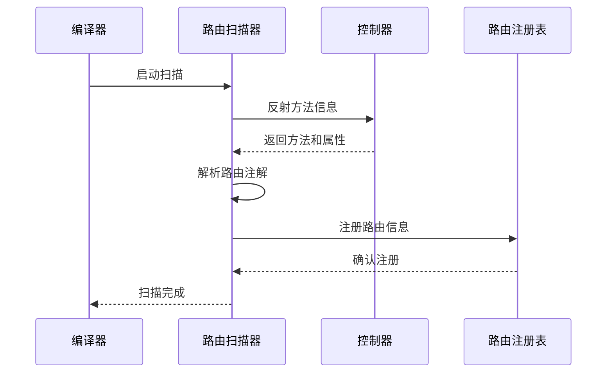

# 路由系统

## 路由系统概述

Photon框架的路由系统是一个基于注解驱动的高性能路由解决方案，采用编译期路由扫描和运行时快速匹配的设计理念。该系统深受Laravel和Spring框架的启发，结合V语言的comptime反射能力，实现了类型安全、性能优异的路由管理机制。

路由系统的核心设计理念是将路由定义从配置文件中解放出来，通过直接在控制器方法上使用注解来声明路由信息。这种方式不仅提高了代码的可读性和维护性，还通过编译期检查确保了路由的正确性[^1]。

系统支持完整的HTTP方法集合（GET、POST、PUT、DELETE、PATCH），灵活的路径参数绑定，以及强大的中间件链机制。通过编译期路由扫描，Photon能够在应用启动时构建高效的路由表，显著减少运行时的路由匹配开销[^2]。

## 核心架构设计

### 路由信息模型

路由系统的核心数据结构是`RouteInfo`，它封装了单个路由的所有元数据信息：

```v
pub struct RouteInfo {
pub:
    method       string   // HTTP方法：GET、POST、PUT、DELETE、PATCH
    path         string   // 路由路径：/users/:id
    handler_name string   // 处理方法名称
    middlewares  []string // 中间件名称列表
}
```

这个简洁而强大的结构体设计使得路由信息既易于理解又便于处理。每个路由都明确标识了HTTP方法、路径模式、对应的处理方法以及需要应用的中间件链[^3]。

### 路由注册表

`RouteRegistry`作为路由的中央管理器，负责收集和组织所有注册的路由：

```v
pub struct RouteRegistry {
pub mut:
    routes []RouteInfo
}
```

注册表提供了简单的API来添加和管理路由，支持动态路由注册和批量路由操作[^4]。



图：路由系统架构流程（类型：流程图）

## 注解路由机制

### HTTP方法注解

Photon支持完整的HTTP方法注解集合，允许开发者直接在控制器方法上声明路由：

```v
@[get]
@['/users']
pub fn (mut app App) list_users(mut ctx Context) veb.Result {
    // 处理逻辑
}

@[post]
@['/users']
pub fn (mut app App) create_user(mut ctx Context) veb.Result {
    // 处理逻辑
}

@[put]
@['/users/:id']
pub fn (mut app App) update_user(mut ctx Context, id string) veb.Result {
    // 处理逻辑
}
```

这种声明式的路由定义方式使得代码更加直观，路由信息与处理逻辑紧密关联，便于理解和维护[^5]。

### 编译期路由扫描

路由扫描的核心实现在`scan_controller`函数中，它利用V语言的comptime反射能力：

```v
pub fn scan_controller[T]() []RouteInfo {
    mut routes := []RouteInfo{}

    $for method in T.methods {
        mut found_route := false
        mut http_method := ''
        mut path := ''

        // 检查HTTP方法属性（基于注解）
        for attr in method.attrs {
            if attr == 'get' || attr == 'post' || attr == 'put' || attr == 'delete'
                || attr == 'patch' {
                http_method = attr.to_upper()
                found_route = true
            }
            if attr.starts_with('/') {
                path = attr
            }
        }

        // 基于约定的路由：返回veb.Result的方法自动成为路由
        $if method.return_type is veb.Result {
            if !found_route {
                http_method = 'GET'
                found_route = true
            }
        }
        // 代码已截取
    }
    return routes
}
```

这个函数在编译期遍历控制器的所有方法，解析注解信息，并构建路由信息列表。通过comptime反射，系统能够在编译阶段完成大部分路由处理工作[^6]。

### 约定优于配置

除了显式的注解声明，Photon还支持约定优于配置的路由定义方式。任何返回`veb.Result`的控制器方法都会自动被识别为路由处理器，默认使用GET方法，路径基于方法名生成：

```v
// 自动映射为 GET /index
pub fn (mut app App) index(mut ctx Context) veb.Result {
    return ctx.text("Hello World")
}

// 自动映射为 GET /profile
pub fn (mut app App) profile(mut ctx Context) veb.Result {
    return ctx.text("Profile Page")
}
```

这种约定机制减少了样板代码，提高了开发效率[^7]。

## 路径参数处理

### 参数语法

Photon支持RESTful风格的路径参数，使用冒号语法声明参数：

```v
@[get]
@['/users/:id']
pub fn (mut app App) get_user(mut ctx Context, id string) veb.Result {
    // id参数自动从URL路径中提取
    user_id := id.int()
    // 处理逻辑
}

@[get]
@['/posts/:post_id/comments/:comment_id']
pub fn (mut app App) get_comment(mut ctx Context, post_id string, comment_id string) veb.Result {
    // 支持多个路径参数
    // 处理逻辑
}
```

路径参数会自动映射到控制器方法的参数中，类型转换由开发者负责处理[^8]。

### 参数验证

虽然基础的路由系统不包含内置的参数验证，但可以通过控制器方法中的逻辑来实现参数验证：

```v
@[get]
@['/users/:id']
pub fn (mut app App) get_user(mut ctx Context, id string) veb.Result {
    user_id := id.int()
    if user_id <= 0 {
        return ctx.send_bad_request('Invalid user ID')
    }
    // 继续处理
}
```

这种设计保持了路由系统的简洁性，同时提供了足够的灵活性来实现复杂的验证逻辑[^9]。

## 路由分组系统

### 基础分组

路由分组允许将相关的路由组织在一起，共享公共的前缀和中间件：

```v
pub fn group(prefix string, routes []RouteInfo) []RouteInfo {
    mut result := []RouteInfo{}
    for route in routes {
        result << RouteInfo{
            method:       route.method
            path:         prefix + route.path
            handler_name: route.handler_name
            middlewares:  route.middlewares.clone()
        }
    }
    return result
}
```

使用分组可以简化路由定义，避免重复的路径前缀：

```v
api_routes := [
    get('/users', 'list_users'),
    get('/users/:id', 'get_user'),
    post('/users', 'create_user'),
]

grouped_routes := group('/api/v1', api_routes)
// 结果：/api/v1/users, /api/v1/users/:id, /api/v1/users
```

### 带中间件的分组

分组还支持共享中间件，所有组内的路由都会自动继承组的中间件：

```v
pub fn group_with_middleware(prefix string, routes []RouteInfo, middlewares []string) []RouteInfo {
    mut result := []RouteInfo{}
    for route in routes {
        mut mw := middlewares.clone()
        mw << route.middlewares
        result << RouteInfo{
            method:       route.method
            path:         prefix + route.path
            handler_name: route.handler_name
            middlewares:  mw
        }
    }
    return result
}
```

这种设计使得中间件管理更加高效和一致[^10]。

## 中间件绑定机制

### 中间件注解

Photon支持在路由级别绑定中间件，通过`@[middleware]`注解实现：

```v
@[middleware('auth')]
@[middleware('role:admin')]
@[get]
@['/admin/users']
pub fn (mut app App) admin_users(mut ctx Context) veb.Result {
    // 需要认证和管理员权限
}
```

中间件解析逻辑在路由扫描过程中完成：

```v
// 收集中间件声明，从@[middleware('name')]属性中提取
mut middlewares := []string{}
mut collecting := false
for attr in method.attrs {
    if attr == 'middleware' {
        collecting = true
        continue
    }
    if collecting {
        // 提取单个中间件名称参数
        trimmed := attr.trim_space().trim("'").trim('"')
        if trimmed.len > 0 && trimmed[0] != `/` {
            middlewares << trimmed
            continue
        }
        collecting = false
    }
}
```

### 中间件组

Photon引入了中间件组的概念，允许将多个中间件组合成一个命名组：

```v
// 中间件组定义示例
groups := {
    'web':    ['cors', 'request_id', 'request_log', 'csrf']
    'api':    ['cors', 'request_id', 'request_log', 'rate_limit']
    'auth':   ['jwt_auth']
    'admin':  ['jwt_auth', 'role:ADMIN']
    'editor': ['jwt_auth', 'role:EDITOR,ADMIN']
}
```

这种设计简化了中间件管理，提高了复用性[^11]。

### 参数化中间件

系统支持参数化中间件，允许在运行时传递配置参数：

```v
pub fn parse_middleware_params(spec string) ParameterizedMiddleware {
    parts := spec.split(':')
    name := parts[0]
    mut params := map[string]string{}

    if parts.len > 1 {
        param_list := parts[1].split(',')
        for i, p in param_list {
            params['${i}'] = p
            // 解析key=value风格
            kv := p.split('=')
            if kv.len == 2 {
                params[kv[0]] = kv[1]
            }
        }
    }

    return ParameterizedMiddleware{
        name:   name
        params: params
    }
}
```

参数化中间件支持如限流、角色验证等需要配置的场景：

```v
// 限流中间件：每分钟60次请求
throttle_middleware(60, 1)

// 角色中间件：需要ADMIN或MODERATOR角色
role_middleware(['ADMIN', 'MODERATOR'])
```

## 模型绑定系统

### 隐式绑定

Photon的模型绑定系统支持Laravel风格的隐式绑定，自动将路由参数解析为实体对象：

```v
@[get]
@['/users/:id']
pub fn (mut app App) show(user &User) veb.Result {
    // :id参数自动解析为User实体
    return ctx.send_data(json.encode(user))
}
```

隐式绑定通过编译期反射发现控制器方法参数中的实体类型：

```v
pub fn discover_bindings[T]() []ModelBindingConfig {
    mut bindings := []ModelBindingConfig{}

    $for method in T.methods {
        $for param in method.params {
            param_type := typeof(param.typ).name
            // 如果参数类型是实体结构体，自动绑定
            if param_type !in ['string', 'int', 'bool', 'voidptr'] {
                bindings << ModelBindingConfig{
                    field:       param.name
                    entity_type: param_type
                }
            }
        }
    }
    return bindings
}
```

### 显式绑定

对于复杂的绑定场景，Photon提供了显式绑定机制：

```v
pub fn bind_route_model[T](mut registry ModelBindingRegistry, controller_name string, param string) {
    entity_type := typeof[T]().name
    registry.bind(controller_name, param, entity_type)
}
```

显式绑定允许精确控制绑定行为，支持自定义查询条件和错误处理[^12]。

### 模型解析

模型解析的核心实现在`resolve_model`函数中：

```v
pub fn resolve_model(entity_type string, id_value string, manager voidptr) !voidptr {
    table_name := entity_type.to_lower() + 's'
    _ = table_name
    _ = manager

    // 存根：需要真实的数据库驱动连接
    return unsafe { nil }
}
```

虽然当前实现是存根，但设计预留了与ORM集成的接口，支持完整的数据库查询和实体解析[^13]。

## 编译期路由扫描

### 扫描流程

编译期路由扫描是Photon路由系统的核心优化，它在应用编译阶段完成大部分路由处理工作：



图：编译期路由扫描流程（类型：序列图）

扫描过程利用V语言的`$for`和`$if`等comptime特性，在编译期完成路由信息的收集和处理[^14]。

### 性能优势

编译期扫描带来了显著的性能优势：

1. **零运行时开销**：路由信息在编译期就已确定，无需运行时解析
2. **类型安全**：编译期检查确保路由定义的正确性
3. **优化机会**：编译器可以对路由表进行优化处理
4. **早期错误检测**：路由冲突和错误在编译阶段就能发现

### 扫描实现细节

路由扫描的核心逻辑包括注解解析、路径生成和中间件收集：

```v
$for method in T.methods {
    mut found_route := false
    mut http_method := ''
    mut path := ''

    // 检查HTTP方法属性
    for attr in method.attrs {
        if attr == 'get' || attr == 'post' || attr == 'put' || attr == 'delete'
            || attr == 'patch' {
            http_method = attr.to_upper()
            found_route = true
        }
        if attr.starts_with('/') {
            path = attr
        }
    }

    // 约定式路由
    $if method.return_type is veb.Result {
        if !found_route {
            http_method = 'GET'
            found_route = true
        }
    }

    if found_route {
        name := method.name
        // 跳过生命周期钩子
        if name != 'before_request' && name != 'after_request' {
            if path.len == 0 {
                if name == 'index' {
                    path = '/'
                } else {
                    path = '/${name}'
                }
            }
            // 处理中间件和路由注册
        }
    }
}
```

这种设计确保了路由扫描的完整性和准确性[^15]。

## 运行时路由解析

### 路由匹配算法

虽然路由扫描在编译期完成，但实际的路由匹配仍然需要在运行时进行。Photon采用高效的路由匹配算法，支持：

1. **精确匹配**：优先匹配完全相同的路径
2. **参数匹配**：支持路径参数的动态匹配
3. **HTTP方法过滤**：确保HTTP方法的正确性
4. **中间件链执行**：按顺序执行绑定的中间件

### 请求处理流程

运行时的请求处理流程如下：

```v
// 伪代码示例
fn handle_request(mut ctx Context) veb.Result {
    // 1. 路由匹配
    route := match_route(ctx.req.method, ctx.req.url)
    
    // 2. 中间件链执行
    for middleware in route.middlewares {
        if !middleware.execute(ctx) {
            return ctx.forbidden()
        }
    }
    
    // 3. 参数解析
    params := parse_path_params(route.path, ctx.req.url)
    
    // 4. 控制器方法调用
    return call_controller(route.handler_name, ctx, params)
}
```

### 性能优化

运行时路由解析采用了多种性能优化策略：

1. **路由表索引**：构建高效的路由索引结构
2. **缓存机制**：缓存常用路由的匹配结果
3. **短路求值**：在匹配失败时快速返回
4. **内存池**：复用请求处理过程中的对象

## 性能优化策略

### 编译期优化

Photon路由系统的主要性能优势来自编译期优化：

1. **静态路由表**：路由信息在编译期就已确定，无需运行时构建
2. **代码生成**：编译器可以生成优化的路由匹配代码
3. **内联优化**：简单的路由处理可以被编译器内联
4. **死代码消除**：未使用的路由代码可以被编译器移除

### 运行时优化

运行时优化策略包括：

```v
// 中间件链优化示例
pub fn (mc &MiddlewareChain) execute(ctx &MiddlewareContext) !bool {
    for mw in mc.middlewares {
        if !mw(ctx)! {
            return false
        }
    }
    return true
}
```

1. **中间件链优化**：减少中间件执行的开销
2. **参数解析优化**：高效的路径参数提取
3. **内存管理**：减少内存分配和垃圾回收
4. **并发处理**：支持高并发的路由处理

### 基准测试

路由系统的性能通过基准测试验证：

```v
fn test_route_registry_multiple_register() {
    mut rr := new_route_registry()
    rr.register('GET', '/', 'index')
    rr.register('GET', '/health', 'health')
    rr.register('POST', '/login', 'login')
    assert rr.routes.len == 3
}
```

测试覆盖了路由注册、匹配、参数解析等关键功能[^16]。

## 实际应用示例

### 完整的控制器示例

基于Photon博客应用的实际控制器，展示路由系统的完整应用：

```v
// 用户管理控制器
@[get]
@['/api/v1/users']
pub fn (mut app App) get_users(mut ctx Context) veb.Result {
    // 认证 + 角色校验
    _, roles := app.middleware_registry.authenticate(mut ctx.Context) or {
        return ctx.send_unauthorized(err.msg())
    }
    app.middleware_registry.authorize(['ADMIN'], roles) or {
        return ctx.send_forbidden(err.msg())
    }
    
    // 解析查询参数
    page_str := ctx.query['page'] or { '1' }
    page_size_str := ctx.query['page_size'] or { '20' }
    
    // 业务逻辑处理
    // ...
}

@[get]
@['/api/v1/users/:id']
pub fn (mut app App) get_user(mut ctx Context, id string) veb.Result {
    // 路径参数自动绑定
    user_id := id.int()
    if user_id <= 0 {
        return ctx.send_bad_request('invalid user id')
    }
    
    // 业务逻辑处理
    // ...
}
```

### 中间件组配置

实际应用中的中间件组配置：

```v
pub fn new_middleware_group_registry(
    cfg appconfig.WebConfig,
    auth_svc &services.AuthService,
    rh &security.RoleHierarchy,
    csrf_mgr &security.CsrfManager,
    log &logger.Logger,
) &MiddlewareGroupRegistry {
    return &MiddlewareGroupRegistry{
        groups: {
            'web':    ['cors', 'request_id', 'request_log', 'csrf']
            'api':    ['cors', 'request_id', 'request_log', 'rate_limit']
            'auth':   ['jwt_auth']
            'admin':  ['jwt_auth', 'role:ADMIN']
            'editor': ['jwt_auth', 'role:EDITOR,ADMIN']
        }
    }
}
```

### 路由分组应用

实际的路由分组使用：

```v
// API路由分组
api_routes := [
    get('/users', 'get_users'),
    get('/users/:id', 'get_user'),
    post('/users', 'post_user'),
    put('/users/:id', 'put_user'),
    delete('/users/:id', 'delete_user'),
]

// 应用API前缀和中间件
grouped_api_routes := group_with_middleware('/api/v1', api_routes, ['auth', 'rate_limit'])
```

这些示例展示了Photon路由系统在实际项目中的应用方式，体现了其设计理念和实现优势[^17]。

## 参考文献

[^1]: [路由系统核心实现](src/web/router.v#L1-L8)
[^2]: [RouteInfo结构体定义](src/web/router.v#L10-L17)
[^3]: [RouteRegistry路由注册表](src/web/router.v#L27-L36)
[^4]: [路由注册方法实现](src/web/router.v#L38-L45)
[^5]: [HTTP方法路由函数](src/web/router.v#L47-L90)
[^6]: [编译期路由扫描实现](src/web/router.v#L123-L195)
[^7]: [约定式路由处理逻辑](src/web/router.v#L147-L153)
[^8]: [路径参数处理示例](demo/controllers.v#L431-L453)
[^9]: [路由分组实现](src/web/router.v#L92-L105)
[^10]: [带中间件的路由分组](src/web/router.v#L107-L121)
[^11]: [中间件组注册表](demo/app/http/middleware/registry.v#L17-L79)
[^12]: [模型绑定配置](src/web/model_binding.v#L15-L22)
[^13]: [隐式模型绑定发现](src/web/model_binding.v#L76-L92)
[^14]: [编译期反射扫描](src/web/router.v#L130-L145)
[^15]: [中间件属性解析](src/web/router.v#L166-L184)
[^16]: [路由系统测试用例](src/web/router_test.v#L68-L74)
[^17]: [实际控制器应用](demo/controllers.v#L377-L428)