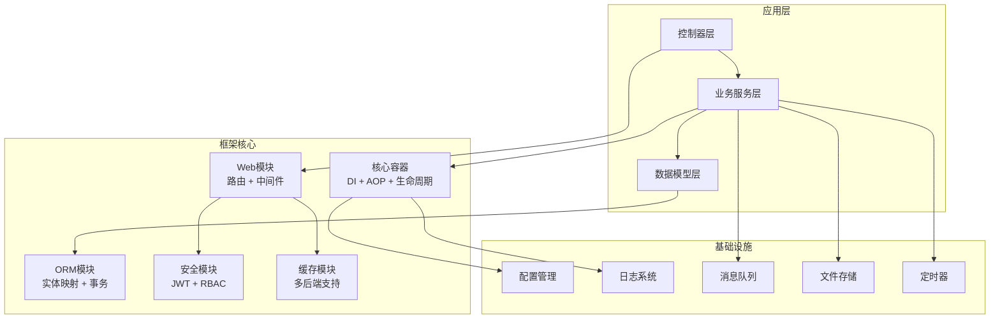
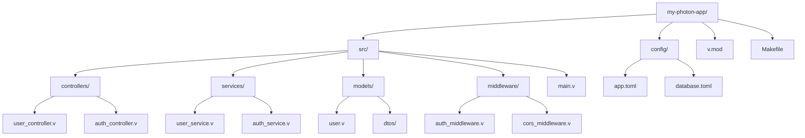
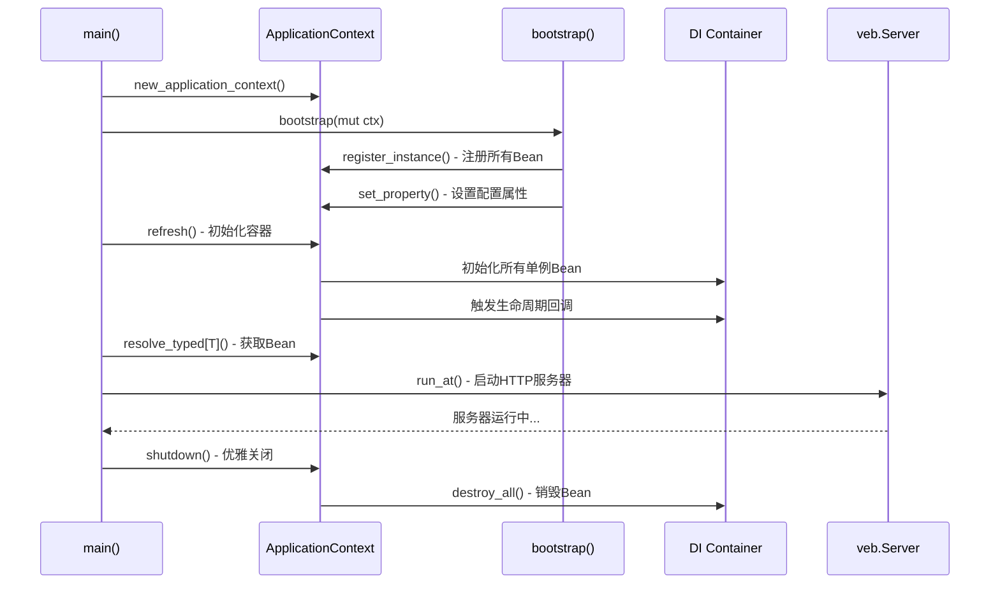

# 快速上手

Photon框架是一个基于V语言的企业级开发框架，提供注解驱动的声明式编程模型、编译期依赖注入和零运行时反射开销。本指南将帮助您快速搭建第一个Photon Web应用。

## 框架架构概览

Photon框架采用分层架构设计，核心思想是"编译期优于运行期，显式优于隐式，约定优于配置"。



图：Photon框架整体架构（类型：架构图）

## 环境准备

### V语言安装

Photon框架需要V语言0.4.x或更高版本。请按照以下步骤安装V语言：

```bash
# 克隆V语言仓库
git clone https://github.com/vlang/v.git
cd v

# 编译并安装
make

# 验证安装
v -V
```

### 系统要求

- **操作系统**：Linux、macOS、Windows（WSL推荐）
- **编译器**：GCC或Clang
- **内存**：建议至少2GB可用内存
- **磁盘空间**：至少500MB

### 验证环境

创建一个简单的测试文件验证V语言环境：

```v
// test.v
fn main() {
    println('Hello V Language!')
}
```

运行测试：
```bash
v run test.v
```

如果输出"Hello V Language!"，说明环境配置正确。

## 项目创建

### 方式一：使用示例项目

最快速的方式是基于Photon的示例项目开始：

```bash
# 克隆Photon框架
git clone https://github.com/photon-framework/photon.git
cd photon

# 运行示例应用
v run example/
```

### 方式二：创建新项目

创建一个新的Photon项目目录结构：

```bash
mkdir my-photon-app
cd my-photon-app

# 创建基本目录结构
mkdir -p src/{controllers,services,models,middleware}
mkdir config
```

创建项目配置文件 `v.mod`：

```v
Module {
    name: 'my-photon-app'
    description: 'My Photon Application'
    version: '1.0.0'
    license: 'MIT'
    dependencies: [
        'photon'
    ]
}
```

### 项目结构说明



图：Photon项目目录结构（类型：结构图）

标准Photon项目包含以下核心目录：

- **src/controllers/** - Web控制器，处理HTTP请求和响应
- **src/services/** - 业务逻辑层，实现核心业务功能
- **src/models/** - 数据模型，定义实体和数据传输对象
- **src/middleware/** - 中间件，处理横切关注点（认证、日志等）
- **config/** - 配置文件，包括应用配置、数据库配置等
- **v.mod** - V语言模块配置文件，定义项目依赖和元数据
- **Makefile** - 构建脚本，简化编译和部署流程

## 基本配置

### 应用启动流程

Photon应用的启动流程遵循标准的Spring Boot模式，通过DI容器管理所有组件的生命周期。



图：Photon应用启动流程（类型：时序图）

### 应用入口文件

创建 `src/main.v` 作为应用入口：

```v
module main

import photon.core
import photon.web
import veb

// 应用控制器
@[controller]
pub struct App {
    veb.Context
pub mut:
    start_time i64
    req_count  int
}

// 首页路由
@[get('/')]
pub fn (mut app App) index() veb.Result {
    return app.json({
        'message': 'Hello Photon!'
        'uptime': '${time.ticks() - app.start_time}ms'
        'requests': '${app.req_count}'
    })
}

pub fn main() {
    // 创建应用上下文
    mut ctx := core.new_application_context()
    
    // 设置基本配置
    ctx.set_profiles(['dev'])
    ctx.set_property('server.port', '8080')
    ctx.set_property('app.name', 'MyPhotonApp')
    
    // 初始化容器
    ctx.refresh() or {
        eprintln('Context refresh failed: ${err}')
        return
    }
    
    // 创建Web应用
    mut web_app := &App{
        start_time: time.ticks()
    }
    
    // 启动HTTP服务器
    println('Starting server on http://localhost:8080')
    veb.run_at[App, veb.Context](mut web_app, port: 8080) or {
        eprintln('Server error: ${err}')
    }
    
    // 优雅关闭
    ctx.shutdown()
}
```

### 构建脚本

创建 `Makefile` 简化构建过程：

```makefile
VFLAGS := -enable-globals

.PHONY: build run clean

build:
	@mkdir -p bin
	v $(VFLAGS) -o bin/my-app src/

run:
	v $(VFLAGS) run src/

clean:
	rm -rf bin/

help:
	@echo "Available targets:"
	@echo "  build  - Compile the application"
	@echo "  run    - Run the application"
	@echo "  clean  - Remove build artifacts"
```

## 第一个Web应用

### 创建控制器

创建 `src/controllers/user_controller.v`：

```v
module main

import veb

@[controller]
pub struct UserController {
    veb.Context
}

// 获取用户列表
@[get('/api/users')]
pub fn (mut uc UserController) list() veb.Result {
    users := [
        {'id': 1, 'name': 'Alice', 'email': 'alice@example.com'},
        {'id': 2, 'name': 'Bob', 'email': 'bob@example.com'}
    ]
    
    return uc.json({
        'code': 200
        'message': 'OK'
        'data': users
    })
}

// 获取单个用户
@[get('/api/users/:id')]
pub fn (mut uc UserController) get(id string) veb.Result {
    user_id := id.int()
    
    // 模拟数据库查询
    if user_id == 1 {
        user := {'id': 1, 'name': 'Alice', 'email': 'alice@example.com'}
        return uc.json({
            'code': 200
            'message': 'OK'
            'data': user
        })
    }
    
    return uc.json({
        'code': 404
        'message': 'User not found'
    })
}

// 创建用户
@[post('/api/users')]
pub fn (mut uc UserController) create() veb.Result {
    name := uc.form['name'] or { '' }
    email := uc.form['email'] or { '' }
    
    if name.len == 0 || email.len == 0 {
        return uc.json({
            'code': 400
            'message': 'Name and email are required'
        })
    }
    
    // 模拟创建用户
    new_user := {
        'id': 3
        'name': name
        'email': email
    }
    
    return uc.json({
        'code': 201
        'message': 'User created successfully'
        'data': new_user
    })
}
```

### 创建数据模型

创建 `src/models/user.v`：

```v
module main

// 用户实体
pub struct User {
pub:
    id    int
    name  string
    email string
}

// 创建用户请求
pub struct CreateUserRequest {
    name  string @[required]
    email string @[required]
}

// 用户响应
pub struct UserResponse {
    id    int
    name  string
    email string
}
```

### 创建服务层

创建 `src/services/user_service.v`：

```v
module main

import photon.core

@[service]
pub struct UserService {
pub mut:
    users []User
}

pub fn new_user_service() &UserService {
    return &UserService{
        users: [
            User{id: 1, name: 'Alice', email: 'alice@example.com'},
            User{id: 2, name: 'Bob', email: 'bob@example.com'}
        ]
    }
}

// 获取所有用户
pub fn (s &UserService) get_all() []User {
    return s.users
}

// 根据ID获取用户
pub fn (s &UserService) get_by_id(id int) !User {
    for user in s.users {
        if user.id == id {
            return user
        }
    }
    return error('User not found')
}

// 创建用户
pub fn (mut s UserService) create(req CreateUserRequest) !User {
    new_user := User{
        id: s.users.len + 1
        name: req.name
        email: req.email
    }
    s.users << new_user
    return new_user
}
```

### 更新主应用

更新 `src/main.v` 集成所有组件：

```v
module main

import photon.core
import photon.web
import veb
import time

// 应用控制器
@[controller]
pub struct App {
    veb.Context
pub mut:
    start_time    i64
    req_count     int
    user_service  &UserService = unsafe { nil } @[autowired]
}

// 首页路由
@[get('/')]
pub fn (mut app App) index() veb.Result {
    return app.json({
        'app': 'My Photon App'
        'version': '1.0.0'
        'uptime': '${time.ticks() - app.start_time}ms'
        'requests': '${app.req_count}'
        'endpoints': [
            'GET /',
            'GET /api/users',
            'GET /api/users/:id',
            'POST /api/users'
        ]
    })
}

pub fn main() {
    // 创建应用上下文
    mut ctx := core.new_application_context()
    
    // 设置配置
    ctx.set_profiles(['dev'])
    ctx.set_property('server.port', '8080')
    ctx.set_property('app.name', 'MyPhotonApp')
    
    // 注册服务
    user_svc := new_user_service()
    ctx.register_instance('UserService', user_svc)!
    
    // 初始化容器
    ctx.refresh() or {
        eprintln('Context refresh failed: ${err}')
        return
    }
    
    // 解析服务
    resolved_user_svc := ctx.resolve_typed[UserService]('UserService') or {
        eprintln('Failed to resolve UserService: ${err}')
        return
    }
    
    // 创建Web应用
    mut web_app := &App{
        start_time: time.ticks()
        user_service: resolved_user_svc
    }
    
    // 注册中间件
    web_app.use(fn [mut web_app] (mut ctx veb.Context) bool {
        web_app.req_count++
        return true
    })
    
    // 启动HTTP服务器
    println('=== Starting My Photon App ===')
    println('Server: http://localhost:8080')
    println('API: http://localhost:8080/api/users')
    println('================================')
    
    veb.run_at[App, veb.Context](mut web_app, port: 8080) or {
        eprintln('Server error: ${err}')
    }
    
    // 优雅关闭
    ctx.shutdown()
}
```

## 运行和测试

### 启动应用

```bash
# 使用Makefile
make run

# 或直接使用V命令
v run src/
```

应用启动后，访问 http://localhost:8080 查看首页。

### API测试

使用curl测试API端点：

```bash
# 获取首页
curl http://localhost:8080/

# 获取用户列表
curl http://localhost:8080/api/users

# 获取单个用户
curl http://localhost:8080/api/users/1

# 创建用户
curl -X POST http://localhost:8080/api/users \
  -H "Content-Type: application/x-www-form-urlencoded" \
  -d "name=Charlie&email=charlie@example.com"
```

### 构建生产版本

```bash
# 编译优化版本
make build

# 运行编译后的二进制文件
./bin/my-app
```

## 下一步

现在您已经成功创建了第一个Photon Web应用！接下来可以：

1. **学习依赖注入**：深入了解Photon的DI容器和注解驱动编程
2. **添加数据库支持**：集成ORM模块进行数据持久化
3. **实现认证授权**：使用安全模块添加JWT认证
4. **添加缓存**：使用缓存模块提升性能
5. **部署应用**：学习如何将应用部署到生产环境

更多详细信息请参考：
- [Photon框架文档](https://github.com/photon-framework/photon)
- [示例项目](https://github.com/photon-framework/photon/tree/master/example)
- [完整演示项目](https://github.com/photon-framework/photon/tree/master/demo)

## 常见问题

### Q: V语言编译失败怎么办？
A: 确保使用V语言0.4.x或更高版本，并正确安装了GCC或Clang编译器。

### Q: 如何添加第三方依赖？
A: 在`v.mod`文件的`dependencies`数组中添加依赖项。

### Q: 如何调试应用？
A: 使用`v -g run src/`启用调试模式，或在代码中添加`println()`语句。

### Q: 如何处理静态文件？
A: 在控制器中添加静态文件路由，或使用veb的静态文件服务功能。

## 参考文献

[^1]: [Photon框架主文档](README.md#L1-L1)
[^2]: [示例应用入口文件](example/main.v#L1-L1)
[^3]: [应用初始化和Bean注册](example/bootstrap.v#L1-L1)
[^4]: [Web控制器实现](example/controllers.v#L1-L1)
[^5]: [业务服务层实现](example/services.v#L1-L1)
[^6]: [数据模型定义](example/models.v#L1-L1)
[^7]: [中间件实现](example/middleware.v#L1-L1)
[^8]: [核心容器实现](src/core/core.v#L1-L100)
[^9]: [Web模块概述](src/web/web.v#L1-L1)
[^10]: [项目模块配置](v.mod#L1-L1)
[^11]: [构建自动化脚本](Makefile#L1-L1)