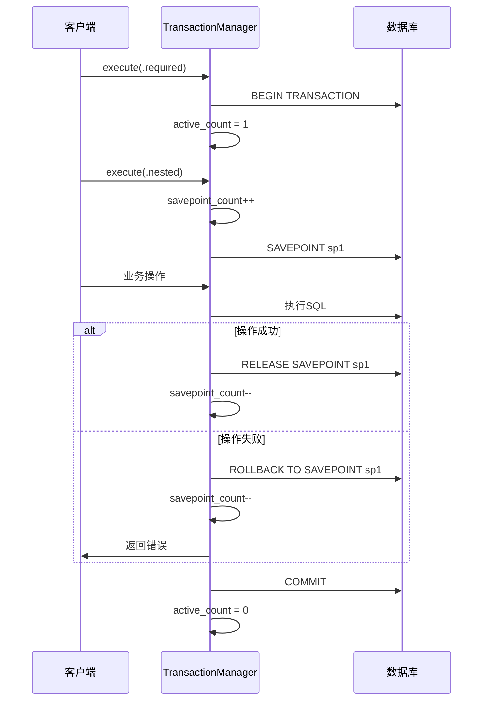

# 事务管理

## 事务管理概述

Photon框架的事务管理系统是一个基于V语言ORM的高级事务管理解决方案，提供了Spring风格的事务传播行为、隔离级别控制和声明式事务管理功能。该系统在V原生ORM事务 primitives基础上构建了完整的事务抽象层，支持复杂的企业级事务场景[^1]。

事务管理系统的核心设计理念是将事务控制从业务逻辑中分离出来，通过统一的API和注解机制提供事务边界管理。系统采用基于计数器的嵌套事务管理机制，解决了传统布尔标志在并发环境下的状态污染问题，确保了嵌套事务的正确性和线程安全性[^2]。

## 核心架构设计

### TransactionManager核心组件

TransactionManager是整个事务管理系统的核心，负责事务的生命周期管理和状态跟踪。该组件采用了创新的设计模式来处理复杂的事务场景：

```v
pub struct TransactionManager {
pub mut:
    active_count    int           // 活跃事务计数器
    savepoint_count int           // 保存点计数器
    propagation     Propagation = .required
    isolation       Isolation   = .default_
    read_only       bool
    timeout_ms      int          // 超时时间（毫秒）
    started_at      time.Time    // 事务开始时间
    rollback_for    []string     // 触发回滚的异常类型
    no_rollback_for []string     // 不触发回滚的异常类型
    driver          DriverType = .sqlite
    conn            voidptr      // 数据库连接
    begin_fn        fn (voidptr) ! // 开始事务回调
    commit_fn       fn (voidptr) ! // 提交事务回调
    rollback_fn     fn (voidptr) ! // 回滚事务回调
    exec_fn         fn (voidptr, string) ! // 执行SQL回调
mut:
    mu sync.RwMutex              // 读写锁保护并发安全
}
```

### 计数器栈机制

系统采用`active_count`计数器而非传统的布尔标志来跟踪事务状态，这一设计解决了CRITICAL #3问题：并发环境下嵌套`REQUIRES_NEW`传播导致的状态污染[^3]。计数器机制的工作原理：

- 每次开始事务时递增计数器
- 每次提交/回滚时递减计数器
- 计数器为0时表示无活跃事务
- 嵌套事务通过计数器层级管理

### 回调机制设计

TransactionManager通过回调函数实现与底层ORM的解耦：

- `begin_fn`: 开始事务的具体实现
- `commit_fn`: 提交事务的具体实现  
- `rollback_fn`: 回滚事务的具体实现
- `exec_fn`: 执行原生SQL（用于设置隔离级别等）

这种设计使得事务管理器可以适配不同的数据库驱动和ORM实现，提供了良好的扩展性。

## 传播行为详解

Photon事务管理系统实现了完整的7种Spring风格传播行为，每种行为都有明确的语义和使用场景：

### REQUIRED传播行为

REQUIRED是默认的传播行为，其语义为"加入现有事务或创建新事务"：

```v
fn (mut tm TransactionManager) execute_required(f fn () !) ! {
    tm.mu.@lock()
    was_inactive := tm.active_count == 0
    if was_inactive {
        tm.begin_locked() or {
            tm.mu.unlock()
            return err
        }
    }
    tm.mu.unlock()
    
    f() or {
        tm.mu.@lock()
        if was_inactive {
            tm.rollback_locked() or {}
        }
        tm.mu.unlock()
        return err
    }
    
    tm.mu.@lock()
    if was_inactive {
        tm.commit_locked() or {
            tm.mu.unlock()
            return err
        }
    }
    tm.mu.unlock()
}
```

### REQUIRES_NEW传播行为

REQUIRES_NEW传播行为总是创建新事务，即使存在现有事务也会挂起它：

```v
fn (mut tm TransactionManager) execute_requires_new(f fn () !) ! {
    tm.mu.@lock()
    tm.begin_new_locked() or {
        tm.mu.unlock()
        return err
    }
    tm.mu.unlock()
    
    f() or {
        tm.mu.@lock()
        tm.rollback_locked() or {
            tm.mu.unlock()
            return err
        }
        tm.mu.unlock()
        return err
    }
    
    tm.mu.@lock()
    tm.commit_locked() or {
        tm.mu.unlock()
        return err
    }
    tm.mu.unlock()
}
```

### NESTED传播行为

NESTED传播行为在现有事务内创建保存点，支持部分回滚：

```v
fn (mut tm TransactionManager) execute_nested(f fn () !) ! {
    tm.mu.@lock()
    if tm.active_count == 0 {
        tm.mu.unlock()
        return error('no active transaction for nested propagation')
    }
    tm.savepoint_count++
    tm.mu.unlock()
    
    f() or {
        tm.mu.@lock()
        tm.savepoint_count--
        tm.mu.unlock()
        return err
    }
    
    tm.mu.@lock()
    tm.savepoint_count--
    tm.mu.unlock()
}
```

### 传播行为对比表

| 传播行为 | 存在事务时行为 | 无事务时行为 | 使用场景 |
|---------|---------------|-------------|----------|
| REQUIRED | 加入现有事务 | 创建新事务 | 大多数业务场景 |
| REQUIRES_NEW | 挂起现有事务，创建新事务 | 创建新事务 | 需要独立事务的场景 |
| NESTED | 创建保存点 | 错误 | 部分回滚需求 |
| SUPPORTS | 加入现有事务 | 非事务执行 | 查询操作 |
| NOT_SUPPORTED | 挂起现有事务，非事务执行 | 非事务执行 | 不需要事务的操作 |
| MANDATORY | 加入现有事务 | 错误 | 必须在事务中执行 |
| NEVER | 错误 | 非事务执行 | 禁止事务的场景 |

## 隔离级别实现

### 隔离级别定义

系统支持4种标准隔离级别，通过`Isolation`枚举定义：

```v
pub enum Isolation {
    default_        // 使用数据库默认级别
    read_uncommitted  // 读未提交
    read_committed   // 读已提交
    repeatable_read  // 可重复读
    serializable     // 串行化
}
```

### 驱动特定SQL生成

系统根据不同的数据库驱动生成相应的隔离级别设置SQL：

```v
fn isolation_sql(driver DriverType, isolation Isolation) string {
    if driver == .sqlite {
        // SQLite只支持read_uncommitted vs default (serializable)
        if isolation == .read_uncommitted {
            return 'PRAGMA read_uncommitted = 1'
        }
        return 'PRAGMA read_uncommitted = 0'
    }
    // 其他数据库使用标准SET TRANSACTION ISOLATION LEVEL
    level := match isolation {
        .read_uncommitted { 'READ UNCOMMITTED' }
        .read_committed { 'READ COMMITTED' }
        .repeatable_read { 'REPEATABLE READ' }
        .serializable { 'SERIALIZABLE' }
        .default_ { '' }
    }
    if level.len == 0 {
        return ''
    }
    return 'SET TRANSACTION ISOLATION LEVEL ${level}'
}
```

### 隔离级别应用

在`begin_with_options`方法中应用隔离级别设置：

```v
pub fn (mut tm TransactionManager) begin_with_options(opts TransactionOptions) ! {
    tm.mu.@lock()
    defer {
        tm.mu.unlock()
    }

    if tm.active_count > 0 {
        return error('transaction already active / 事务已激活')
    }

    if !isnil(tm.begin_fn) {
        tm.begin_fn(tm.conn)!
    }
    tm.active_count++

    // 应用事务选项
    tm.isolation = opts.isolation
    tm.read_only = opts.readonly
    tm.timeout_ms = opts.timeout_ms
    tm.started_at = if opts.timeout_ms > 0 { time.now() } else { time.Time{} }

    // 执行隔离级别SQL
    if opts.isolation != .default_ && !isnil(tm.exec_fn) {
        sql_stmt := isolation_sql(tm.driver, opts.isolation)
        if sql_stmt.len > 0 {
            tm.exec_fn(tm.conn, sql_stmt)!
        }
    }
}
```

## 嵌套事务机制

### 保存点管理

NESTED传播行为通过保存点计数器实现嵌套事务的部分回滚功能。保存点机制允许在事务内部创建回滚点，当内部操作失败时只回滚到保存点，而不影响外部事务[^4]。

### 嵌套事务状态管理

系统通过`savepoint_count`字段跟踪嵌套层级：

```v
pub struct TransactionManager {
pub mut:
    active_count    int  // 活跃事务计数
    savepoint_count int  // 保存点计数
    // ... 其他字段
}
```

### 嵌套事务执行流程



图：嵌套事务执行流程（类型：序列图）

## 事务边界管理

### 事务边界定义

事务边界是指事务开始和结束的范围，正确的事务边界管理对数据一致性至关重要。Photon系统提供了多种事务边界控制方式：

### 编程式事务边界

通过`TransactionManager`的API显式控制事务边界：

```v
mut tm := new_transaction_manager()
tm.begin()!
// 业务操作
if success {
    tm.commit()!
} else {
    tm.rollback()!
}
```

### 声明式事务边界

通过`execute`方法和传播行为控制事务边界：

```v
tm.execute(.required, fn () ! {
    // 自动管理事务边界
    // 成功时自动提交，失败时自动回滚
})!
```

### 事务边界检测

系统提供`is_active()`方法检测当前事务状态：

```v
pub fn (tm &TransactionManager) is_active() bool {
    unsafe { tm.mu.rlock() }
    defer {
        unsafe { tm.mu.runlock() }
    }
    return tm.active_count > 0
}
```

### 事务边界最佳实践

1. **最小化事务范围**: 事务边界应尽可能小，只包含必要的操作
2. **避免长事务**: 长事务会占用数据库资源并增加死锁风险
3. **正确处理异常**: 确保异常情况下事务能正确回滚
4. **合理选择传播行为**: 根据业务需求选择合适的传播行为

## 回滚策略

### 基于异常类型的回滚控制

Photon事务管理系统支持基于异常类型的智能回滚策略，通过`rollback_for`和`no_rollback_for`属性精确控制回滚行为：

```v
pub struct TransactionOptions {
pub:
    isolation       Isolation = .default_
    readonly        bool
    timeout_ms      int
    rollback_for    []string  // 触发回滚的异常类型
    no_rollback_for []string  // 不触发回滚的异常类型
}
```

### 回滚决策算法

系统实现了精确的回滚决策逻辑，按优先级评估异常类型：

```v
pub fn (mut tm TransactionManager) rollback_if_needed(err IError, attr TransactionAttribute) ! {
    tm.mu.@lock()
    defer {
        tm.mu.unlock()
    }

    if tm.active_count == 0 {
        return
    }

    // 1. 优先检查no_rollback_for - 匹配的异常跳过回滚
    for no_rollback_type in attr.no_rollback_for {
        if error_type_matches(err, no_rollback_type) {
            return
        }
    }

    // 2-3. 如果指定了rollback_for，只对匹配的异常回滚
    if attr.rollback_for.len > 0 {
        for rollback_type in attr.rollback_for {
            if error_type_matches(err, rollback_type) {
                tm.rollback_locked()!
                return
            }
        }
        return // 不在rollback_for中 -> 不回滚
    }

    // 4. 默认策略：任何异常都回滚
    tm.rollback_locked()!
}
```

### 异常类型匹配机制

系统支持两种异常类型匹配策略：

```v
fn error_type_matches(err IError, type_name string) bool {
    // 策略1: typeof名称匹配（去除模块前缀）
    tn := typeof(err).name
    if tn == type_name || tn.ends_with('.' + type_name) {
        return true
    }
    // 策略2: 错误消息包含类型名称（回退策略）
    return err.msg().contains(type_name)
}
```

### 回滚策略配置示例

```v
// 只对NetworkError回滚，其他异常不回滚
tm.begin_with_options(TransactionOptions{
    rollback_for: ['NetworkError']
})!

// 对所有异常回滚，除了ValidationError
tm.begin_with_options(TransactionOptions{
    no_rollback_for: ['ValidationError']
})!

// 精确控制：只对NetworkError和TimeoutError回滚，忽略BusinessError
tm.begin_with_options(TransactionOptions{
    rollback_for: ['NetworkError', 'TimeoutError'],
    no_rollback_for: ['BusinessError']
})!
```

## 性能优化

### 读写锁优化

系统使用`sync.RwMutex`实现读写分离，优化并发性能：

- 读操作（如`is_active()`）使用读锁，允许多个并发读取
- 写操作（如`begin`、`commit`、`rollback`）使用写锁，确保独占访问

```v
pub fn (tm &TransactionManager) is_active() bool {
    unsafe { tm.mu.rlock() }  // 读锁
    defer {
        unsafe { tm.mu.runlock() }
    }
    return tm.active_count > 0
}
```

### 计数器机制优化

相比传统的布尔标志，计数器机制减少了锁的竞争：

- 嵌套事务不需要额外的锁操作
- 通过计数器值直接判断事务状态
- 避免了状态污染问题

### 超时控制优化

系统实现了事务超时机制，防止长事务占用资源：

```v
pub fn (mut tm TransactionManager) check_timeout() ! {
    tm.mu.@lock()
    defer {
        tm.mu.unlock()
    }

    if tm.active_count == 0 || tm.timeout_ms == 0 {
        return
    }

    elapsed := time.now().unix_milli() - tm.started_at.unix_milli()
    if elapsed > i64(tm.timeout_ms) {
        tm.rollback_locked() or {}
        return error('transaction timeout / 事务超时')
    }
}
```

### 只读事务优化

只读事务标记允许数据库进行优化：

```v
pub fn (mut tm TransactionManager) exec_within(sql_stmt string, params []string) ! {
    // ... 其他检查
    
    // 只读事务写操作检查
    if tm.read_only {
        sql_upper := sql_stmt.to_upper()
        if is_write_operation(sql_upper) {
            return error('readonly transaction cannot perform write operation / 只读事务不能执行写操作')
        }
    }
    
    // 执行SQL
    if !isnil(tm.exec_fn) {
        tm.exec_fn(tm.conn, sql_stmt)!
    }
}
```

### 性能基准测试

系统提供了完整的性能基准测试，验证不同配置下的性能表现：

```v
fn test_bench_transaction_execute_required() {
    mut tm := new_transaction_manager()
    measure := 10000

    start := time.ticks()
    for _ in 0 .. measure {
        tm.execute(.required, fn () ! {}) or {}
    }
    elapsed := time.ticks() - start

    bench_report('TransactionManager.execute(.required) x10000', measure, elapsed * 1000000)
}
```

## 并发安全

### 并发安全设计

Photon事务管理系统从设计之初就考虑了并发安全性，通过多层机制确保线程安全：

#### 1. 读写锁保护

所有对共享状态的访问都通过`sync.RwMutex`保护：

```v
pub struct TransactionManager {
mut:
    mu sync.RwMutex  // 保护所有可变状态
}
```

#### 2. 原子操作

关键状态变更操作都是原子的，避免中间状态：

```v
fn (mut tm TransactionManager) begin_locked() ! {
    if tm.active_count > 0 {
        return error('transaction already active')
    }
    if !isnil(tm.begin_fn) {
        tm.begin_fn(tm.conn)!
    }
    tm.active_count++  // 原子递增
}
```

#### 3. 计数器栈机制

计数器机制天然支持并发嵌套事务：

```v
fn test_requires_new_count_stack_semantics() {
    mut tm := new_transaction_manager()
    assert tm.active_count == 0

    // 外层事务：0→1
    tm.begin()!
    assert tm.active_count == 1

    // REQUIRES_NEW：1→2→1，保持外层状态
    tm.execute(.requires_new, fn () ! {})!
    assert tm.active_count == 1

    // 提交外层：1→0
    tm.commit()!
    assert tm.active_count == 0
}
```

### 并发测试验证

系统提供了全面的并发测试，验证各种并发场景下的正确性：

#### 1. 独立事务管理器并发

```v
fn test_concurrent_begin_commit_separate_managers() {
    n := 20
    mut handles := []thread bool{}
    for _ in 0 .. n {
        handles << spawn concurrent_begin_commit_worker()
    }
    results := handles.wait()
    assert results.len == n
    for r in results {
        assert r == true, 'concurrent begin/commit worker failed'
    }
}
```

#### 2. 共享事务管理器序列化

```v
fn test_shared_manager_concurrent_serialized() {
    mut tm := new_transaction_manager()
    n := 10
    mut handles := []thread bool{}
    for _ in 0 .. n {
        handles << spawn shared_tm_required_worker(mut tm)
    }
    results := handles.wait()
    assert results.len == n
    for r in results {
        assert r == true, 'shared TM worker failed'
    }
    // 验证无事务泄漏
    assert tm.is_active() == false
    assert tm.active_count == 0
}
```

#### 3. 嵌套REQUIRES_NEW并发安全

```v
fn test_concurrent_nested_requires_new_no_corruption() {
    n := 20
    mut handles := []thread bool{}
    for _ in 0 .. n {
        handles << spawn concurrent_nested_requires_new_worker()
    }
    results := handles.wait()
    assert results.len == n
    for r in results {
        assert r == true, 'nested requires_new corrupted outer tx state'
    }
}
```

### 并发安全最佳实践

1. **独立事务管理器**: 每个goroutine使用独立的TransactionManager实例
2. **避免共享状态**: 尽量避免在多个goroutine间共享TransactionManager
3. **正确使用锁**: 确保所有状态访问都在锁保护下进行
4. **测试验证**: 通过并发测试验证实现的正确性

## 注解式事务

### @[transactional]注解

Photon框架提供了Spring风格的`@[transactional]`注解，支持声明式事务管理：

```v
@[transactional]
pub fn (mut r UserRepository) create_user(mut user User) ! {
    r.repo.save(mut user)!
}
```

### 注解属性解析

系统支持丰富的注解属性配置：

```v
// 基本用法
@[transactional]

// 只读事务
@[transactional: 'readonly']

// 指定传播行为
@[transactional: 'requires_new']

// 复合属性
@[transactional: 'propagation:requires_new;isolation:read_committed;timeout:5000']

// 异常回滚控制
@[transactional: 'rollback:NetworkError;no_rollback:ValidationError']
```

### TransactionAttribute结构

注解解析结果存储在`TransactionAttribute`结构中：

```v
pub struct TransactionAttribute {
pub mut:
    propagation     Propagation = .required
    isolation       Isolation   = .default_
    readonly        bool
    timeout_ms      int
    rollback_for    []string
    no_rollback_for []string
}
```

### 注解解析器

`parse_transactional_attr`函数负责解析注解字符串：

```v
pub fn parse_transactional_attr(attr string) TransactionAttribute {
    mut ta := new_transaction_attribute()

    if attr.len == 0 {
        return ta
    }

    // 简单缩写处理
    lower := attr.to_lower()
    if lower == 'readonly' || lower == 'read_only' {
        ta.readonly = true
        return ta
    }

    // 复杂键值对处理
    parts := attr.split(';')
    for part in parts {
        p := part.trim_space()
        if p.starts_with('propagation:') {
            ta.propagation = propagation_from_str(p['propagation:'.len..])
        } else if p.starts_with('isolation:') {
            ta.isolation = isolation_from_str(p['isolation:'.len..])
        } else if p.starts_with('timeout:') {
            ta.timeout_ms = p['timeout:'.len..].int()
        }
        // ... 其他属性处理
    }

    return ta
}
```

### TransactionalInterceptor

`TransactionalInterceptor`提供了注解式事务的拦截器实现：

```v
pub struct TransactionalInterceptor {
pub mut:
    tx_manager &TransactionManager = unsafe { nil }
}

pub fn (mut ti TransactionalInterceptor) begin_if_needed(attr TransactionAttribute) !bool {
    if isnil(ti.tx_manager) {
        return error('TransactionalInterceptor: TransactionManager not set')
    }

    return match attr.propagation {
        .required {
            if !ti.tx_manager.is_active() {
                ti.tx_manager.begin()!
                true
            } else {
                false
            }
        }
        .requires_new {
            if ti.tx_manager.is_active() {
                ti.tx_manager.commit() or { ti.tx_manager.rollback() or {} }
            }
            ti.tx_manager.begin()!
            true
        }
        // ... 其他传播行为
    }
}
```

## 最佳实践

### 事务管理最佳实践

#### 1. 选择合适的传播行为

```v
// 大多数业务场景使用REQUIRED
@[transactional]
pub fn (mut s OrderService) create_order(order Order) ! {
    // 业务逻辑
}

// 需要独立事务的场景使用REQUIRES_NEW
@[transactional: 'requires_new']
pub fn (mut s AuditService) log_audit(action string) ! {
    // 审计日志需要独立提交
}

// 查询操作使用SUPPORTS
@[transactional: 'supports']
pub fn (mut s UserService) get_user(id int) !User {
    // 支持事务但不强制要求
}
```

#### 2. 合理设置隔离级别

```v
// 默认隔离级别适用于大多数场景
@[transactional]
pub fn (mut s UserService) update_user(user User) ! {
    // 使用数据库默认隔离级别
}

// 需要避免脏读的场景
@[transactional: 'isolation:read_committed']
pub fn (mut s ReportService) generate_report() !Report {
    // 避免读取未提交的数据
}

// 高一致性要求的场景
@[transactional: 'isolation:serializable']
pub fn (mut s BankService) transfer_money(from int, to int, amount f64) ! {
    // 确保最高级别的数据一致性
}
```

#### 3. 异常处理策略

```v
// 业务异常不回滚
@[transactional: 'no_rollback:BusinessException']
pub fn (mut s OrderService) process_order(order Order) ! {
    if order.amount <= 0 {
        return BusinessException('invalid amount')
    }
    // 业务逻辑
}

// 系统异常回滚
@[transactional: 'rollback:SystemException']
pub fn (mut s PaymentService) process_payment(payment Payment) ! {
    // 系统级异常需要回滚
}
```

#### 4. 超时控制

```v
// 设置合理的超时时间
@[transactional: 'timeout:30000']  // 30秒超时
pub fn (mut s BatchService) process_batch(items []Item) ! {
    // 批量处理操作
}
```

### 性能优化建议

#### 1. 最小化事务范围

```v
// 好的做法：事务范围最小化
pub fn (mut s UserService) update_user_profile(user User) ! {
    tm.execute(.required, fn [mut s, user] () ! {
        // 只包含必要的数据库操作
        s.repo.update_user(user)!
        s.repo.update_user_preferences(user.preferences)!
    })!
}

// 避免：事务范围过大
pub fn (mut s UserService) update_user_profile_bad(user User) ! {
    tm.execute(.required, fn [mut s, user] () ! {
        s.repo.update_user(user)!                    // 数据库操作
        s.send_notification_email(user.email)!        // 外部调用
        s.cache.invalidate_user(user.id)!             // 缓存操作
        s.log_user_activity(user.id, 'profile_update')! // 日志记录
    })!
}
```

#### 2. 避免长事务

```v
// 好的做法：分批处理
pub fn (mut s BatchService) process_large_batch(items []Item) ! {
    batch_size := 100
    for i := 0; i < items.len; i += batch_size {
        end := i + batch_size
        if end > items.len {
            end = items.len
        }
        
        batch := items[i..end]
        tm.execute(.required, fn [mut s, batch] () ! {
            for item in batch {
                s.process_item(item)!
            }
        })!
    }
}
```

#### 3. 合理使用只读事务

```v
// 查询操作使用只读事务
@[transactional: 'readonly']
pub fn (mut s ReportService) get_monthly_report(year int, month int) !Report {
    return s.repo.generate_report(year, month)!
}
```

### 错误处理最佳实践

#### 1. 区分业务异常和系统异常

```v
// 业务异常：不触发回滚
struct BusinessException {
    msg string
}

fn (e BusinessException) msg() string {
    return e.msg
}

// 系统异常：触发回滚
struct SystemException {
    msg string
}

fn (e SystemException) msg() string {
    return e.msg
}

@[transactional: 'no_rollback:BusinessException;rollback:SystemException']
pub fn (mut s OrderService) create_order(order Order) ! {
    if order.customer_id == 0 {
        return BusinessException('invalid customer')
    }
    
    // 可能抛出系统异常的数据库操作
    s.repo.save_order(order)!
}
```

#### 2. 正确处理嵌套事务异常

```v
pub fn (mut s OrderService) complex_order_operation(order Order) ! {
    tm.execute(.required, fn [mut s, order] () ! {
        // 外层事务
        
        tm.execute(.nested, fn [mut s, order] () ! {
            // 内层嵌套事务
            s.validate_order(order)!
            s.reserve_inventory(order)!
        }) or {
            // 嵌套事务失败，但不影响外层事务
            // 可以进行补偿操作
        }
        
        // 继续外层事务的其他操作
        s.process_payment(order)!
    })!
}
```

## 参考文献

[^1]: [TransactionManager核心实现](src/orm/transaction.v#L78-L97)
[^2]: [事务传播行为枚举定义](src/orm/transaction.v#L20-L28)
[^3]: [并发安全的计数器机制](src/orm/transaction.v#L64-L77)
[^4]: [嵌套事务保存点管理](src/orm/transaction.v#L527-L544)
[^5]: [隔离级别SQL生成](src/orm/transaction.v#L404-L424)
[^6]: [基于异常类型的回滚策略](src/orm/transaction.v#L348-L378)
[^7]: [事务属性解析](src/orm/transaction_annotation.v#L51-L107)
[^8]: [并发测试验证](src/orm/transaction_concurrency_test.v#L89-L100)
[^9]: [性能基准测试](src/orm/transaction_bench_test.v#L15-L26)
[^10]: [驱动类型定义](src/orm/orm.v#L129-L134)