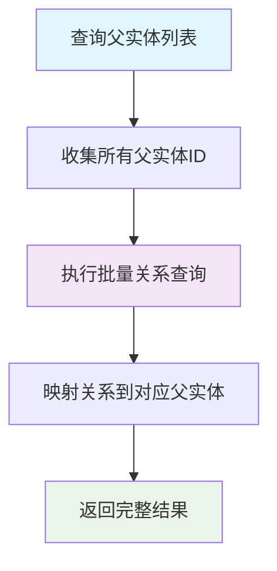
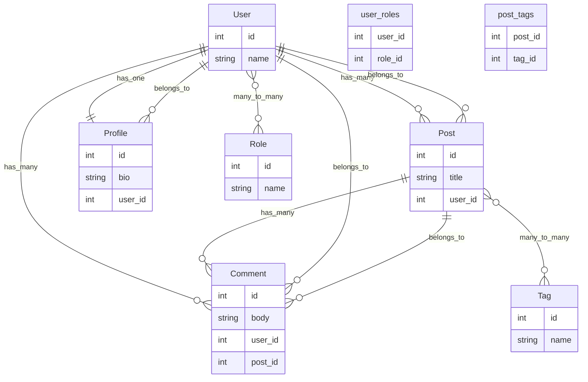

# 关系映射

## 架构概述

Photon ORM的关系映射系统采用了现代化的设计模式，在V语言编译时特性的基础上，提供了类型安全、高性能的实体关系管理能力。该系统通过泛型结构体、编译时反射和回调机制，实现了对一对一、一对多、多对多关系的完整支持[^1]。

关系映射架构分为三个核心层次：关系类型定义层、关系加载执行层和实体生命周期管理层。这种分层设计确保了系统的可扩展性和维护性，同时通过严格的类型检查在编译时捕获潜在错误。

## 关系类型定义

### 基础关系结构

Photon ORM提供了四种标准的关系类型，每种都采用泛型设计以确保类型安全：

```v
// 一对多关系
pub struct HasMany[T] {
pub mut:
    items []T
mut:
    loaded bool
}

// 多对一关系
pub struct BelongsTo[T] {
pub mut:
    item   T
    loaded bool
}

// 多对多关系
pub struct ManyToMany[T] {
pub mut:
    items []T
mut:
    loaded bool
}

// 一对一关系
pub struct HasOne[T] {
pub mut:
    item   T
    loaded bool
}
```

每种关系类型都包含`loaded`状态标记，用于跟踪关系是否已被加载，避免重复查询和潜在的无限递归问题[^2]。

### 关系元数据

`Relationship`结构体提供了关系的完整元数据描述：

```v
pub struct Relationship {
pub:
    name        string
    typ         string // 'has_many', 'belongs_to', 'many_to_many', 'has_one'
    target      string // 目标实体类型名
    foreign_key string
    local_key   string
    pivot_table string // 用于多对多关系
}
```

这种设计使得关系配置可以在运行时动态调整，同时保持了配置的清晰性和可读性。

## 关系加载机制

### RelationLoader核心组件

`RelationLoader`是关系映射系统的核心执行引擎，采用回调模式设计以避免与V标准ORM模块的命名冲突[^3]：

```v
pub struct RelationLoader {
pub mut:
    manager  &OrmManager
    db_name  string
    exec_fn  SqlExecFn  = unsafe { nil }
    query_fn SqlQueryFn = unsafe { nil }
}
```

该设计允许用户在应用层提供具体的数据库操作实现，而Photon ORM专注于关系逻辑的处理。

### 一对多关系加载

`load_has_many`方法实现了一对多关系的加载逻辑：

```v
pub fn (rl &RelationLoader) load_has_many[T, R](entity T, mut relation HasMany[R], foreign_key string) ! {
    // 1. 获取父实体主键值
    pk_value := get_entity_pk_value(entity)!
    
    // 2. 验证标识符防止SQL注入
    target_table := get_table_name[R]()
    if !is_valid_identifier(target_table) {
        return error('load_has_many: invalid table name "${target_table}"')
    }
    
    // 3. 执行参数化查询
    query := 'SELECT * FROM ${target_table} WHERE ${foreign_key} = ?'
    db := rl.manager.get_conn(rl.db_name)!
    rows := rl.query_fn(db, query, [pk_value])!
    
    // 4. 映射结果到实体结构
    mut items := []R{cap: rows.len}
    for row in rows {
        mut item := R{}
        jpa_map_row(mut item, row)
        items << item
    }
    
    // 5. 回填关系
    relation.items = items
    relation.loaded = true
}
```

该实现通过编译时反射获取主键值，使用严格的标识符验证防止SQL注入，并通过参数化查询确保安全性[^4]。

### 多对一关系加载

`load_belongs_to`方法处理多对一关系的加载，特别处理了空外键的情况：

```v
pub fn (rl &RelationLoader) load_belongs_to[T, R](entity T, mut relation BelongsTo[R], foreign_key string) ! {
    // 获取子实体的外键值
    fk_value := get_entity_field_value(entity, foreign_key)!
    
    // 处理空外键情况
    if fk_value == '0' || fk_value == '' {
        relation.item = R{}
        relation.loaded = true
        return
    }
    
    // 执行查询并映射结果
    query := 'SELECT * FROM ${target_table} WHERE id = ?'
    db := rl.manager.get_conn(rl.db_name)!
    rows := rl.query_fn(db, query, [fk_value])!
    
    if rows.len > 0 {
        mut item := R{}
        jpa_map_row(mut item, rows[0])
        relation.item = item
    }
    relation.loaded = true
}
```

这种设计确保了即使关联实体不存在，系统也能优雅地处理而不会抛出异常[^5]。

### 多对多关系加载

多对多关系通过中间表（pivot table）实现，支持复杂的JOIN查询：

```v
pub fn (rl &RelationLoader) load_many_to_many[T, R](entity T, mut relation ManyToMany[R], pivot_table string, local_key string, foreign_key string) ! {
    // 获取实体主键值
    pk_value := get_entity_pk_value(entity)!
    
    // 验证所有标识符
    target_table := get_table_name[R]()
    for ident in [target_table, pivot_table, local_key, foreign_key] {
        if !is_valid_identifier(ident) {
            return error('load_many_to_many: invalid identifier "${ident}"')
        }
    }
    
    // 执行JOIN查询
    query := 'SELECT t.* FROM ${target_table} t INNER JOIN ${pivot_table} p ON t.id = p.${foreign_key} WHERE p.${local_key} = ?'
    db := rl.manager.get_conn(rl.db_name)!
    rows := rl.query_fn(db, query, [pk_value])!
    
    // 映射结果
    mut items := []R{cap: rows.len}
    for row in rows {
        mut item := R{}
        jpa_map_row(mut item, row)
        items << item
    }
    
    relation.items = items
    relation.loaded = true
}
```

该实现通过标准的SQL JOIN语法，高效地处理多对多关系的查询，同时保持了代码的简洁性和可维护性[^6]。

## 加载策略

### 懒加载机制

懒加载是默认的加载策略，关系数据仅在首次访问时被加载。这种策略的优点是：

- 减少初始查询的复杂度和数据传输量
- 避免加载不必要的数据
- 提高应用程序的启动速度

```v
// 使用示例
mut user := User{ id: 1, name: 'Alice' }
mut posts := new_has_many[Post]()
// 此时posts.loaded = false，数据尚未加载

rl.load_has_many[User, Post](user, mut posts, 'user_id')!
// 现在posts.loaded = true，数据已加载
```

### 预加载机制

为了解决N+1查询问题，Photon ORM提供了预加载机制。`EagerLoader`组件支持批量加载相关实体：

```v
pub struct EagerLoader[T] {
pub mut:
    manager    &OrmManager
    table_name string
    db_name    string
    withs      []EagerLoadSpec
}

pub fn (mut el EagerLoader[T]) with(relations []string) &EagerLoader[T] {
    for rel in relations {
        el.withs << EagerLoadSpec{
            name:        rel
            foreign_key: get_relation_fk(rel)
            local_key:   'id'
        }
    }
    return el
}
```

预加载通过收集所有父实体的ID，然后执行单个批量查询来获取所有相关实体，显著提高了性能[^7]。



图：预加载机制执行流程（类型：流程图）

## 级联操作

### 生命周期钩子

Photon ORM通过生命周期钩子系统支持级联操作。实体可以实现以下接口来参与级联操作：

```v
pub interface BeforeDeleteHook {
    before_delete()
}

pub interface AfterDeleteHook {
    after_delete()
}

pub interface BeforeCreateHook {
    before_create()
}

pub interface AfterCreateHook {
    after_create()
}
```

### 级联删除实现

级联删除通过在删除父实体前先删除相关子实体来实现：

```v
// 在实体中实现级联删除逻辑
pub fn (mut user User) before_delete() {
    // 删除用户的所有文章
    for mut post in user.posts.items {
        post.delete()!
    }
    
    // 删除用户的所有评论
    for mut comment in user.comments.items {
        comment.delete()!
    }
}
```

这种设计将级联逻辑封装在实体内部，保持了业务逻辑的内聚性[^8]。

## 安全机制

### SQL注入防护

Photon ORM实现了多层安全机制来防止SQL注入攻击：

1. **标识符验证**：所有表名和列名都经过严格验证

```v
fn is_valid_identifier(s string) bool {
    if s.len == 0 {
        return false
    }
    if !(s[0].is_letter() || s[0] == `_`) {
        return false
    }
    for ch in s {
        if !(ch.is_alnum() || ch == `_`) {
            return false
        }
    }
    return true
}
```

2. **参数化查询**：所有用户输入都通过参数化查询传递

```v
query := 'SELECT * FROM ${target_table} WHERE ${foreign_key} = ?'
rows := rl.query_fn(db, query, [pk_value])!
```

3. **编译时反射**：通过编译时代码生成避免运行时字符串拼接

### 类型安全

通过V语言的泛型系统和编译时检查，Photon ORM确保了：

- 关系类型在编译时就被确定
- 字段访问类型安全
- 防止运行时类型转换错误

## 性能优化

### 批量操作

预加载机制通过批量操作显著提升了性能：

```v
// 传统N+1查询问题
for user in users {
    mut posts := new_has_many[Post]()
    rl.load_has_many[User, Post](user, mut posts, 'user_id')! // N次查询
}

// 优化后的批量查询
mut loader := new_eager_loader[User](om, 'users')
loader.with(['posts'])
// 只需1次查询获取所有用户的文章
```

### 连接池管理

通过`OrmManager`的连接池机制，Photon ORM实现了高效的数据库连接管理：

```v
pub struct OrmManager {
mut:
    connections map[string]DbConnection
    mutex       sync.RwMutex
}
```

连接池避免了频繁创建和销毁数据库连接的开销，提高了应用程序的并发处理能力[^9]。

## 实际应用示例

### 完整的实体关系定义

```v
struct User {
pub:
    id int @[primary_key]
pub mut:
    name     string
    posts    HasMany[Post]
    profile  HasOne[Profile]
    roles    ManyToMany[Role]
    comments HasMany[Comment]
}

struct Post {
pub:
    id int @[primary_key]
pub mut:
    title    string
    user_id  int
    author   BelongsTo[User]
    comments HasMany[Comment]
    tags     ManyToMany[Tag]
}

struct Profile {
pub:
    id int @[primary_key]
pub mut:
    bio     string
    user_id int
    user    BelongsTo[User]
}
```

### 关系加载使用示例

```v
// 创建关系加载器
mut om := new_orm_manager()
om.register_connection('default', .sqlite, voidptr(db))!

exec_fn := fn (db voidptr, query string, args []string) ! {
    // 实现具体的SQL执行逻辑
}

query_fn := fn (db voidptr, query string, args []string) ![][]string {
    // 实现具体的查询逻辑
}

rl := new_relation_loader_with_fns(om, 'default', exec_fn, query_fn)

// 加载用户的所有文章
mut user := User{ id: 1, name: 'Alice' }
mut posts := new_has_many[Post]()
rl.load_has_many[User, Post](user, mut posts, 'user_id')!

// 加载文章的作者
mut post := Post{ id: 10, title: 'Hello World', user_id: 1 }
mut author := new_belongs_to[User]()
rl.load_belongs_to[Post, User](post, mut author, 'user_id')!

// 加载用户的角色（多对多关系）
mut roles := new_many_to_many[Role]()
rl.load_many_to_many[User, Role](user, mut roles, 'user_roles', 'user_id', 'role_id')!
```



图：实体关系模型图（类型：关系图）

## 最佳实践

### 关系设计原则

1. **合理选择关系类型**：根据业务需求选择合适的关系类型，避免过度设计
2. **控制关系深度**：避免过深的嵌套关系，考虑使用DTO来优化数据传输
3. **使用预加载**：在需要访问多个关系时，优先使用预加载避免N+1问题

### 性能优化建议

1. **选择性加载**：只加载需要的关系字段，避免不必要的数据传输
2. **批量操作**：尽可能使用批量操作来减少数据库往返次数
3. **索引优化**：为外键字段和常用查询字段创建适当的数据库索引

### 错误处理

```v
// 推荐的错误处理模式
fn load_user_with_posts(user_id int) !User {
    mut user := repo.find_by_id(user_id)!
    mut posts := new_has_many[Post]()
    
    if err := rl.load_has_many[User, Post](user, mut posts, 'user_id') {
        // 记录错误日志
        eprintln('Failed to load posts for user ${user_id}: ${err}')
        // 返回用户但不包含文章，或者根据业务需求抛出错误
        return user
    }
    
    user.posts = posts
    return user
}
```

## 参考文献

[^1]: [关系类型定义](src/orm/relation.v#L55-L103)
[^2]: [关系元数据结构](src/orm/relation.v#L44-L53)
[^3]: [RelationLoader核心设计](src/orm/relation.v#L114-L120)
[^4]: [一对多关系加载实现](src/orm/relation.v#L161-L194)
[^5]: [多对一关系加载实现](src/orm/relation.v#L207-L240)
[^6]: [多对多关系加载实现](src/orm/relation.v#L257-L289)
[^7]: [预加载机制设计](src/orm/eager.v#L21-L28)
[^8]: [生命周期钩子系统](src/orm/entity.v#L33-L66)
[^9]: [连接池管理机制](src/orm/orm.v#L100-L150)