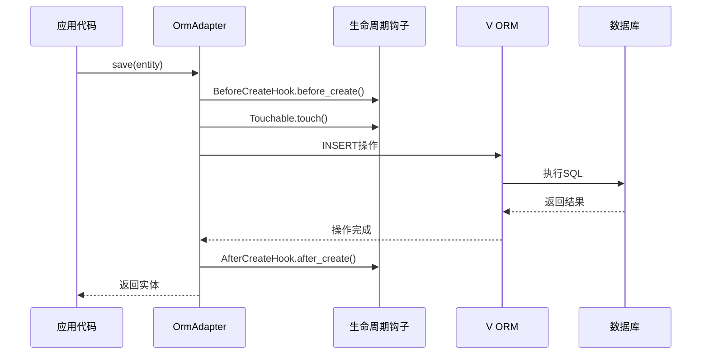
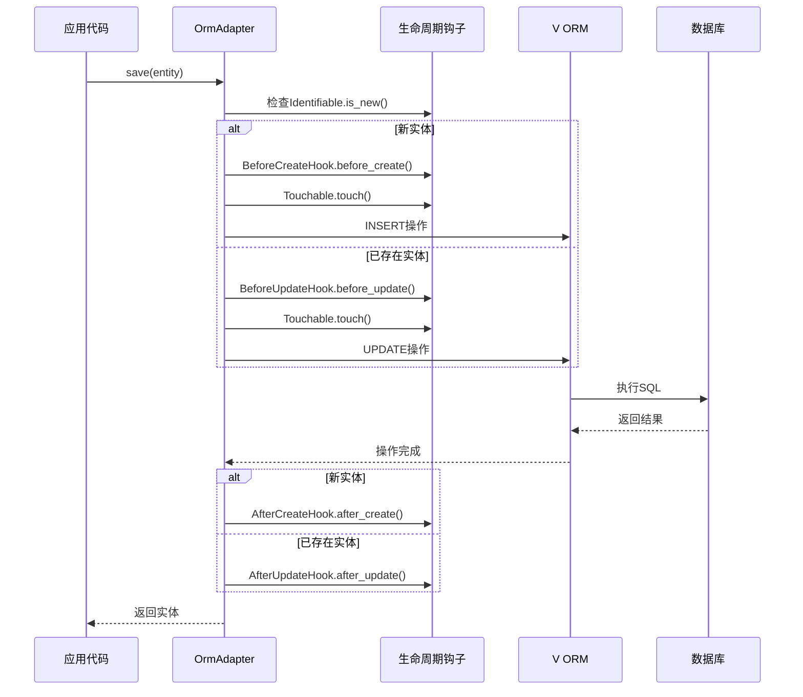
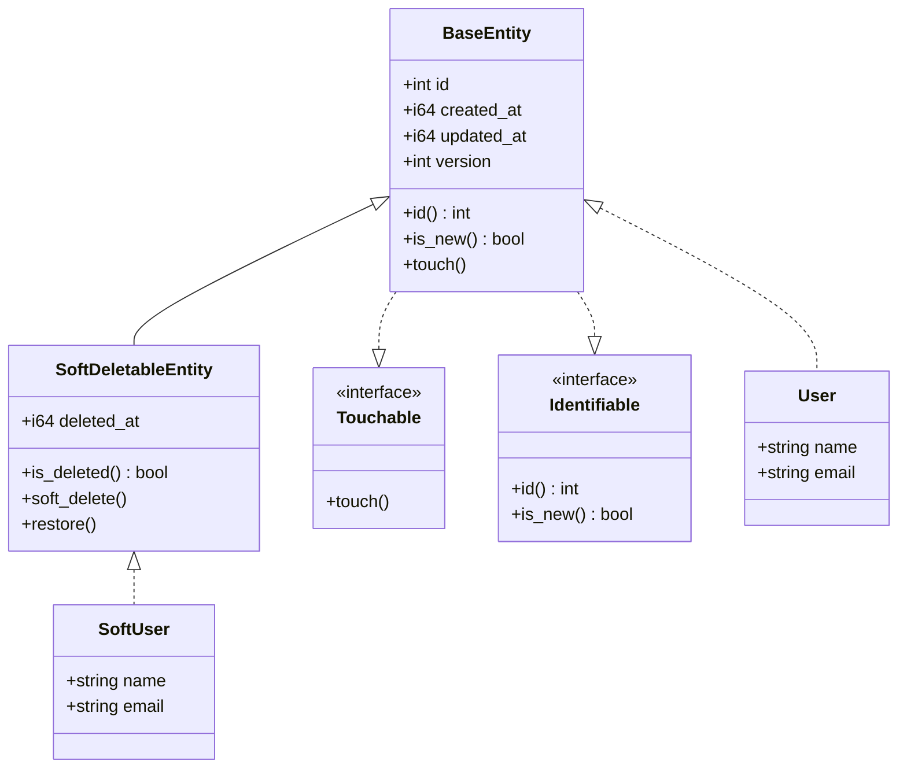
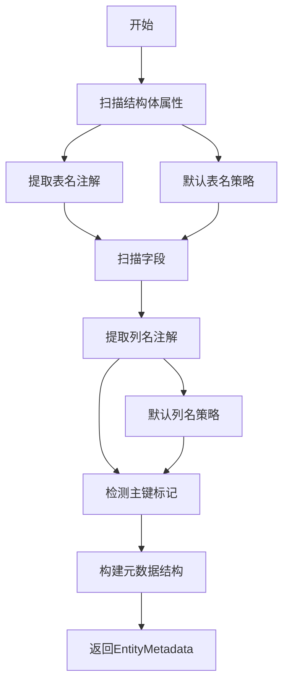

# 实体映射

## 实体映射概述

Photon ORM实现了一个多层次、零运行时反射的实体映射系统，灵感来源于Spring Data JPA，但充分利用了V语言的编译时特性。该系统通过组合模式、适配器模式和模板方法模式，提供了类型安全、高性能的ORM解决方案。

### 核心设计理念

实体映射系统围绕以下几个核心原则构建：

- **零运行时反射**：利用V的comptime特性在编译时提取所有元数据[^1]
- **类型安全**：通过泛型确保编译时类型检查
- **生命周期管理**：提供完整的实体生命周期钩子系统
- **多数据库支持**：通过OrmManager管理多个数据库连接
- **向后兼容**：支持传统struct和JPA注解两种使用模式

### 架构层次

```mermaid
flowchart TB
    subgraph "应用层"
        App[应用代码]
    end
    
    subgraph "仓储层"
        BR[BaseRepository[T]]
        JR[JpaRepository[T]]
        DR[DerivedRepository[T]]
    end
    
    subgraph "适配器层"
        OA[OrmAdapter[T]]
    end
    
    subgraph "实体层"
        BE[BaseEntity]
        SDE[SoftDeletableEntity]
        LH[生命周期钩子]
    end
    
    subgraph "元数据层"
        EM[EntityMetadata]
        CM[ColumnMetadata]
    end
    
    App --> BR
    App --> JR
    App --> DR
    BR --> OA
    JR --> OA
    DR --> OA
    OA --> BE
    OA --> SDE
    OA --> LH
    JR --> EM
    EM --> CM
```

图：实体映射系统架构（类型：架构图）

## 基础实体系统

### BaseEntity核心功能

BaseEntity是所有实体的基础组件，通过结构体嵌入提供通用功能[^2]：

```v
pub struct BaseEntity {
pub mut:
    id         int @[primary_key; sql: 'id'; sql_type: 'INTEGER']
    created_at i64 @[sql: 'created_at'; sql_type: 'INTEGER']
    updated_at i64 @[sql: 'updated_at'; sql_type: 'INTEGER']
    version    int @[sql: 'version'; sql_type: 'INTEGER']
}
```

**核心方法实现**：

- `id() int`：返回实体主键
- `is_new() bool`：判断是否为新实体（id == 0）
- `touch()`：自动更新时间戳和版本号

```v
pub fn (mut e BaseEntity) touch() {
    now := time.now().unix()
    if e.created_at == 0 {
        e.created_at = now
    }
    e.updated_at = now
    e.version++
}
```

### 软删除支持

SoftDeletableEntity扩展BaseEntity，提供软删除功能[^3]：

```v
pub struct SoftDeletableEntity {
    BaseEntity
pub mut:
    deleted_at i64 @[sql: 'deleted_at'; sql_type: 'INTEGER']
}
```

**软删除操作**：
- `is_deleted() bool`：检查是否已删除
- `soft_delete()`：标记为已删除
- `restore()`：恢复删除状态

### 核心接口设计

#### Touchable接口
提供自动时间戳管理能力[^4]：

```v
pub interface Touchable {
mut:
    touch()
}
```

#### Identifiable接口
提供主键访问和新实体检测[^5]：

```v
pub interface Identifiable {
    id() int
    is_new() bool
}
```

#### Entity接口
扩展Identifiable，添加表名感知[^6]：

```v
pub interface Entity {
    Identifiable
    table_name() string
}
```

## JPA注解系统

### 表映射注解

#### @[table('name')] 自定义表名
允许覆盖默认的表名生成策略[^7]：

```v
@[table('t_user')]
struct User {
    // ...
}
```

默认表名生成规则：`snake_case(类型名) + 's'`

### 字段映射注解

#### @[column('name')] 自定义列名
覆盖默认的snake_case列名映射[^8]：

```v
struct User {
pub mut:
    user_id int    @[id]
    name    string @[column('user_name')]
    email   string  // 默认映射为 'email'
}
```

#### @[id] 和 @[primary_key] 主键标记
两种等价的主键标记方式[^9]：

```v
struct User {
pub mut:
    id int @[id]           // 推荐方式
    // 或者
    uid int @[primary_key] // 向后兼容
}
```

#### @[version] 乐观锁版本字段
支持乐观锁并发控制[^10]：

```v
struct Product {
pub mut:
    id      int @[id]
    name    string
    version int @[version]
}
```

### 注解解析机制

系统使用V的comptime特性在编译时提取注解信息[^11]：

```v
pub fn extract_entity_metadata[T]() EntityMetadata {
    mut columns := []ColumnMetadata{}
    mut pk := ColumnMetadata{}
    mut has_pk := false

    // 解析表名注解
    mut tbl_name := ''
    mut has_table := false
    $for attr in T.attributes {
        if attr.name == 'table' && attr.has_arg {
            tbl_name = strip_attr_quotes(attr.arg)
            has_table = true
        }
    }
    if !has_table {
        tbl_name = default_table_name[T]()
    }

    // 解析字段注解
    $for field in T.fields {
        col_name := extract_column_name(field.name, field.attrs)
        is_pk := is_primary_key_field(field.attrs)
        // ... 元数据构建逻辑
    }
    
    return EntityMetadata{...}
}
```

## 生命周期钩子

### 钩子接口定义

系统提供七个生命周期钩子接口[^12]：

```v
pub interface BeforeCreateHook { before_create() }
pub interface AfterCreateHook  { after_create() }
pub interface BeforeUpdateHook { before_update() }
pub interface AfterUpdateHook  { after_update() }
pub interface BeforeDeleteHook { before_delete() }
pub interface AfterDeleteHook  { after_delete() }
pub interface AfterFindHook    { after_find() }
```

### 钩子执行顺序

#### INSERT操作流程


图：INSERT操作生命周期（类型：时序图）

#### UPDATE操作流程


图：UPDATE操作生命周期（类型：时序图）

### 编译时钩子绑定

OrmAdapter使用V的编译时接口检查确保零运行时开销[^13]：

```v
pub fn (mut a OrmAdapter[T]) before_insert(mut entity T) ! {
    $if T is BeforeCreateHook {
        entity.before_create()
    }
    $if T is Touchable {
        entity.touch()
    }
}
```

### 钩子使用示例

```v
struct User {
    BaseEntity
pub mut:
    name  string
    email string
}

// 实现钩子接口
fn (u User) before_create() {
    println("即将创建用户: ${u.name}")
}

fn (mut u User) after_create() {
    println("用户创建完成: ${u.name}")
}
```

## 实体继承机制

### 结构体嵌入模式

Photon ORM使用V的结构体嵌入而非继承来实现代码复用[^14]：

```v
struct User {
    BaseEntity  // 嵌入基础实体
pub mut:
    name  string
    email string
}

struct SoftUser {
    SoftDeletableEntity  // 嵌入软删除实体
pub mut:
    name  string
    email string
}
```

### 接口实现多态

通过接口实现实现多态行为[^15]：

```v
// User自动获得Touchable和Identifiable能力
fn test_user_polymorphism() {
    mut user := User{name: "Alice"}
    
    // 通过接口调用
    touchable := Touchable(user)
    touchable.touch()
    
    identifiable := Identifiable(user)
    println(is_new: ${identifiable.is_new()}")
}
```

### 继承层次设计



图：实体继承层次（类型：类图）

## 关联映射

### 关联类型定义

系统支持四种标准关联类型[^16]：

#### HasMany 一对多关联
```v
pub struct HasMany[T] {
pub mut:
    items []T
mut:
    loaded bool
}
```

#### BelongsTo 多对一关联
```v
pub struct BelongsTo[T] {
pub mut:
    item   T
    loaded bool
}
```

#### ManyToMany 多对多关联
```v
pub struct ManyToMany[T] {
pub mut:
    items []T
mut:
    loaded bool
}
```

#### HasOne 一对一关联
```v
pub struct HasOne[T] {
pub mut:
    item   T
    loaded bool
}
```

### RelationLoader关联加载器

RelationLoader通过用户提供的SQL执行函数加载关联[^17]：

```v
pub fn (rl &RelationLoader) load_has_many[T, R](entity T, mut relation HasMany[R], foreign_key string) ! {
    // 1. 获取父实体主键值
    pk_value := get_entity_pk_value(entity)!
    
    // 2. 验证标识符防止SQL注入
    target_table := get_table_name[R]()
    if !is_valid_identifier(target_table) {
        return error('invalid table name')
    }
    
    // 3. 执行参数化查询
    query := 'SELECT * FROM ${target_table} WHERE ${foreign_key} = ?'
    db := rl.manager.get_conn(rl.db_name)!
    rows := rl.query_fn(db, query, [pk_value])!
    
    // 4. 映射结果到实体
    mut items := []R{cap: rows.len}
    for row in rows {
        mut item := R{}
        jpa_map_row(mut item, row)
        items << item
    }
    
    // 5. 回填关联
    relation.items = items
    relation.loaded = true
}
```

### 关联使用示例

```v
struct User {
    BaseEntity
pub mut:
    name  string
    posts HasMany[Post]
}

struct Post {
    BaseEntity
pub mut:
    title    string
    user_id  int
    user     BelongsTo[User]
}

// 加载关联
fn load_user_posts(mut user User, rl &RelationLoader) ! {
    rl.load_has_many[User, Post](user, mut user.posts, 'user_id')!
}
```

### 安全验证机制

所有SQL标识符都经过严格验证防止注入[^18]：

```v
fn is_valid_identifier(s string) bool {
    if s.len == 0 {
        return false
    }
    if !(s[0].is_letter() || s[0] == `_`) {
        return false
    }
    for ch in s {
        if !(ch.is_alnum() || ch == `_`) {
            return false
        }
    }
    return true
}
```

## 编译时元数据

### 零反射设计

系统完全依赖V的comptime特性，实现零运行时反射的元数据提取[^19]：

```v
pub struct EntityMetadata {
pub:
    table_name           string
    has_table_annotation bool
    columns              []ColumnMetadata
    primary_key          ColumnMetadata
    has_primary_key      bool
}

pub struct ColumnMetadata {
pub:
    field_name  string  // V结构体字段名
    column_name string  // 数据库列名
    is_primary  bool    // 是否为主键
    typ         string  // V类型名
}
```

### 元数据提取流程



图：编译时元数据提取流程（类型：流程图）

### 类型映射策略

系统支持基础V类型到SQL类型的映射[^20]：

```v
$if field.typ is string {
    col_type = 'TEXT'
} $else $if field.typ is int {
    col_type = 'INTEGER'
} $else $if field.typ is i64 {
    col_type = 'INTEGER'
} $else $if field.typ is f64 {
    col_type = 'REAL'
} $else $if field.typ is bool {
    col_type = 'INTEGER'
}
```

### 主键检测策略

主键检测按优先级进行[^21]：

1. 字段带有`@[id]`或`@[primary_key]`属性
2. 字段名为`'id'`（回退策略）

```v
fn is_primary_key_field(attrs []string) bool {
    for attr in attrs {
        if attr == 'id' || attr == 'primary_key' {
            return true
        }
    }
    return false
}
```

## 自定义类型转换

### 基础类型支持

系统内置支持以下V基础类型[^22]：

- `string` → `TEXT`
- `int` → `INTEGER`
- `i64` → `INTEGER`
- `f64` → `REAL`
- `bool` → `INTEGER`

### 行映射机制

通过编译时类型分发实现高效的行到实体映射[^23]：

```v
fn jpa_map_row[T](mut entity T, row []string) {
    mut i := 0
    $for field in T.fields {
        if i < row.len {
            val := row[i]
            $if field.typ is string {
                entity.$(field.name) = val
            } $else $if field.typ is int {
                entity.$(field.name) = val.int()
            } $else $if field.typ is i64 {
                entity.$(field.name) = val.i64()
            } $else $if field.typ is f64 {
                entity.$(field.name) = val.f64()
            } $else $if field.typ is bool {
                entity.$(field.name) = val == '1' || val == 'true'
            }
            i++
        }
    }
}
```

### 扩展类型转换

虽然当前实现主要支持基础类型，但架构设计为未来扩展预留了空间。开发者可以通过以下方式扩展：

1. **自定义映射函数**：在应用层实现特定类型的转换逻辑
2. **仓储层封装**：在Repository实现中处理复杂类型
3. **值对象模式**：使用基础类型存储，在实体中提供访问器

## 最佳实践

### 实体设计原则

#### 1. 优先使用BaseEntity嵌入
```v
// 推荐
struct User {
    BaseEntity
pub mut:
    name string
    email string
}

// 不推荐（重复实现基础功能）
struct User {
pub mut:
    id         int
    created_at i64
    updated_at i64
    version    int
    name       string
    email      string
}
```

#### 2. 合理使用JPA注解
```v
// 推荐：有意义时使用自定义映射
@[table('app_users')]
struct User {
pub mut:
    user_id int @[id]
    name    string @[column('display_name')]
    email   string  // 保持默认映射
}

// 不推荐：过度自定义
struct User {
pub mut:
    id int @[id; column('user_identifier')]
    name string @[column('user_full_name')]
}
```

#### 3. 生命周期钩子实现
```v
// 推荐：轻量级钩子逻辑
fn (u User) before_create() {
    u.email = u.email.to_lower()
}

// 不推荐：重量级操作
fn (u User) after_create() {
    // 避免在钩子中进行网络请求、文件IO等操作
    send_welcome_email(u.email)  // 不推荐
}
```

### 性能优化建议

#### 1. 编译时优化
- 充分利用comptime特性，避免运行时反射
- 使用泛型确保编译时类型检查
- 合理设计实体结构，减少不必要的字段

#### 2. 批量操作
```v
// 推荐：批量加载关联
users := repo.find_all()!
for mut user in users {
    rl.load_has_many[User, Post](user, mut user.posts, 'user_id')!
}

// 不推荐：N+1查询问题
for user in users {
    posts := post_repo.find_by_user_id(user.id)  // N+1问题
}
```

#### 3. 连接管理
```v
// 推荐：使用OrmManager管理连接
mut om := orm.new_orm_manager()
om.register_connection('default', .sqlite, db)!
om.register_connection('replica', .sqlite, replica_db)!

// 不推荐：直接管理连接
conn := sqlite.connect('db.sqlite')!
```

### 错误处理策略

#### 1. 实体验证
```v
fn (mut repo UserRepository) create_user(name string, email string) !User {
    if name.len == 0 {
        return error('name cannot be empty')
    }
    if !email.contains('@') {
        return error('invalid email format')
    }
    
    mut user := User{name: name, email: email}
    return repo.save(mut user)!
}
```

#### 2. 并发控制
```v
// 使用乐观锁
struct Product {
pub mut:
    id      int @[id]
    name    string
    version int @[version]
}

fn update_product(mut repo ProductRepository, mut product Product) ! {
    repo.update(mut product)!  // 自动检查版本冲突
}
```

### 测试策略

#### 1. 实体测试
```v
fn test_user_entity() {
    mut user := User{name: "Test", email: "test@example.com"}
    
    // 测试新实体状态
    assert user.is_new() == true
    assert user.id() == 0
    
    // 测试touch操作
    user.touch()
    assert user.created_at > 0
    assert user.updated_at > 0
    assert user.version == 1
}
```

#### 2. 钩子测试
```v
fn test_lifecycle_hooks() {
    mut user := User{name: "HookTest"}
    
    // 模拟钩子调用
    $if User is BeforeCreateHook {
        user.before_create()
    }
    
    // 验证钩子效果
    assert user.email == user.email.to_lower()
}
```

## 参考文献

[^1]: [编译时元数据提取机制](src/orm/entity.v#L172-L228)
[^2]: [BaseEntity结构定义](src/orm/entity.v#L68-L95)
[^3]: [SoftDeletableEntity软删除实现](src/orm/entity.v#L97-L117)
[^4]: [Touchable接口定义](src/orm/entity.v#L13-L16)
[^5]: [Identifiable接口定义](src/orm/entity.v#L21-L24)
[^6]: [Entity接口定义](src/orm/entity.v#L28-L31)
[^7]: [表名注解解析](src/orm/entity.v#L177-L188)
[^8]: [列名注解解析](src/orm/entity.v#L248-L263)
[^9]: [主键字段检测](src/orm/entity.v#L269-L276)
[^10]: [乐观锁版本字段处理](src/orm/repository.v#L715-L725)
[^11]: [实体元数据提取](src/orm/entity.v#L172-L228)
[^12]: [生命周期钩子接口定义](src/orm/entity.v#L34-L66)
[^13]: [编译时钩子绑定](src/orm/adapter.v#L118-L125)
[^14]: [BaseEntity嵌入测试](src/orm/entity_test.v#L75-L81)
[^15]: [接口多态测试](src/orm/entity_test.v#L12-L24)
[^16]: [关联类型定义](src/orm/relation.v#L55-L103)
[^17]: [HasMany关联加载实现](src/orm/relation.v#L161-L194)
[^18]: [SQL标识符安全验证](src/orm/relation.v#L344-L361)
[^19]: [EntityMetadata结构定义](src/orm/entity.v#L154-L162)
[^20]: [类型映射策略](src/orm/repository.v#L1115-L1126)
[^21]: [主键检测优先级](src/orm/repository.v#L705-L714)
[^22]: [基础类型支持](src/orm/entity.v#L195-L206)
[^23]: [行映射机制实现](src/orm/repository.v#L1149-L1167)