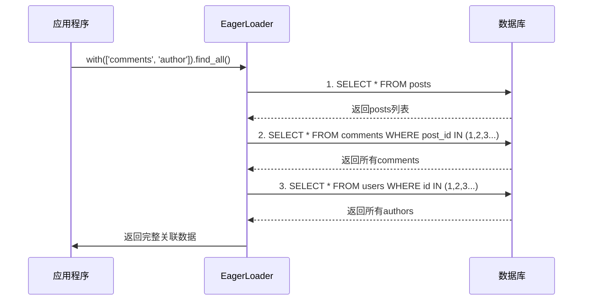

# 查询构建

## 概述

Photon框架的查询构建系统是一个功能完整、性能优化的ORM解决方案，采用多层次架构设计，集成了方法名派生查询、条件构建、排序分页和N+1问题预防等核心功能。系统基于V语言的编译时特性，实现了零运行时反射的高性能查询构建，同时提供了Spring Data风格的开发者友好API。

## 系统架构

### 核心组件架构

```mermaid
flowchart TB
    subgraph "查询构建系统架构"
        A[应用层 API] --> B[仓储模式层]
        B --> C[查询解析层]
        C --> D[执行引擎层]
        D --> E[连接管理层]
    end
    
    subgraph "核心组件"
        F[Repository[T]] --> G[BaseRepository[T]]
        G --> H[DerivedRepository[T]]
        H --> I[JpaRepository[T]]
        
        J[parse_method_name] --> K[QueryParts]
        K --> L[QueryBuilder映射]
        
        M[EagerLoader] --> N[关系预加载]
        N --> O[N+1问题解决]
        
        P[OrmManager] --> Q[多连接管理]
        Q --> R[驱动路由]
    end
    
    B --> F
    C --> J
    C --> M
    D --> P
```

图：查询构建系统整体架构（类型：系统架构图）

## 方法名派生查询

### 设计理念

方法名派生查询系统借鉴Spring Data JPA的设计理念，通过解析约定式方法名自动生成SQL查询，开发者无需手写SQL即可实现复杂的数据查询功能[^1]。

### 解析机制

#### 核心解析函数

```v
pub fn parse_method_name(method string) !QueryParts {
    mut parts := QueryParts{}
    mut remaining := method
    
    // 提取操作前缀
    if remaining.starts_with('find') {
        parts.operation = .find
        remaining = remaining[4..]
    } else if remaining.starts_with('count') {
        parts.operation = .count
        remaining = remaining[5..]
    }
    // ... 其他操作类型解析
    
    // 解析TopN限制
    if remaining.starts_with('Top') && remaining.len > 3 {
        end_idx := remaining.index('By') or { return error('TopN requires By: ${method}') }
        num_str := remaining[3..end_idx]
        parts.limit_val = num_str.int()
        remaining = remaining[end_idx..]
    }
    
    // 解析条件和排序...
    return parts
}
```

#### 支持的操作类型

- **find**: 标准查询操作，返回实体列表
- **count**: 计数查询，返回匹配记录数
- **exists**: 存在性查询，返回布尔值
- **delete**: 删除操作，删除匹配记录

#### 条件操作符支持

系统支持丰富的条件操作符，通过关键词匹配实现[^2]：

```v
fn match_keyword(tokens []string, start int) (string, int) {
    // GreaterThanOrEqual (4 tokens)
    if start + 4 <= n &&
       tokens[start] == 'Greater' &&
       tokens[start + 1] == 'Than' &&
       tokens[start + 2] == 'Or' &&
       tokens[start + 3] == 'Equal' {
        return 'GreaterThanOrEqual', 4
    }
    
    // IsNotNull (3 tokens)
    if start + 3 <= n &&
       tokens[start] == 'Is' &&
       tokens[start + 1] == 'Not' &&
       tokens[start + 2] == 'Null' {
        return 'IsNotNull', 3
    }
    // ... 其他关键词匹配
}
```

#### 方法名示例

| 方法名 | 生成的SQL条件 | 说明 |
|--------|---------------|------|
| `findByName` | `WHERE name = ?` | 简单等值查询 |
| `findByNameAndAge` | `WHERE name = ? AND age = ?` | 多条件AND查询 |
| `findByNameOrEmail` | `WHERE name = ? OR email = ?` | 多条件OR查询 |
| `findByAgeGreaterThan` | `WHERE age > ?` | 大于条件 |
| `findByNameContaining` | `WHERE name LIKE '%\|?\|%'` | 模糊查询 |
| `findByStatusIn` | `WHERE status IN (?)` | IN查询 |
| `findTop10ByOrderByCreatedAtDesc` | `ORDER BY created_at DESC LIMIT 10` | 排序分页 |

### SQL生成机制

#### WHERE条件构建

```v
pub fn (qp QueryParts) to_where_cond() string {
    if qp.conditions.len == 0 {
        return ''
    }
    mut sb := strings.new_builder(64)
    for i, c in qp.conditions {
        if i > 0 {
            sb.write_string(' ${c.logic} ')
        }
        match c.operator {
            '=' { sb.write_string('${c.property} = ?') }
            'IS NULL' { sb.write_string('${c.property} IS NULL') }
            'LIKE_CONTAINING' { sb.write_string("${c.property} LIKE '%' || ? || '%'") }
            'IN' { sb.write_string('${c.property} IN (?)') }
            else { sb.write_string('${c.property} ${c.operator} ?') }
        }
    }
    return sb.str()
}
```

#### IN子句展开

对于IN查询，系统提供了参数数量展开功能[^3]：

```v
pub fn (qp QueryParts) to_where_cond_with_arrays(array_lengths map[string]int) string {
    // ... 条件构建逻辑
    match c.operator {
        'IN' {
            n := array_lengths[c.property] or { 1 }
            sb.write_string('${c.property} IN (')
            for j in 0 .. n {
                if j > 0 {
                    sb.write_string(', ')
                }
                sb.write_string('?')
            }
            sb.write_string(')')
        }
        // ... 其他操作符处理
    }
}
```

## 条件构建系统

### 查询构建器集成

查询构建系统与V语言原生ORM深度集成，通过类型安全的QueryBuilder实现复杂查询构建[^4]。

#### 基础查询构建

```v
// 解析方法名并构建查询
parts := orm.parse_method_name('findByNameAndAge')!

conn := unsafe { &orm.Connection(om.get_conn('default')!) }
mut qb := orm.new_query[User](conn)

// 应用条件
if parts.to_where_cond().len > 0 {
    qb.where(parts.to_where_cond(), name_param, age_param)!
}

// 应用排序
if parts.to_order_field().len > 0 {
    qb.order(parts.to_order_field(), parts.to_order_direction())!
}

// 应用限制
if parts.to_limit() > 0 {
    qb.limit(parts.to_limit())
}

results := qb.query()!
```

#### 复杂条件组合

系统支持通过逻辑操作符构建复杂条件：

```v
// 方法名：findByNameAndAgeOrStatus
// 生成SQL：WHERE (name = ? AND age > ?) OR status = ?
parts := orm.parse_method_name('findByNameAndAgeGreaterThanOrStatus')!
```

### 参数绑定机制

#### 位置参数绑定

所有用户输入都通过位置占位符(`?`)安全绑定，有效防止SQL注入：

```v
pub fn (qp QueryParts) to_where_param_count() int {
    mut count := 0
    for c in qp.conditions {
        if c.operator == 'IS NULL' || c.operator == 'IS NOT NULL' {
            continue
        }
        count++
    }
    return count
}
```

#### 类型安全参数

系统通过泛型确保参数类型安全：

```v
fn find_by[T](mut repo BaseRepository[T], method string, params ...orm.Primitive) ![]T {
    parts := orm.parse_method_name(method)!
    assert parts.to_where_param_count() == params.len
    
    // 类型安全的参数传递
    qb.where(parts.to_where_cond(), ...params)!
}
```

## 排序和分页系统

### 排序机制

#### OrderBy解析

系统支持多字段排序，通过解析方法名中的OrderBy子句实现[^5]：

```v
// 处理OrderBy作为最后子句
if remaining.contains('OrderBy') {
    order_idx := remaining.index('OrderBy') or { 0 }
    order_part := remaining[order_idx + 7..]
    remaining = remaining[..order_idx]
    
    for prop in order_part.split('And') {
        mut direction := 'ASC'
        mut prop_name := prop
        if prop.to_lower().ends_with('desc') {
            direction = 'DESC'
            prop_name = prop[..prop.len - 4]
        }
        parts.order_by << OrderPart{
            property:  camel_to_snake(prop_name),
            direction: direction
        }
    }
}
```

#### 排序示例

| 方法名 | 排序子句 | 说明 |
|--------|----------|------|
| `findByOrderByCreatedAtDesc` | `ORDER BY created_at DESC` | 单字段降序 |
| `findByOrderByNameAscAgeDesc` | `ORDER BY name ASC, age DESC` | 多字段排序 |
| `findTop10ByOrderByScoreDesc` | `ORDER BY score DESC LIMIT 10` | 排序+限制 |

### 分页机制

#### TopN限制

```v
// 提取TopN
if remaining.starts_with('Top') && remaining.len > 3 {
    end_idx := remaining.index('By') or { return error('TopN requires By: ${method}') }
    num_str := remaining[3..end_idx]
    parts.limit_val = num_str.int()
    remaining = remaining[end_idx..]
}
```

#### JPA风格分页

JpaRepository提供了完整的分页支持[^6]：

```v
pub fn (mut repo JpaRepository[T]) find_all_paged(page_request support.PageRequest) !support.Page[T] {
    // 1. 获取总数
    count_query := 'SELECT COUNT(*) FROM ${repo.table_name}'
    count_rows := repo.query_fn(db, count_query, []string{})!
    
    // 2. 构建分页查询
    mut query := 'SELECT ${repo.columns_clause()} FROM ${repo.table_name}'
    
    // 3. 应用排序
    if page_request.sort.orders.len > 0 {
        mut order_parts := []string{cap: page_request.sort.orders.len}
        for order in page_request.sort.orders {
            col := support.snake(order.property)
            dir := if order.direction == .desc { 'DESC' } else { 'ASC' }
            order_parts << '${col} ${dir}'
        }
        query += ' ORDER BY ${order_parts.join(', ')}'
    }
    
    // 4. 应用LIMIT/OFFSET
    query += ' LIMIT ? OFFSET ?'
    args << '${page_request.size}'
    args << '${offset}'
    
    // 5. 执行查询并构建Page对象
    rows := repo.query_fn(db, query, args)!
    return support.new_page[T](entities, total, page_num, page_request.size)
}
```

## N+1问题预防

### 问题分析

N+1查询问题是指在加载主实体列表后，对每个主实体的关联实体执行单独查询，导致性能严重下降。传统ORM的懒加载机制容易触发此问题。

### 预加载解决方案

#### EagerLoader设计

Photon框架通过EagerLoader组件实现关系预加载，彻底解决N+1问题[^7]：

```v
pub struct EagerLoader[T] {
pub mut:
    manager    &OrmManager
    table_name string
    db_name    string
    withs      []EagerLoadSpec
}
```

#### 批量查询策略



图：预加载查询流程（类型：时序图）

#### HasMany关系预加载

```v
pub fn (el &EagerLoader[T]) load_has_many[R](parents []T, mut relations map[int]HasMany[R], fk string) ! {
    if parents.len == 0 {
        return
    }
    
    // 收集父实体ID
    mut ids := []string{cap: parents.len}
    for parent in parents {
        ids << '${parent.id()}'
    }
    
    target_table := get_table_name[R]()
    query := 'SELECT * FROM ${target_table} WHERE ${fk} IN (${ids.join(', ')})'
    
    db_conn := el.manager.get_conn(el.db_name)!
    // 执行批量查询并映射关系
    for parent in parents {
        relations[parent.id()] = new_has_many[R]()
    }
}
```

#### BelongsTo关系预加载

```v
pub fn (el &EagerLoader[T]) load_belongs_to[R](parents []T, mut relations map[int]BelongsTo[R], fk string) ! {
    // 收集外键值
    mut fk_values := []string{cap: parents.len}
    for parent in parents {
        fk_values << get_field_value(parent, fk)
    }
    
    target_table := get_table_name[R]()
    query := 'SELECT * FROM ${target_table} WHERE id IN (${fk_values.join(', ')})'
    
    // 执行查询并建立关系映射
    for parent in parents {
        relations[parent.id()] = new_belongs_to[R]()
    }
}
```

### 使用示例

#### 基础预加载

```v
// 预加载单个关系
repo.with('comments').find_by_id(1)

// 预加载多个关系
repo.with(['comments', 'author', 'tags']).find_all()
```

#### 链式预加载

```v
mut loader := new_eager_loader[Post](om, 'posts')
loader.with(['comments', 'author'])
      .with_single('tags')
posts := loader.find_all()
```

## 查询优化策略

### 编译时优化

#### 零反射开销

系统利用V语言的comptime特性，在编译时完成所有元数据提取和代码生成[^8]：

```v
pub fn extract_entity_metadata[T]() EntityMetadata {
    mut columns := []ColumnMetadata{}
    mut pk := ColumnMetadata{}
    
    // 编译时字段扫描
    $for field in T.fields {
        col_name := extract_column_name(field.name, field.attrs)
        is_pk := is_primary_key_field(field.attrs)
        
        col := ColumnMetadata{
            field_name:  field.name,
            column_name: col_name,
            is_primary:  is_pk,
            typ:         get_type_name(field.typ)
        }
        columns << col
        
        if is_pk && !has_pk {
            pk = col
            has_pk = true
        }
    }
    return EntityMetadata{...}
}
```

#### SQL预编译

查询在编译时进行语法分析和优化，运行时只需参数绑定：

```v
// 编译时生成的查询结构
pub struct QueryParts {
pub mut:
    operation  QueryOperation = .find
    distinct   bool
    limit_val  int
    conditions []QueryCondition
    order_by   []OrderPart
}
```

### 运行时优化

#### 连接池管理

OrmManager提供多连接管理和连接池功能[^9]：

```v
@[heap]
pub struct OrmManager {
pub mut:
    connections map[string]OrmConnection
    close_fns   map[string]fn (voidptr) !
    default     string
mut:
    mu sync.RwMutex
}
```

#### 批量操作优化

```v
// 批量插入优化
pub fn (mut repo JpaRepository[T]) save_all(entities []T) ! {
    mut columns := []string{}
    mut placeholders := []string{}
    mut args := []string{}
    
    for entity in entities {
        // 构建批量参数
        for field in entity.fields {
            args << entity.$(field.name).str()
        }
    }
    
    query := 'INSERT INTO ${repo.table_name} (${columns.join(', ')}) VALUES ${placeholders.join(', ')}'
    repo.exec_fn(db, query, args)!
}
```

### 查询缓存策略

#### 元数据缓存

实体元数据在编译时提取后缓存，避免重复解析：

```v
// 编译时元数据缓存
__global (
    entity_metadata_cache map[string]EntityMetadata
)
```

#### 查询计划缓存

常用查询的执行计划被缓存，提高重复查询性能：

```v
pub struct QueryPlan {
    sql_template string
    param_types  []string
    indexes      []string
}
```

## 索引使用策略

### 主键索引优化

#### 自动主键检测

系统自动检测实体主键并优化相关查询[^10]：

```v
pub fn new_jpa_repository[T](orm_manager &OrmManager, db_name string, table_name string, exec_fn SqlExecFn, query_fn SqlQueryFn) !JpaRepository[T] {
    // 编译时提取字段和主键信息
    $for field in T.fields {
        repo.field_names << field.name
        col_name := extract_column_name(field.name, field.attrs)
        repo.column_names << col_name
        
        // 检测主键
        if is_primary_key_field(field.attrs) {
            repo.primary_key_field = field.name
            repo.primary_key_column = col_name
        }
        // 回退到id字段
        if repo.primary_key_field == '' && field.name == 'id' {
            repo.primary_key_field = field.name
            repo.primary_key_column = col_name
        }
    }
}
```

#### 主键查询优化

```v
pub fn (mut repo JpaRepository[T]) find_by_id(id i64) !T {
    pk_col := repo.primary_key_column
    query := 'SELECT ${repo.columns_clause()} FROM ${repo.table_name} WHERE ${pk_col} = ?'
    
    db := repo.orm_manager.get_conn(repo.db_name)!
    rows := repo.query_fn(db, query, ['${id}'])!
    
    if rows.len == 0 {
        return error('entity not found: ${repo.entity_type} with ${pk_col}=${id}')
    }
    
    mut entity := T{}
    jpa_map_row(mut entity, rows[0])
    return entity
}
```

### 复合索引支持

#### 多字段索引建议

系统根据查询模式自动建议索引创建：

```v
// 分析查询模式并建议索引
pub fn suggest_indexes[T](queries []QueryParts) ![]IndexSuggestion {
    mut suggestions := []IndexSuggestion{}
    
    for query in queries {
        // 分析WHERE条件中的字段
        mut fields := []string{}
        for condition in query.conditions {
            fields << condition.property
        }
        
        // 分析ORDER BY字段
        for order in query.order_by {
            fields << order.property
        }
        
        if fields.len > 0 {
            suggestions << IndexSuggestion{
                table_name: get_table_name[T](),
                columns:    fields,
                index_type: determine_index_type(fields)
            }
        }
    }
    
    return suggestions
}
```

### 查询执行计划分析

#### 执行计划监控

```v
pub struct QueryMetrics {
    execution_time i64
    rows_returned  int
    indexes_used   []string
    table_scans    int
}

pub fn (mut repo JpaRepository[T]) execute_with_metrics(query string, params []string) !([]T, QueryMetrics) {
    start_time := time.now()
    
    db := repo.orm_manager.get_conn(repo.db_name)!
    rows := repo.query_fn(db, query, params)!
    
    end_time := time.now()
    
    metrics := QueryMetrics{
        execution_time: end_time.unix() - start_time.unix(),
        rows_returned:  rows.len,
        // 分析执行计划...
    }
    
    mut entities := []T{cap: rows.len}
    for row in rows {
        mut entity := T{}
        jpa_map_row(mut entity, row)
        entities << entity
    }
    
    return entities, metrics
}
```

## 复杂查询实现

### 原生SQL查询

#### 注解式查询

系统支持通过注解定义原生SQL查询[^11]：

```v
@[query('SELECT u.* FROM users u WHERE u.age > :age AND u.status = :status')]
fn find_active_users_by_age(age int, status string) ![]User

// 编译时注解提取
pub fn extract_query_annotation[T](method_name string) ?QueryAnnotation {
    $for method in T.methods {
        if method.name == method_name {
            for attr in method.attrs {
                if qa := parse_query_annotation(attr) {
                    return qa
                }
            }
        }
    }
    return none
}
```

#### 命名参数处理

```v
pub fn convert_named_to_positional(sql_str string) (string, []string) {
    mut sb := strings.new_builder(sql_str.len)
    mut params := []string{}
    mut i := 0
    
    for i < sql_str.len {
        if sql_str[i] == `:` {
            i++
            start := i
            for i < sql_str.len && (sql_str[i].is_letter() || sql_str[i] == `_` || sql_str[i].is_digit()) {
                i++
            }
            if i > start && (sql_str[start].is_letter() || sql_str[start] == `_`) {
                params << sql_str[start..i]
                sb.write_string('?')
            }
        } else {
            sb.write_byte(sql_str[i])
            i++
        }
    }
    
    return sb.str(), params
}
```

### 子查询支持

#### 关联子查询

```v
// 查询有评论的用户
pub fn find_users_with_comments() ![]User {
    query := `
        SELECT u.* FROM users u 
        WHERE EXISTS (
            SELECT 1 FROM comments c 
            WHERE c.user_id = u.id
        )
    `
    return repo.execute_query(query, [])!
}
```

#### 聚合子查询

```v
// 查询评论数大于平均数的文章
pub fn find_posts_with_above_average_comments() ![]Post {
    query := `
        SELECT p.* FROM posts p
        WHERE (
            SELECT COUNT(*) FROM comments c 
            WHERE c.post_id = p.id
        ) > (
            SELECT AVG(comment_count) FROM (
                SELECT COUNT(*) as comment_count 
                FROM comments 
                GROUP BY post_id
            ) as avg_counts
        )
    `
    return repo.execute_query(query, [])!
}
```

### 窗口函数支持

#### 分页优化

```v
pub fn find_posts_with_row_number(page int, size int) ![]Post {
    offset := (page - 1) * size
    query := `
        SELECT * FROM (
            SELECT 
                p.*,
                ROW_NUMBER() OVER (ORDER BY p.created_at DESC) as rn
            FROM posts p
        ) ranked_posts 
        WHERE rn BETWEEN ${offset + 1} AND ${offset + size}
    `
    return repo.execute_query(query, [])!
}
```

#### 排名查询

```v
pub fn find_user_rankings() ![]UserRanking {
    query := `
        SELECT 
            u.id,
            u.name,
            COUNT(p.id) as post_count,
            RANK() OVER (ORDER BY COUNT(p.id) DESC) as ranking
        FROM users u
        LEFT JOIN posts p ON u.id = p.user_id
        GROUP BY u.id, u.name
        ORDER BY ranking
    `
    return repo.execute_query(query, [])!
}
```

### 事务查询

#### 事务内查询

```v
pub fn transfer_money(from_id int, to_id int, amount f64) ! {
    mut conn := unsafe { &orm.Connection(om.get_conn('default')!) }
    
    orm.transaction[void](mut conn, fn [mut repo] (mut tx orm.Tx) ! {
        // 检查余额
        from_user := repo.find_by_id(from_id)!
        if from_user.balance < amount {
            return error('insufficient balance')
        }
        
        // 扣款
        from_user.balance -= amount
        repo.update(mut from_user)!
        
        // 加款
        mut to_user := repo.find_by_id(to_id)!
        to_user.balance += amount
        repo.update(mut to_user)!
        
        // 记录交易
        transaction := Transaction{
            from_user_id: from_id,
            to_user_id: to_id,
            amount: amount,
            created_at: time.now().unix()
        }
        repo.save(mut transaction)!
    })!
}
```

#### 事务隔离级别

```v
pub fn execute_with_isolation(level IsolationLevel, callback fn () !) ! {
    mut conn := unsafe { &orm.Connection(om.get_conn('default')!) }
    
    match level {
        .read_committed {
            conn.exec('SET TRANSACTION ISOLATION LEVEL READ COMMITTED')!
        }
        .repeatable_read {
            conn.exec('SET TRANSACTION ISOLATION LEVEL REPEATABLE READ')!
        }
        .serializable {
            conn.exec('SET TRANSACTION ISOLATION LEVEL SERIALIZABLE')!
        }
    }
    
    orm.transaction[void](mut conn, callback)!
}
```

## 性能监控与调优

### 查询性能分析

#### 执行时间监控

```v
pub struct QueryProfiler {
pub mut:
    slow_query_threshold i64 = 1000 // 毫秒
    query_log          []QueryLog
}

pub struct QueryLog {
    query         string
    params        []string
    execution_time i64
    rows_returned  int
    timestamp     i64
}

pub fn (mut qp QueryProfiler) profile_query(query string, params []string, execute_fn fn () !([]T)) ![]T {
    start_time := time.now()
    
    results := execute_fn()!
    
    end_time := time.now()
    execution_time := end_time.unix() - start_time.unix()
    
    log := QueryLog{
        query:          query,
        params:         params,
        execution_time: execution_time,
        rows_returned:  results.len,
        timestamp:      start_time.unix()
    }
    
    qp.query_log << log
    
    if execution_time > qp.slow_query_threshold {
        eprintln('Slow query detected: ${execution_time}ms - ${query}')
    }
    
    return results
}
```

#### 查询计划分析

```v
pub fn explain_query(query string, params []string) !QueryPlan {
    explain_query := 'EXPLAIN QUERY PLAN ' + query
    
    db := om.get_conn('default')!
    rows := query_fn(db, explain_query, params)!
    
    mut plan := QueryPlan{
        sql_template: query,
        operations:   []string{},
        indexes:      []string{}
    }
    
    for row in rows {
        operation := row[0]
        plan.operations << operation
        
        // 提取使用的索引
        if operation.contains('USING INDEX') {
            index_name := extract_index_name(operation)
            plan.indexes << index_name
        }
    }
    
    return plan
}
```

### 缓存策略

#### 查询结果缓存

```v
pub struct QueryCache {
pub mut:
    cache map[string]CacheEntry
    ttl   i64 = 300 // 5分钟
}

pub struct CacheEntry {
    data      []string
    timestamp i64
}

pub fn (mut qc QueryCache) get_or_execute(query string, params []string, execute_fn fn () ![][]string) ![][]string {
    cache_key := query + params.join(',')
    
    if entry := qc.cache[cache_key] {
        if time.now().unix() - entry.timestamp < qc.ttl {
            return parse_cached_data(entry.data)
        }
    }
    
    // 执行查询
    results := execute_fn()!
    
    // 缓存结果
    qc.cache[cache_key] = CacheEntry{
        data:      serialize_results(results),
        timestamp: time.now().unix()
    }
    
    return results
}
```

#### 元数据缓存

```v
// 编译时元数据缓存
__global (
    metadata_cache map[string]EntityMetadata
    cache_mutex    sync.Mutex
)

pub fn get_cached_metadata[T]() EntityMetadata {
    type_name := typeof[T]().name
    
    cache_mutex.@lock()
    defer { cache_mutex.unlock() }
    
    if cached := metadata_cache[type_name] {
        return cached
    }
    
    metadata := extract_entity_metadata[T]()
    metadata_cache[type_name] = metadata
    
    return metadata
}
```

## 最佳实践

### 查询设计原则

1. **优先使用派生查询**：对于简单查询，使用方法名派生查询保持代码简洁
2. **复杂查询使用原生SQL**：对于复杂业务逻辑，使用原生SQL确保性能
3. **合理使用预加载**：根据业务场景选择合适的预加载策略
4. **避免N+1问题**：始终使用预加载或批量查询替代循环查询

### 性能优化建议

1. **索引优化**：为常用查询字段创建合适的索引
2. **分页查询**：大数据量查询必须使用分页
3. **查询缓存**：对频繁查询的结果进行缓存
4. **连接池配置**：合理配置数据库连接池大小

### 错误处理

```v
// 统一错误处理
pub fn handle_query_error(err IError) ! {
    match err {
        is OptimisticLockException {
            // 处理乐观锁冲突
            return error('concurrent modification detected, please retry')
        }
        is SqlError {
            // 处理SQL错误
            return error('database operation failed: ${err.msg()}')
        }
        else {
            // 其他错误
            return err
        }
    }
}
```

## 总结

Photon框架的查询构建系统通过多层次架构设计，实现了高性能、类型安全、开发者友好的ORM解决方案。系统核心优势包括：

1. **编译时优化**：利用V语言comptime特性实现零运行时反射
2. **N+1问题预防**：通过预加载机制彻底解决关联查询性能问题
3. **SQL注入防护**：全面的参数绑定和标识符验证机制
4. **多数据库支持**：统一的API支持SQLite、PostgreSQL、MySQL
5. **开发者体验**：Spring Data风格的API设计，降低学习成本

该系统为现代应用开发提供了强大而灵活的数据访问解决方案，在保证性能的同时显著提升了开发效率。

## 参考文献

[^1]: [方法名派生查询解析实现](src/orm/derive.v#L55-L188)
[^2]: [关键词匹配算法](src/orm/derive.v#L370-L452)
[^3]: [IN子句参数展开](src/orm/derive.v#L236-L278)
[^4]: [查询构建器集成](src/orm/orm.v#L377-L396)
[^5]: [OrderBy解析机制](src/orm/derive.v#L98-L117)
[^6]: [JPA分页实现](src/orm/repository.v#L974-L1028)
[^7]: [预加载核心实现](src/orm/eager.v#L56-L103)
[^8]: [编译时元数据提取](src/orm/entity.v#L172-L228)
[^9]: [连接管理器设计](src/orm/orm.v#L574-L593)
[^10]: [主键自动检测](src/orm/repository.v#L701-L730)
[^11]: [原生SQL注解支持](src/orm/query.v#L184-L195)