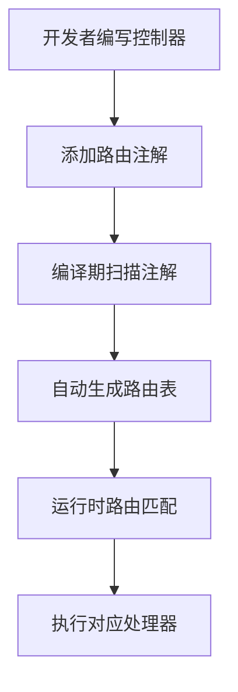
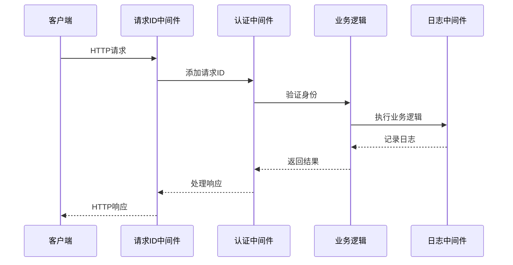

# Web应用框架

## 框架概述与价值定位

### 业务背景与挑战

现代Web应用开发面临着诸多挑战：路由配置繁琐、中间件管理复杂、响应格式不统一、测试困难等问题。这些挑战直接影响开发效率和项目质量。Photon框架的Web层正是为了解决这些痛点而设计的，它提供了一套完整的Web应用开发解决方案。

### 核心价值主张

Photon框架通过注解驱动的开发模式，显著简化了Web应用的开发流程。框架的核心价值在于：

- **开发效率提升**：通过编译期注解扫描和自动路由生成，减少大量样板代码编写工作
- **代码一致性保障**：统一的响应格式和中间件机制确保团队代码风格一致
- **维护成本降低**：标准化的开发模式使项目更易于维护和扩展
- **团队协作优化**：清晰的开发规范和最佳实践提升团队协作效率

### 目标用户群体

该框架特别适合以下场景的开发团队：
- 需要快速构建RESTful API的创业团队
- 追求代码质量一致性的企业级开发团队
- 采用微服务架构的技术团队
- 重视测试驱动开发(TDD)的敏捷团队

## 核心功能模块详解

### 注解驱动路由系统

Photon框架的路由系统采用编译期注解扫描机制，开发者只需在控制器方法上添加简单的注解即可完成路由配置。这种方式不仅减少了配置工作量，还避免了运行时路由注册的性能开销。

图：注解驱动路由工作流程（类型：业务流程图）

框架支持完整的HTTP方法集合，包括GET、POST、PUT、DELETE、PATCH等，同时支持路径参数和查询参数的自动提取[^1]。路由系统还提供了分组功能，允许为相关路由设置统一的前缀和中间件。

### 中间件链管理

中间件是Web应用中处理横切关注点的重要机制。Photon框架提供了灵活的中间件链管理系统，支持线性链和洋葱模型两种执行模式。

框架内置了多种常用中间件：
- **请求ID中间件**：为每个请求生成唯一标识，便于日志追踪和问题排查
- **CORS中间件**：自动处理跨域请求，简化前后端分离开发
- **认证中间件**：提供JWT令牌验证和用户身份识别
- **限流中间件**：保护系统免受恶意请求攻击
- **日志中间件**：记录请求处理过程，支持性能监控

图：中间件链执行时序（类型：业务时序图）

中间件链的执行顺序可以精确控制，开发者可以根据业务需求灵活组合不同的中间件[^2]。

### 统一响应封装

为了提供一致的前端集成体验，Photon框架设计了统一的API响应格式。所有API响应都遵循相同的数据结构，包含状态码、消息、数据载荷和时间戳等标准字段。

对于分页数据，框架提供了专门的PageResult结构，不仅包含数据列表，还提供了完整的分页元信息，如当前页码、总页数、是否有下一页等[^3]。这种设计大大简化了前端分页逻辑的实现。

响应封装还支持多种状态码的快速构建，包括成功(200)、创建成功(201)、无内容(204)、客户端错误(400)、未授权(401)、禁止访问(403)、未找到(404)、服务器错误(500)等常用场景。

### 数据绑定机制

Photon框架提供了强大的数据绑定功能，支持将HTTP请求数据自动绑定到业务对象。框架支持三种主要的绑定方式：

- **查询参数绑定**：自动将URL查询参数映射到结构体字段
- **表单数据绑定**：处理POST表单提交的数据
- **JSON body绑定**：解析JSON格式的请求体

绑定过程支持字段验证，通过@[required]注解可以标记必填字段，框架会自动进行验证并返回友好的错误信息。还支持字段名映射，通过@[form: 'field_name']注解可以将HTTP字段名映射到不同的结构体字段名。

### 测试支持体系

框架内置了完整的测试支持体系，提供流畅的测试API，支持测试驱动开发(TDD)。测试工具支持多种断言方式：

- 状态码断言：验证HTTP响应状态码
- 内容断言：验证响应体内容
- JSON路径断言：支持复杂的JSON结构验证
- 响应头断言：验证HTTP响应头信息

测试API采用链式调用设计，使测试代码更加简洁易读。开发者可以轻松构建复杂的测试场景，确保API功能的正确性[^4]。

## 开发流程与最佳实践

### 标准开发流程

使用Photon框架开发Web应用遵循以下标准流程：

1. **定义数据传输对象(DTO)**：创建用于接收请求数据的结构体
2. **实现控制器**：编写业务逻辑处理方法，添加路由注解
3. **配置中间件**：根据业务需求选择合适的中间件组合
4. **编写测试**：使用测试工具验证API功能
5. **集成部署**：将应用部署到生产环境

### 路由设计最佳实践

在设计API路由时，建议遵循RESTful设计原则：
- 使用名词而非动词表示资源
- 采用层级结构表示资源关系
- 使用HTTP方法表示操作类型
- 保持路由命名的一致性和可预测性

框架支持路由分组，建议将相关的API端点组织在同一组中，共享相同的前缀和中间件配置[^5]。

### 中间件使用策略

中间件的使用应该遵循最小权限原则，只为必要的路由添加所需的中间件。常见的中间件组合策略包括：

- **公开API**：CORS + 请求ID + 日志 + 限流
- **认证API**：公开API中间件 + JWT认证
- **管理API**：认证API中间件 + 角色权限验证

### 错误处理机制

框架提供了统一的错误处理机制，建议在应用层面实现全局异常处理。对于业务异常，应该返回明确的错误码和错误信息，帮助前端开发者快速定位问题。

## 实际应用场景展示

### 用户管理系统

在用户管理系统中，Photon框架可以显著简化开发工作。通过注解驱动的路由系统，开发者可以快速定义用户相关的API端点：

- 用户注册和登录
- 用户信息查询和更新
- 权限验证和角色管理

中间件链可以自动处理身份验证和权限检查，业务逻辑代码只需关注核心功能实现[^6]。

### 内容发布平台

对于内容发布平台，框架的统一响应格式和分页支持特别有价值。文章列表、评论系统等功能都可以通过标准的分页响应格式提供给前端，大大简化了前端开发工作。

数据绑定机制可以自动处理复杂的表单提交，包括文章内容、标签、分类等多维度数据的绑定和验证。

### 电商API服务

在电商场景中，框架的限流中间件和认证机制可以有效保护系统安全。商品查询、订单处理、支付回调等业务场景都可以通过标准化的API格式提供服务。

测试支持体系确保了关键业务逻辑的可靠性，特别是在订单处理和支付流程中，全面的测试覆盖是必不可少的。

## 总结

Photon框架的Web层通过注解驱动、中间件链、统一响应、数据绑定和测试支持等核心功能，为Web应用开发提供了完整的解决方案。框架不仅提升了开发效率，还确保了代码质量和系统可靠性。

通过标准化的开发模式和最佳实践指导，开发团队可以快速构建高质量的Web应用，专注于业务逻辑的实现而非底层技术细节。这使得Photon框架成为现代Web应用开发的理想选择。

## 参考文献

[^1]: [路由注解扫描机制](src/web/router.v#L122-L194)
[^2]: [中间件链执行逻辑](src/web/middleware.v#L75-L83)
[^3]: [分页响应结构设计](src/web/result.v#L74-L87)
[^4]: [测试断言API实现](src/web/testing.v#L73-L192)
[^5]: [API路由分组配置](demo/routes/api.v#L54-L92)
[^6]: [认证中间件实现](src/web/middleware.v#L117-L126)