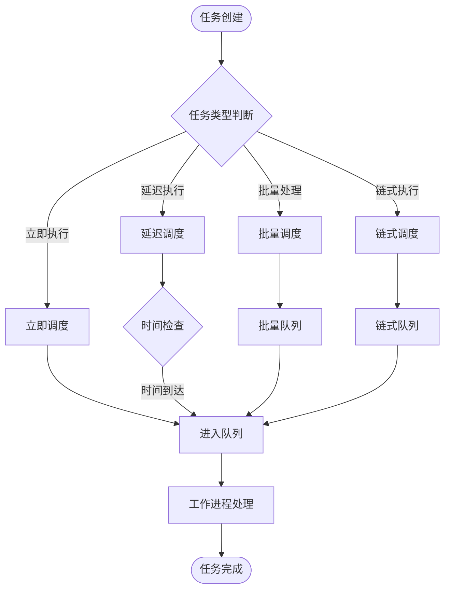
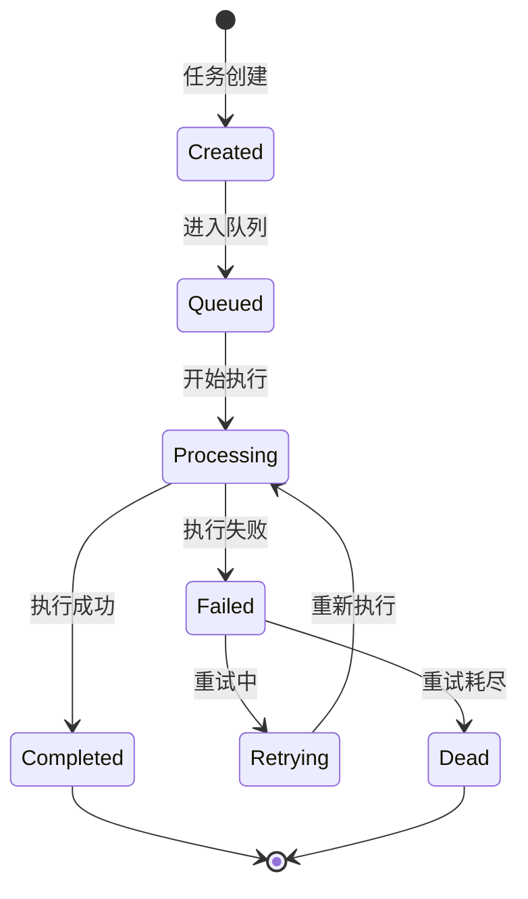

# 任务队列调度

## 系统概述

Photon框架的任务队列调度系统是一个企业级的异步任务处理解决方案，专为提升业务系统响应能力和处理效率而设计。该系统通过将耗时操作异步化处理，显著改善用户体验，同时确保任务执行的可靠性和可追溯性。

### 核心价值定位

任务队列调度系统解决了现代业务应用中的关键痛点：如何在保证用户体验的同时，可靠地处理大量后台任务。系统通过智能的任务分发、可靠的执行机制和完善的失败处理，为业务运营提供了坚实的技术支撑[^1]。

### 业务应用场景

- **用户服务优化**：用户注册后的欢迎邮件发送、密码重置通知等
- **数据处理任务**：报表生成、数据同步、批量导入导出等
- **系统维护操作**：缓存清理、日志归档、数据备份等
- **通知推送服务**：系统公告、营销消息、状态更新通知等
- **定时业务流程**：会员等级更新、订阅续费提醒、数据统计分析等

## 核心功能特性

### 智能任务调度

任务调度中心提供了灵活多样的任务分发策略，满足不同业务场景的需求：

#### 立即执行调度
适用于需要立即处理的业务场景，如用户操作触发的实时通知。系统通过全局调度器单例模式，确保任务分发的线程安全性和高效性[^2]。

#### 延迟执行调度
支持指定延迟时间的任务调度，适用于需要等待特定时机的业务操作。系统通过时间戳前缀机制，精确控制任务的执行时机[^3]。

#### 批量任务处理
提供批量任务分发能力，自动生成批次标识，便于任务追踪和管理。这对于需要处理大量相似任务的场景特别有用，如批量邮件发送或批量数据处理。

#### 链式任务执行
支持任务按顺序依次执行，确保业务流程的有序性。适用于有依赖关系的多步骤业务操作。

图：任务调度分发流程（类型：业务流程图）

### 可靠任务执行

#### 工作进程管理
任务工作进程采用轮询机制，持续监控队列状态并执行待处理任务。系统支持多工作进程并发运行，可根据业务负载动态调整处理能力[^4]。

#### 智能重试机制
系统提供可配置的重试策略，支持自定义重试次数和退避时间。当任务执行失败时，系统会根据预设的重试规则自动重新执行，最大程度确保任务成功完成[^5]。

#### 优雅停止机制
工作进程支持优雅停止，在收到停止信号时会完成当前正在执行的任务，并中断等待中的重试操作，确保数据一致性。

### 失败任务管理

#### 失败任务记录
系统自动记录执行失败的任务详细信息，包括任务类型、执行参数、失败原因、失败时间和重试次数等，为问题排查和业务分析提供数据支持[^6]。

#### 失败任务重试
支持单个失败任务的重试操作，也支持批量重试所有失败任务。这为临时性故障导致的任务失败提供了恢复机制。

#### 失败任务清理
提供失败任务的清理功能，支持按ID删除单个任务或清空所有失败任务，帮助维护系统的整洁性。

### 高性能定时任务

#### 优化定时器设计
定时任务系统采用4-ary最小堆和64桶分片优化技术，显著提升了定时任务的管理效率和性能表现。这种设计使得系统能够高效处理大量定时任务[^7]。

#### 周期性任务支持
支持周期性执行的定时任务，系统会自动重新调度到期的周期性任务，确保业务流程的持续运行。

#### 灵活的API接口
提供与Go语言兼容的定时器API，包括Timer、Ticker、Sleep、After等常用接口，降低开发者的学习成本。

## 业务流程管理

### 任务生命周期管理

图：任务生命周期状态转换（类型：业务状态图）

### 队列监控与管理

#### 实时状态监控
系统提供队列状态的实时监控能力，包括待处理任务数量、执行中任务数量、失败任务数量等关键指标，帮助运维人员及时了解系统运行状况。

#### 队列管理操作
支持队列的清空、计数等管理操作，为系统维护和故障处理提供便利。通过命令行工具，管理员可以方便地进行队列管理操作[^8]。

### 任务执行追踪

#### 执行日志记录
系统详细记录每个任务的执行过程，包括开始时间、结束时间、执行结果等信息，为业务分析和问题定位提供依据。

#### 批次任务管理
对于批量任务，系统提供批次级别的管理能力，可以追踪整个批次任务的执行状态和结果。

## 系统优势与价值

### 业务效率提升

#### 响应时间优化
通过异步处理机制，系统能够立即响应用户请求，将耗时操作转移到后台处理，显著提升用户体验和系统响应速度。

#### 吞吐量提升
多工作进程并发处理机制，配合高效的队列实现，使系统能够处理更大规模的任务负载，满足业务增长需求。

#### 资源利用优化
智能的轮询和休眠机制，避免了无效的资源消耗，提高了系统资源的利用效率。

### 可靠性保障

#### 故障恢复能力
完善的重试机制和失败任务管理，确保即使在网络波动、服务临时不可用等情况下，任务最终能够得到执行。

#### 数据一致性保证
线程安全的队列操作和原子性的任务状态管理，确保在高并发场景下的数据一致性。

#### 服务可用性
优雅的停止和重启机制，确保系统维护过程中不影响正在执行的任务，保障服务的连续性。

### 运维友好性

#### 简化部署配置
默认的内存队列实现，使得系统能够快速部署和启动，降低了初期使用门槛。

#### 丰富的管理工具
提供完整的命令行管理工具，支持队列监控、任务管理、失败处理等常用运维操作。

#### 可扩展架构
插件化的队列驱动设计，支持根据业务需求选择不同的存储后端，为系统扩展提供了灵活性。

## 适用场景与建议

### 推荐使用场景

#### 高并发Web应用
适用于用户量大、并发请求高的Web应用，通过异步处理提升系统响应能力。

#### 数据处理密集型应用
适用于需要大量数据处理、报表生成、数据同步等操作的业务系统。

#### 定时任务需求
适用于需要定期执行数据清理、统计分析、状态更新等定时操作的场景。

#### 通知推送服务
适用于邮件发送、短信通知、APP推送等需要可靠传递的消息服务。

### 使用建议

#### 任务设计原则
- 任务应该是幂等的，支持重复执行而不产生副作用
- 任务应该尽可能轻量，避免长时间占用工作进程
- 任务应该有明确的失败处理逻辑

#### 队列配置建议
- 根据业务负载合理配置工作进程数量
- 设置合适的重试次数和退避时间
- 定期清理失败任务，避免存储空间浪费

#### 监控与维护
- 建立完善的监控体系，及时发现问题
- 定期分析失败任务，优化任务设计
- 根据业务发展调整队列配置

## 参考文献

[^1]: [任务队列系统核心架构设计](src/queue/queue.v#L1-L28)
[^2]: [全局调度器线程安全实现](src/queue/dispatcher.v#L15-L39)
[^3]: [延迟任务时间戳处理机制](src/queue/dispatcher.v#L84-L90)
[^4]: [工作进程轮询执行机制](src/queue/worker.v#L75-L139)
[^5]: [任务重试与退避策略实现](src/queue/worker.v#L115-L135)
[^6]: [失败任务持久化管理](src/queue/failed_jobs.v#L117-L128)
[^7]: [高性能定时器优化设计](src/ticker/ticker.v#L1-L30)
[^8]: [队列管理命令行工具](src/cli/queue_commands.v#L38-L87)