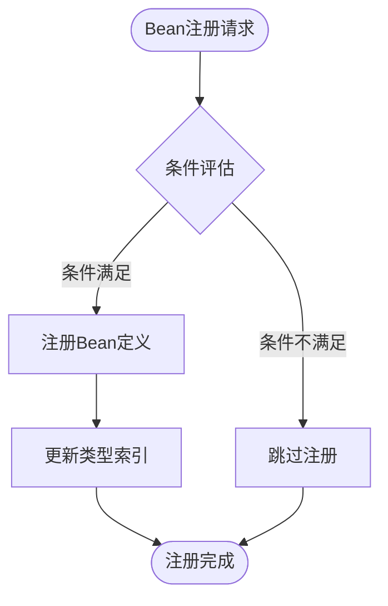
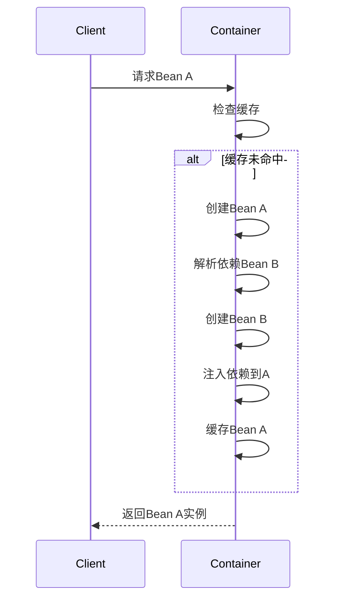
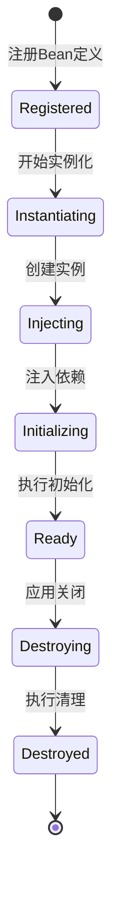

# 依赖注入容器

## 框架概述与业务价值

### 业务背景

现代企业应用开发面临着日益复杂的组件管理挑战。随着业务规模的扩大，应用系统中包含的服务组件数量呈指数级增长，这些组件之间存在着复杂的依赖关系。传统的手动组件管理方式不仅增加了开发复杂度，还容易引发运行时错误和维护困难。

Photon框架的依赖注入容器正是为了解决这些业务痛点而设计的核心基础设施。它借鉴了Spring和Laravel等成熟框架的设计理念，为V语言企业级开发提供了完整的组件管理解决方案。

### 核心业务价值

#### 开发效率提升
通过自动化的组件管理，开发者可以将精力集中在业务逻辑实现上，而非繁琐的对象创建和依赖注入工作。这种关注点分离显著提高了开发效率，缩短了项目交付周期[^1]。

#### 系统可维护性增强
松耦合的组件架构使得系统更容易维护和扩展。当需要修改某个组件时，不会影响到其他无关组件，降低了系统变更的风险和成本[^2]。

#### 测试覆盖率改善
依赖注入机制使得组件可以轻松替换为测试替身，大大提高了单元测试的可行性和覆盖率。这有助于在开发早期发现潜在问题，减少后期修复成本[^3]。

#### 多环境部署支持
条件装配功能支持根据不同环境（开发、测试、生产）动态调整组件配置，确保应用在各种部署环境中都能稳定运行。

#### 资源管理优化
自动化的生命周期管理确保系统资源（如数据库连接、缓存、线程池等）得到正确的初始化和清理，避免资源泄漏和性能问题。

## 核心容器功能详解

### 容器架构设计

Photon框架采用统一的应用上下文设计，将IoC容器、事件总线、生命周期管理器和环境配置整合为一个有机整体。这种设计简化了系统架构，提供了统一的应用管理入口[^4]。

容器支持多种Bean作用域：
- **单例模式**：整个应用生命周期中只创建一个实例，适用于无状态服务
- **原型模式**：每次请求都创建新实例，适用于有状态对象
- **请求模式**：每个HTTP请求创建一个实例，适用于Web应用中的请求级别数据

### Bean注册机制

容器提供了灵活的Bean注册方式，支持通过注解、配置类或工厂方法注册组件。注册过程中会进行条件评估，只有满足条件的Bean才会被注册到容器中[^5]。

图：Bean注册流程（类型：业务流程图）

### 依赖解析策略

容器采用智能的依赖解析策略，支持：
- **类型匹配**：根据类型自动查找匹配的Bean
- **限定符匹配**：通过名称限定符区分同类型的多个Bean
- **可选依赖**：标记为可选的依赖在找不到时不会报错
- **集合注入**：注入某个接口的所有实现类

## 依赖注入机制

### 自动装配流程

依赖注入是容器的核心功能，它自动完成组件之间的依赖关系建立。当需要创建某个Bean时，容器会：

1. 分析Bean的依赖关系
2. 递归解析所有依赖的Bean
3. 按正确顺序创建依赖实例
4. 将依赖注入到目标Bean中
5. 执行初始化回调

这个过程确保了依赖关系的正确性，避免了循环依赖等问题[^6]。

图：依赖注入时序图（类型：业务序列图）

### 注入方式支持

容器支持多种依赖注入方式：
- **字段注入**：直接在字段上标记依赖关系
- **方法注入**：通过setter方法注入依赖
- **构造函数注入**：通过构造函数参数注入依赖
- **查找注入**：运行时动态查找依赖

## 生命周期管理

### 生命周期阶段

每个Bean都经历完整的生命周期管理，包括以下关键阶段：

1. **实例化**：创建Bean实例
2. **依赖注入**：注入所需的依赖
3. **初始化**：执行初始化回调
4. **使用**：Bean处于可用状态
5. **销毁**：执行清理回调并销毁实例

容器确保这些阶段按正确顺序执行，并在应用关闭时正确清理所有资源[^7]。

### 智能生命周期管理

对于需要精细控制启动和关闭顺序的组件，容器提供了SmartLifecycle接口。实现该接口的组件可以：
- 定义启动阶段（phase值越小越早启动）
- 控制启动和停止时机
- 报告运行状态

这种机制特别适用于调度器、消息队列消费者等后台服务组件[^8]。

图：Bean生命周期状态转换（类型：业务状态转换图）

## 条件装配策略

### 条件评估机制

条件装配是Photon框架的重要特性，它允许根据运行时条件决定是否注册某个Bean。这种机制支持：

- **环境条件**：根据激活的环境Profile决定Bean注册
- **属性条件**：根据配置属性的存在或值决定Bean注册
- **Bean条件**：根据容器中是否存在其他Bean决定注册
- **类条件**：根据类路径中是否存在特定类决定注册
- **表达式条件**：根据复杂的SpEL表达式决定注册

### 业务应用场景

条件装配在以下业务场景中特别有用：

#### 多环境配置
开发环境可能使用内存数据库，而生产环境使用MySQL数据库。通过条件装配，可以自动选择合适的数据库配置[^9]。

#### 功能开关
某些功能可能需要根据配置动态启用或禁用。条件装配可以在功能关闭时跳过相关Bean的注册，节省系统资源。

#### 可选依赖
当某个依赖是可选的时，条件装配可以在依赖不存在时提供默认实现，而不是报错。

## 业务应用场景

### 企业级Web应用

在企业级Web应用中，依赖注入容器可以管理各种服务组件：
- 用户服务、订单服务等业务服务
- 数据访问层组件
- 缓存管理器
- 消息队列生产者和消费者
- 定时任务调度器

通过容器的统一管理，这些组件可以自动协作，形成完整的业务处理流程[^10]。

### 微服务架构

在微服务架构中，每个服务都需要独立管理其内部组件。依赖注入容器为每个微服务提供了轻量级的组件管理能力，同时保持了与整体架构的一致性。

### 数据处理管道

对于复杂的数据处理管道，容器可以管理各个处理阶段的组件：
- 数据读取器
- 数据转换器
- 数据验证器
- 数据写入器

通过依赖注入，这些处理组件可以灵活组合，形成不同的数据处理流程。

## 最佳实践建议

### 组件设计原则

1. **单一职责**：每个组件应该只负责一个明确的功能
2. **接口隔离**：通过接口定义组件间的契约，降低耦合度
3. **依赖倒置**：依赖抽象而非具体实现，提高可测试性
4. **配置外部化**：将可变配置外部化，支持不同环境部署

### 性能优化建议

1. **合理使用作用域**：根据组件特性选择合适的作用域
2. **延迟初始化**：对于非关键组件使用延迟初始化
3. **避免循环依赖**：设计时避免组件间的循环依赖
4. **监控和诊断**：利用容器的诊断功能监控组件状态

### 测试策略

1. **单元测试**：利用依赖注入轻松替换依赖为测试替身
2. **集成测试**：使用测试配置创建专用的测试容器
3. **模拟环境**：通过条件装配模拟不同的运行环境
4. **性能测试**：测试容器在高并发场景下的表现

通过遵循这些最佳实践，可以充分发挥Photon框架依赖注入容器的优势，构建高质量、易维护的企业应用系统。

## 参考文献

[^1]: [组件自动化管理逻辑](src/core/core.v#L88-L145)
[^2]: [松耦合架构设计](src/core/application_context.v#L56-L80)
[^3]: [依赖注入测试支持](src/core/core.v#L121-L130)
[^4]: [统一应用上下文设计](src/core/application_context.v#L84-L109)
[^5]: [条件评估机制](src/core/condition.v#L78-L102)
[^6]: [依赖解析流程](src/core/core.v#L61-L89)
[^7]: [生命周期回调管理](src/core/lifecycle.v#L68-L86)
[^8]: [智能生命周期控制](src/core/lifecycle.v#L185-L200)
[^9]: [环境条件装配](src/core/condition.v#L72-L80)
[^10]: [企业应用组件管理](src/core/application_context.v#L111-L131)