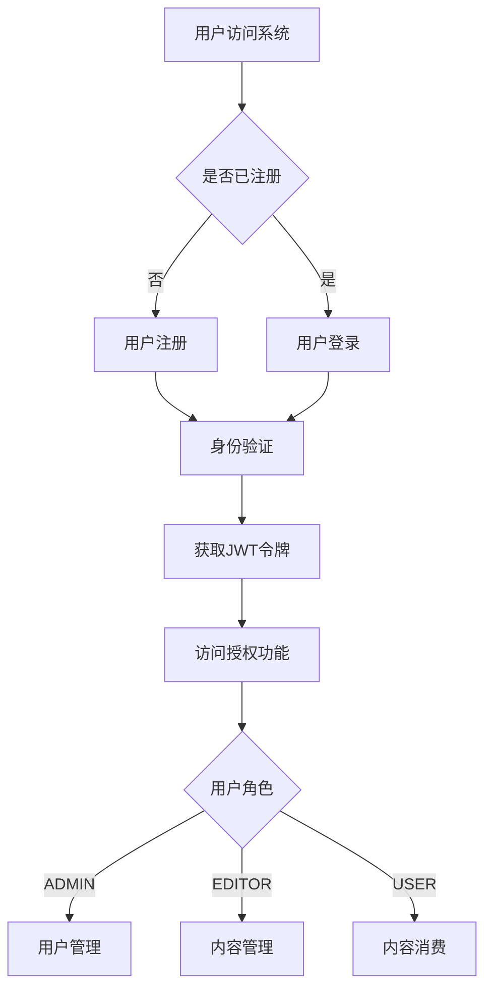
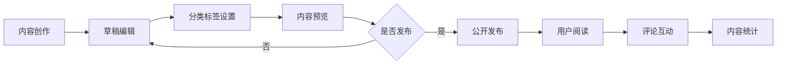
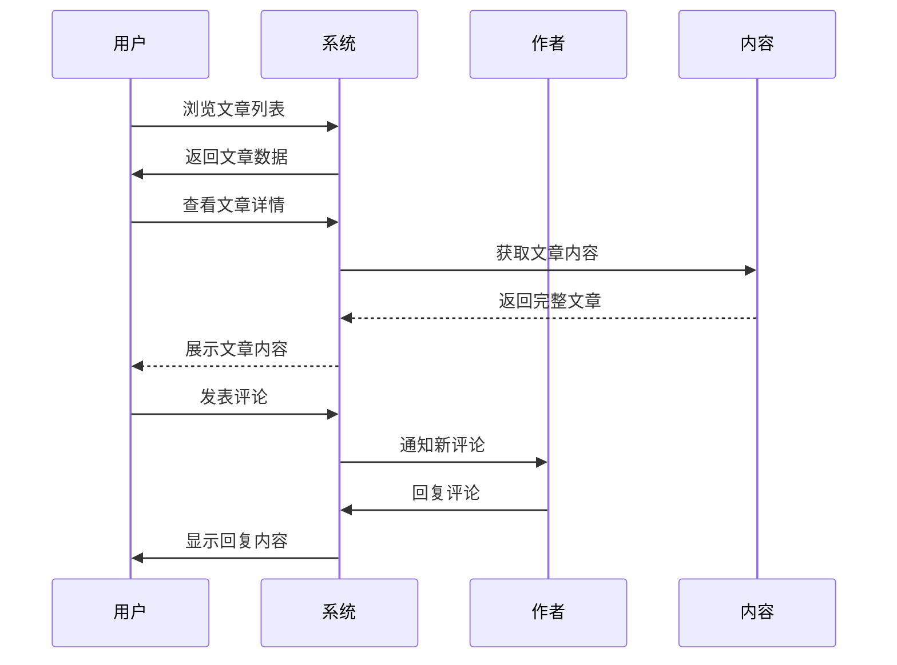
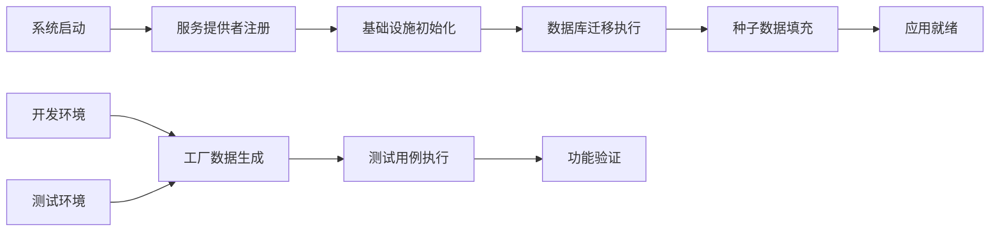

# 博客系统示例

## 项目概述与价值定位

### 项目背景

Photon博客系统是一个基于Photon框架构建的完整博客平台示例，旨在展示如何运用框架的各种功能构建实际业务应用。该系统涵盖了现代博客平台的核心功能模块，包括用户管理、内容创作、互动交流等关键业务场景[^1]。

### 业务定位

该博客系统定位于为内容创作者和读者提供完整的博客发布与阅读体验。系统支持多角色用户体系，包括管理员、编辑者和普通用户，满足不同层级的内容管理需求[^2]。通过标准化的API接口和灵活的权限控制，系统能够适应从小型个人博客到中型内容平台的各种应用场景。

### 核心价值

**内容管理价值**：提供完整的文章生命周期管理，从草稿创建到发布归档，支持分类标签体系，帮助内容创作者高效组织和管理内容[^3]。

**用户体验价值**：通过统一的API响应格式和资源转换机制，确保前端应用获得一致的数据结构，提升开发效率和用户体验[^4]。

**扩展性价值**：基于Photon框架的模块化设计，系统具备良好的扩展能力，能够快速适应业务需求变化和功能扩展[^5]。

## 核心业务功能模块

### 用户管理模块

用户管理模块是博客系统的基础支撑，提供完整的用户身份管理和权限控制功能。系统支持三种用户角色：管理员（ADMIN）、编辑者（EDITOR）和普通用户（USER），每种角色具有不同的操作权限[^6]。

**用户注册与认证**：系统提供安全的用户注册流程，支持用户名、邮箱、密码等基本信息录入。密码采用Bcrypt加密存储，确保用户信息安全[^7]。用户登录后获得JWT令牌，用于后续API访问的身份验证。

**用户资料管理**：用户可以管理个人资料信息，包括昵称、头像等。系统支持头像上传功能，用户可以通过API上传个人头像图片[^8]。

**权限控制体系**：基于角色的访问控制（RBAC）机制确保不同角色用户只能访问授权的功能模块。管理员拥有用户管理权限，编辑者可以创建和管理内容，普通用户主要进行内容消费和基础互动[^9]。

图：用户认证与权限分配流程（类型：业务流程图）

### 内容管理模块

内容管理模块是博客系统的核心功能，提供完整的文章创作、编辑、发布和管理能力。系统支持富文本内容编辑，包括标题、摘要、正文等结构化信息管理[^10]。

**文章生命周期管理**：文章支持多种状态管理，包括草稿（draft）、已发布（published）、已归档（archived）等状态。作者可以创建草稿并进行多次编辑，确认无误后发布到公开状态[^11]。

**分类标签体系**：系统提供灵活的内容组织方式，支持分类和标签两种维度。分类采用层级结构，适合内容的主要分类；标签采用扁平化设计，支持多标签关联，便于内容的多维度检索和推荐[^12]。

**内容关联管理**：文章与作者、分类、标签之间建立了完整的关联关系。系统通过资源转换器（Resource）将复杂的实体关系转换为适合API响应的数据结构，包含作者信息、分类详情和关联标签列表[^13]。

图：内容创作与发布流程（类型：业务流程图）

### 互动交流模块

互动交流模块增强博客平台的社交属性，支持用户之间的内容讨论和意见交流。系统采用嵌套评论结构，支持多级回复功能[^14]。

**评论系统**：用户可以对已发布的文章进行评论，评论内容支持富文本格式。系统提供评论状态管理，包括可见（visible）、已删除（deleted）等状态，确保内容质量管控[^15]。

**嵌套回复**：评论支持父子关系，用户可以对特定评论进行回复，形成讨论串。系统通过parent_id字段建立评论层级关系，前端可以展示完整的讨论脉络[^16]。

**内容审核**：系统预留了内容审核机制，管理员和编辑者可以对不当评论进行管理。通过软删除机制，被删除的内容在数据库中保留痕迹，便于审计和恢复[^17]。

### 数据管理模块

数据管理模块提供系统的基础数据服务，包括数据初始化、测试数据生成、数据迁移等关键功能[^18]。

**种子数据管理**：系统通过种子数据（Seeder）机制初始化基础数据。用户种子数据创建8个默认用户，包括1个管理员、2个编辑者和5个普通用户，为系统提供完整的角色体系基础[^19]。

**工厂模式数据生成**：采用工厂模式（Factory）生成测试数据，支持链式调用配置用户属性。工厂模式可以创建用户实体但不持久化，或者直接创建并保存到数据库，满足不同测试场景需求[^20]。

**数据库迁移**：系统提供完整的数据库迁移机制，支持表结构创建、索引建立、约束添加等操作。迁移文件版本化管理，确保数据库结构的一致性和可追溯性[^21]。

## 业务流程与用户场景

### 内容创作场景

内容创作者通过博客系统进行文章创作和发布的完整流程体现了系统的核心业务价值。创作者首先需要注册账户并获得编辑者权限，然后可以开始内容创作过程[^22]。

**创作准备阶段**：创作者登录系统后，进入文章创建界面，填写文章标题、撰写内容摘要和正文。系统支持自动保存功能，避免内容意外丢失。创作者可以为文章选择合适的分类，并添加相关标签以提高内容可发现性[^23]。

**内容编辑阶段**：在草稿状态下，创作者可以多次修改文章内容，调整分类标签设置。系统提供内容预览功能，创作者可以查看文章的最终展示效果。编辑过程中，系统会自动保存编辑历史，支持版本回退功能[^24]。

**发布管理阶段**：文章编辑完成后，创作者可以选择立即发布或定时发布。发布后文章状态变为公开状态，所有用户都可以查看和评论。创作者可以随时查看文章的阅读统计和用户反馈，了解内容表现情况[^25]。

### 用户互动场景

用户互动场景展示了博客平台的社交功能和社区价值。用户通过阅读文章、发表评论、参与讨论等方式与内容和其他用户产生互动[^26]。

**内容消费过程**：用户浏览文章列表，可以根据分类、标签、发布时间等维度筛选感兴趣的内容。点击文章标题进入详情页面，可以阅读完整文章内容，查看作者信息和相关文章推荐[^27]。

**评论参与过程**：用户阅读文章后可以发表评论，分享自己的观点和看法。评论支持对文章的直接评论，也可以对其他用户的评论进行回复，形成多层次的讨论。系统会实时通知作者有新的评论，促进内容创作者与读者的互动[^28]。

**社区建设过程**：通过持续的互动交流，用户之间建立联系，形成活跃的社区氛围。优质评论和深度讨论能够提升内容价值，吸引更多用户参与，形成良性循环的社区生态[^29]。

图：用户互动交流时序图（类型：业务时序图）

### 系统管理场景

系统管理场景体现了博客平台的运营管理能力，确保平台的稳定运行和内容质量。管理员通过系统提供的工具进行用户管理、内容审核、数据统计等操作[^30]。

**用户管理流程**：管理员可以查看所有用户列表，包括用户基本信息、注册时间、最后活跃时间等。管理员可以编辑用户资料，调整用户角色，处理违规用户账号。系统提供用户搜索和筛选功能，便于快速定位特定用户[^31]。

**内容审核流程**：管理员和编辑者可以管理平台上的所有内容，包括文章和评论。对于违规内容，管理员可以将其隐藏或删除。系统记录所有管理操作，便于审计和追溯。重要操作需要二次确认，防止误操作[^32]。

**数据统计分析**：系统提供丰富的数据统计功能，包括用户增长趋势、文章发布统计、评论活跃度等关键指标。管理员可以通过统计报表了解平台运营状况，制定相应的运营策略。统计数据支持导出功能，便于进一步分析和报告[^33]。

## 技术实现与业务价值

### API资源转换机制

系统采用API资源转换机制，将数据库实体转换为适合前端使用的数据结构。这种设计确保了API响应的一致性和灵活性，提升了前后端协作效率[^34]。

**数据结构标准化**：通过UserResource、PostResource、CommentResource等资源类，系统将复杂的实体关系转换为扁平化的JSON结构。资源类支持关联数据的懒加载，避免不必要的数据查询，提升API响应性能[^35]。

**集合数据处理**：系统提供专门的集合资源类，如UserResourceCollection、PostResourceCollection等，支持分页、排序、过滤等常见操作。集合资源包含元数据信息，如总数、当前页、是否有更多数据等，便于前端实现分页功能[^36]。

**字段选择性输出**：资源类支持字段选择机制，通过@[skip_empty]注解控制空值字段的输出。这种机制减少了API响应的数据量，提升了网络传输效率，同时保持了API的灵活性[^37]。

### 服务提供者架构

系统采用服务提供者架构模式，实现了组件的松耦合和高内聚。这种设计使得系统具备良好的可维护性和扩展性，便于功能模块的独立开发和测试[^38]。

**基础设施服务**：AppServiceProvider负责注册应用级的基础设施组件，包括日志记录器、邮件发送器、任务调度器、锁管理器等。这些组件无外部依赖，是最先注册的基础服务[^39]。

**服务生命周期管理**：服务提供者支持服务的注册（register）和启动（boot）两个阶段。注册阶段完成服务的创建和依赖注入配置，启动阶段执行服务的初始化操作。这种两阶段设计确保了服务依赖的正确顺序[^40]。

**配置驱动架构**：服务提供者基于配置文件驱动，可以根据不同的环境配置创建不同的服务实例。例如，邮件服务可以根据配置选择日志驱动或SMTP驱动，满足开发和生产环境的不同需求[^41]。

### 数据工厂与种子系统

系统实现了完整的数据工厂和种子系统，支持测试数据的生成和基础数据的初始化。这种设计大大提升了开发和测试效率，确保了开发环境的一致性[^42]。

**链式调用配置**：用户工厂支持链式调用方法，如with_role()、with_username()、with_email()等，可以灵活配置用户属性。这种流畅的API设计使得测试数据的创建变得简单直观[^43]。

**幂等性保证**：种子数据创建采用幂等性设计，通过create_or_first()方法确保数据不会重复创建。如果用户名已存在，系统会返回已有用户而不是创建新用户，保证了种子数据的稳定性[^44]。

**环境变量配置**：种子数据支持通过环境变量配置默认密码，如SEED_ADMIN_PASSWORD、SEED_EDITOR_PASSWORD等。这种设计使得不同环境可以使用不同的密码配置，提升了安全性[^45]。

图：系统初始化与数据准备流程（类型：业务流程图）

## 业务扩展与生态建设

### 多端适配能力

博客系统基于标准化的API设计，天然支持多端适配。无论是Web前端、移动应用还是第三方集成，都可以通过统一的API接口访问系统功能[^46]。

**响应式数据格式**：API资源转换机制确保了数据格式的标准化，不同客户端可以获得一致的数据结构。系统支持内容协商，可以根据客户端需求返回不同格式的响应数据[^47]。

**权限统一管理**：基于JWT的身份认证机制适用于各种客户端类型。无论是浏览器应用还是移动应用，都可以通过统一的认证流程获取访问权限[^48]。

**版本化API设计**：系统采用版本化API设计（/api/v1），为未来的功能扩展和接口升级预留了空间。新版本API可以与旧版本并存，确保平滑升级[^49]。

### 内容生态扩展

博客系统为内容生态的扩展提供了良好的基础，支持多种内容形式和互动方式的扩展。系统架构设计考虑了未来功能扩展的需求[^50]。

**多媒体内容支持**：系统预留了文件上传接口，支持头像、图片等多媒体内容。未来可以扩展支持视频、音频等更多媒体类型，丰富内容表现形式[^51]。

**社交功能扩展**：基于用户系统和评论机制，可以扩展点赞、收藏、分享等社交功能。系统架构支持这些功能的模块化开发和集成[^52]。

**内容推荐机制**：通过用户行为数据和内容关联分析，可以实现个性化内容推荐。系统的标签体系和分类结构为推荐算法提供了良好的数据基础[^53]。

### 运营工具集成

博客系统为运营管理提供了丰富的工具支持，帮助平台运营者提升管理效率和运营效果。系统设计考虑了运营场景的实际需求[^54]。

**数据分析工具**：系统提供基础的数据统计功能，可以扩展更详细的数据分析工具。通过用户行为分析、内容效果分析等，为运营决策提供数据支持[^55]。

**内容管理工具**：基于现有的内容管理功能，可以扩展批量操作、内容审核、发布计划等高级管理工具，提升内容运营效率[^56]。

**用户运营工具**：系统支持用户角色管理和权限控制，可以扩展用户等级、积分体系、会员制度等用户运营功能，增强用户粘性[^57]。

## 参考文献

[^1]: [博客系统整体架构设计](/demo/app.v#L1-L50)
[^2]: [用户角色权限体系](/demo/routes/api.v#L37-L42)
[^3]: [文章生命周期管理](/demo/database/migrations/20260101000002_create_posts_table.v#L33-L35)
[^4]: [API资源转换机制](/demo/app/http/resources/post_resource.v#L37-L53)
[^5]: [服务提供者扩展架构](/demo/providers/app_service_provider.v#L28-L76)
[^6]: [用户角色定义](/demo/database/seeders/user_seeder.v#L48-L97)
[^7]: [密码安全加密](/demo/database/factories/user_factory.v#L98-L110)
[^8]: [文件上传功能](/demo/routes/api.v#L34-L35)
[^9]: [权限中间件配置](/demo/routes/api.v#L37-L41)
[^10]: [文章内容结构](/demo/database/migrations/20260101000002_create_posts_table.v#L24-L31)
[^11]: [文章状态管理](/demo/app/http/resources/post_resource.v#L18)
[^12]: [分类标签关联](/demo/database/migrations/20260101000006_create_post_tags_table.v#L23-L35)
[^13]: [关联数据资源转换](/demo/app/http/resources/post_resource.v#L37-L53)
[^14]: [嵌套评论结构](/demo/database/migrations/20260101000003_create_comments_table.v#L31-L32)
[^15]: [评论状态管理](/demo/app/http/resources/comment_resource.v#L15)
[^16]: [评论回复机制](/demo/app/http/resources/comment_resource.v#L38-L44)
[^17]: [软删除实现](/demo/database/migrations/20260101000003_create_comments_table.v#L35-L36)
[^18]: [数据管理架构](/demo/database/seeders/database_seeder.v#L1-L30)
[^19]: [种子数据初始化](/demo/database/seeders/user_seeder.v#L29-L99)
[^20]: [工厂模式设计](/demo/database/factories/user_factory.v#L25-L150)
[^21]: [数据库迁移机制](/demo/database/migrations/20260101000001_create_users_table.v#L21-L49)
[^22]: [内容创作流程](/demo/controllers.v#L20-L27)
[^23]: [文章分类标签](/demo/app/http/resources/post_resource.v#L10-L12)
[^24]: [草稿状态管理](/demo/database/migrations/20260101000002_create_posts_table.v#L34)
[^25]: [发布状态控制](/demo/routes/api.v#L22)
[^26]: [用户互动功能](/demo/controllers.v#L25-L26)
[^27]: [文章列表接口](/demo/routes/api.v#L17)
[^28]: [评论通知机制](/demo/app/http/resources/comment_resource.v#L30-L36)
[^29]: [社区互动设计](/demo/app/http/resources/comment_resource.v#L10-L11)
[^30]: [系统管理功能](/demo/controllers.v#L23)
[^31]: [用户管理接口](/demo/routes/api.v#L11-L15)
[^32]: [内容审核权限](/demo/routes/api.v#L78-L81)
[^33]: [数据统计功能](/demo/controllers.v#L183-L200)
[^34]: [资源转换架构](/demo/app/http/resources/user_resource.v#L26-L39)
[^35]: [关联数据加载](/demo/app/http/resources/post_resource.v#L37-L53)
[^36]: [集合分页处理](/demo/app/http/resources/user_resource.v#L56-L66)
[^37]: [字段选择机制](/demo/app/http/resources/post_resource.v#L17)
[^38]: [服务提供者模式](/demo/providers/app_service_provider.v#L17-L26)
[^39]: [基础设施注册](/demo/providers/app_service_provider.v#L33-L69)
[^40]: [服务生命周期](/demo/providers/app_service_provider.v#L28-L76)
[^41]: [配置驱动设计](/demo/providers/app_service_provider.v#L46-L59)
[^42]: [数据工厂系统](/demo/database/factories/user_factory.v#L1-L19)
[^43]: [链式调用设计](/demo/database/factories/user_factory.v#L52-95)
[^44]: [幂等性保证](/demo/database/factories/user_factory.v#L133-L139)
[^45]: [环境变量配置](/demo/database/seeders/user_seeder.v#L33-L44)
[^46]: [多端API设计](/demo/routes/api.v#L1-L45)
[^47]: [响应式数据格式](/demo/app/http/resources/collection.v#L1-L50)
[^48]: [统一认证机制](/demo/routes/api.v#L38-L39)
[^49]: [版本化API](/demo/routes/api.v#L5)
[^50]: [扩展架构设计](/demo/app.v#L1-L100)
[^51]: [多媒体上传支持](/demo/routes/api.v#L87-L91)
[^52]: [社交功能扩展](/demo/app/http/resources/comment_resource.v#L10-L11)
[^53]: [内容推荐基础](/demo/database/migrations/20260101000006_create_post_tags_table.v#L1-L42)
[^54]: [运营工具设计](/demo/controllers.v#L183-L200)
[^55]: [数据分析功能](/demo/controllers.v#L84-L93)
[^56]: [内容管理工具](/demo/routes/api.v#L19-22)
[^57]: [用户运营功能](/demo/database/seeders/user_seeder.v#L62-78)