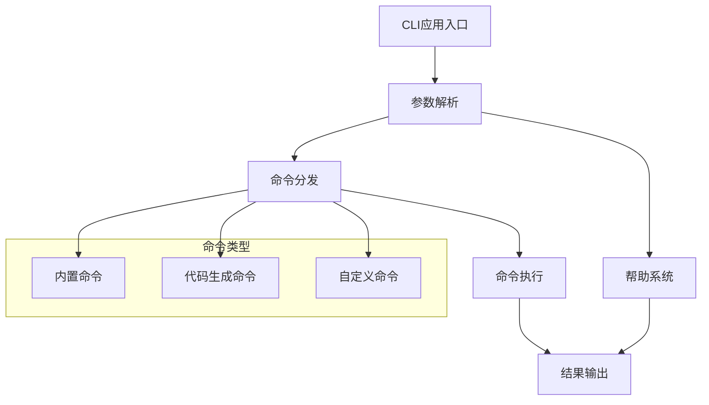
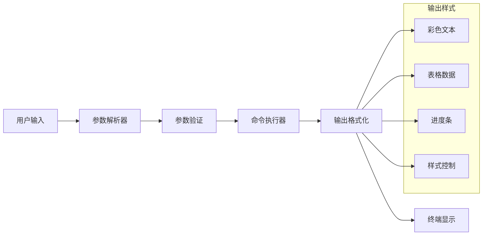

# 命令行界面

## 框架概述

Photon框架的命令行界面（CLI）是一个受Laravel/Symfony Console启发的企业级命令行解决方案，为V语言应用提供完整的开发工具链。CLI系统通过统一的命令行界面，简化应用开发、部署和维护流程，显著提升开发团队的工作效率[^1]。

### 核心价值定位

CLI系统致力于解决企业级应用开发中的三个核心挑战：开发效率、应用管理和开发体验。通过提供丰富的代码生成工具、标准化的项目脚手架和直观的交互界面，帮助开发团队快速构建高质量的应用程序[^2]。

## 业务功能架构

### 命令管理体系

Photon CLI采用模块化的命令管理架构，通过CliApplication作为核心调度器，实现命令的注册、解析和分发。系统支持多种参数类型，包括位置参数、选项值和布尔标志，为开发者提供灵活的命令设计能力[^3]。

图：CLI命令执行流程（类型：业务流程图）

### 开发效率工具集

CLI系统提供完整的代码生成工具链，涵盖应用开发的各个方面：

**脚手架生成命令**：
- `make:command` - 生成CLI命令类
- `make:controller` - 生成Web控制器
- `make:middleware` - 生成中间件
- `make:provider` - 生成服务提供者
- `make:entity` - 生成ORM实体
- `make:model` - 生成模型（实体+仓储）
- `make:migration` - 生成数据库迁移
- `make:resource` - 生成API资源转换器
- `make:seeder` - 生成数据库种子
- `make:factory` - 生成模型工厂

这些代码生成工具遵循框架的最佳实践，确保生成的代码符合项目规范，减少开发人员的重复劳动[^4]。

### 应用运维能力

CLI系统提供完整的应用生命周期管理能力：

**服务管理**：
- `serve` - 启动HTTP服务器，支持端口和主机配置
- `queue:work` - 启动队列工作进程，处理异步任务
- `schedule:run` - 执行定时任务调度

**数据库管理**：
- 迁移命令系列支持数据库结构的版本控制
- 种子命令提供测试数据的快速填充

**系统监控**：
- `list` - 显示所有可用命令
- `help` - 提供详细的命令使用说明
- `stats` - 输出应用统计信息

## 用户体验设计

### 交互式输入系统

CLI提供丰富的交互式输入功能，改善用户操作体验：

- **ask()** - 文本输入提示，支持默认值
- **confirm()** - 是/否确认，支持默认选择
- **secret()** - 密码输入，隐藏用户输入内容
- **choice()** - 选择列表，提供多选项菜单

这些交互功能让命令行工具更加友好，特别是在需要用户输入复杂配置或敏感信息时[^5]。

### 输出格式化

CLI系统支持多种输出格式，提升信息可读性：

- **彩色输出** - 支持成功（绿色）、错误（红色）、警告（黄色）、信息（青色）等颜色标识
- **表格显示** - 自动计算列宽，格式化表格数据
- **进度条** - 显示长时间运行任务的进度
- **样式控制** - 支持normal、quiet、verbose三种输出模式

图：CLI输入输出处理流程（类型：业务流程图）

## 业务应用场景

### 开发阶段工作流

在应用开发阶段，CLI工具链提供完整的工作流支持：

1. **项目初始化** - 使用make命令生成基础项目结构
2. **功能开发** - 通过代码生成快速创建控制器、模型等组件
3. **数据库设计** - 使用迁移命令管理数据库结构变更
4. **开发调试** - 通过serve命令启动开发服务器

### 生产环境运维

在生产环境中，CLI提供可靠的运维工具：

1. **服务部署** - 通过命令行启动和管理应用服务
2. **任务处理** - 使用队列工作进程处理异步任务
3. **定时调度** - 通过调度命令执行周期性任务
4. **系统监控** - 通过内置命令获取系统运行状态

### 团队协作支持

CLI系统通过标准化工具支持团队协作：

- **统一规范** - 代码生成工具确保团队代码风格一致
- **文档生成** - 自动生成API文档和使用说明
- **环境管理** - 支持多环境配置和切换

## 效率提升价值

### 开发效率优化

通过CLI工具链，开发团队可以获得显著的效率提升：

- **快速原型** - 代码生成工具让开发者几分钟内创建完整的功能模块
- **减少错误** - 标准化模板减少手工编码的常见错误
- **一致性保证** - 统一的代码结构提升代码可维护性

### 学习成本降低

CLI系统的设计注重用户体验：

- **直观命令** - 命令名称清晰表达功能意图
- **丰富帮助** - 完整的帮助系统降低学习门槛
- **渐进式使用** - 从简单命令到复杂功能的平滑过渡

### 运维效率提升

在生产环境中，CLI工具简化运维工作：

- **一键部署** - 通过命令行完成应用部署
- **自动化运维** - 队列和调度命令支持自动化运维
- **快速诊断** - 内置命令提供系统状态快速检查

## 扩展能力

### 自定义命令开发

CLI系统支持开发者创建自定义命令：

- **标准接口** - 通过Command接口定义命令规范
- **基类支持** - BaseCommand提供常用功能的默认实现
- **灵活注册** - 支持动态注册和命令发现

### 集成能力

CLI系统可以与框架其他模块深度集成：

- **服务容器** - 访问框架的依赖注入容器
- **配置系统** - 读取和应用配置信息
- **日志系统** - 集成统一的日志记录

## 最佳实践建议

### 命令设计原则

在设计CLI命令时，建议遵循以下原则：

- **单一职责** - 每个命令专注于一个特定功能
- **参数清晰** - 使用描述性的参数名称和帮助信息
- **错误处理** - 提供清晰的错误信息和解决建议

### 用户体验优化

- **进度反馈** - 长时间操作提供进度显示
- **结果确认** - 重要操作提供确认提示
- **输出控制** - 支持不同详细程度的输出模式

## 参考文献

[^1]: [CLI模块功能概述](src/cli/cli.v#L4-L12)
[^2]: [命令注册和分发机制](src/cli/application.v#L25-L28)
[^3]: [参数解析实现](src/cli/input.v#L14-L72)
[^4]: [代码生成命令实现](src/cli/make_commands.v#L15-L108)
[^5]: [交互式输入功能](src/cli/interactive.v#L30-L100)