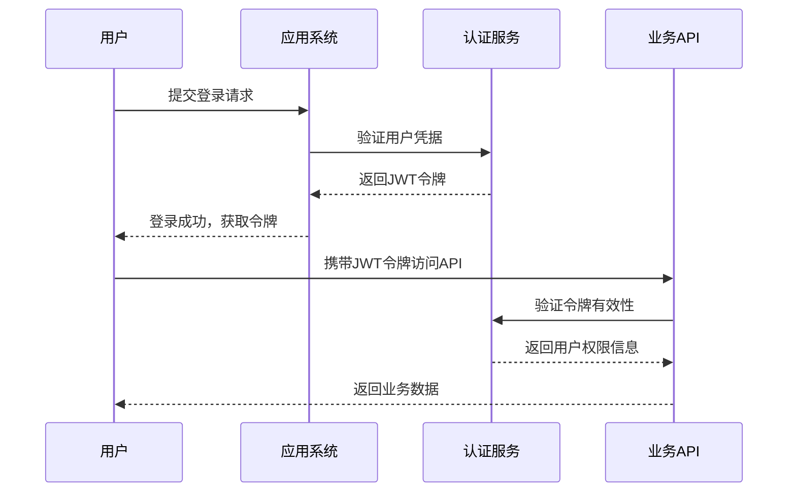
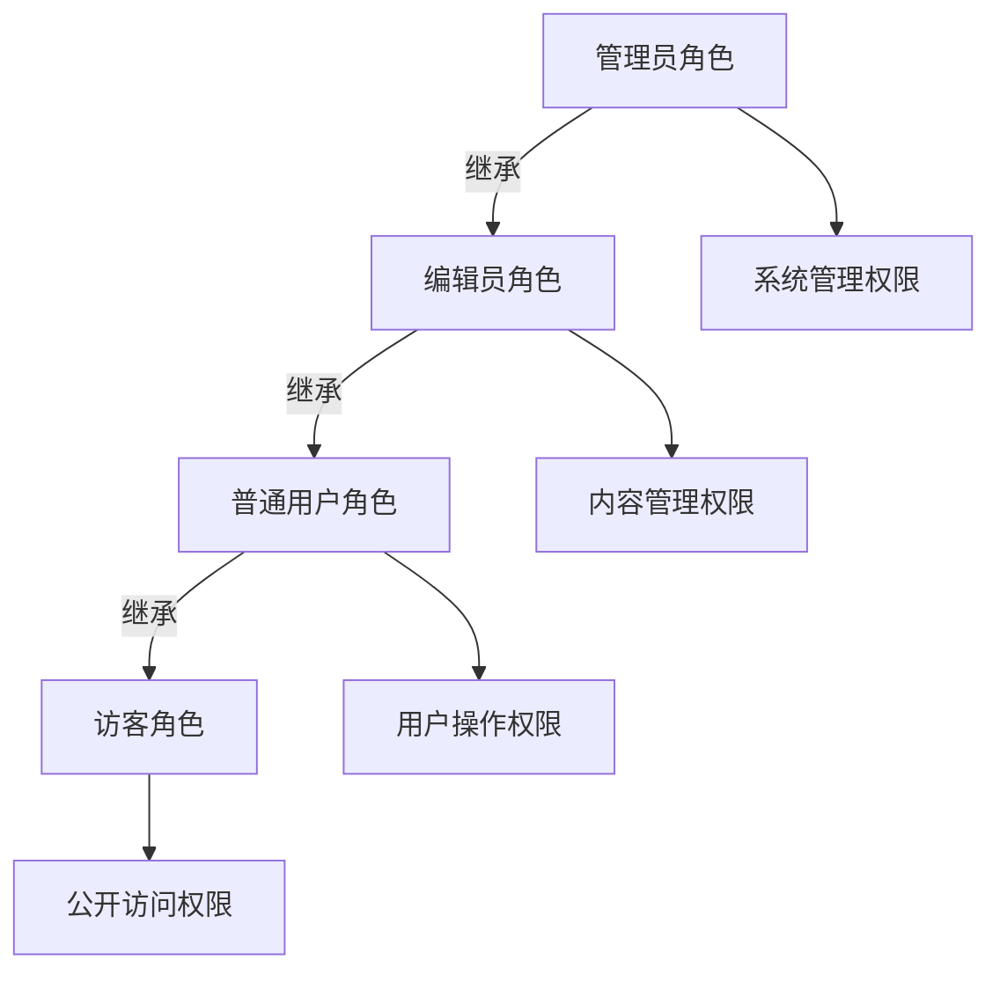
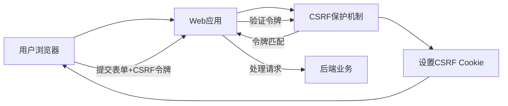

# 安全认证系统

## 项目概述与价值定位

### 总体目标

Photon框架的安全认证系统旨在为企业级应用提供全面的安全保障，通过标准化的安全组件和流程，确保用户数据和系统资源得到有效保护。该系统采用现代安全架构设计，支持多种认证方式和灵活的权限控制策略，帮助企业构建安全可靠的应用程序。

### 核心价值主张

**企业级安全保障**
Photon安全系统提供完整的安全防护体系，涵盖身份认证、权限授权、数据保护等多个维度，确保企业应用在面对各种安全威胁时能够保持稳定运行[^1]。系统采用行业标准的加密算法和安全协议，为企业的核心业务数据提供银行级别的安全保护。

**开发效率提升**
通过声明式安全控制和预置的安全组件，开发团队可以将更多精力专注于业务逻辑实现，而无需重复开发安全相关功能。系统提供的安全注解和配置机制，使得安全控制变得简单直观，大幅降低了安全开发的复杂度和出错概率[^2]。

**合规性支持**
系统设计遵循现代安全标准和最佳实践，支持企业满足各类安全合规要求。无论是数据保护法规还是行业安全标准，Photon安全系统都能提供相应的技术支持和实现方案，帮助企业顺利通过安全审计和合规检查[^3]。

### 适用范围

Photon安全认证系统特别适用于以下业务场景：
- 需要严格权限控制的企业内部管理系统
- 处理敏感用户数据的电商平台和金融服务
- 提供API服务的微服务架构应用
- 多租户SaaS应用的安全隔离需求

## 核心安全功能详解

### 身份认证管理

**JWT令牌认证**
系统支持基于JWT（JSON Web Token）的无状态认证机制，为分布式应用和微服务架构提供高效的认证解决方案。JWT令牌包含用户身份信息和权限数据，支持跨服务的身份验证，避免了传统session机制在分布式环境下的局限性[^4]。令牌采用HMAC-SHA256算法签名，确保令牌的完整性和不可伪造性。

图：JWT认证流程（类型：业务序列图）

**多方式认证支持**
Photon安全系统提供灵活的认证方式支持，包括传统的用户名密码认证和基于令牌的认证。系统通过认证提供者模式，可以轻松扩展新的认证方式，如第三方登录、生物识别认证等，满足不同业务场景的认证需求[^5]。

**会话管理**
系统提供完善的会话生命周期管理，包括令牌生成、验证、刷新和撤销等操作。JWT令牌支持可配置的过期时间，平衡了安全性和用户体验。刷新令牌机制允许用户在访问令牌过期后无缝续期，提升用户体验的同时保持安全性[^6]。

### 权限控制系统

**RBAC角色权限管理**
系统实现了基于角色的访问控制（RBAC）机制，支持灵活的角色定义和权限分配。企业可以根据组织架构和业务需求，定义不同的用户角色（如管理员、普通用户、访客等），并为每个角色分配相应的操作权限[^7]。这种设计使得权限管理变得清晰可控，降低了权限管理的复杂度。

**层级权限继承**
Photon安全系统支持角色层级关系，高级角色自动继承低级角色的所有权限。例如，管理员角色可以继承编辑员角色的所有权限，同时拥有额外的管理权限。这种层级设计简化了权限配置工作，避免了重复授权的问题[^8]。

图：RBAC角色层级关系（类型：业务架构图）

**细粒度权限控制**
系统支持方法级别的权限控制，可以精确到具体的业务操作。通过声明式注解，开发人员可以轻松地为业务方法添加权限要求，如需要特定角色或权限才能执行某些操作。这种细粒度的控制确保了只有具备相应权限的用户才能访问敏感功能[^9]。

### 安全防护机制

**CSRF保护**
系统实现了跨站请求伪造（CSRF）保护机制，采用Double-Submit Cookie模式防止恶意网站伪造用户请求。每个用户会话都会生成唯一的CSRF令牌，在执行状态变更操作时必须提供正确的令牌，有效防止了CSRF攻击[^10]。

图：CSRF保护流程（类型：业务流程图）

**密码安全存储**
用户密码采用现代加密算法进行安全存储，支持BCrypt和Argon2等多种加密方式。系统通过密码编码器接口，提供了灵活的加密策略选择，并支持加密算法的平滑迁移。密码存储采用加盐哈希方式，即使数据库泄露也无法直接获取用户原始密码[^11]。

**数据加密保护**
对于敏感数据，系统提供了AES-256-CBC加密算法进行保护。加密过程采用认证加密模式，确保数据的机密性和完整性。所有加密操作都使用安全的随机数生成器，防止预测性攻击[^12]。

### 声明式安全控制

**注解驱动安全**
Photon安全系统提供了一套完整的声明式安全注解，开发人员可以通过简单的注解配置来实现复杂的安全控制。常用的注解包括@Secured（需要认证）、@RolesAllowed（需要特定角色）、@PermitAll（允许所有访问）等，使得安全控制变得直观易懂[^13]。

**表达式语言支持**
系统支持Spring Security风格的安全表达式语言，允许开发人员编写复杂的权限判断逻辑。表达式语言支持角色检查、权限验证、逻辑运算等多种操作，可以满足各种复杂的业务安全需求[^14]。

**配置化管理**
安全策略可以通过配置文件进行集中管理，支持不同环境的差异化配置。企业可以根据部署环境（开发、测试、生产）调整安全策略的严格程度，在保证安全的同时提供灵活的配置选项[^15]。

## 业务应用场景

### 企业内部管理系统

**权限分级管理**
在企业内部管理系统中，不同级别的员工需要访问不同的功能和数据。Photon安全系统的RBAC机制可以完美匹配企业的组织架构，为不同部门、不同职位的员工分配相应的访问权限。系统支持角色继承，高级管理人员自动获得下级员工的所有权限，简化了权限管理工作[^16]。

**数据安全隔离**
对于涉及敏感业务数据的系统，Photon安全系统提供了细粒度的权限控制，确保员工只能访问其职责范围内的数据。通过方法级别的权限控制，系统可以精确控制每个业务操作的访问权限，防止数据泄露和越权访问[^17]。

**审计合规支持**
企业内部系统通常需要满足严格的审计要求，Photon安全系统提供了完整的访问日志和权限追踪功能。所有的认证和授权操作都有详细的记录，便于安全审计和问题排查[^18]。

### 电商平台用户管理

**用户身份保护**
电商平台处理大量用户的个人信息和交易数据，Photon安全系统的JWT认证机制为用户身份提供了可靠的保护。令牌的无状态特性支持水平扩展，能够应对电商平台的访问高峰[^19]。

**交易安全保障**
对于涉及资金交易的操作，系统提供了额外的安全保护措施。CSRF防护机制防止恶意网站伪造交易请求，而细粒度的权限控制确保只有授权用户才能执行敏感操作[^20]。

**多租户隔离**
在SaaS模式的电商平台中，不同商家的数据需要严格隔离。Photon安全系统的权限控制机制可以实现数据级别的隔离，确保每个商家只能访问自己的数据，防止数据泄露[^21]。

### API服务安全网关

**服务间认证**
在微服务架构中，服务间的安全通信至关重要。Photon安全系统的JWT令牌机制为服务间通信提供了可靠的认证方案，确保只有合法的服务才能访问受保护的API[^22]。

**API访问控制**
系统支持基于角色的API访问控制，可以为不同的客户端应用分配不同的访问权限。通过声明式的安全配置，API网关可以轻松实现复杂的访问控制策略[^23]。

**速率限制保护**
结合安全过滤器，系统可以实现API的速率限制和访问控制，防止恶意请求和API滥用。这种保护机制确保了API服务的稳定性和可用性[^24]。

## 实施指南与最佳实践

### 安全配置建议

**分层安全策略**
建议采用分层的安全策略，在网络层、应用层和数据层都实施相应的安全措施。Photon安全系统主要关注应用层的安全，但需要与其他安全措施配合使用，形成完整的安全防护体系[^25]。

**最小权限原则**
在配置权限时，应遵循最小权限原则，只授予用户完成其工作所必需的最小权限。定期审查和清理不必要的权限，减少安全风险[^26]。

**定期安全更新**
建议定期更新安全配置和加密算法，确保系统始终使用最新的安全标准。Photon安全系统的模块化设计使得安全组件的更新变得简单快捷[^27]。

### 开发最佳实践

**安全编码规范**
开发团队应建立安全编码规范，确保所有开发人员都正确使用安全组件。特别是在处理用户输入和敏感数据时，必须遵循安全编码的最佳实践[^28]。

**测试覆盖**
安全功能需要充分的测试覆盖，包括正常流程和异常情况的处理。建议建立专门的安全测试用例，定期进行安全测试和渗透测试[^29]。

**监控和告警**
建立完善的安全监控和告警机制，及时发现和处理安全事件。Photon安全系统提供了丰富的安全事件信息，可以与企业的监控系统集成[^30]。

### 运维管理要点

**密钥管理**
建立严格的密钥管理制度，定期轮换JWT密钥和加密密钥。密钥的存储和传输都需要采用安全的方式，防止密钥泄露[^31]。

**备份和恢复**
制定完善的安全数据备份和恢复策略，确保在发生安全事件时能够快速恢复系统。备份文件也需要进行加密保护，防止数据泄露[^32]。

**应急响应**
建立安全事件应急响应流程，明确不同级别安全事件的处理方式和责任人。定期进行应急演练，提高团队的安全事件处理能力[^33]。

## 参考文献

[^1]: [企业级安全架构设计](src/security/security.v#L1-L15)
[^2]: [声明式安全控制实现](src/security/annotations.v#L1-L55)
[^3]: [安全标准合规支持](src/security/password_encoder.v#L1-L13)
[^4]: [JWT令牌认证机制](src/security/jwt.v#L49-L99)
[^5]: [多方式认证提供者](src/security/auth.v#L90-L164)
[^6]: [会话生命周期管理](src/security/jwt.v#L64-L93)
[^7]: [RBAC角色权限实现](src/security/role.v#L7-L170)
[^8]: [层级权限继承机制](src/security/role.v#L34-L69)
[^9]: [方法级权限控制](src/security/annotations.v#L147-203)
[^10]: [CSRF保护实现](src/security/csrf.v#L1-155)
[^11]: [密码安全存储机制](src/security/password_encoder.v#L15-195)
[^12]: [数据加密保护](src/security/cipher.v#L31-100)
[^13]: [声明式安全注解](src/security/annotations.v#L7-24)
[^14]: [安全表达式语言](src/security/annotations.v#L162-203)
[^15]: [配置化安全管理](src/security/filter.v#L127-154)
[^16]: [企业权限分级管理](src/security/role.v#L152-170)
[^17]: [数据安全隔离控制](src/security/annotations.v#L80-103)
[^18]: [审计合规支持功能](src/security/context.v#L38-80)
[^19]: [用户身份保护机制](src/security/jwt.v#L125-175)
[^20]: [交易安全保障措施](src/security/csrf.v#L118-142)
[^21]: [多租户数据隔离](src/security/role.v#L91-105)
[^22]: [服务间认证方案](src/security/auth.v#L90-125)
[^23]: [API访问控制策略](src/security/filter.v#L34-100)
[^24]: [速率限制保护机制](src/security/filter.v#L156-171)
[^25]: [分层安全策略设计](src/security/security.v#L7-L15)
[^26]: [最小权限原则实现](src/security/role.v#L129-148)
[^27]: [安全组件更新机制](src/security/password_encoder.v#L134-183)
[^28]: [安全编码规范指导](src/security/annotations.v#L105-146)
[^29]: [安全测试覆盖要求](src/security/filter.v#L172-192)
[^30]: [安全监控集成支持](src/security/context.v#L82-109)
[^31]: [密钥管理制度](src/security/jwt.v#L14-21)
[^32]: [安全数据备份策略](src/security/cipher.v#L50-79)
[^33]: [应急响应流程建立](src/security/filter.v#L49-67)