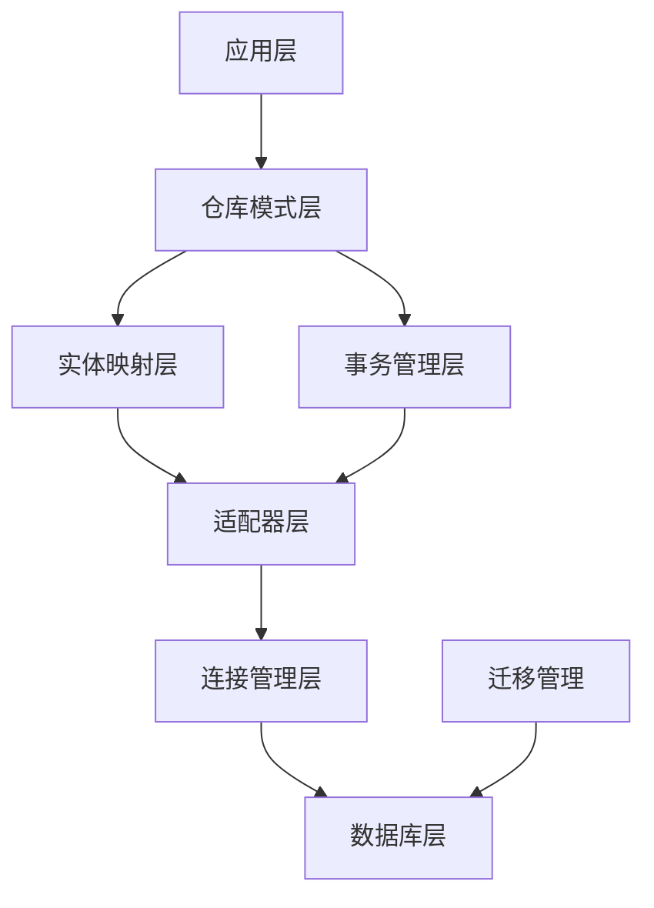
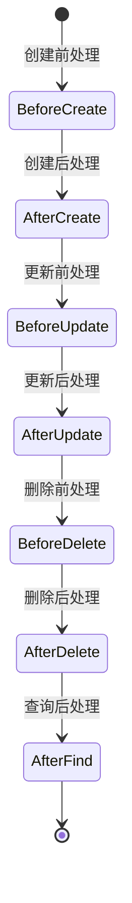
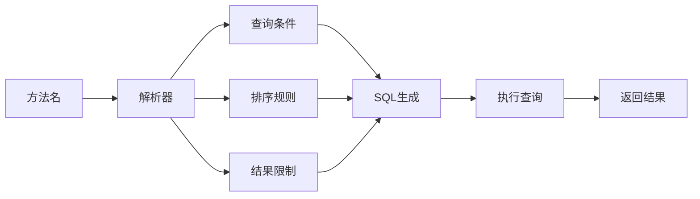

# 数据持久化层

## 框架概述与价值定位

### 业务背景与挑战

在现代企业应用开发中，数据持久化层承担着业务数据存储、访问和管理的核心职责。Photon框架的数据持久化层针对V语言生态系统的企业级应用需求，提供了一套完整的数据访问解决方案。该框架在V语言原生ORM基础上构建增强层，解决了原生ORM在企业级应用场景中的功能局限性。

### 核心价值主张

Photon数据持久化层通过四大核心价值为企业应用开发提供支撑：

**开发效率提升**：通过约定优于配置的设计原则，大幅减少样板代码编写。开发者可以专注于业务逻辑实现，而非重复的数据访问代码编写[^1]。

**数据安全保障**：提供完整的事务管理机制和生命周期钩子，确保业务操作的原子性和数据一致性。框架自动处理时间戳更新、版本控制等关键数据管理任务[^2]。

**团队协作优化**：通过标准化的实体定义和版本化的数据库迁移系统，促进开发团队之间的协作。统一的代码结构和命名规范降低了团队沟通成本[^3]。

**系统可维护性**：清晰的架构分层和接口设计使得代码结构更加清晰，便于后续的功能扩展和维护工作。

## 核心业务功能模块

### 功能架构概览

Photon数据持久化层采用分层架构设计，各模块职责明确，相互协作形成完整的数据访问能力。



图：数据持久化层功能架构（类型：架构图）

### 模块能力矩阵

| 功能模块 | 核心能力 | 业务价值 |
|---------|---------|---------|
| 实体映射 | 标准化实体结构、生命周期钩子、软删除支持 | 统一数据模型、简化实体管理 |
| 仓库模式 | Spring Data风格查询、派生查询、类型安全CRUD | 提高开发效率、减少错误 |
| 事务管理 | 多种传播行为、隔离级别控制、嵌套事务 | 确保数据一致性、支持复杂业务 |
| 迁移管理 | 版本化迁移、团队协作、结构变更追踪 | 规范数据库演进、降低协作风险 |

## 实体映射与管理

### 实体生命周期管理

Photon框架通过BaseEntity提供标准化的实体基础结构，所有业务实体都可以继承这些通用特性。这种设计确保了整个应用中实体行为的一致性。

**核心实体特性**：
- 自动时间戳管理：创建时间和更新时间的自动维护
- 版本控制：乐观锁机制，防止并发更新冲突
- 软删除支持：逻辑删除机制，保留数据完整性
- 主键标准化：统一的主键定义和访问方式

### 生命周期钩子机制

框架提供了完整的实体生命周期钩子，允许开发者在关键操作节点插入自定义业务逻辑。这种机制为复杂的业务规则实现提供了灵活的扩展点。



图：实体生命周期状态转换（类型：状态图）

**钩子应用场景**：
- 数据验证和清理
- 审计日志记录
- 缓存更新
- 事件发布
- 业务规则校验

## 数据访问模式

### 仓库模式实现

Photon框架实现了Spring Data风格的仓库模式，为数据访问提供了统一的高级抽象。开发者可以通过接口定义的方式声明数据访问方法，框架自动生成具体的实现逻辑。

**核心仓库接口**：
- 基础CRUD操作：增删改查的标准方法
- 条件查询：支持复杂查询条件的构建
- 分页查询：大数据集的高效处理
- 聚合查询：统计和计算功能

### 派生查询机制

框架提供了强大的方法名解析功能，能够将符合命名规范的方法名自动转换为SQL查询条件。这种机制大幅简化了查询方法的定义过程。

**查询方法命名规范**：
- `findByUsername`：根据用户名查询
- `findByStatusAndCreatedAtAfter`：多条件组合查询
- `countByRole`：统计查询
- `deleteByExpiredAtBefore`：条件删除



图：派生查询处理流程（类型：流程图）

## 事务管理机制

### 事务传播行为

Photon框架提供了7种事务传播行为，满足不同业务场景下的事务管理需求。这种灵活性使得开发者可以根据业务逻辑的复杂性选择合适的事务边界。

**传播行为类型**：
- **REQUIRED**：默认行为，加入现有事务或创建新事务
- **REQUIRES_NEW**：始终创建新事务，挂起现有事务
- **NESTED**：在现有事务中创建嵌套事务（保存点）
- **SUPPORTS**：支持现有事务，非事务环境下也可执行
- **NOT_SUPPORTED**：挂起现有事务，非事务执行
- **MANDATORY**：必须存在现有事务
- **NEVER**：不能存在事务

### 隔离级别控制

框架支持4种标准的事务隔离级别，允许开发者根据业务需求在数据一致性和并发性能之间进行权衡。

**隔离级别选择策略**：
- **READ_UNCOMMITTED**：最高并发性能，适合读多写少的场景
- **READ_COMMITTED**：平衡性能和一致性，适合大多数业务场景
- **REPEATABLE_READ**：强一致性保证，适合关键业务数据
- **SERIALIZABLE**：最高隔离级别，适合高一致性要求的场景

## 数据库迁移管理

### 版本化迁移系统

Photon框架提供了完整的数据库迁移管理功能，支持团队协作环境下的数据库结构演进。迁移系统通过版本号和批次管理，确保数据库变更的可追溯性和可控性。

**迁移管理特性**：
- 版本号管理：每个迁移都有唯一的版本标识
- 批次控制：相关迁移可以组织为同一批次
- 前进和回滚：支持迁移的执行和撤销操作
- 状态追踪：实时监控迁移执行状态

### 迁移执行流程

迁移系统提供了完整的数据库结构变更生命周期管理，从迁移定义到执行验证的全过程支持。

```mermaid
sequenceDiagram
    Dev[开发者] --> System[迁移系统]
    System --> DB[数据库]
    
    Dev->>System: 定义迁移
    System->>System: 验证迁移
    System->>DB: 检查版本状态
    DB-->>System: 返回当前版本
    System->>DB: 执行迁移
    DB-->>System: 确认执行结果
    System->>DB: 更新版本记录
    System-->>Dev: 返回执行状态
```

图：迁移执行交互流程（类型：序列图）

## 最佳实践指南

### 实体设计原则

**单一职责原则**：每个实体应该专注于单一业务概念，避免将多个业务概念混合在一个实体中。

**一致性原则**：在整个应用中保持实体命名和结构的一致性，使用统一的字段命名规范。

**可扩展性考虑**：在设计实体时考虑未来的业务扩展需求，预留必要的扩展字段。

### 数据访问优化

**查询优化**：合理使用索引，避免全表扫描。对于复杂查询，考虑使用原生SQL优化性能。

**批量操作**：对于大量数据的处理，使用批量操作减少数据库交互次数。

**缓存策略**：合理使用缓存减少数据库访问压力，但要注意缓存一致性问题。

### 事务使用建议

**事务边界控制**：保持事务的简短，避免在事务中执行耗时操作。

**异常处理**：合理设置事务的回滚规则，确保异常情况下的数据一致性。

**并发控制**：在高并发场景下，合理选择隔离级别，平衡性能和一致性要求。

## 参考文献

[^1]: [开发效率提升机制](src/orm/repository.v#L37-L47)
[^2]: [数据安全保障实现](src/orm/transaction.v#L18-L36)
[^3]: [团队协作优化功能](src/orm/migration.v#L4-L14)