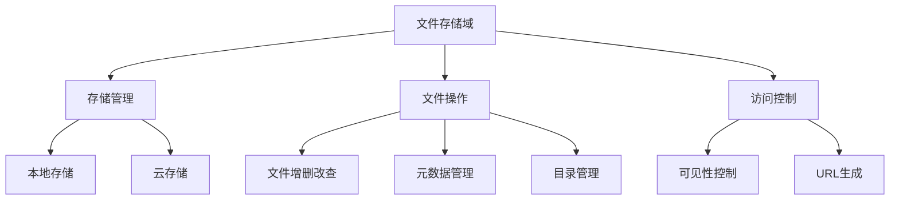
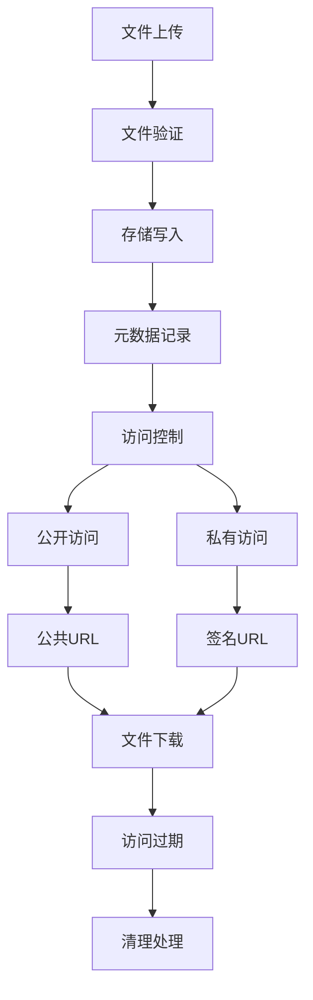

# 文件存储管理

## 概述与价值定位

Photon框架的文件存储管理功能为现代应用提供了统一、灵活的文件处理解决方案。通过抽象化的存储接口，系统能够无缝支持本地文件系统和多种云存储服务，为业务发展提供了坚实的技术基础。

### 核心业务价值

文件存储管理功能直接解决了企业在数字化转型过程中面临的几个关键挑战：

- **降低技术复杂度**：统一的API接口让开发团队无需掌握多种存储系统的专业知识，显著降低了学习成本和开发难度[^1]
- **提升业务敏捷性**：支持在不同存储后端间灵活切换，满足从开发测试到生产部署的全生命周期需求
- **优化资源配置**：根据业务场景选择最适合的存储方案，在成本、性能和可靠性之间取得最佳平衡
- **保障数据安全**：内置的文件可见性控制和权限管理机制，确保敏感数据的安全性

## 业务架构设计

### 存储域模型

Photon文件存储系统采用分层架构设计，将存储业务划分为清晰的职责域：


图：文件存储业务域架构（类型：业务域架构图）

### 统一存储抽象

系统通过Storage接口提供统一的文件操作能力，屏蔽了不同存储后端的技术差异。这种设计让业务代码能够保持一致性，无论底层使用本地文件系统还是云存储服务[^2]。

核心业务操作包括：
- 文件读写：支持文本和二进制文件的存取
- 文件管理：复制、移动、删除等基础操作
- 元数据查询：获取文件大小、类型、修改时间等信息
- 目录操作：创建、删除、遍历目录结构

## 核心功能特性

### 多存储后端支持

#### 本地文件系统
本地存储适配器为应用提供了可靠的本地文件管理能力，特别适合开发环境和小规模部署场景：

- **目录隔离**：通过根目录配置实现安全的文件隔离，防止路径遍历攻击
- **权限管理**：基于Unix权限系统的文件可见性控制，支持公开（644）和私有（600）两种模式
- **自动目录创建**：写入文件时自动创建必要的父目录，简化业务逻辑
- **性能优化**：内置权限缓存机制，避免频繁的文件系统权限检查[^3]

#### 云存储集成
S3兼容适配器让应用能够无缝对接主流云存储服务，为业务扩展提供云端能力：

- **多云支持**：兼容AWS S3、MinIO、DigitalOcean Spaces等主流云存储服务
- **预签名URL**：生成有时效性的访问链接，支持安全的临时文件访问
- **成本优化**：根据业务需求选择最适合的云存储方案，优化存储成本
- **高可用性**：利用云存储的内置冗余和备份机制，保障数据安全

### 文件生命周期管理


图：文件生命周期管理流程（类型：业务流程图）

### 智能文件类型识别

系统内置了全面的MIME类型检测能力，支持超过100种常见文件格式的自动识别：

- **Web资源**：HTML、CSS、JavaScript等前端资源文件
- **媒体文件**：图片、音频、视频等多媒体内容
- **办公文档**：PDF、Word、Excel、PowerPoint等商业文档
- **开发文件**：源代码、配置文件、压缩包等技术资源

这种智能识别能力为业务场景提供了精准的文件处理策略，比如根据文件类型自动选择合适的压缩算法或缓存策略。

## 业务应用场景

### 内容管理系统

对于需要处理大量用户生成内容的业务场景，Photon存储系统提供了完整的解决方案：

- **用户上传**：支持图片、文档、视频等多种格式的内容上传
- **内容分发**：通过公共URL实现内容的快速分发和访问
- **存储优化**：根据内容类型和访问频率选择最优存储策略
- **权限控制**：确保私有内容只能被授权用户访问

### 电子商务平台

电商业务中的商品图片、订单文档等文件管理需求得到了充分支持：

- **商品图片**：支持高分辨率图片的存储和快速访问
- **订单文档**：发票、合同等重要文档的安全存储
- **临时文件**：通过预签名URL实现临时的文件分享
- **批量处理**：支持商品图片的批量上传和管理

### 企业协作平台

企业内部文档协作场景下的文件管理需求：

- **文档共享**：支持团队成员间的安全文件共享
- **版本管理**：通过元数据追踪文件的修改历史
- **权限分级**：根据文档敏感度设置不同的访问权限
- **审计追踪**：完整的文件操作记录支持合规要求

## 配置与部署策略

### 开发环境配置

在开发阶段，推荐使用本地存储适配器：

```v
mut manager := storage.new_manager()
manager.register('local', storage.new_local_adapter('./uploads'))
```

这种配置方式简单快捷，无需额外的服务依赖，适合快速原型开发和功能验证。

### 生产环境部署

生产环境建议采用云存储方案，以获得更好的可扩展性和可靠性：

```v
manager.register('s3', storage.new_s3_adapter('my-bucket', 'us-east-1'))
```

云存储提供了自动备份、全球分发、高可用性等企业级特性，能够满足大规模业务的需求。

### 混合部署策略

对于复杂的业务场景，可以同时配置多种存储后端：

- **热数据**：频繁访问的文件使用本地存储，提升访问速度
- **冷数据**：历史文件和备份使用云存储，降低存储成本
- **临时文件**：短期使用的文件存储在内存或临时目录中

## 性能与扩展性

### 性能优化策略

系统在设计时充分考虑了性能因素：

- **缓存机制**：本地存储适配器内置权限缓存，减少文件系统调用
- **并发安全**：使用读写锁确保多线程环境下的数据一致性
- **内存管理**：权限缓存采用FIFO淘汰策略，防止内存泄漏

### 扩展性设计

存储系统的架构支持业务的无缝扩展：

- **水平扩展**：通过增加存储节点提升系统容量
- **垂直扩展**：升级存储硬件提升单点性能
- **地理分布**：利用云存储的全球节点实现就近访问

## 安全与合规

### 数据安全

文件存储系统提供了多层次的安全保障：

- **访问控制**：基于文件可见性的权限管理
- **路径安全**：防止目录遍历攻击的路径解析机制
- **传输安全**：支持HTTPS加密传输
- **存储加密**：云存储支持服务端加密

### 合规支持

对于有合规要求的业务场景，系统提供了必要的支持：

- **审计日志**：完整的文件操作记录
- **数据保留**：支持文件的生命周期管理
- **地域限制**：云存储支持数据地域存储要求

## 成本效益分析

### 开发成本节约

- **学习成本**：统一的API减少了团队的学习时间
- **维护成本**：抽象层降低了代码维护的复杂度
- **迁移成本**：存储后端的切换无需修改业务代码

### 运营成本优化

- **存储成本**：根据业务特点选择最优存储方案
- **带宽成本**：通过CDN和缓存减少带宽消耗
- **人力成本**：自动化的文件管理减少人工干预

## 未来发展方向

### 功能增强

- **更多云存储支持**：Azure Blob、Google Cloud Storage等
- **高级功能**：文件版本控制、增量备份、数据压缩
- **监控告警**：存储使用量、性能指标的实时监控

### 生态集成

- **CDN集成**：与内容分发网络的无缝对接
- **AI服务**：图片识别、内容审核等智能服务集成
- **数据分析**：文件访问模式的分析和优化建议

## 参考文献

[^1]: [统一存储接口设计](src/storage/storage.v#L105-L134)
[^2]: [存储管理器实现](src/storage/storage.v#L140-L194)
[^3]: [本地存储权限管理](src/storage/local_adapter.v#L170-L210)