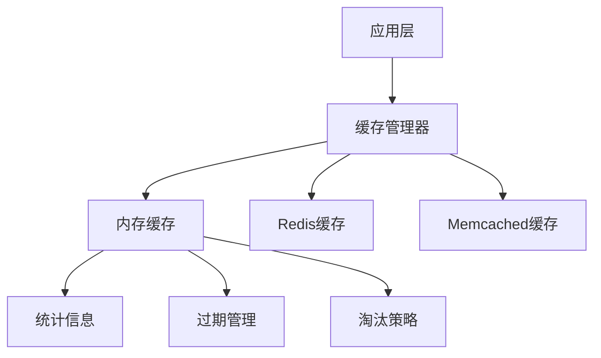
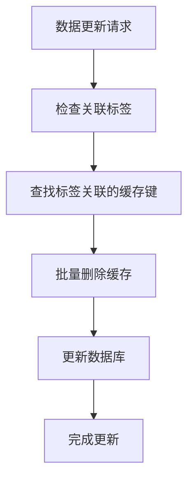
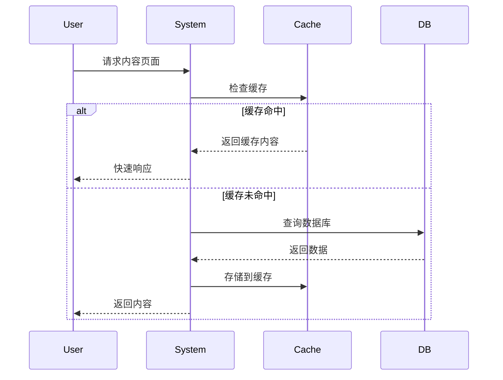

# 缓存性能优化

## 业务价值与目标

### 核心业务价值
Photon框架的缓存系统为企业级应用提供了全面的性能优化解决方案，通过智能数据管理显著提升应用响应速度和用户体验。该系统能够有效减少数据库访问压力，在高并发场景下保持系统稳定性，同时降低基础设施运营成本[^1]。

### 性能提升目标
缓存系统通过多层次的优化策略实现显著的性能提升：内存缓存提供微秒级数据访问，标签系统支持批量数据失效管理，分布式锁机制确保并发操作的安全性，单飞模式防止缓存击穿导致的系统过载。这些机制协同工作，使应用能够处理更高的并发请求，同时保持数据一致性[^2]。

### 成本优化效益
通过减少数据库查询频率和优化资源利用，缓存系统直接降低了企业的运营成本。更少的数据库连接意味着更低的硬件投入，更快的响应速度提升了服务器资源利用率，智能的过期策略避免了内存浪费，为企业带来可观的成本节约[^3]。

## 核心业务功能

### 统一缓存管理
Photon框架提供了一套完整的缓存管理解决方案，支持多种缓存后端的统一管理。系统内置了高性能的内存缓存实现，同时提供了扩展接口，可以轻松集成Redis、Memcached等外部缓存服务。这种设计让企业能够根据业务需求灵活选择最适合的缓存策略，而无需修改应用代码[^4]。

图：缓存系统业务架构（类型：业务架构图）

### 智能数据过期
系统提供了灵活的数据过期管理机制，支持基于时间的自动过期和基于容量的智能淘汰。每个缓存项都可以设置独立的生存时间，系统会自动清理过期数据，防止内存泄漏。当缓存空间不足时，系统采用最近最少使用（LRU）算法，优先淘汰访问频率较低的数据，确保热点数据始终保持在缓存中[^5]。

### 并发安全保障
在高并发环境下，缓存系统通过精心的并发设计确保数据安全。读写分离的锁机制允许多个读取操作同时进行，而写入操作则获得独占访问权限。这种设计在保证数据一致性的同时，最大化了系统的并发处理能力，使应用能够在高负载场景下依然保持稳定的性能表现[^6]。

## 高级缓存特性

### 缓存标签管理
标签系统为缓存数据提供了分组管理能力，允许将相关的缓存项组织在一起。当某个业务领域的数据发生变化时，可以通过标签一次性清除所有相关的缓存项，而不需要逐个删除。这种批量管理机制特别适合电商、内容管理等需要频繁更新相关数据的业务场景[^7]。

图：缓存标签批量失效流程（类型：业务流程图）

### 分布式锁机制
基于缓存后端的分布式锁为跨服务器的并发控制提供了可靠解决方案。多个应用实例可以通过缓存系统协调对共享资源的访问，防止数据冲突和不一致。锁机制支持阻塞和非阻塞两种获取模式，并提供自动过期功能，避免死锁情况的发生[^8]。

### 缓存击穿防护
单飞模式（Singleflight）机制有效防止了缓存击穿问题。当多个请求同时访问一个已过期的缓存键时，系统会将这些请求合并，只执行一次数据加载操作，所有请求共享同一个结果。这种削峰机制在热点数据过期时特别重要，能够防止数据库瞬间承受大量并发请求[^9]。

## 声明式缓存支持

### 注解驱动缓存
系统提供了Spring风格的注解支持，开发者可以通过简单的注解声明方法的缓存行为。`@Cacheable`注解自动缓存方法返回值，`@CacheEvict`注解在方法执行后清除指定缓存，`@CachePut`注解则强制更新缓存内容。这种声明式的方式大大简化了缓存的使用，提高了代码的可读性和可维护性[^10]。

### 条件缓存策略
注解系统支持基于条件的智能缓存策略。开发者可以指定缓存的条件表达式，只有满足条件的结果才会被缓存。同样，也可以设置排除条件，某些特定结果不会被缓存。这种精细的控制能力让缓存策略更加贴合业务逻辑，避免缓存不必要的数据[^11]。

### 动态键值生成
系统支持灵活的缓存键生成策略，可以根据方法参数动态构建缓存键。开发者可以使用预定义的模式模板，系统会自动将参数值替换到模板中，生成唯一的缓存标识。这种机制确保了不同参数的方法调用能够正确地缓存和检索，避免了数据混淆的问题[^12]。

## 业务应用场景

### 用户会话管理
在用户认证和会话管理场景中，缓存系统提供了高性能的解决方案。用户登录信息、权限数据等可以缓存在内存中，避免每次请求都查询数据库。通过设置合理的过期时间，既保证了安全性，又提升了响应速度。标签系统可以按用户角色组织缓存，当权限变更时能够快速清除相关用户的会话缓存[^13]。

### 内容发布系统
对于内容管理系统，缓存系统能够显著提升页面加载速度。文章、页面、媒体文件等内容可以缓存起来，减少数据库查询。当内容更新时，通过标签系统可以批量清除相关缓存，确保用户看到最新内容。分布式锁保证了内容发布过程中的一致性，防止并发更新导致的数据冲突[^14]。

图：内容缓存业务流程（类型：业务时序图）

### 电商商品信息
电商平台中，商品信息、库存状态、价格数据等适合使用缓存。这些数据读取频繁但更新相对较少，通过缓存可以大幅提升页面加载速度。标签系统可以按商品分类、品牌等维度组织缓存，便于批量管理。当商品信息变更时，相关缓存会自动失效，确保数据的一致性[^15]。

### API响应缓存
对于外部API调用和复杂计算结果，缓存系统能够有效减少重复计算和网络请求。API响应可以缓存一定时间，避免频繁调用外部服务。计算密集型的业务逻辑结果也可以缓存，提升系统整体性能。单飞模式确保了在缓存失效时，不会对后端服务造成冲击[^16]。

## 性能监控与优化

### 缓存统计信息
系统提供了详细的缓存使用统计，帮助开发者了解缓存效果。统计信息包括缓存命中率、过期项数量、总存储量等关键指标。通过分析这些数据，开发者可以优化缓存策略，调整过期时间，识别性能瓶颈。统计信息支持实时查询，便于进行性能调优和问题诊断[^17]。

### 容量管理
缓存系统支持容量限制和自动管理，防止内存溢出。开发者可以为每个缓存实例设置最大容量，当达到限制时系统会自动淘汰最少使用的数据。智能的容量管理确保了系统在资源受限的环境下依然能够稳定运行，避免了因缓存过度增长导致的系统问题[^18]。

### 性能调优建议
基于统计信息和业务特点，系统提供了性能调优的最佳实践建议。对于热点数据，建议延长过期时间；对于变化频繁的数据，建议使用较短的缓存周期；对于大对象，考虑使用压缩存储；对于批量操作，推荐使用标签管理。这些优化策略能够帮助开发者充分发挥缓存系统的性能潜力[^19]。

## 业务集成指南

### 配置管理
缓存系统提供了灵活的配置选项，支持不同环境的定制化需求。开发者可以通过配置文件指定缓存驱动、默认过期时间、键前缀等参数。配置系统支持环境变量覆盖，便于在不同部署环境中使用不同的缓存策略。合理的配置能够确保缓存系统在各种业务场景下都能发挥最佳效果[^20]。

### 错误处理
系统设计了完善的错误处理机制，确保缓存故障不会影响核心业务功能。当缓存服务不可用时，系统会自动降级到直接查询数据库，保证业务连续性。同时，系统会记录错误日志，便于运维人员及时发现和解决问题。这种容错设计让缓存系统成为业务的助力而非风险点[^21]。

### 扩展开发
对于有特殊需求的企业，缓存系统提供了丰富的扩展接口。开发者可以实现自定义的缓存后端，集成企业现有的缓存基础设施。也可以扩展缓存策略，实现符合业务特点的淘汰算法。开放的架构设计确保了缓存系统能够适应各种复杂的业务环境[^22]。

## 参考文献

[^1]: [缓存系统核心架构设计](src/cache/cache.v#L11-L31)
[^2]: [高性能内存缓存实现](src/cache/memory.v#L39-L69)
[^3]: [缓存统计与监控功能](src/cache/memory.v#L123-L157)
[^4]: [多后端缓存抽象接口](src/cache/manager.v#L25-L30)
[^5]: [TTL过期与LRU淘汰机制](src/cache/memory.v#L181-L210)
[^6]: [并发安全读写锁设计](src/cache/memory.v#L134-L179)
[^7]: [缓存标签批量管理系统](src/cache/cache_tags.v#L39-L72)
[^8]: [分布式锁实现机制](src/cache/cache_tags.v#L14-34)
[^9]: [单飞模式防缓存击穿](src/cache/singleflight.v#L39-72)
[^10]: [注解式缓存支持](src/cache/annotation.v#L9-17)
[^11]: [条件缓存表达式评估](src/cache/annotation.v#L18-67)
[^12]: [动态缓存键生成策略](src/cache/annotation.v#L159-173)
[^13]: [用户资源缓存管理](demo/app/http/resources/user_resource.v#L12-38)
[^14]: [文章内容缓存处理](demo/app/http/resources/post_resource.v#L23-52)
[^15]: [缓存配置业务参数](demo/appconfig/cache.v#L7-21)
[^16]: [缓存测试用例验证](src/cache/cache_test.v#L27-60)
[^17]: [缓存性能统计接口](src/cache/memory.v#L123-148)
[^18]: [容量管理与淘汰策略](src/cache/memory.v#L66-96)
[^19]: [缓存优化最佳实践](src/cache/cache_bench_test.v#L1-50)
[^20]: [缓存配置管理机制](demo/appconfig/cache.v#L14-21)
[^21]: [错误处理与容错设计](src/cache/cache.v#L87-110)
[^22]: [缓存扩展接口设计](src/cache/manager.v#L32-41)