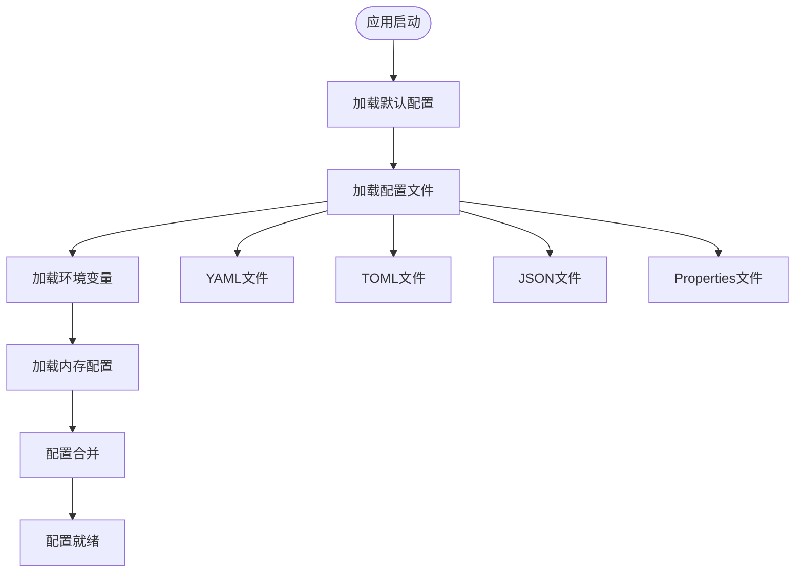
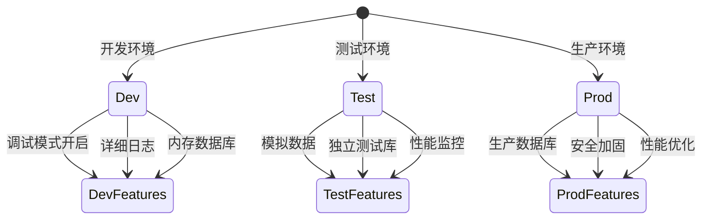

# 配置管理

## 配置系统概述

Photon框架的配置系统为企业级应用提供了统一、灵活、类型安全的配置管理解决方案。该系统通过多源配置合并、环境变量支持和属性绑定机制，显著降低了应用在不同部署环境中的配置管理复杂度，提升了开发和运维效率。

配置系统的核心业务价值在于实现"一次编码，多环境部署"的目标，让同一套应用代码能够无缝适配开发、测试、生产等不同环境，同时保持配置的可追溯性和一致性[^1]。

### 核心业务能力

- **多源配置合并**：支持从文件、环境变量、内存等多种来源加载配置，自动合并并处理优先级
- **环境配置管理**：通过Profile机制支持dev、test、prod等环境的差异化配置
- **类型安全访问**：提供强类型的配置访问方法，减少运行时配置错误
- **属性自动绑定**：通过注解方式将配置值自动注入到业务对象字段
- **配置占位符**：支持配置值间的引用和动态解析

## 配置源管理

### 多源配置架构

Photon配置系统支持多种配置来源，按照加载顺序确定优先级，后加载的配置源会覆盖先加载的同名配置项。这种设计确保了配置的灵活性和可扩展性。

图：配置源加载流程（类型：业务流程图）

### 配置文件支持

配置系统支持多种主流配置文件格式，满足不同团队和项目的偏好：

- **YAML格式**：适合复杂嵌套配置，支持注释，是Spring Boot等主流框架的首选格式
- **TOML格式**：V语言生态的标准配置格式，语法简洁明了
- **JSON格式**：标准数据交换格式，适合程序化配置管理
- **Properties格式**：传统的键值对格式，兼容性好

### 环境变量集成

系统提供强大的环境变量支持，允许通过前缀过滤和命名转换，将环境变量无缝集成到配置体系中。这种机制特别适合容器化部署和云原生应用场景[^2]。

环境变量配置支持以下特性：
- 前缀过滤：只加载特定前缀的环境变量（如APP_）
- 自动转换：环境变量名自动转换为配置键名（APP_SERVER_HOST → server.host）
- 优先级覆盖：环境变量可以覆盖配置文件中的同名配置

## 环境配置管理

### Profile机制

Profile机制是Photon配置系统的核心特性，允许应用根据不同的运行环境加载不同的配置组合。系统支持同时激活多个Profile，提供了灵活的环境适配能力。

图：环境配置状态转换（类型：业务状态图）

### 环境差异化配置

通过Profile机制，可以为不同环境定义差异化的配置策略：

**开发环境（dev）**：
- 启用调试模式和详细日志
- 使用内存数据库加速开发
- 开放所有开发工具和监控端点
- 宽松的安全策略

**测试环境（test）**：
- 使用独立的测试数据库
- 启用性能监控和测试工具
- 模拟外部服务调用
- 适中的安全级别

**生产环境（prod）**：
- 关闭调试模式，优化性能
- 使用生产级数据库和连接池
- 启用安全加固和访问控制
- 限制管理端点访问

### 配置继承与覆盖

配置系统支持配置的继承和覆盖机制，允许定义基础配置，然后在特定环境中覆盖部分配置项。这种设计减少了配置重复，提高了维护效率[^3]。

## 属性绑定机制

### 注解驱动配置

Photon框架提供了便捷的属性绑定机制，通过@[value]注解可以将配置值自动注入到业务对象的字段中。这种方式大大简化了配置的使用，提高了代码的可读性和维护性。

属性绑定支持以下特性：
- 自动类型转换：将字符串配置值转换为目标字段类型
- 默认值支持：当配置不存在时使用指定的默认值
- 表达式解析：支持key:default格式的配置表达式
- 编译时验证：在编译阶段验证配置的完整性

### 配置访问模式

系统提供了多种配置访问模式，满足不同的使用场景：

**直接访问模式**：通过Config对象直接获取配置值，适合简单的配置读取场景

**类型安全访问**：提供get_int()、get_bool()等类型化方法，避免类型转换错误

**绑定访问模式**：通过属性绑定将配置注入到结构体字段，适合复杂的配置对象

**环境感知访问**：结合Profile机制，根据当前环境返回相应的配置值

## 业务价值与优势

### 运维效率提升

配置系统显著提升了运维团队的工作效率：
- **统一配置管理**：所有配置集中管理，避免配置散落和遗漏
- **环境一致性**：通过模板化和继承机制确保环境间配置的一致性
- **快速环境切换**：通过Profile参数快速切换不同环境的配置
- **配置可追溯**：清晰的配置来源和优先级，便于问题排查

### 开发体验优化

为开发团队提供了优秀的配置使用体验：
- **类型安全**：编译时类型检查，减少运行时配置错误
- **智能提示**：IDE可以提供配置项的自动补全和验证
- **热重载支持**：配置变更后可以快速重载，无需重启应用
- **文档化配置**：通过结构化的配置定义，自动生成配置文档

### 部署灵活性

支持多种部署场景和策略：
- **容器化部署**：完美适配Docker、Kubernetes等容器环境
- **云原生支持**：支持云平台的配置服务和密钥管理
- **多租户架构**：支持租户级别的配置隔离和管理
- **配置中心集成**：可以与外部配置中心集成，实现集中配置管理

## 最佳实践建议

### 配置组织策略

**分层配置设计**：
- 基础配置：定义所有环境共享的基础配置项
- 环境配置：定义特定环境的差异化配置
- 实例配置：定义单个实例的特殊配置

**命名规范**：
- 使用点分隔的层次化命名（如database.host、server.port）
- 环境相关配置使用统一前缀（如app_、db_、web_）
- 敏感配置使用明确的标识（如secret、key、password）

### 安全配置管理

**敏感信息保护**：
- 敏感配置优先使用环境变量或密钥管理服务
- 避免在配置文件中明文存储密码和密钥
- 使用配置加密功能保护敏感信息

**访问控制**：
- 限制生产环境配置的访问权限
- 实施配置变更的审批和审计流程
- 定期轮换敏感配置项

### 性能优化建议

**配置加载优化**：
- 合理安排配置源的加载顺序，避免不必要的重复加载
- 使用配置缓存减少频繁的配置访问开销
- 对于大型配置，考虑按需加载和延迟初始化

**内存使用优化**：
- 及时释放不再使用的配置对象
- 避免在配置中存储大量二进制数据
- 使用合适的数据结构存储配置信息

## 参考文献

[^1]: [配置系统核心架构设计](src/config/config.v#L10-L17)
[^2]: [环境变量配置源实现](src/config/source.v#L51-L80)
[^3]: [Profile环境管理机制](src/config/environment.v#L32-L50)