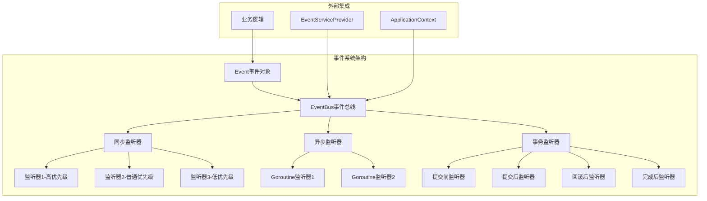
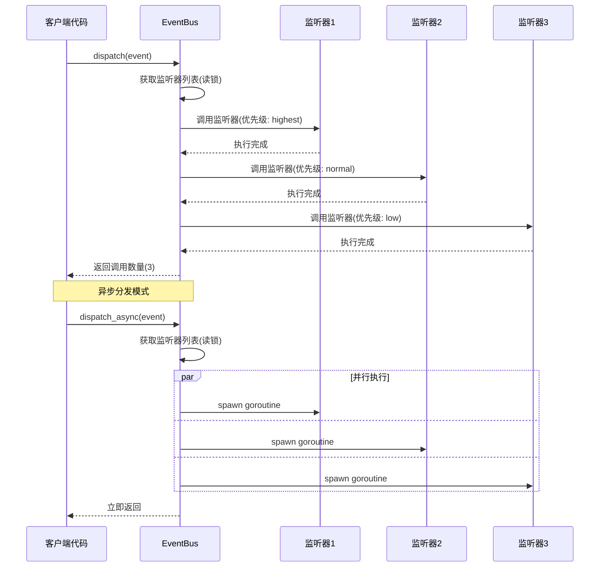
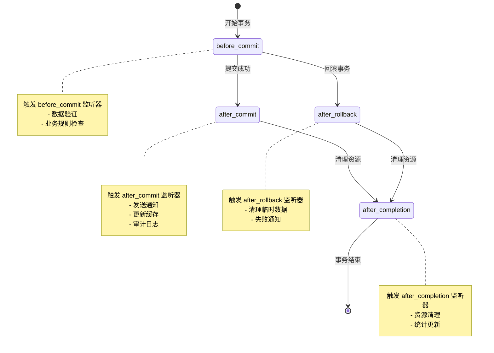

# 事件系统

## 架构概述

Photon事件系统是一个受Spring ApplicationEvent和Laravel Event启发的高性能事件驱动架构，提供了类型安全、线程安全的事件发布订阅机制。系统采用中心化EventBus设计，支持同步/异步事件分发、优先级调度、事务事件监听等企业级特性[^1]。

事件系统的核心设计理念是解耦业务逻辑，通过事件驱动的方式实现模块间的松耦合通信。EventBus作为中央事件调度器，管理所有事件监听器的注册、移除和调用，确保事件在正确的时机被正确的监听器处理[^2]。


图：Photon事件系统整体架构（类型：架构图）

## EventBus实现

EventBus是事件系统的核心组件，采用线程安全设计，使用`sync.RwMutex`保护并发访问。EventBus内部维护两个核心数据结构：`listeners`映射存储普通事件监听器，`transactional_listeners`映射存储事务事件监听器[^3]。

```v
@[heap]
pub struct EventBus {
pub mut:
    listeners               map[string][]RegisteredListener
    transactional_listeners map[string][]TransactionalRegisteredListener
mut:
    mu      sync.RwMutex
    wg      sync.WaitGroup
    next_id int
}
```

EventBus的线程安全策略采用读写分离设计：
- **读操作**：使用`rlock()`允许并发读取，如事件分发、监听器查询
- **写操作**：使用`lock()`确保独占访问，如监听器注册、移除
- **异步跟踪**：使用`sync.WaitGroup`跟踪异步事件分发的完成状态

每个监听器都被分配一个全局唯一的ID，这使得闭包监听器的精确移除成为可能，避免了函数指针比较在闭包场景下的不可靠性问题[^4]。

## 事件监听器管理

### 监听器注册机制

EventBus提供灵活的监听器注册API，支持优先级控制和唯一ID管理：

```v
// 普通优先级注册
pub fn (mut bus EventBus) on(event_name string, listener EventListener) int

// 指定优先级注册
pub fn (mut bus EventBus) on_with_priority(event_name string, listener EventListener, priority int) int

// 事务监听器注册
pub fn (mut bus EventBus) on_transactional(event_name string, listener TransactionalEventListener) int
```

监听器优先级系统定义了5个级别，数值越小优先级越高：
- `highest = 0`：最高优先级，如系统级事件处理
- `high = 25`：高优先级，如安全审计
- `normal = 50`：普通优先级，默认级别
- `low = 75`：低优先级，如日志记录
- `lowest = 100`：最低优先级，如统计收集

监听器按优先级升序排列执行，确保关键业务逻辑优先处理[^5]。

### 监听器移除策略

EventBus支持两种移除模式：
1. **批量移除**：`off(event_name)`移除指定事件的所有监听器
2. **精确移除**：`off_listener(id)`通过唯一ID移除特定监听器

精确移除机制遍历所有事件类型查找匹配的ID，确保全局唯一性。这种设计特别适合动态监听器管理场景，如插件系统的热插拔[^6]。

## 同步异步事件发布

### 同步事件分发

同步事件分发通过`dispatch()`方法实现，采用阻塞式调用模式：

```v
pub fn (mut bus EventBus) dispatch(event &Event) int {
    // 设置时间戳
    if event.timestamp == 0 {
        unsafe {
            mut e := event
            e.timestamp = time.now().unix()
        }
    }
    
    // 获取监听器列表（读锁保护）
    bus.mu.rlock()
    listeners := bus.listeners[event.name] or { []RegisteredListener{} }
    bus.mu.runlock()
    
    // 按优先级顺序执行监听器
    mut called := 0
    for i in 0 .. listeners.len {
        if event.is_propagation_stopped() {
            break
        }
        rl := listeners[i]
        if !isnil(rl.listener) {
            rl.listener(event)
        }
        called++
    }
    return called
}
```

同步分发的关键特性：
- **传播控制**：支持`stop_propagation()`停止后续监听器执行
- **异常隔离**：单个监听器异常不影响其他监听器
- **调用统计**：记录实际调用的监听器数量

### 异步事件分发

异步事件分发通过`dispatch_async()`方法实现，每个监听器在独立的goroutine中执行：

```v
pub fn (mut bus EventBus) dispatch_async(event &Event) {
    bus.mu.rlock()
    listeners := bus.listeners[event.name] or { []RegisteredListener{} }
    bus.mu.runlock()

    for rl in listeners {
        if event.is_propagation_stopped() {
            break
        }
        if isnil(rl.listener) {
            continue
        }
        bus.wg.add(1)
        captured_event := event
        captured_listener := rl.listener
        bus_ref := bus
        spawn fn (e &Event, l EventListener, gb &EventBus) {
            defer {
                unsafe { gb.wg.done() }
            }
            l(e)
        }(captured_event, captured_listener, bus_ref)
    }
}
```

异步分发的核心优势：
- **并发执行**：多个监听器并行处理，提高吞吐量
- **资源跟踪**：通过WaitGroup跟踪所有异步任务完成状态
- **优雅关闭**：`wait_async()`和`shutdown()`确保所有任务完成后再退出


图：同步与异步事件分发流程对比（类型：时序图）

## 事务事件监听

Photon事件系统提供了完整的事务事件支持，允许在事务的不同阶段触发相应的事件监听器。这种设计特别适合需要与数据库事务状态同步的业务场景[^7]。

### 事务阶段定义

系统定义了四个事务阶段，对应Spring的TransactionPhase：

```v
pub enum TransactionPhase {
    before_commit    // 事务提交前
    after_commit     // 事务成功提交后
    after_rollback   // 事务回滚后
    after_completion // 事务完成后(提交或回滚)
}
```

### 事务监听器接口

事务监听器必须实现`TransactionalEventListener`接口：

```v
pub interface TransactionalEventListener {
    phase() TransactionPhase
mut:
    handle(event &Event)
}
```

### 事务事件分发机制

事务事件分发通过`dispatch_transactional()`方法实现，支持精确的阶段匹配：

```v
pub fn (mut bus EventBus) dispatch_transactional(event &Event, phase TransactionPhase) int {
    bus.mu.rlock()
    mut listeners := bus.transactional_listeners[event.name] or {
        []TransactionalRegisteredListener{}
    }
    bus.mu.runlock()

    mut called := 0
    for mut rl in listeners {
        if event.is_propagation_stopped() {
            break
        }
        // 匹配阶段：after_completion对提交和回滚都触发
        if rl.phase == phase || (rl.phase == .after_completion && (phase == .after_commit
            || phase == .after_rollback)) {
            rl.listener.handle(event)
            called++
        }
    }
    return called
}
```

事务事件监听的典型应用场景：
- **before_commit**：数据验证、业务规则检查
- **after_commit**：发送通知、更新缓存、记录审计日志
- **after_rollback**：清理临时数据、发送失败通知
- **after_completion**：资源清理、统计更新


图：事务事件生命周期状态转换（类型：状态图）

## 事件传播机制

### 传播控制

EventBus提供了灵活的事件传播控制机制，允许监听器在必要时停止事件的进一步传播：

```v
pub fn (mut e Event) stop_propagation() {
    e.stopped = true
}

pub fn (e &Event) is_propagation_stopped() bool {
    return e.stopped
}
```

传播控制的应用场景：
- **权限检查**：安全监听器在权限不足时停止传播
- **缓存命中**：缓存监听器在命中缓存时停止后续处理
- **条件过滤**：条件监听器在不满足条件时停止传播

### 异常处理策略

事件系统采用监听器隔离的异常处理策略，确保单个监听器的异常不会影响其他监听器的执行：

```v
// 监听器执行被隔离，异常不会传播到其他监听器
if !isnil(rl.listener) {
    // Isolate listener execution — one failing listener
    // should not prevent others from being called.
    rl.listener(event)
}
```

这种设计提高了系统的健壮性，避免了单点故障导致整个事件处理链的崩溃[^8]。

## 性能优化策略

### 并发控制优化

EventBus采用了多种并发控制优化策略：

1. **读写锁分离**：读操作使用`rlock()`允许并发访问，写操作使用`lock()`确保数据一致性
2. **最小锁粒度**：只在必要时持有锁，尽快释放避免阻塞
3. **异步跟踪优化**：使用WaitGroup而非channel跟踪异步任务，减少内存开销

### 内存管理优化

```v
// called_count故意设计为非原子，避免性能开销
// Note: called_count is intentionally non-atomic.
// It's a diagnostic counter — exact accuracy under concurrent
// dispatch is not critical. Using atomic would add overhead
// for negligible benefit.
called++
```

系统在关键路径上避免了不必要的原子操作，`called_count`作为诊断计数器，在并发环境下允许轻微的不精确，以换取更好的性能表现[^9]。

### 闭包处理优化

闭包监听器的移除通过唯一ID而非函数指针比较实现：

```v
// 使用唯一ID移除监听器，支持闭包场景
pub fn (mut bus EventBus) off_listener(id int) {
    bus.mu.@lock()
    defer { bus.mu.unlock() }

    for event_name, listeners in bus.listeners {
        mut new_listeners := []RegisteredListener{}
        for rl in listeners {
            if rl.id != id {
                new_listeners << rl
            }
        }
        // 更新监听器列表
    }
}
```

这种设计避免了函数指针比较在闭包场景下的不可靠性问题，提供了稳定的监听器管理机制[^10]。

## 实际应用示例

### 框架集成

Photon事件系统通过服务提供者模式集成到框架中：

```v
pub struct EventServiceProvider {
    ctx &BootContext
}

pub fn (sp &EventServiceProvider) register(mut app_ctx core.ApplicationContext) ! {
    mut ctx := unsafe { sp.ctx }
    event_bus := core.new_event_bus()
    ctx.event_bus = event_bus
    app_ctx.register_instance('EventBus', unsafe { voidptr(event_bus) })!
}

pub fn (sp &EventServiceProvider) boot(mut app_ctx core.ApplicationContext) ! {
    event_bus := sp.ctx.event_bus
    cache_mgr := sp.ctx.cache_mgr
    register_event_listeners(event_bus, cache_mgr, log)
}
```

### 业务事件定义

在实际应用中，事件名称通过常量定义，确保类型安全：

```v
pub const event_user_registered  = 'user.registered'
pub const event_user_logged_in   = 'user.logged_in'
pub const event_post_published   = 'post.published'
pub const event_comment_posted   = 'comment.posted'
```

### 监听器注册示例

```v
pub fn register_event_listeners(bus &core.EventBus, log &logger.Logger) {
    mut b := unsafe { mut bus }

    // 用户注册事件监听器
    b.on(event_user_registered, fn [log] (event &core.Event) {
        log.info('[Event] user.registered — payload: ${event.payload_str}')
    })

    // 文章发布事件监听器
    b.on(event_post_published, fn [log] (event &core.Event) {
        log.info('[Event] post.published — payload: ${event.payload_str}')
    })
}
```

### 事务事件应用

```v
struct UserCreatedListener {
mut:
    called bool
}

fn (l UserCreatedListener) phase() TransactionPhase {
    return .after_commit
}

fn (mut l UserCreatedListener) handle(event &Event) {
    // 在事务提交后发送欢迎邮件
    send_welcome_email(event.payload_str)
    l.called = true
}
```

这种设计模式确保了业务逻辑与基础设施的关注点分离，提高了代码的可维护性和可测试性[^11]。

## 参考文献

[^1]: [EventBus核心实现](src/core/event.v#L94-L119)
[^2]: [Event结构体定义](src/core/event.v#L22-L31)
[^3]: [EventBus线程安全设计](src/core/event.v#L103-L111)
[^4]: [监听器唯一ID机制](src/core/event.v#L131-L155)
[^5]: [监听器优先级系统](src/core/event.v#L71-L77)
[^6]: [监听器精确移除](src/core/event.v#L170-L187)
[^7]: [事务事件监听接口](src/core/event.v#L154-L158)
[^8]: [异常隔离策略](src/core/event.v#L55-L59)
[^9]: [性能优化注释](src/core/event.v#L60-L64)
[^10]: [闭包安全移除](src/core/event.v#L164-L187)
[^11]: [EventServiceProvider集成](demo/providers/event_service_provider.v#L24-L43)