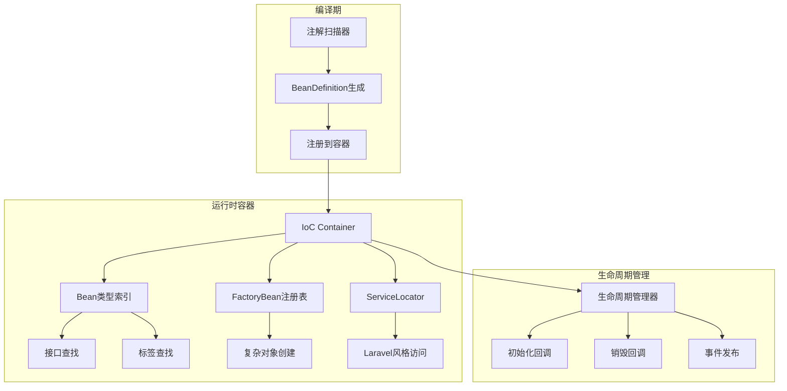
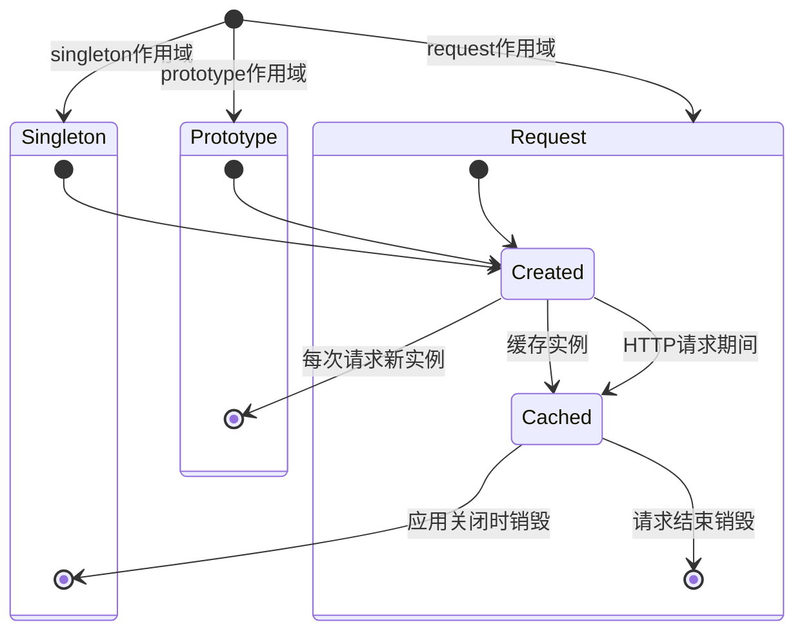
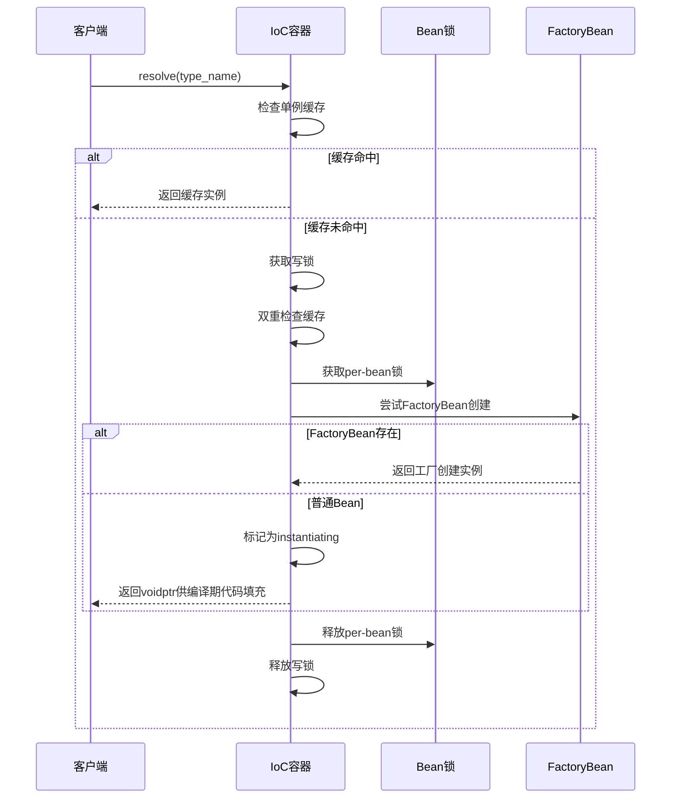
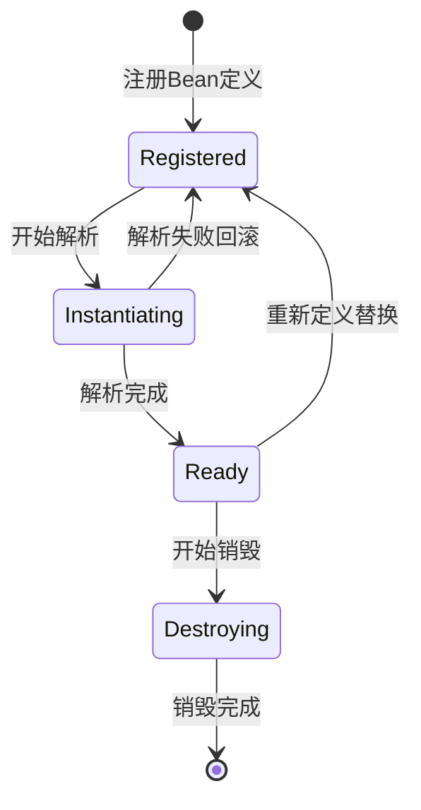

# 依赖注入

## 架构概述

Photon框架的依赖注入系统是一个受Spring Framework和Laravel Container启发的现代化IoC容器，实现了编译期注解扫描和运行时零反射的高性能依赖注入。该系统通过BeanDefinition元数据驱动，支持多种作用域管理、自动装配机制和循环依赖检测。

### 核心组件架构


图：Photon依赖注入系统核心架构（类型：技术组件架构图）

### 设计理念

Photon DI系统遵循以下核心设计原则：

1. **编译期优化**：通过comptime $for实现编译期注解扫描，消除运行时反射开销[^1]
2. **类型安全**：基于V语言的类型系统，提供编译期类型检查
3. **线程安全**：使用sync.RwMutex和per-bean锁定机制确保并发安全[^2]
4. **可扩展性**：支持FactoryBean、ServiceLocator等多种扩展模式
5. **生命周期感知**：完整的Bean生命周期管理和事件通知机制

## Bean定义系统

### BeanDefinition结构

BeanDefinition是Photon DI系统的核心数据结构，包含了Bean的完整元数据：

```v
pub struct BeanDefinition {
pub:
    type_name string // 结构体名称
pub mut:
    scope          Scope = .singleton
    is_lazy        bool
    dependencies   []Dependency
    qualifier      string
    init_method    string
    destroy_method string
    tags           []string
    order_         int
    state          BeanState = .registered
    depends_on     []string
    is_primary     bool
    parent_name    string
    // 增强型DI字段
    interfaces            []string
    method_injections     []MethodInjection
    collection_injections []CollectionInjection
    lookup_injections     []LookupInjection
    conditions            []&Condition
}
```

### 作用域管理

Photon支持三种Bean作用域，每种作用域都有不同的生命周期特征：


图：Bean作用域生命周期状态机（类型：技术状态管理架构图）

#### Singleton作用域
- **特征**：每个容器只创建一个实例
- **适用场景**：无状态服务、配置对象、数据源连接
- **线程安全**：通过per-bean锁定机制确保并发安全[^3]

#### Prototype作用域
- **特征**：每次注入都创建新实例
- **适用场景**：有状态对象、命令对象、临时计算对象
- **性能考虑**：无缓存开销，但需要频繁实例化

#### Request作用域
- **特征**：每个HTTP请求创建一个实例
- **适用场景**：请求上下文、用户会话数据
- **集成要求**：需要Web模块支持

### 依赖描述

Dependency结构描述了Bean之间的依赖关系：

```v
pub struct Dependency {
pub:
    field_name  string // V结构体字段名
    type_name   string // 要解析的完全限定类型名
    qualifier   string // @[qualifier('name')]限定符
    is_required bool = true // 是否必需依赖
}
```

支持可选依赖（is_required=false），当依赖不存在时跳过注入，这与Spring的@Autowired(required=false)语义一致。

## 自动装配机制

### 编译期注解扫描

Photon在编译期通过comptime $for扫描所有标记了注解的结构体，生成BeanDefinition并注册到容器：

```v
// 编译期扫描伪代码
$for file in sources {
    $if file.has_component_annotations() {
        bean_def := generate_bean_definition(file)
        container.register(bean_def)
    }
}
```

支持的注解包括：
- `@[component]` / `@[service]` / `@[repository]` / `@[controller]`：标记Bean
- `@[autowired]`：标记自动装配字段
- `@[scope('singleton'|'prototype'|'request')]`：指定作用域
- `@[lazy]`：延迟初始化
- `@[qualifier('name')]`：限定符注解
- `@[post_construct]` / `@[pre_destroy]`：生命周期回调
- `@[primary]`：主要Bean标记

### 运行时Bean解析

Bean解析过程采用双重检查锁定模式，确保线程安全的同时优化性能：


图：Bean解析流程时序图（类型：技术工作流程序列图）

### 循环依赖处理

Photon通过状态机制检测循环依赖：

1. **状态跟踪**：Bean在解析过程中被标记为`instantiating`状态
2. **检测机制**：如果解析过程中再次遇到`instantiating`状态的Bean，抛出循环依赖异常
3. **拓扑排序**：注册时使用Kahn算法进行拓扑排序，提前检测循环依赖[^4]

```v
// 循环依赖检测核心逻辑
if inst.state == .instantiating {
    return error('circular dependency detected for bean "${resolved_name}"')
}
```

## 限定符注解系统

### 限定符机制

当同一类型存在多个Bean时，使用限定符进行精确匹配：

```v
// 定义多个缓存实现
@[component]
@[qualifier('redis')]
pub struct RedisCache {}

@[component]
@[qualifier('memory')]
pub struct MemoryCache {}

// 使用限定符注入
@[component]
pub struct UserService {
    @[autowired]
    @[qualifier('redis')]
    cache &CacheService
}
```

### 主要Bean支持

使用`@[primary]`注解标记主要Bean，当存在多个候选者时优先选择：

```v
pub fn (mut c Container) resolve_primary() !voidptr {
    // 查找标记为is_primary的Bean
    for name, def in c.definitions {
        if def.is_primary {
            return c.resolve(name)
        }
    }
    return error('no @[primary] bean found')
}
```

## 工厂Bean模式

### FactoryBean接口

FactoryBean提供了一种委托对象创建的机制，适用于需要复杂初始化逻辑的对象：

```v
pub interface FactoryBean {
    create() !voidptr                    // 创建Bean实例
    bean_type() string                   // 返回产出类型
    is_singleton() bool                  // 是否单例
}
```

### 工厂注册表

FactoryBeanRegistry管理所有工厂Bean及其产出：

```v
pub struct FactoryBeanRegistry {
pub mut:
    factories       map[string]FactoryBeanDefinition
    factory_outputs map[string]voidptr  // 单例缓存
mut:
    mu sync.RwMutex
}
```

### 使用场景

FactoryBean特别适用于：
- 数据库连接池创建
- 复杂配置对象构建
- 第三方服务客户端初始化
- 需要运行时参数的对象创建

```v
@[component]
pub struct DatabaseConnectionFactory {
    @[autowired]
    config &DatabaseConfig
    
    pub fn (f &DatabaseConnectionFactory) create() !voidptr {
        return unsafe { new_connection_pool(f.config) }
    }
    
    pub fn (f &DatabaseConnectionFactory) bean_type() string {
        return 'ConnectionPool'
    }
    
    pub fn (f &DatabaseConnectionFactory) is_singleton() bool {
        return true
    }
}
```

## 增强型DI功能

### 方法注入

支持在方法上进行依赖注入，类似于Spring的setter注入：

```v
pub struct MethodInjection {
pub:
    method_name string       // 要调用的方法名
    params      []Dependency // 参数依赖列表
}
```

### 集合注入

可以注入所有实现特定接口的Bean：

```v
pub struct CollectionInjection {
pub:
    field_name     string // 字段名
    interface_name string // 接口类型
    tag            string // 可选标签过滤
}
```

使用示例：
```v
@[component]
pub struct EventManager {
    @[autowired]
    handlers &[]EventHandler  // 注入所有EventHandler实现
}
```

### 延迟提供者

DeferredProvider提供懒加载机制，Bean在首次访问时才被解析：

```v
pub struct DeferredProvider {
pub mut:
    type_name string
    mutable   bool          // 是否每次返回新实例
    container &Container
    resolved  bool
    instance  voidptr
mut:
    mu sync.RwMutex
}
```

线程安全的延迟解析实现：
```v
pub fn (mut dp DeferredProvider) get() !voidptr {
    // 快速路径：读取缓存状态
    dp.mu.rlock()
    resolved := dp.resolved
    mutable := dp.mutable
    cached := dp.instance
    dp.mu.runlock()
    
    if resolved && !mutable {
        return cached
    }
    
    // 慢速路径：写锁双重检查
    instance := dp.container.resolve(dp.type_name)!
    
    if !mutable {
        dp.mu.@lock()
        if !dp.resolved {
            dp.instance = instance
            dp.resolved = true
        }
        dp.mu.unlock()
    }
    
    return instance
}
```

## Bean类型索引

### 索引结构

BeanTypeIndex提供高效的基于类型的Bean查找：

```v
pub struct BeanTypeIndex {
pub mut:
    type_to_beans map[string][]string  // 接口名 -> Bean名列表
    tag_to_beans  map[string][]string  // 标签名 -> Bean名列表
mut:
    mu sync.RwMutex
}
```

### 类型查找

支持多种查找策略：
1. **接口查找**：查找实现特定接口的所有Bean
2. **标签查找**：查找具有特定标签的所有Bean
3. **组合查找**：接口+标签的精确匹配

```v
pub fn (mut c Container) resolve_all_by_interface(interface_name string) ![]voidptr {
    names := c.beans_for_interface(interface_name)
    mut instances := []voidptr{}
    for name in names {
        instance := c.resolve(name) or { continue }
        instances << instance
    }
    return instances
}
```

## 服务定位器模式

### ServiceLocator设计

ServiceLocator提供Laravel风格的便捷访问接口：

```v
pub struct ServiceLocator {
pub mut:
    context &ApplicationContext
    mu      sync.RwMutex
    cache   map[string]voidptr  // 解析缓存
}
```

### 便捷函数

提供模块级别的便捷函数，类似Laravel的app()助手：

```v
// Laravel风格的服务解析
pub fn service_from(mut ctx ApplicationContext, type_name string) !voidptr {
    return ctx.resolve(type_name)
}

// 限定符解析
pub fn qualified_service_from(mut ctx ApplicationContext, qualifier string) !voidptr {
    return ctx.resolve_by_qualifier(qualifier)
}
```

### 绑定注册表

BindingRegistry支持Laravel风格的服务绑定：

```v
pub struct BindingRegistry {
pub mut:
    bindings  map[string]ServiceBinding
    instances map[string]voidptr
mut:
    mu sync.RwMutex
}
```

支持工厂绑定和实例绑定：
```v
// 工厂绑定
registry.bind('CacheService', fn() !voidptr {
    return new_redis_cache()
}, true)  // 单例

// 实例绑定
registry.bind_instance('ConfigService', config_instance)
```

## 线程安全设计

### 锁策略

Photon DI系统采用分层锁策略确保线程安全：

1. **容器级锁**：sync.RwMutex保护所有映射表操作
2. **Bean级锁**：per-bean锁防止单例创建竞态
3. **索引锁**：类型索引的独立锁保护

### 双重检查锁定

在单例创建中使用双重检查锁定模式：

```v
// 快速路径：读锁检查缓存
r.mu.rlock()
if cached := r.factory_outputs[output_type_name] {
    r.mu.runlock()
    return cached
}
r.mu.runlock()

// 慢速路径：写锁创建实例
r.mu.@lock()
// 双重检查
if cached := r.factory_outputs[output_type_name] {
    r.mu.unlock()
    return cached
}
// 创建并缓存实例
instance := def.factory.create()!
r.factory_outputs[output_type_name] = instance
r.mu.unlock()
```

### 内存可见性

在弱内存架构上确保内存可见性，所有状态读取都在锁保护下进行[^5]。

## 生命周期管理

### Bean状态机

Bean在容器中有四种状态：


图：Bean生命周期状态转换（类型：技术状态管理架构图）

### 生命周期回调

支持初始化和销毁回调：

```v
// 初始化回调类型
pub type InitCallback = fn (instance voidptr) !

// 销毁回调类型  
pub type DestroyCallback = fn (instance voidptr) !
```

### 事件发布

Bean生命周期事件通过EventBus发布：
- `bean.created`：Bean创建完成
- `bean.destroyed`：Bean销毁完成

```v
// 发布Bean创建事件
if !isnil(c.event_bus) {
    mut event := new_event(event_bean_created, type_name)
    bus.dispatch(event)
}
```

## 性能优化策略

### 编译期优化

1. **零反射**：编译期生成所有解析代码
2. **类型推导**：编译期确定依赖关系
3. **代码生成**：避免运行时类型检查

### 运行时优化

1. **单例缓存**：避免重复实例化
2. **类型索引**：O(1)接口查找
3. **分层锁定**：减少锁竞争
4. **延迟初始化**：按需加载Bean

### 内存管理

1. **及时清理**：销毁时清理所有引用
2. **缓存回收**：支持容器冻结和重启
3. **弱引用**：避免循环引用导致的内存泄漏

## 参考文献

[^1]: [编译期注解扫描实现](src/core/core.v#L5-L6)
[^2]: [线程安全锁机制设计](src/core/core.v#L382-L386)
[^3]: [Per-bean锁定实现](src/core/core.v#L765-L788)
[^4]: [循环依赖拓扑排序算法](src/core/core.v#L1418-L1478)
[^5]: [内存可见性保护机制](src/core/di_enhanced.v#L104-L109)