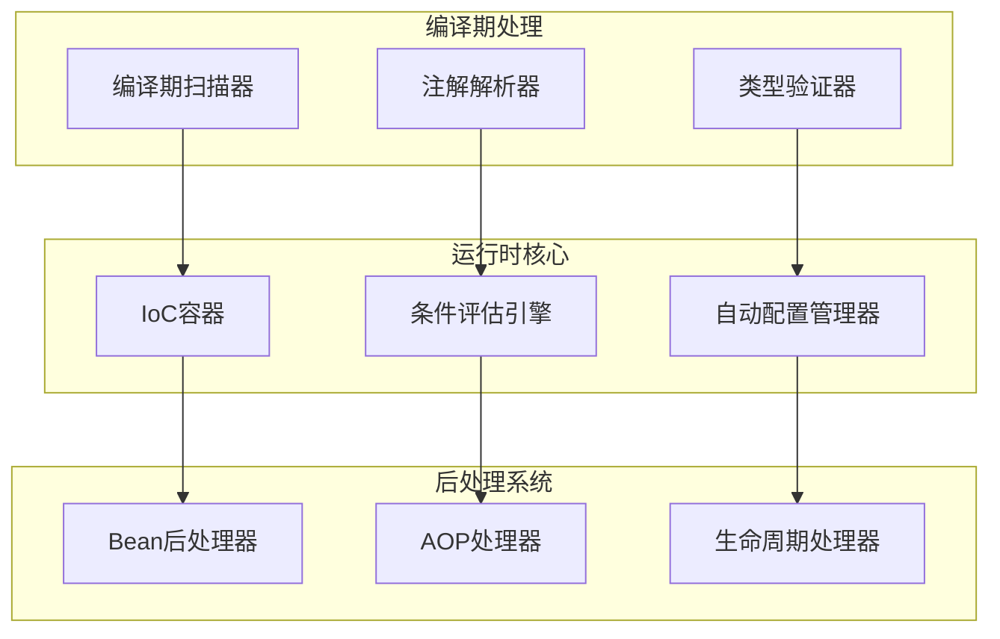
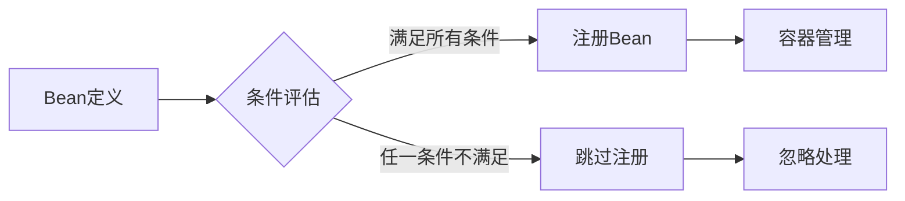
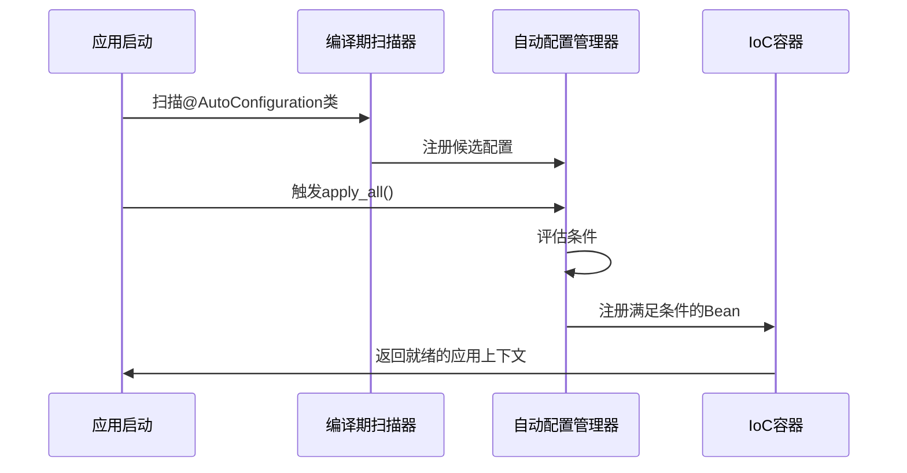

# 注解系统

## 架构概述

Photon框架的注解系统是一个基于V语言编译期元编程能力的依赖注入和配置管理框架，实现了零运行时反射的高性能注解驱动编程模型。该系统借鉴了Spring Framework和Spring Boot的设计理念，但充分利用了V语言的comptime特性，在编译期完成大部分注解处理工作[^1]。

### 核心设计原则

注解系统遵循以下核心设计原则：

1. **编译期优先**：所有注解扫描和验证在编译期完成，避免运行时反射开销
2. **类型安全**：利用V语言的类型系统确保注解使用的正确性
3. **条件装配**：支持基于环境、配置和依赖条件的智能Bean注册
4. **可扩展性**：提供清晰的扩展点支持自定义注解和处理器
5. **Spring兼容**：提供与Spring Framework相似的注解语义，降低学习成本

### 系统架构

注解系统由四个核心模块组成：



图：注解系统核心架构（类型：流程图）

## 编译期注解扫描

### 扫描机制原理

Photon的编译期注解扫描基于V语言的`$for`循环和`$if`条件编译，实现了对结构体和方法注解的零成本抽象[^2]。扫描器在编译期遍历类型的字段和方法，提取注解信息并生成相应的元数据。

```v
// 扫描结构体注解的核心实现
pub fn extract_auto_configuration[T]() bool {
    mut found := false
    $for attr in T.attributes {
        if attr.name == attr_auto_configuration {
            found = true
        }
    }
    return found
}
```

### 支持的注解类型

系统支持丰富的注解类型，涵盖了现代应用开发的主要场景：

#### 组件注解
- `@[component]`：通用组件标记
- `@[service]`：业务服务层组件
- `@[repository]`：数据访问层组件
- `@[controller]`：Web控制器组件
- `@[configuration]`：配置类标记

#### 依赖注入注解
- `@[autowired]`：自动装配依赖
- `@[qualifier('name')]`：限定符，解决多Bean冲突
- `@[value('config.key')]`：配置值注入
- `@[required]`：标记必需依赖

#### 生命周期注解
- `@[post_construct]`：初始化后回调
- `@[pre_destroy]`：销毁前回调
- `@[lazy]`：延迟初始化

#### 作用域注解
- `@[scope('singleton')]`：单例作用域
- `@[scope('prototype')]`：原型作用域
- `@[scope('request')]`：请求作用域

### 扫描结果数据结构

编译期扫描的结果被封装在结构化的数据模型中：

```v
pub struct ScannedBean {
pub:
    type_name      string
    component_type ComponentType
    scope          Scope = .singleton
    is_lazy        bool
    qualifier      string
    dependencies   []Dependency
    init_method    string
    destroy_method string
    value_bindings []ValueBinding
    conditions     []string
}
```

### 方法级注解扫描

除了结构体级注解，系统还支持方法级注解扫描，主要用于`@Bean`方法和AOP注解：

```v
pub fn extract_scheduled_methods[T]() []ScheduledTaskInfo {
    mut tasks := []ScheduledTaskInfo{}
    $for method in T.methods {
        cron_expr := extract_scheduled_expr(method.attrs)
        if cron_expr.len > 0 {
            tasks << ScheduledTaskInfo{
                method_name: method.name
                cron_expr:   cron_expr
            }
        }
    }
    return tasks
}
```

## 条件装配系统

### 条件评估机制

条件装配系统实现了Spring Boot风格的智能Bean注册，支持基于多种条件的动态装配决策[^3]。条件评估在Bean注册时进行，确保只有满足条件的Bean才会被注册到容器中。



图：条件装配决策流程（类型：流程图）

### 内置条件类型

系统提供了丰富的内置条件类型：

#### 环境条件
```v
// 基于配置文件的条件
@[conditional_on_profile('prod')]
struct ProductionConfig {
    debug bool = false
}

// 基于配置属性的条件
@[conditional_on_property('cache.enabled', 'true')]
struct CacheService {
    driver string
}
```

#### Bean依赖条件
```v
// 当指定Bean存在时才注册
@[conditional_on_bean('DataSource')]
struct JpaService {
    // ...
}

// 当指定Bean不存在时才注册
@[conditional_on_missing_bean('CacheManager')]
struct InMemoryCache {
    // ...
}
```

#### 类路径条件
```v
// 当指定类存在时才注册
@[conditional_on_class('redis.RedisClient')]
struct RedisAutoConfig {
    // ...
}

// 当指定类不存在时才注册
@[conditional_on_missing_class('org.hibernate.SessionFactory')]
struct SimpleJdbcConfig {
    // ...
}
```

#### 表达式条件
```v
// 基于SpEL表达式的条件
@[conditional_on_expression('app.debug == true && cache.enabled == true')]
struct DebugCacheService {
    // ...
}
```

### 条件解析实现

条件解析器将注解字符串转换为可执行的条件对象：

```v
pub fn parse_conditions(attrs []string, mut ctx ConditionContext) []&Condition {
    mut conditions := []&Condition{}
    
    for attr in attrs {
        if attr.starts_with('conditional_on_profile:') {
            profile := extract_conditional_arg(attr)
            conditions << &Condition(&OnProfileCondition{
                profile: profile
            })
        } else if attr.starts_with('conditional_on_property:') {
            // 解析属性条件
            arg := extract_conditional_arg(attr)
            parts := arg.split_nth(',', 2)
            if parts.len == 2 {
                key := parts[0].trim(' ').trim("'").trim('"')
                having_value := parts[1].trim(' ').trim("'").trim('"')
                conditions << &Condition(&OnPropertyCondition{
                    key:          key
                    having_value: having_value
                })
            }
        }
        // 其他条件类型解析...
    }
    
    return conditions
}
```

### 条件评估策略

条件评估采用AND语义，即所有条件都必须满足才会注册Bean。系统也提供了OR语义的评估方法：

```v
pub fn evaluate_conditions(conditions []&Condition, mut ctx ConditionContext) bool {
    for c in conditions {
        if !c.evaluate(mut ctx) {
            return false
        }
    }
    return true
}

pub fn any_condition_matches(conditions []&Condition, mut ctx ConditionContext) bool {
    for c in conditions {
        if c.evaluate(mut ctx) {
            return true
        }
    }
    return false
}
```

## 自动配置机制

### 自动配置原理

自动配置机制实现了Spring Boot风格的智能Bean注册，通过`@AutoConfiguration`注解标记配置类，并根据条件自动装配相关组件[^4]。系统采用两阶段模型：声明阶段和评估阶段。



图：自动配置执行序列（类型：序列图）

### @AutoConfiguration注解

`@AutoConfiguration`注解标记一个类为自动配置源：

```v
@[auto_configuration]
@[conditional_on_class('redis.RedisClient')]
@[conditional_on_property('spring.redis.host')]
pub struct RedisAutoConfig {
    host string
    port int = 6379
}

pub fn (config RedisAutoConfig) configure(mut ctx ApplicationContext) ! {
    // 配置Redis连接
    redis_client := redis.connect(config.host, config.port)!
    ctx.register_instance('redisClient', redis_client)
}
```

### @Configuration + @Bean模式

系统还支持传统的`@Configuration`类配合`@Bean`方法的模式：

```v
@[configuration]
pub struct DatabaseConfig {
    // ...
}

@[bean('dataSource')]
@[scope('singleton')]
pub fn (config DatabaseConfig) data_source() DataSource {
    return DataSource{
        url:      'jdbc:mysql://localhost:3306/mydb'
        username: 'user'
        password: 'pass'
    }
}

@[bean]
@[depends_on('dataSource')]
pub fn (config DatabaseConfig) transaction_manager(ds DataSource) TransactionManager {
    return TransactionManager{ data_source: ds }
}
```

### 编译期注册机制

由于V语言的限制，自动配置采用编译期注册模式：

```v
pub fn (mut m AutoConfigurationManager) register_from_comptime[T]() ! {
    // 编译期检查：T必须携带@AutoConfiguration注解
    if !extract_auto_configuration[T]() {
        return error('type "${T.name}" is not annotated with @[auto_configuration]')
    }
    
    // 提取条件注解
    attrs := extract_auto_configuration_attrs[T]()
    mut cond_ctx := new_condition_context()
    conditions := parse_conditions(attrs, mut cond_ctx)
    
    candidate := AutoConfigurationCandidate{
        type_name:  T.name
        config:     unsafe { nil }
        conditions: conditions
        order_:     0
    }
    m.add_candidate(candidate)
}
```

### Starter模式支持

系统支持Spring Boot风格的Starter模式，通过清单文件声明自动配置类：

```v
// auto_configuration_imports.v
photon.db.DbAutoConfig
photon.db.RedisAutoConfig
photon.cache.CacheAutoConfig
```

```v
pub fn (mut m AutoConfigurationManager) load_imports_from_manifest(path string) !int {
    if !os.exists(path) {
        return error('manifest file not found: ${path}')
    }
    
    content := os.read_file(path)!
    class_names := parse_manifest_content(content)
    for class_name in class_names {
        m.register_imported(class_name)
    }
    return class_names.len
}
```

## 后处理器系统

### BeanPostProcessor架构

后处理器系统提供了Bean实例化过程中的扩展点，支持在Bean初始化前后执行自定义逻辑[^5]。这是AOP功能的基础设施。

```v
pub interface BeanPostProcessor {
    post_process_before_initialization(bean_name string, bean voidptr) voidptr
    post_process_after_initialization(bean_name string, bean voidptr) voidptr
}
```

### 内置后处理器

系统提供了多个内置后处理器：

#### AutowiredAnnotationPostProcessor
处理`@Autowired`注解，实现自动依赖注入：

```v
pub struct AutowiredAnnotationPostProcessor {
pub:
    container &Container = unsafe { nil }
}

pub fn (pp AutowiredAnnotationPostProcessor) post_process_before_initialization(
    bean_name string, bean voidptr) voidptr {
    // 实际的自动装配由编译期生成的代码完成
    // 此处作为标记和运行时验证
    return bean
}
```

#### ValueAnnotationPostProcessor
处理`@Value`注解，实现配置值注入：

```v
pub fn (mut pp ValueAnnotationPostProcessor) inject_values[T](mut bean T, mut env &Environment) ! {
    $for field in T.fields {
        key := extract_value_expr(field.attrs)
        if key.len > 0 {
            if !env.has_property(key) {
                return error('value injection failed: key "${key}" not found')
            }
            raw_value := env.get_property(key)
            
            $if field.typ is string {
                bean.$(field.name) = raw_value
            } $else $if field.typ is int {
                bean.$(field.name) = raw_value.int()
            } $else $if field.typ is bool {
                bean.$(field.name) = raw_value.to_lower() == 'true'
            }
            // 其他类型处理...
        }
    }
}
```

### AOP支持

由于V语言不支持运行时方法拦截，系统采用编译期检测+包装器函数的方式实现AOP功能：

```v
// AOP方法检测
pub fn detect_aop_methods[T]() []AopMethodDescriptor {
    mut descriptors := []AopMethodDescriptor{}
    $for method in T.methods {
        mut has_tx := false
        mut has_cache := false
        for attr in method.attrs {
            if attr == 'transactional' || attr.starts_with('transactional:') {
                has_tx = true
            }
            if attr == 'cacheable' || attr.starts_with('cacheable:') {
                has_cache = true
            }
        }
        if has_tx || has_cache {
            descriptors << AopMethodDescriptor{
                name:              method.name
                has_transactional: has_tx
                has_cacheable:     has_cache
            }
        }
    }
    return descriptors
}
```

#### 事务包装器
```v
pub fn transactional_wrap[T](mut tm T, f fn () !) ! {
    tm.begin()!
    f() or {
        tm.rollback() or {}
        return err
    }
    tm.commit()!
}
```

#### 缓存包装器
```v
pub fn cacheable_wrap[T](mut cache T, key string, ttl_seconds int, f fn () !string) !string {
    cached := cache.get(key) or {
        result := f()!
        cache.set(key, result, ttl_seconds) or {}
        return result
    }
    return cached
}
```

### 使用示例

```v
@[service]
pub struct UserService {
pub mut:
    tm &TransactionManager @[autowired]
    cache &CacheManager @[autowired]
}

@[transactional]
pub fn (mut s UserService) transfer(from int, to int, amount f64) ! {
    core.transactional_wrap(mut s.tm, fn () ! {
        // 实际的转账逻辑
        s.update_balance(from, -amount)!
        s.update_balance(to, amount)!
    })!
}

@[cacheable]
pub fn (mut s UserService) get_user(id int) !string {
    return core.cacheable_wrap(mut s.cache, 'user:${id}', 300, fn () !string {
        // 从数据库查询用户
        return s.query_user_from_db(id)!
    })!
}
```

## 自定义注解扩展

### 扩展机制

Photon框架提供了清晰的扩展点，支持开发者定义自定义注解和处理器。扩展主要通过以下方式实现：

1. **定义注解常量**：在scanner.v中添加新的注解常量
2. **实现解析逻辑**：添加注解解析函数
3. **创建处理器**：实现相应的后处理器
4. **注册处理器**：将处理器注册到应用上下文

### 自定义注解示例

#### 1. 定义注解常量

```v
// 在scanner.v中添加
pub const attr_retryable = 'retryable'
pub const attr_circuit_breaker = 'circuit_breaker'
pub const attr_rate_limiter = 'rate_limiter'
```

#### 2. 实现解析函数

```v
// 解析重试配置
pub fn extract_retry_config(attrs []string) RetryConfig {
    for attr in attrs {
        if attr.starts_with('retryable:') || attr.starts_with('retryable(') {
            mut val := attr
            if val.starts_with('retryable:') {
                val = val['retryable:'.len..]
            } else if val.starts_with('retryable(') {
                val = val['retryable('.len..]
                if val.ends_with(')') {
                    val = val[..val.len - 1]
                }
            }
            // 解析重试次数和间隔
            parts := val.split(',')
            if parts.len >= 2 {
                return RetryConfig{
                    max_attempts: parts[0].trim_space().int()
                    delay_ms:     parts[1].trim_space().int()
                }
            }
        }
    }
    return RetryConfig{max_attempts: 3, delay_ms: 1000}
}
```

#### 3. 创建后处理器

```v
pub struct RetryablePostProcessor {
pub:
    retry_manager &RetryManager = unsafe { nil }
}

pub fn (pp RetryablePostProcessor) post_process_before_initialization(
    bean_name string, bean voidptr) voidptr {
    // 检测@Retryable注解并注册重试配置
    return bean
}

pub fn (mut pp RetryablePostProcessor) process_retryable[T](mut bean T) ! {
    $for method in T.methods {
        if has_method_attr(method.attrs, 'retryable') {
            config := extract_retry_config(method.attrs)
            pp.retry_manager.register_retry_method(T.name, method.name, config)
        }
    }
}
```

#### 4. 注册处理器

```v
// 在应用启动时注册
mut app := core.new_application_context()
app.add_post_processor(&RetryablePostProcessor{
    retry_manager: retry_manager
})
```

### 条件注解扩展

可以扩展条件系统支持自定义条件：

```v
// 自定义条件
pub struct OnFeatureFlagCondition {
pub:
    feature_name string
}

pub fn (c OnFeatureFlagCondition) evaluate(mut ctx ConditionContext) bool {
    // 从配置或远程服务获取特性开关状态
    flag_value := ctx.properties['feature.${c.feature_name}'] or { 'false' }
    return flag_value == 'true'
}

// 注册条件解析
pub fn parse_custom_conditions(attrs []string, mut ctx ConditionContext) []&Condition {
    mut conditions := []&Condition{}
    
    for attr in attrs {
        if attr.starts_with('conditional_on_feature:') {
            feature := extract_conditional_arg(attr)
            conditions << &Condition(&OnFeatureFlagCondition{
                feature_name: feature
            })
        }
    }
    
    return conditions
}
```

## 实际应用示例

### 完整的Web应用配置

以下是一个完整的Web应用配置示例，展示了注解系统的综合使用：

```v
// 主配置类
@[configuration]
pub struct AppConfig {
    // 配置属性
}

@[bean]
@[conditional_on_property('app.database.enabled', 'true')]
pub fn (config AppConfig) data_source() DataSource {
    return DataSource{
        url:      'jdbc:mysql://localhost:3306/myapp'
        username: 'app_user'
        password: 'app_pass'
        max_pool_size: 20
    }
}

@[bean]
@[depends_on('data_source')]
pub fn (config AppConfig) user_repository(ds DataSource) UserRepository {
    return UserRepository{ data_source: ds }
}

@[bean]
@[depends_on('user_repository')]
pub fn (config AppConfig) user_service(repo UserRepository) UserService {
    return UserService{ repository: repo }
}
```

### 服务层实现

```v
@[service]
pub struct UserService {
pub mut:
    repository UserRepository @[autowired]
    cache     CacheManager   @[autowired]
    logger    Logger         @[autowired]
    tm        TransactionManager @[autowired]
}

@[cacheable('users', 300)]
pub fn (mut s UserService) get_user(id int) !User {
    return core.cacheable_wrap(mut s.cache, 'user:${id}', 300, fn () !User {
        s.logger.info('Querying user ${id} from database')
        return s.repository.find_by_id(id)!
    })!
}

@[transactional]
pub fn (mut s UserService) create_user(user User) !User {
    return core.transactional_wrap(mut s.tm, fn () !User {
        // 验证用户数据
        s.validate_user(user)!
        
        // 保存到数据库
        created_user := s.repository.save(user)!
        
        // 清除缓存
        s.cache.delete_pattern('users:*') or {}
        
        // 发布事件
        s.event_bus.publish(UserCreatedEvent{user: created_user}) or {}
        
        return created_user
    })!
}

@[retryable(max_attempts=3, delay_ms=1000)]
pub fn (mut s UserService) send_welcome_email(user_id int) ! {
    user := s.get_user(user_id)!
    // 发送邮件逻辑
    s.email_service.send_welcome(user.email)!
}
```

### 控制器层实现

```v
@[controller]
@[scope('request')]
pub struct UserController {
pub mut:
    user_service UserService @[autowired]
    validator    Validator   @[autowired]
}

@[post_construct]
pub fn (mut c UserController) init() {
    // 初始化逻辑
}

@['/api/users'; get]
pub fn (mut c UserController) list_users(mut ctx Context) veb.Result {
    page := ctx.query['page'] or { '1' }.int()
    size := ctx.query['size'] or { '10' }.int()
    
    users := c.user_service.list(page, size)!
    return ctx.json(users)
}

@['/api/users'; post]
pub fn (mut c UserController) create_user(mut ctx Context) veb.Result {
    mut user := ctx.json_decode[User]()!
    
    // 验证输入
    if err := c.validator.validate(user) {
        return ctx.bad_request(err)
    }
    
    created_user := c.user_service.create_user(user)!
    return ctx.created(created_user)
}

@['/api/users/{id}'; get]
pub fn (mut c UserController) get_user(id int, mut ctx Context) veb.Result {
    user := c.user_service.get_user(id)!
    return ctx.json(user)
}
```

### 自动配置类

```v
@[auto_configuration]
@[conditional_on_class('redis.RedisClient')]
@[conditional_on_property('spring.redis.host')]
pub struct RedisAutoConfig {
    host string @[value('spring.redis.host')]
    port int @[value('spring.redis.port')]
}

pub fn (config RedisAutoConfig) configure(mut ctx ApplicationContext) ! {
    // 创建Redis客户端
    redis_client := redis.connect(config.host, config.port)!
    
    // 注册Redis客户端
    ctx.register_instance('redisClient', redis_client)
    
    // 创建缓存管理器
    cache_manager := RedisCacheManager{ client: redis_client }
    ctx.register_instance('cacheManager', cache_manager)
}
```

## 最佳实践

### 注解使用原则

1. **优先使用编译期注解**：尽可能使用编译期能处理的注解，避免运行时开销
2. **合理使用条件装配**：通过条件装配实现环境相关的配置，避免硬编码
3. **保持注解简洁**：注解应该表达声明式意图，复杂的逻辑放在代码中
4. **避免注解滥用**：不要为了使用注解而使用注解，保持代码的可读性

### 性能优化建议

1. **延迟初始化**：对于非关键组件使用`@Lazy`注解延迟初始化
2. **作用域选择**：根据组件特性选择合适的作用域，避免不必要的单例
3. **条件优化**：将最可能失败的条件放在前面，提高条件评估效率
4. **缓存策略**：合理使用缓存注解，避免缓存雪崩和缓存穿透

### 错误处理

```v
@[service]
pub struct RobustService {
pub mut:
    logger Logger @[autowired]
}

pub fn (mut s RobustService) safe_operation() !string {
    return s.execute_with_fallback(fn () !string {
        // 主要逻辑
        return s.primary_operation()
    }, fn () !string {
        // 降级逻辑
        s.logger.warn('Primary operation failed, using fallback')
        return s.fallback_operation()
    })!
}

pub fn (mut s RobustService) execute_with_fallback(
    primary fn () !string, 
    fallback fn () !string) !string {
    return primary() or {
        return fallback()
    }
}
```

### 测试策略

```v
// 测试配置
@[configuration]
pub struct TestConfig {
}

@[bean('testDataSource')
pub fn (config TestConfig) test_data_source() DataSource {
    return DataSource{
        url: 'jdbc:h2:mem:testdb'
        username: 'sa'
        password: ''
    }
}

// 测试类
fn test_user_service_with_mock() {
    mut container := core.new_container()
    
    // 注册测试依赖
    mock_repo := &MockUserRepository{}
    container.register_instance('userRepository', mock_repo)
    
    // 注册服务
    user_service := UserService{repository: mock_repo}
    container.register_instance('userService', user_service)
    
    // 执行测试
    service := container.resolve('userService')!
    result := service.get_user(1)!
    
    assert result.id == 1
}
```

### 监控和诊断

```v
@[component]
pub struct AnnotationMonitor {
pub mut:
    metrics MetricsCollector @[autowired]
}

pub fn (mut m AnnotationMonitor) scan_annotations() ! {
    mut report := AnnotationReport{
        total_beans: 0,
        by_type: map[string]int{}
    }
    
    // 扫描所有Bean的注解使用情况
    for bean_name in m.container.list_bean_names() {
        bean_def := m.container.get_bean_definition(bean_name)!
        report.total_beans++
        
        // 统计注解类型
        for attr in bean_def.annotations {
            report.by_type[attr] = report.by_type[attr] + 1
        }
    }
    
    m.metrics.record_annotation_usage(report)
}
```

## 参考文献

[^1]: [编译期注解扫描器实现](src/core/scanner.v#L1-L200)
[^2]: [条件装配系统核心逻辑](src/core/condition.v#L1-L150)
[^3]: [自动配置管理器实现](src/core/auto_configuration.v#L1-200)
[^4]: [Bean后处理器系统](src/core/post_processor.v#L1-200)
[^5]: [注解检测和AOP支持](src/core/post_processor.v#L100-200)