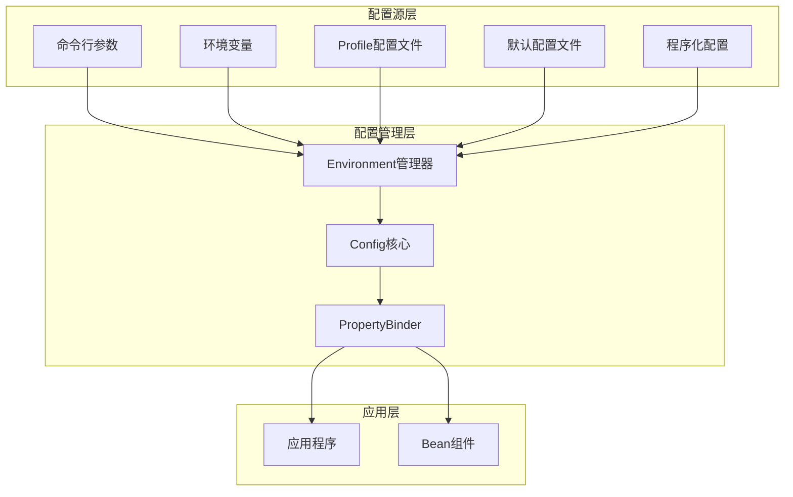
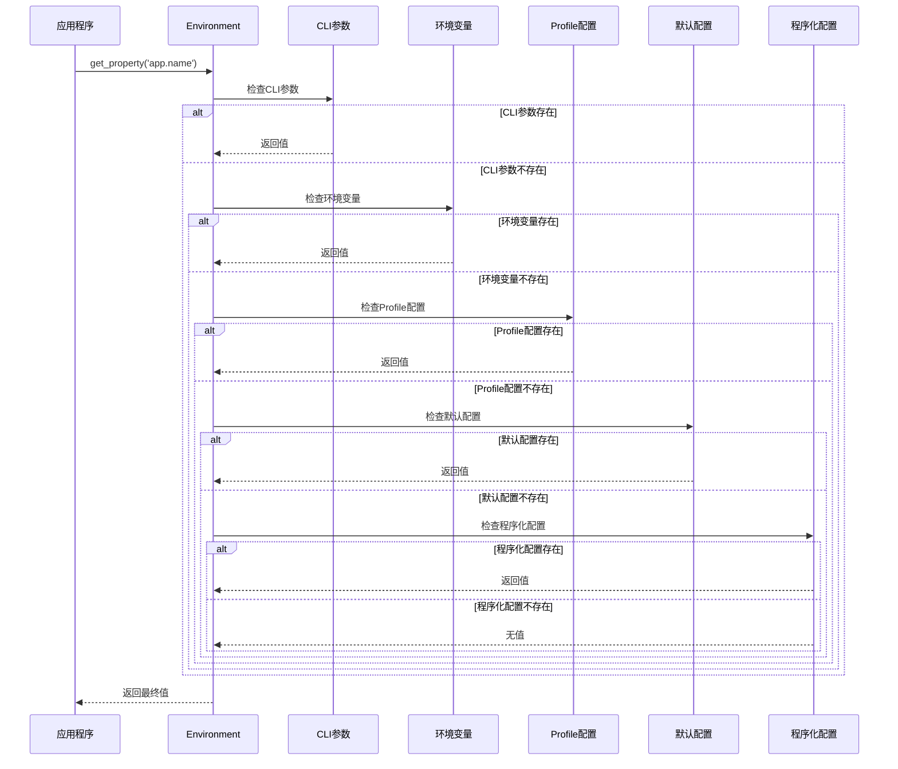

# 配置管理

## 架构概述

Photon框架的配置管理系统是一个受Spring Boot启发的多源配置管理解决方案，提供了统一的配置抽象、类型安全的属性绑定和灵活的环境切换能力。该系统采用分层架构设计，通过PropertySource抽象实现了配置源的解耦，支持从文件、环境变量、命令行参数等多种来源加载配置，并通过优先级链机制确保配置的正确覆盖顺序[^1]。

配置管理系统的核心设计理念是"约定优于配置"与"灵活性并重"。系统提供了合理的默认值和约定，同时允许开发者通过Profile、占位符、自定义配置源等方式进行精细化的配置管理。这种设计使得Photon框架既能够满足简单应用的快速开发需求，又能够支撑复杂企业级应用的配置管理要求[^2]。

### 核心设计原则

配置管理系统遵循以下核心设计原则：

1. **统一抽象**：通过Environment接口提供统一的配置访问入口，屏蔽底层配置源的复杂性
2. **优先级链**：建立明确的配置优先级顺序，确保配置覆盖的可预测性
3. **类型安全**：提供编译时类型检查的配置绑定机制，减少运行时错误
4. **环境感知**：通过Profile机制支持不同环境的配置切换
5. **扩展性**：通过PropertySource接口支持自定义配置源的扩展



图：Photon配置管理系统架构（类型：系统架构图）

## 核心组件

### Config核心管理器

Config是配置管理系统的基础组件，负责管理多个配置源并提供统一的配置访问接口。它采用简单的键值对模型存储配置，支持字符串、整数、布尔值和浮点数等基本类型的访问[^3]。

Config的核心职责包括：
- 配置源的注册和管理
- 配置属性的加载和合并
- 类型安全的配置访问
- 配置状态的跟踪

```v
pub struct Config {
pub mut:
    sources    []ConfigSource
    properties map[string]string
    profiles   []string
    loaded     bool
}
```

Config采用延迟加载策略，只有在显式调用`load()`方法时才会加载所有配置源。这种设计允许开发者在加载前进行必要的配置源注册和参数设置[^4]。

### Environment环境抽象

Environment是Spring Environment接口的Photon实现，提供了更高级的配置管理功能。它不仅包含Config的所有功能，还增加了Profile管理、占位符解析、属性源优先级等企业级特性[^5]。

Environment的核心特性包括：

1. **多级属性源管理**：支持CLI参数、环境变量、Profile配置、默认配置等多个层次的属性源
2. **Profile支持**：通过active_profiles和default_profiles管理不同环境的配置
3. **占位符解析**：支持`${key}`和`${key:default}`语法的动态配置解析
4. **类型安全访问**：提供get_property_int、get_property_bool等类型化访问方法
5. **线程安全**：使用RwMutex确保并发环境下的配置访问安全

```v
@[heap]
pub struct Environment {
pub mut:
    active_profiles  []string
    default_profiles []string
    properties       map[string]string
    sources          []&PropertySource
    active_profile string
    config_dir     string
mut:
    mu                        sync.RwMutex
    default_config_properties map[string]string
    profile_config_properties map[string]string
    cli_args                  map[string]string
}
```

Environment通过优先级链机制确保配置的正确覆盖顺序，最高优先级的配置源会覆盖较低优先级的同名配置[^6]。

### PropertySource配置源抽象

PropertySource是配置源的统一抽象接口，定义了配置源的基本行为。所有具体的配置源实现都需要实现这个接口，从而确保系统的可扩展性[^7]。

```v
pub interface ConfigSource {
    load() !map[string]string
    name() string
}

pub interface PropertySource {
    name() string
    load() !map[string]string
}
```

PropertySource接口的设计非常简洁，只包含两个核心方法：
- `name()`：返回配置源的名称，用于调试和日志记录
- `load()`：加载配置并返回键值对映射，可能抛出异常

这种简洁的设计使得添加新的配置源变得非常容易，开发者只需要实现这两个方法就可以集成自定义的配置源[^8]。

## 配置源机制

### 内置配置源实现

Photon框架提供了多种内置配置源实现，覆盖了常见的配置管理场景：

#### FileConfigSource文件配置源

FileConfigSource支持从文件系统加载配置，目前支持JSON和Properties两种格式。它会根据文件扩展名自动选择合适的解析器[^9]。

```v
pub fn (s FileConfigSource) load() !map[string]string {
    content := os.read_file(s.filepath)!
    mut result := map[string]string{}

    if s.filepath.ends_with('.json') {
        // JSON格式解析
        parsed := json.decode(map[string]string, content) or {
            return error('failed to parse JSON config: ${err}')
        }
        for key, val in parsed {
            result[key] = val
        }
    } else {
        // Properties格式解析
        lines := content.split_into_lines()
        for line in lines {
            trimmed := line.trim_space()
            if trimmed.len == 0 || trimmed.starts_with('#') || trimmed.starts_with('//') {
                continue
            }
            parts := trimmed.split_nth('=', 1)
            if parts.len == 2 {
                key := parts[0].trim_space()
                value := parts[1].trim_space()
                result[key] = value
            }
        }
    }

    return result
}
```

FileConfigSource具有以下特性：
- 自动格式检测：根据文件扩展名选择解析器
- 注释支持：支持#和//开头的注释行
- 错误处理：提供详细的解析错误信息
- 编码处理：自动处理文件编码问题

#### EnvConfigSource环境变量配置源

EnvConfigSource从操作系统环境变量中加载配置，支持前缀过滤和键名转换[^10]。

```v
pub fn (s EnvConfigSource) load() !map[string]string {
    mut result := map[string]string{}
    env_vars := os.environ()

    for _, env_var in env_vars {
        if s.prefix.len > 0 && !env_var.starts_with(s.prefix) {
            continue
        }
        parts := env_var.split_nth('=', 1)
        if parts.len == 2 {
            mut key := parts[0]
            if s.prefix.len > 0 {
                key = key[s.prefix.len..]
            }
            result[key.to_lower()] = parts[1]
        }
    }

    return result
}
```

EnvConfigSource的关键特性：
- 前缀过滤：只加载指定前缀的环境变量
- 键名转换：将环境变量名转换为小写的配置键
- 安全过滤：避免加载敏感的系统环境变量

#### MapConfigSource内存配置源

MapConfigSource是最简单的配置源实现，直接从内存中的map加载配置。它通常用于提供默认值或测试场景[^11]。

```v
pub fn (s MapConfigSource) load() !map[string]string {
    return s.data.clone()
}
```

#### YAML/TOML配置源

除了基本的JSON和Properties格式，Photon还提供了YAML和TOML格式的配置源支持。这两种格式在现代应用开发中非常流行，提供了更好的可读性和结构化表达能力[^12]。

YAML配置源支持：
- 嵌套结构的扁平化映射
- 列表项的索引访问
- 多文档支持
- 注释和引用解析

TOML配置源基于V语言官方toml模块实现，完全符合TOML 1.0规范，支持：
- 表格和数组表格
- 日期时间类型
- 内联表格
- 多行字符串

### 配置源优先级

配置源按照明确的优先级顺序进行加载和合并，后加载的配置源会覆盖先加载的同名配置。在Environment中，优先级顺序从高到低为[^13]：

1. CLI参数（--key=value）
2. 环境变量（PHOTON_*前缀）
3. Profile配置（application-{profile}.toml）
4. 默认配置（application.toml）
5. 程序化配置（set_property）

```mermaid
flowchart TD
    CLI[CLI参数<br/>最高优先级] --> ENV[环境变量<br/>PHOTON_*]
    ENV --> PROFILE[Profile配置<br/>application-{profile}.toml]
    PROFILE --> DEFAULT[默认配置<br/>application.toml]
    DEFAULT --> PROG[程序化配置<br/>最低优先级]
    
    style CLI fill:#ff9999
    style ENV fill:#ffcc99
    style PROFILE fill:#ffff99
    style DEFAULT fill:#99ff99
    style PROG fill:#99ccff
```

图：配置源优先级链（类型：流程图）

## Profile管理

### Profile概念与作用

Profile是Photon框架中用于管理不同环境配置的核心机制。它允许开发者定义多套配置，并根据运行环境自动选择合适的配置集。常见的Profile包括：dev（开发环境）、test（测试环境）、prod（生产环境）等[^14]。

Profile的主要作用：
- 环境隔离：不同环境使用不同的配置参数
- 配置切换：无需修改代码即可切换运行环境
- 部署灵活性：同一套代码可以部署到不同环境

### Profile检测与激活

Environment提供了多种Profile检测和激活方式：

1. **命令行参数**：通过--profile=dev或--profile dev指定
2. **环境变量**：通过PHOTON_PROFILE环境变量指定
3. **程序化设置**：通过set_active_profile()方法设置

```v
pub fn (mut env Environment) detect_profile() string {
    // 1. 检查CLI参数
    env.mu.rlock()
    args_snapshot := env.cli_args.clone()
    env.mu.runlock()
    if profile := args_snapshot['profile'] {
        return profile
    }

    // 2. 扫描os.args中的--profile参数
    if os.args.len > 1 {
        for i := 1; i < os.args.len; i++ {
            arg := os.args[i]
            if arg == '--profile' && i + 1 < os.args.len {
                return os.args[i + 1]
            }
            if arg.starts_with('--profile=') {
                return arg['--profile='.len..]
            }
        }
    }

    // 3. 检查PHOTON_PROFILE环境变量
    env_var := os.getenv('PHOTON_PROFILE')
    if env_var.len > 0 {
        return env_var
    }

    return ''
}
```

Profile检测遵循明确的优先级顺序：CLI参数 > 环境变量 > 默认值[^15]。

### Profile配置加载

Environment支持Profile特定的配置文件加载，通常的命名约定是：
- application.toml：默认配置
- application-{profile}.toml：Profile特定配置

```v
pub fn (mut env Environment) load_profile(profile string) ! {
    target_profile := if profile.len > 0 { profile } else { env.get_active_profile() }
    if target_profile.len == 0 {
        return
    }

    // 确保Profile被标记为活跃
    if profile.len > 0 {
        env.set_active_profile(profile)
    }

    file_path := '${env.get_config_dir()}/application-${target_profile}.toml'
    env.load_profile_config(file_path)!
}
```

Profile配置会覆盖默认配置中的同名属性，但不会影响其他属性。这种机制允许开发者只定义需要覆盖的配置，而继承默认配置的其他设置[^16]。

## 属性绑定系统

### @ConfigurationProperties绑定

Photon框架提供了类似Spring Boot的@ConfigurationProperties功能，支持将配置属性类型安全地绑定到结构体。这种绑定机制利用V语言的编译时反射能力，在编译期生成绑定代码，确保类型安全和性能[^17]。

```v
struct DatabaseConfig {
    host     string
    port     int
    timeout  f64
    ssl      bool
    replicas []string
}

// 使用示例
env.set_property('app.db.host', 'localhost')
env.set_property('app.db.port', '5432')
env.set_property('app.db.replicas', 'r1,r2,r3')

config := bind_to_struct[DatabaseConfig](mut env, 'app.db')!
// config.host == 'localhost', config.port == 5432
// config.replicas == ['r1','r2','r3']
```

属性绑定系统支持以下类型：
- 基本类型：string, int, i64, f32, f64, bool
- 数组类型：[]string, []int, []f64, []bool（逗号分隔值）
- 嵌套结构体：递归绑定

### 自定义字段映射

通过@[config_field]注解，开发者可以自定义字段与配置键的映射关系[^18]。

```v
struct CustomConfig {
    host       string @[config_field: 'hostname']
    port       int    @[config_field('port_number')]
    alias_name string @[config_field: 'display_name']
}

// 配置键映射
// app.hostname -> host
// app.port_number -> port  
// app.display_name -> alias_name
```

### 绑定实现机制

属性绑定通过编译时代码生成实现，核心逻辑在bind_to_struct_impl函数中：

```v
fn bind_to_struct_impl[T](mut env &Environment, prefix string, typ &T) !T {
    mut config := T{}

    $for field in T.fields {
        // 确定查找键：使用自定义键或字段名
        field_key := extract_config_field_key(field.attrs)
        effective_key := if field_key.len > 0 { field_key } else { field.name }

        // 构建完整属性键
        full_key := if prefix.len > 0 { '${prefix}.${effective_key}' } else { effective_key }

        // 基于字段类型进行绑定
        $if field.typ is string {
            if env.has_property(full_key) {
                config.$(field.name) = env.get_property(full_key)
            }
        } $else $if field.typ is int {
            if env.has_property(full_key) {
                config.$(field.name) = env.get_property(full_key).int()
            }
        }
        // ... 其他类型处理
    }
    return config
}
```

这种编译时绑定机制确保了类型安全，同时避免了运行时反射的性能开销[^19]。

## 占位符解析

### 占位符语法

Photon框架支持两种占位符语法：
1. `${key}`：简单占位符，必须存在对应的配置
2. `${key:default}`：带默认值的占位符，如果配置不存在则使用默认值

```v
// 示例配置
app.name=Photon
app.version=1.0.0
app.url=http://${app.host}:${app.port}
app.description=${app.name} v${app.version:unknown}
```

### 解析实现

占位符解析通过resolve_placeholders方法实现，支持递归解析和循环引用检测[^20]。

```v
pub fn (mut env Environment) resolve_placeholders(text string) string {
    return env.resolve_placeholders_with_visited(text, [])
}

fn (mut env Environment) resolve_placeholders_with_visited(text string, visited []string) string {
    mut result := text
    mut start := 0
    open_pattern := '${'

    for {
        open_pos := result.index_after(open_pattern, start) or { break }
        close_pos := result.index_after('}', open_pos) or { break }

        placeholder := result[open_pos + 2..close_pos]
        parts := placeholder.split_nth(':', 2)
        key := parts[0]
        default_val := if parts.len > 1 { parts[1] } else { '' }

        // 循环引用检测
        if key in visited {
            cycle_path := visited.join('→') + '→' + key
            result = result[..open_pos] + '${cycle_path}' + result[close_pos + 1..]
            break
        }

        resolved_raw := env.get_property_or(key, default_val)
        // 递归解析嵌套占位符
        mut resolved := resolved_raw
        if resolved_raw.contains(open_pattern) {
            mut new_visited := visited.clone()
            new_visited << key
            resolved = env.resolve_placeholders_with_visited(resolved_raw, new_visited)
        }

        result = result[..open_pos] + resolved + result[close_pos + 1..]
        start = open_pos + resolved.len
        if start >= result.len {
            break
        }
    }
    return result
}
```

### 高级特性

占位符解析系统提供了以下高级特性：

1. **递归解析**：支持占位符中嵌套占位符
2. **循环检测**：检测并处理循环引用，避免无限递归
3. **默认值支持**：提供配置缺失时的回退机制
4. **类型保持**：解析后的值保持原有的类型信息

```v
// 递归解析示例
server.host=localhost
server.port=8080
server.url=http://${server.host}:${server.port}
app.name=${server.url}/api

// 解析结果：app.name=http://localhost:8080/api
```

## 配置加载顺序

### 优先级链详解

Photon框架的配置加载遵循严格的优先级链，确保配置的可预测性和一致性。优先级从高到低依次为[^21]：

1. **CLI参数**（优先级3）：通过--key=value传递的命令行参数
2. **环境变量**（优先级2）：PHOTON_*前缀的环境变量
3. **Profile配置**（优先级1）：application-{profile}.toml文件
4. **默认配置**（优先级0）：application.toml文件
5. **程序化配置**（最低优先级）：通过set_property设置的配置

```v
pub enum PropertySourcePriority {
    default = 0 // application.toml (最低)
    profile = 1 // application-{profile}.toml
    env_var = 2 // PHOTON_* 环境变量
    cli     = 3 // --key=value 命令行参数 (最高)
}
```

### 查找过程

配置查找通过lookup_property方法实现，按照优先级顺序依次检查各个配置源[^22]。

```v
fn (mut env Environment) lookup_property(key string) ?string {
    // 1. 检查CLI参数（最高优先级）
    env.mu.rlock()
    if val := env.cli_args[key] {
        env.mu.runlock()
        return val
    }
    env.mu.runlock()

    // 2. 检查环境变量
    if val := env.lookup_env_var(key) {
        return val
    }

    // 3-5. 检查内存配置源
    env.mu.rlock()
    // 3. Profile配置
    if val := env.profile_config_properties[key] {
        env.mu.runlock()
        return val
    }
    // 4. 默认配置
    if val := env.default_config_properties[key] {
        env.mu.runlock()
        return val
    }
    // 5. 程序化配置
    if val := env.properties[key] {
        env.mu.runlock()
        return val
    }
    env.mu.runlock()

    return none
}
```

### 环境变量转换

环境变量到配置键的转换遵循以下规则：
- 添加PHOTON_前缀
- 转换为大写
- 将点号替换为下划线

```v
pub fn env_var_name_for_key(key string) string {
    return 'PHOTON_' + key.to_upper().replace('.', '_').replace('-', '_')
}

// 示例：
// app.name -> PHOTON_APP_NAME
// server.port -> PHOTON_SERVER_PORT
// db.host -> PHOTON_DB_HOST
```

### 配置合并策略

配置合并采用"后者覆盖前者"的策略，后加载的配置源会覆盖先加载的同名配置。这种策略确保了高优先级配置能够正确覆盖低优先级配置[^23]。



图：配置查找流程（类型：序列图）

## 实际应用场景

### 典型应用配置

一个典型的Photon应用配置结构如下：

```v
// 应用主配置结构
pub struct AppConfig {
pub:
    app      AppConfigBlock
    server   ServerConfig
    database DatabaseConfig
    jwt      JwtConfigBlock
    cache    CacheConfigBlock
    mail     MailConfigBlock
    storage  StorageConfigBlock
    logging  LoggingConfig
    web      WebConfig
    auth     AuthConfig
    profile  string
    debug    bool
    log_level string
}

// 数据库配置
pub struct DatabaseConfig {
pub:
    driver    string
    path      string
    max_conns int
}

// 服务器配置
pub struct ServerConfig {
pub:
    host string
    port int
}
```

### 环境特定配置

通过Profile机制，可以为不同环境定义特定的配置：

```v
pub fn default_database_config(profile string) DatabaseConfig {
    mut path := env_or('DB_PATH', ':memory:')
    mut max_conns := env_or_int('DB_MAX_CONNS', 10)

    match profile {
        'dev' {
            path = env_or('DB_PATH', ':memory:')
        }
        'prod' {
            path = env_or('DB_PATH', './photonblog.db')
            max_conns = env_or_int('DB_MAX_CONNS', 20)
        }
        'test' {
            path = env_or('DB_PATH', ':memory:')
            max_conns = env_or_int('DB_MAX_CONNS', 5)
        }
        else {
            path = env_or('DB_PATH', ':memory:')
        }
    }

    return DatabaseConfig{
        driver: env_or('DB_DRIVER', 'sqlite')
        path: path
        max_conns: max_conns
    }
}
```

### 配置文件示例

#### application.toml（默认配置）
```toml
[app]
name = "Photon Application"
version = "1.0.0"
debug = true

[server]
host = "0.0.0.0"
port = 8080

[database]
driver = "sqlite"
path = ":memory:"
max_conns = 10

[logging]
level = "info"
format = "text"
```

#### application-prod.toml（生产环境配置）
```toml
[app]
debug = false

[server]
port = 80

[database]
path = "./production.db"
max_conns = 50

[logging]
level = "warn"
format = "json"
```

### 使用示例

#### 基本配置访问
```v
import core

fn main() {
    mut env := core.new_environment()
    
    // 加载默认配置
    env.load_default_config('config/application.toml')!
    
    // 检测并应用Profile
    profile := env.apply_detected_profile()
    if profile.len > 0 {
        env.load_profile(profile)!
    }
    
    // 解析CLI参数
    remaining := env.parse_cli_args(os.args)
    
    // 访问配置
    host := env.get_property_or('server.host', 'localhost')
    port := env.get_property_int_or('server.port', 8080)
    debug := env.get_property_bool_or('app.debug', false)
    
    println('Server: ${host}:${port}, Debug: ${debug}')
}
```

#### 类型安全绑定
```v
struct ServerConfig {
    host string @[config_field: 'server.host']
    port int    @[config_field: 'server.port']
    ssl  bool   @[config_field: 'server.ssl']
}

fn setup_server(mut env &core.Environment) ! {
    config := core.bind_to_struct[ServerConfig](mut env, '')!
    
    if config.ssl {
        println('Starting HTTPS server on ${config.host}:${config.port}')
    } else {
        println('Starting HTTP server on ${config.host}:${config.port}')
    }
}
```

#### 占位符解析
```v
fn setup_database(mut env &core.Environment) ! {
    // 设置基础配置
    env.set_property('db.host', 'localhost')
    env.set_property('db.port', '5432')
    env.set_property('db.name', 'photondb')
    
    // 使用占位符
    url_template := 'postgresql://${db.user:admin}:${db.pass:secret}@${db.host}:${db.port}/${db.name}'
    resolved_url := env.resolve_placeholders(url_template)
    
    println('Database URL: ${resolved_url}')
}
```

### 最佳实践

1. **配置分层**：将配置分为默认配置和环境特定配置，避免重复
2. **敏感信息**：使用环境变量存储密码、密钥等敏感信息
3. **类型安全**：优先使用@ConfigurationProperties绑定，避免字符串转换错误
4. **配置验证**：在应用启动时验证必需的配置项
5. **文档化**：为配置项提供清晰的文档和示例

```v
// 配置验证示例
fn validate_config(mut env &core.Environment) ! {
    required_keys := [
        'app.name',
        'server.host',
        'server.port',
        'database.driver'
    ]
    
    env.validate_required_properties(required_keys)!
    
    // 验证端口范围
    port := env.get_property_int('server.port')!
    if port < 1 || port > 65535 {
        return error('server.port must be between 1 and 65535')
    }
}
```

Photon框架的配置管理系统通过其灵活的架构设计、强大的类型安全机制和丰富的功能特性，为开发者提供了一个企业级的配置管理解决方案。无论是简单的配置需求还是复杂的多环境部署场景，Photon都能够提供相应的支持，帮助开发者构建可维护、可扩展的应用程序[^24]。

## 参考文献

[^1]: [配置管理系统核心架构](src/config/config.v#L10-L17)
[^2]: [Environment环境抽象设计](src/core/environment.v#L72-L90)
[^3]: [Config核心管理器结构](src/config/config.v#L11-L17)
[^4]: [Config延迟加载机制](src/config/config.v#L47-L56)
[^5]: [Environment高级特性](src/core/environment.v#L91-L105)
[^6]: [Environment优先级链实现](src/core/environment.v#L537-L572)
[^7]: [PropertySource接口定义](src/config/config.v#L19-L23)
[^8]: [PropertySource扩展机制](src/core/environment.v#L67-L70)
[^9]: [FileConfigSource实现](src/config/source.v#L19-L49)
[^10]: [EnvConfigSource实现](src/config/source.v#L61-L80)
[^11]: [MapConfigSource实现](src/config/source.v#L92-L94)
[^12]: [YAML/TOML配置源支持](src/config/yaml_source.v#L28-L78)
[^13]: [配置源优先级定义](src/core/environment.v#L44-L49)
[^14]: [Profile管理机制](src/core/environment.v#L119-L167)
[^15]: [Profile检测实现](src/core/environment.v#L232-L263)
[^16]: [Profile配置加载](src/core/environment.v#L351-L364)
[^17]: [类型安全属性绑定](src/core/environment.v#L1230-L1263)
[^18]: [自定义字段映射](src/core/environment.v#L1203-L1228)
[^19]: [绑定实现机制](src/core/environment.v#L1271-L1366)
[^20]: [占位符解析实现](src/core/environment.v#L726-L764)
[^21]: [配置加载优先级](src/core/environment.v#L37-L49)
[^22]: [配置查找过程](src/core/environment.v#L537-L572)
[^23]: [配置合并策略](src/core/environment.v#L946-L970)
[^24]: [应用配置示例](demo/appconfig/app_config.v#L54-L101)