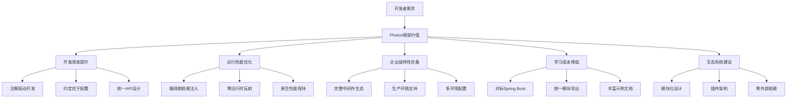

# 项目概述

## 背景定位

Photon框架是一个面向商业化应用的V语言企业级Web开发框架，旨在解决V语言生态中缺乏成熟企业级开发工具的痛点。框架对标Spring Boot，采用编译期优于运行期的设计哲学，通过注解驱动的声明式编程模型，为开发者提供零运行时反射开销的高性能解决方案[^1]。

在当前企业级应用开发中，开发者面临着开发效率与运行性能之间的权衡。传统框架虽然功能丰富，但往往依赖运行时反射，影响性能；而高性能框架又往往缺乏完整的企业级特性。Photon框架通过编译期代码生成和依赖注入，在保持V语言原生性能的同时，提供了完整的企业级开发体验。

框架定位为V语言生态中的标准企业级开发平台，服务于需要构建商业化应用的开发团队，特别适合对性能有较高要求的Web应用、微服务和API服务场景[^2]。

## 目标愿景

Photon框架的短期目标是为V语言开发者提供类似Spring Boot的开发体验，让开发者能够快速构建功能完整的企业级应用。通过注解驱动、约定优于配置的设计理念，大幅降低企业级应用的开发门槛和学习成本[^3]。

长期愿景是成为V语言生态中的标准企业级开发框架，建立完整的开发工具链和生态系统。框架致力于支持从简单应用到复杂分布式系统的全场景开发需求，为V语言在企业级应用领域的普及奠定基础。

框架追求在开发效率、运行性能、代码可维护性三个维度达到最佳平衡，让开发者既能享受快速开发的便利，又能获得接近原生代码的运行性能[^4]。

## 范围边界

Photon框架包含16个核心模块，覆盖了企业级应用开发的完整技术栈：

**核心基础设施**：提供依赖注入容器、事件系统、生命周期管理等基础能力，支持编译期Bean扫描和自动装配[^5]。

**Web开发层**：基于V语言veb框架增强，提供注解驱动路由、中间件链、请求过滤器、统一响应封装等功能，支持RESTful API快速开发[^6]。

**数据访问层**：在V语言标准ORM基础上提供生命周期钩子、多数据库连接路由、Repository模式等企业级特性，支持复杂的数据操作场景[^7]。

**中间件生态**：包含缓存抽象、安全认证、消息队列、分布式锁、文件存储、定时任务等常用中间件，提供统一的编程接口和多种后端实现[^8]。

**开发工具**：提供配置管理、CLI工具、健康检查、性能监控等开发运维工具，支持应用的完整生命周期管理。

框架明确不重复造轮子，而是在V语言标准库基础上提供企业级抽象和增强。例如，ORM模块是对V语言标准ORM的包装增强，而非完全替代；缓存模块提供统一抽象，支持内存、Redis等多种后端实现[^9]。

## 核心价值

### 开发效率提升

框架通过注解驱动的声明式编程模型，大幅减少样板代码编写。开发者只需关注业务逻辑，框架自动处理依赖注入、生命周期管理、异常处理等基础设施代码。统一的API设计和约定优于配置的理念，让开发者能够快速上手并高效开发[^10]。

### 运行性能优化

采用编译期依赖注入和代码生成技术，所有Bean解析和路由匹配都在编译期完成，实现零运行时反射开销。这种设计让应用在获得企业级框架便利的同时，保持了接近原生代码的运行性能[^11]。

### 企业级特性完备

提供完整的中间件生态，包括缓存、安全、队列、锁、存储等企业级常用组件。支持多环境配置、健康检查、性能监控、优雅关闭等生产环境必需功能，满足商业化应用的全方位需求[^12]。

### 学习成本降低

框架设计对标Spring Boot，Java开发者可以快速迁移。统一的模块导出和类型别名设计，提供简洁的API体验。丰富的示例代码和文档，帮助开发者快速掌握框架使用方法[^13]。

### 生态系统建设

通过模块化设计和插件架构，框架具备良好的扩展性。开发者可以基于框架构建特定领域的解决方案，形成丰富的第三方生态。框架的零外部依赖设计，降低了集成和部署的复杂度[^14]。

图：Photon框架核心价值体系（类型：业务价值架构图）

Photon框架通过系统性的设计，在开发效率、运行性能、企业特性、学习成本和生态建设五个维度创造了显著价值，为V语言企业级应用开发提供了完整的解决方案[^15]。

## 参考文献

[^1]: [框架定位与设计哲学](/README.md#L13-L17)
[^2]: [企业级应用开发痛点解决](/src/photon.v#L1-L4)
[^3]: [注解驱动编程模型](/src/core/core.v#L12-L20)
[^4]: [编译期优化设计](/ARCHITECTURE.md#L26-L29)
[^5]: [核心容器功能](/src/core/core.v#L8-L11)
[^6]: [Web层增强特性](/src/web/web.v#L4-L6)
[^7]: [ORM层生命周期管理](/src/orm/orm.v#L24-L30)
[^8]: [中间件生态覆盖](/README.md#L28-L36)
[^9]: [框架设计边界](/src/orm/orm.v#L21-L23)
[^10]: [声明式编程体验](/example/main.v#L27-L35)
[^11]: [编译期依赖注入](/src/core/core.v#L4-L6)
[^12]: [生产环境特性](/src/security/security.v#L4-L8)
[^13]: [统一API设计](/src/photon.v#L22-L100)
[^14]: [零依赖设计理念](/v.mod#L6)
[^15]: [框架价值体系](/ARCHITECTURE.md#L24-L30)