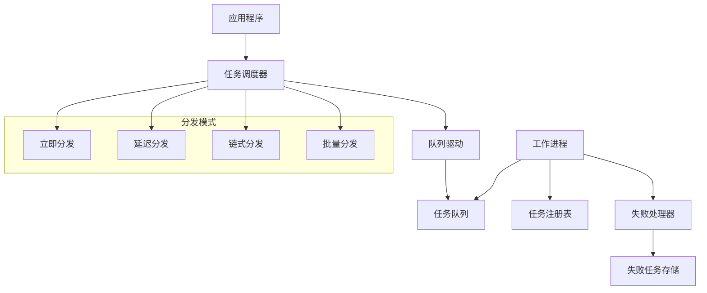
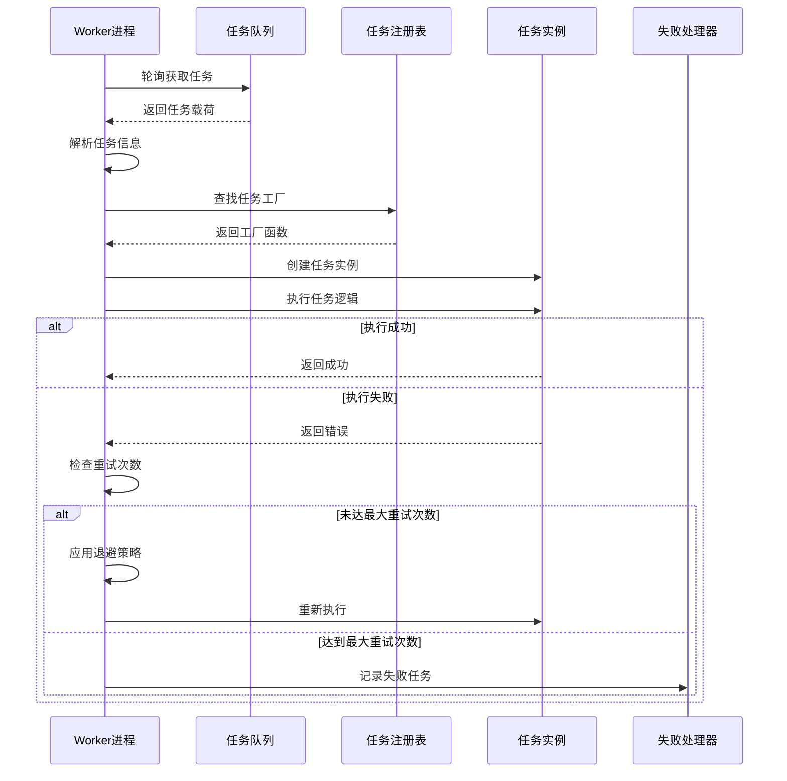

# 任务队列

## 系统架构概述

Photon任务队列系统是一个受Laravel Queue启发的异步任务处理框架，提供了完整的任务调度、执行和失败重试机制。系统采用模块化设计，支持多种分发模式、可插拔的存储后端和强大的并发控制能力。

### 核心组件架构



图：任务队列系统核心架构（类型：系统架构图）

## Job定义与接口

### Job接口规范

所有队列任务必须实现`Job`接口，该接口定义了任务的基本行为和配置[^1]：

```v
pub interface Job {
    job_type() string    // 任务类型标识
    handle() !           // 任务执行逻辑
    tries() int          // 最大重试次数
    backoff() []i64      // 退避策略配置
}
```

### JobPayload数据结构

`JobPayload`是任务在队列中传输的标准格式，包含了任务执行所需的所有元数据[^2]：

```v
pub struct JobPayload {
pub:
    id       string      // 任务唯一标识
    job_type string      // 任务类型
    data     string      // JSON序列化的任务数据
    attempts int         // 当前尝试次数
pub mut:
    delay_secs i64       // 延迟执行秒数
}
```

### 任务实现示例

```v
@[heap]
struct EmailJob {
pub:
    recipient string
    subject   string
    content   string
}

fn (j &EmailJob) job_type() string {
    return 'email_job'
}

fn (j &EmailJob) handle() ! {
    // 实际发送邮件逻辑
    println('Sending email to ${j.recipient}')
}

fn (j &EmailJob) tries() int {
    return 3  // 最多重试3次
}

fn (j &EmailJob) backoff() []i64 {
    return [i64(1), 5, 10]  // 1秒、5秒、10秒退避
}
```

## 队列驱动机制

### 驱动接口设计

队列系统采用可插拔的驱动架构，通过`QueueDriver`接口实现存储后端的抽象[^3]：

```v
pub interface QueueDriver {
mut:
    count(queue_name string) int
    push(queue_name string, payload string) !
    pop(queue_name string) !string
    clear(queue_name string) !
}
```

### 内存驱动实现

系统默认提供`MemoryDriver`实现，采用环形缓冲区优化，实现O(1)均摊时间的弹出操作[^4]：

```v
pub struct MemoryDriver {
pub mut:
    jobs map[string]QueueBuffer  // 队列名 → 环形缓冲区
mut:
    mu sync.Mutex                // 线程安全保护
}

struct QueueBuffer {
mut:
    data []string  // 环形缓冲区数据
    head int       // 下一个弹出项的索引
}
```

环形缓冲区通过移动头指针而非删除数组元素来避免O(n)的移位开销，当消费的槽位超过阈值时自动压缩缓冲区回收空间。

### 任务序列化机制

任务在存储前会被序列化为管道分隔的字符串格式[^5]：

```v
fn serialize_job(job_type string, data string) string {
    return '${job_type}||${data}'
}

fn deserialize_job(payload string) !(string, string) {
    parts := payload.split_n('||', 2)
    if parts.len < 2 {
        return error('invalid job payload format')
    }
    return parts[0], parts[1]
}
```

## 任务调度器

### 全局单例模式

调度器采用线程安全的单例模式，使用双重检查锁定和读写锁优化[^6]：

```v
fn get_dispatcher() &QueueDispatcher {
    // 快速路径：读锁保护下的内存可见性检查
    dispatcher_mu.rlock()
    d := unsafe { global_dispatcher }
    dispatcher_mu.runlock()
    if !isnil(d) {
        return d
    }
    
    // 慢速路径：写锁保护下的初始化
    dispatcher_mu.@lock()
    if !isnil(unsafe { global_dispatcher }) {
        defer { dispatcher_mu.unlock() }
        return unsafe { global_dispatcher }
    }
    unsafe {
        global_dispatcher = new_dispatcher(new_memory_driver())
    }
    defer { dispatcher_mu.unlock() }
    return unsafe { global_dispatcher }
}
```

### 分发模式支持

#### 立即分发

```v
pub fn dispatch(job Job) ! {
    mut d := get_dispatcher()
    payload := serialize_job(job.job_type(), '{}')
    d.driver.push(d.default_queue, payload)!
}
```

#### 延迟分发

延迟任务通过时间戳前缀实现，调度器在弹出时检查执行时间[^7]：

```v
pub fn push(queue_name string, job Job, delay_secs i64) ! {
    mut d := get_dispatcher()
    mut payload := serialize_job(job.job_type(), '{}')
    
    if delay_secs > 0 {
        run_at := time.now().unix_nano() + delay_secs * 1_000_000_000
        payload = '${run_at}||${payload}'
    }
    d.driver.push(queue_name, payload)!
}
```

#### 链式分发

链式任务按顺序依次分发，确保执行顺序[^8]：

```v
pub fn dispatch_chain(jobs []Job) ! {
    mut d := get_dispatcher()
    for job in jobs {
        payload := serialize_job(job.job_type(), '{}')
        d.driver.push(d.default_queue, payload)!
    }
}
```

#### 批量分发

批量任务共享同一个批次ID，便于追踪和管理[^9]：

```v
pub fn dispatch_batch(jobs []Job) !string {
    batch_id := generate_batch_id()
    mut d := get_dispatcher()
    for job in jobs {
        payload := serialize_job(job.job_type(), '{"batch_id":"${batch_id}"}')
        d.driver.push(d.default_queue, payload)!
    }
    return batch_id
}
```

## Worker进程实现

### 工作进程结构

`QueueWorker`是任务执行的核心组件，负责轮询队列并执行任务[^10]：

```v
pub struct QueueWorker {
pub:
    queue_name string = 'default'  // 监听的队列名称
    sleep_secs int    = 5          // 空闲时轮询间隔
pub mut:
    running        bool            // 运行状态标志
    registry       map[string]JobFactory  // 任务类型注册表
    failed_handler &FailedJobHandler      // 失败任务处理器
mut:
    mu          sync.Mutex       // 保护running标志
    registry_mu sync.RwMutex     // 保护注册表
    stop_ch     chan bool        // 停止信号通道
}
```

### 任务注册机制

Worker通过工厂函数注册任务类型，实现动态任务创建[^11]：

```v
pub type JobFactory = fn () &Job

pub fn (mut w QueueWorker) register(job_type string, factory JobFactory) {
    w.registry_mu.@lock()
    defer { w.registry_mu.unlock() }
    w.registry[job_type] = factory
}
```

### 任务执行流程



图：Worker任务执行流程（类型：时序图）

### 并发控制设计

#### 线程安全的状态管理

Worker的运行状态通过互斥锁保护，确保多线程环境下的状态一致性[^12]：

```v
pub fn (mut w QueueWorker) run() {
    w.mu.@lock()
    defer { w.mu.unlock() }
    w.running = true
}

pub fn (w &QueueWorker) is_running() bool {
    unsafe {
        mut mw := w
        mw.mu.@lock()
        val := mw.running
        mw.mu.unlock()
        return val
    }
}
```

#### 可中断的退避睡眠

重试退避期间支持中断，避免Worker停止时长时间阻塞[^13]：

```v
fn (mut w QueueWorker) interruptible_sleep(delay_secs i64) bool {
    mut remaining_ms := delay_secs * 1000
    for remaining_ms > 0 {
        select {
            _ := <-w.stop_ch {
                w.mu.@lock()
                w.running = false
                w.mu.unlock()
                return true  // 被中断
            }
            else {}
        }
        sleep_ms := if remaining_ms < 100 { remaining_ms } else { 100 }
        time.sleep(sleep_ms * time.millisecond)
        remaining_ms -= sleep_ms
    }
    return false  // 正常完成
}
```

## 失败重试机制

### 失败任务数据模型

失败任务通过`FailedJob`结构体持久化，记录完整的失败上下文[^14]：

```v
pub struct FailedJob {
pub:
    id         string    // 失败任务唯一标识
    job_type   string    // 任务类型
    payload    string    // 原始任务载荷
    exception  string    // 失败原因
    failed_at  i64       // 失败时间戳
    queue_name string    // 所属队列
    attempts   int       // 失败时的尝试次数
}
```

### 失败任务存储抽象

系统提供`FailedJobRepository`接口，支持多种存储后端[^15]：

```v
pub interface FailedJobRepository {
mut:
    save(job FailedJob) !
    all() ![]FailedJob
    find_by_id(id string) !FailedJob
    delete_by_id(id string) !
    clear() !
    count() int
}
```

### 重试策略实现

#### 指数退避算法

任务重试采用可配置的退避策略，支持指数退避和固定间隔[^16]：

```v
// 执行重试循环
for attempt := 0; attempt < max_tries; attempt++ {
    mut has_error := false
    job.handle() or { has_error = true }
    if !has_error {
        return  // 执行成功
    }
    
    // 应用退避策略
    if attempt < max_tries - 1 {
        mut delay_secs := i64(1)  // 默认1秒退避
        if attempt < backoffs.len {
            delay_secs = backoffs[attempt]
        }
        if w.interruptible_sleep(delay_secs) {
            return  // Worker被停止
        }
    }
}
```

#### 失败任务重放

失败任务支持单个重试和批量重放[^17]：

```v
pub fn (mut h FailedJobHandler) retry(id string) ! {
    job := h.repository.find_by_id(id)!
    h.repository.delete_by_id(id)!
    dispatch_later_by_type(job.job_type, 0)!
}

pub fn (mut h FailedJobHandler) retry_all() ! {
    all_jobs := h.repository.all()!
    for job in all_jobs {
        h.repository.delete_by_id(job.id)!
        dispatch_later_by_type(job.job_type, 0)!
    }
}
```

## 监控指标

### 队列状态监控

系统提供多种监控指标，帮助了解队列运行状态[^18]：

```v
// 获取待处理任务数量
pub fn count() int {
    mut d := get_dispatcher()
    return d.driver.count(d.default_queue)
}

// 清空队列
pub fn clear_queue() ! {
    mut d := get_dispatcher()
    d.driver.clear(d.default_queue)!
}
```

### 失败任务统计

失败任务存储提供统计功能，便于监控任务失败情况[^19]：

```v
pub fn (mut r MemoryFailedJobRepository) count() int {
    r.mu.@lock()
    defer { r.mu.unlock() }
    return r.jobs.len
}

pub fn (mut r MemoryFailedJobRepository) all() ![]FailedJob {
    r.mu.@lock()
    defer { r.mu.unlock() }
    return r.jobs.clone()
}
```

### 性能优化指标

#### 环形缓冲区效率

内存驱动的环形缓冲区设计显著提升了性能：
- 弹出操作：O(1)均摊时间复杂度
- 内存使用：通过压缩机制避免无限增长
- 并发性能：细粒度锁减少竞争

#### 线程安全开销

系统采用多种同步机制确保线程安全：
- 读写锁：读多写少场景优化
- 互斥锁：简单状态保护
- 通道：优雅的停止信号传递

## 最佳实践

### 任务设计原则

1. **幂等性设计**：任务应该支持重复执行而不产生副作用
2. **资源管理**：及时释放文件句柄、数据库连接等资源
3. **错误处理**：合理区分可重试和不可重试的错误
4. **执行时间**：避免长时间运行的任务，考虑拆分为多个小任务

### 配置建议

1. **重试次数**：根据任务重要性设置合适的重试次数
2. **退避策略**：使用指数退避避免系统过载
3. **队列分离**：不同优先级任务使用不同队列
4. **Worker数量**：根据CPU核心数和任务类型调整Worker数量

### 监控运维

1. **队列长度**：监控队列积压情况，及时扩容
2. **失败率**：关注任务失败率，排查系统问题
3. **执行时间**：监控任务执行时间，优化性能瓶颈
4. **资源使用**：监控内存和CPU使用情况

## 参考文献

[^1]: [Job接口定义](src/queue/queue.v#L24-L28)
[^2]: [JobPayload结构体](src/queue/queue.v#L13-L21)
[^3]: [QueueDriver接口](src/queue/driver.v#L6-L12)
[^4]: [MemoryDriver环形缓冲区](src/queue/memory_driver.v#L12-L16)
[^5]: [任务序列化函数](src/queue/driver.v#L14-L26)
[^6]: [调度器单例实现](src/queue/dispatcher.v#L16-L40)
[^7]: [延迟任务分发](src/queue/dispatcher.v#L81-L91)
[^8]: [链式任务分发](src/queue/dispatcher.v#L72-L78)
[^9]: [批量任务分发](src/queue/dispatcher.v#L98-L107)
[^10]: [QueueWorker结构体](src/queue/worker.v#L14-L26)
[^11]: [任务注册机制](src/queue/worker.v#L35-L43)
[^12]: [Worker状态管理](src/queue/worker.v#L52-L70)
[^13]: [可中断睡眠实现](src/queue/worker.v#L145-L167)
[^14]: [FailedJob数据模型](src/queue/failed_jobs.v#L11-L20)
[^15]: [FailedJobRepository接口](src/queue/failed_jobs.v#L23-L31)
[^16]: [重试循环实现](src/queue/worker.v#L116-L140)
[^17]: [失败任务重放](src/queue/failed_jobs.v#L131-L146)
[^18]: [队列监控函数](src/queue/dispatcher.v#L109-L119)
[^19]: [失败任务统计](src/queue/failed_jobs.v#L95-L100)