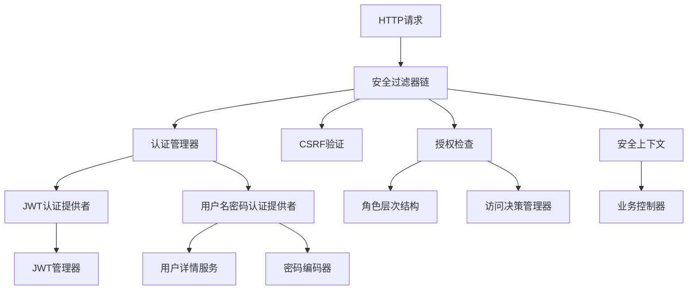
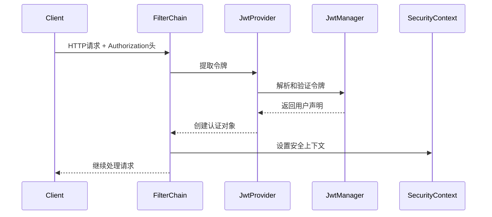
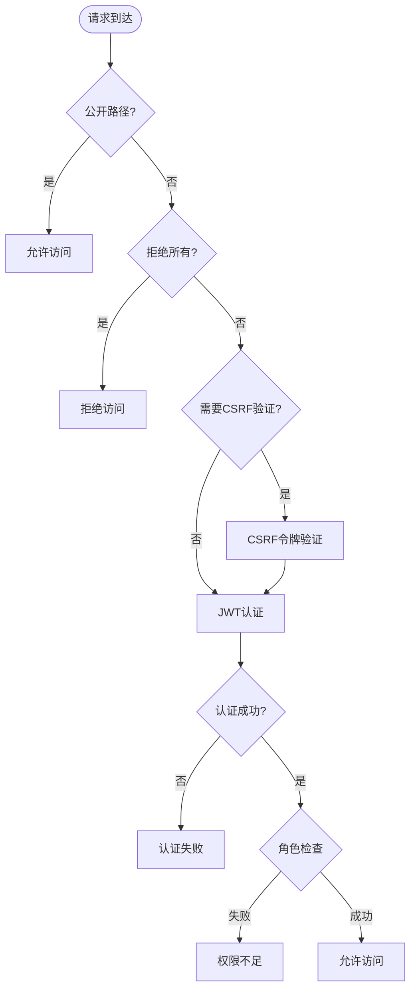

# 安全框架

## 架构概述

Photon安全框架是一个全面的企业级安全解决方案，采用分层架构设计，提供认证、授权、JWT令牌管理、RBAC权限控制和CSRF保护等核心安全功能。框架设计遵循Spring Security的设计理念，通过模块化组件实现灵活的安全策略配置。

### 核心架构组件

安全框架由以下核心模块组成：

- **认证模块**：提供多种认证方式，包括JWT令牌认证和用户名密码认证
- **授权模块**：实现基于角色的访问控制(RBAC)和细粒度权限管理
- **JWT管理**：完整的JWT令牌生命周期管理，支持访问令牌和刷新令牌
- **CSRF保护**：基于Double-Submit Cookie模式的跨站请求伪造防护
- **密码加密**：支持BCrypt和Argon2等多种密码哈希算法
- **安全上下文**：请求级别的安全状态管理
- **过滤器链**：与veb web框架集成的安全过滤器链


图：Photon安全框架架构流程（类型：流程图）

## JWT认证系统

### JWT管理器设计

JWT管理器(`JwtManager`)是JWT令牌管理的核心组件，负责令牌的创建、解析和验证。采用HMAC-SHA256签名算法，确保令牌的完整性和安全性[^1]。

#### JWT配置结构

```v
pub struct JwtConfig {
pub:
    secret                         string
    issuer                         string = 'photon'
    audience                       string
    expiration_minutes             int = 60
    refresh_token_expiration_hours int = 168
}
```

#### 令牌创建流程

JWT管理器支持两种令牌类型：

1. **访问令牌**：短期有效，用于API访问认证
2. **刷新令牌**：长期有效，用于获取新的访问令牌

访问令牌创建过程包含以下关键步骤：
- 设置标准声明(sub, iat, exp, iss, aud, jti)
- 包含用户角色信息
- 使用HMAC-SHA256算法签名
- 返回标准JWT格式字符串

```v
pub fn (jm &JwtManager) create_token(username string, roles []string) !string {
    now := time.now().unix()
    claims := JwtClaims{
        sub:   username
        iat:   now
        exp:   now + i64(jm.config.expiration_minutes * 60)
        iss:   jm.config.issuer
        aud:   jm.config.audience
        jti:   generate_jti(username, now)
        roles: roles
    }
    return jm.encode(claims)
}
```

#### 令牌验证机制

JWT验证包含多层安全检查：
- **签名验证**：使用HMAC-SHA256验证令牌完整性
- **时间验证**：检查令牌是否在有效期内
- **发行者验证**：确认令牌发行者身份
- **格式验证**：确保JWT格式正确

```v
pub fn (jm &JwtManager) parse_token(token string) !JwtClaims {
    claims := jm.decode(token)!
    
    now := time.now().unix()
    if now > claims.exp {
        return error('JWT token expired at ${claims.exp}')
    }
    if claims.iat > now {
        return error('JWT token used before issued time')
    }
    if claims.iss.len > 0 && claims.iss != jm.config.issuer {
        return error('JWT issuer mismatch: expected ${jm.config.issuer}, got ${claims.iss}')
    }
    
    return claims
}
```

### JWT认证提供者

`JwtAuthenticationProvider`实现了基于JWT令牌的认证逻辑，支持Bearer令牌格式和原始JWT令牌格式[^2]。


图：JWT认证流程（类型：序列图）

## 认证管理架构

### 认证管理器设计

`AuthenticationManager`采用提供者模式，支持多种认证方式的统一管理。通过`AuthenticationProvider`接口，可以灵活扩展新的认证方式[^3]。

#### 认证提供者接口

```v
pub interface AuthenticationProvider {
    supports(auth &Authentication) bool
    authenticate(auth &Authentication) !&Authentication
}
```

#### 认证对象结构

```v
pub struct Authentication {
pub mut:
    principal     string
    credentials   string
    authorities   []string
    authenticated bool
    details       map[string]string
}
```

### 用户名密码认证

`UsernamePasswordAuthenticationProvider`实现传统的用户名密码认证，集成了密码编码器和用户详情服务：

- **密码验证**：使用配置的密码编码器验证密码
- **账户状态检查**：验证账户是否启用、未锁定、未过期
- **权限加载**：从用户详情服务获取用户权限

```v
pub fn (up &UsernamePasswordAuthenticationProvider) authenticate(auth &Authentication) !&Authentication {
    user := up.user_service.load_user_by_username(auth.principal)!
    
    // 验证密码
    if !up.password_encoder.matches(auth.credentials, user.password())! {
        return error('invalid credentials for user: ${auth.principal}')
    }
    
    // 检查账户状态
    if !user.is_enabled() {
        return error('account is disabled: ${auth.principal}')
    }
    if !user.is_account_non_locked() {
        return error('account is locked: ${auth.principal}')
    }
    if !user.is_account_non_expired() {
        return error('account is expired: ${auth.principal}')
    }
    
    mut result := new_authentication(user.username(), '')
    result.mark_authenticated(user.authorities())
    
    return result
}
```

## RBAC权限系统

### 角色层次结构

`RoleHierarchy`实现了灵活的角色继承机制，支持角色间的父子关系定义。通过递归算法计算角色可达性，实现权限的自动继承[^4]。

#### 默认角色层次

系统预定义了标准的角色层次结构：
```
ADMIN > MODERATOR > USER > GUEST
```

```v
pub fn build_default_hierarchy() &RoleHierarchy {
    mut hierarchy := new_role_hierarchy()
    hierarchy.add_role('ADMIN', ['MODERATOR'])
    hierarchy.add_role('MODERATOR', ['USER'])
    hierarchy.add_role('USER', ['GUEST'])
    hierarchy.add_role('GUEST', [])
    return hierarchy
}
```

#### 角色可达性算法

```v
pub fn (rh &RoleHierarchy) get_reachable_roles(role string) []string {
    mut reachable := []string{}
    rh.collect_roles(role, mut reachable)
    return reachable
}

fn (rh &RoleHierarchy) collect_roles(role string, mut collected []string) {
    // 防重复检查
    for c in collected {
        if c == role {
            return
        }
    }
    collected << role
    
    parents := rh.hierarchy[role] or { return }
    for parent in parents {
        rh.collect_roles(parent, mut collected)
    }
}
```

### 访问决策管理器

`AccessDecisionManager`是权限决策的核心组件，支持基于角色和权限的双重验证机制：

- **角色检查**：验证用户是否具有所需角色（考虑角色继承）
- **权限检查**：验证用户是否具有特定操作权限
- **组合验证**：支持同时检查多个角色和权限

```v
pub fn (adm &AccessDecisionManager) decide(user_roles []string, required_roles []string, required_permissions []string) bool {
    // 检查角色
    if required_roles.len > 0 {
        if !adm.hierarchy.has_any_role(user_roles, required_roles) {
            return false
        }
    }
    
    // 检查权限
    if required_permissions.len > 0 {
        for perm in required_permissions {
            if !adm.hierarchy.has_permission(user_roles, adm.role_permissions, perm) {
                return false
            }
        }
    }
    
    return true
}
```

### 权限映射机制

系统支持细粒度的权限控制，每个角色可以关联多个特定权限：

```v
pub fn build_default_permissions() map[string][]string {
    return {
        'ADMIN':     ['*', 'user:read', 'user:write', 'user:delete', 'admin:settings', 'admin:users']
        'MODERATOR': ['user:read', 'user:write']
        'USER':      ['user:read', 'self:write']
        'GUEST':     ['public:read']
    }
}
```

## CSRF保护机制

### Double-Submit Cookie模式

CSRF保护采用Double-Submit Cookie模式，通过在Cookie和请求中同时包含CSRF令牌来验证请求的合法性[^5]。

#### CSRF配置

```v
pub struct CsrfConfig {
pub:
    enabled          bool   = true
    cookie_name      string = 'XSRF-TOKEN'
    header_name      string = 'X-CSRF-TOKEN'
    form_field_name  string = '_csrf'
    token_length     int    = 32
    cookie_path      string = '/'
    cookie_http_only bool
    cookie_secure    bool
    cookie_same_site string   = 'Lax'
    ignored_methods  []string = ['GET', 'HEAD', 'OPTIONS', 'TRACE']
}
```

#### 令牌生成和验证

CSRF令牌使用随机字符串生成，确保不可预测性：

```v
pub fn (ctr &CookieCsrfTokenRepository) generate_token() string {
    mut token := ''
    mut chars_used := 0
    for chars_used < ctr.config.token_length {
        b := rand.u8()
        if (b >= `a` && b <= `z`) || (b >= `A` && b <= `Z`) || (b >= `0` && b <= `9`) {
            token += b.ascii_str()
            chars_used++
        }
    }
    return token
}
```

验证过程检查请求头或表单字段中的令牌是否与存储的令牌匹配：

```v
pub fn (cm &CsrfManager) validate(actual_token string, expected_token string) ! {
    if !cm.config.enabled {
        return
    }
    if actual_token.len == 0 {
        return error('CSRF token is missing')
    }
    if actual_token != expected_token {
        return error('CSRF token mismatch')
    }
}
```

## 密码加密系统

### 密码编码器架构

密码编码器采用策略模式，支持多种哈希算法的统一接口。通过`DelegatingPasswordEncoder`实现多算法支持和密码迁移[^6]。

#### 支持的编码器

1. **BCryptPasswordEncoder**：基于BCrypt算法，强度可配置
2. **Argon2PasswordEncoder**：基于Argon2算法，内存和时间参数可调
3. **FnvPasswordEncoder**：遗留算法支持，仅用于迁移验证

#### DelegatingPasswordEncoder

```v
pub struct DelegatingPasswordEncoder {
pub:
    id_for_encode          string
    encoders               map[string]PasswordEncoder
    default_id_for_matches string
}
```

该设计支持：
- **前缀标识**：使用{id}hash格式标识算法类型
- **编码委托**：根据配置选择默认编码算法
- **匹配委托**：根据前缀自动选择对应的验证算法
- **升级检测**：自动检测是否需要密码重新哈希

```v
pub fn (e DelegatingPasswordEncoder) matches(raw_password string, encoded string) !bool {
    id, hash_stripped := parse_encoder_id(encoded)
    encoder_id := if id == '' { e.default_id_for_matches } else { id }
    hash_to_verify := if id == '' { encoded } else { hash_stripped }
    encoder := e.encoders[encoder_id] or { return false }
    return encoder.matches(raw_password, hash_to_verify)!
}
```

### 哈希算法实现

#### BCrypt哈希

```v
pub fn (h &BcryptHasher) make(password string) string {
    salt := generate_salt(22)
    hash := hash_string(password, salt, u64(h.rounds))
    return r'$2y$' + '${h.rounds:02d}' + r'$' + '${salt}${hash}'
}
```

#### Argon2哈希

```v
pub fn (h &Argon2Hasher) make(password string) string {
    salt := generate_salt(16)
    hash := hash_string(password, salt, u64(h.time) + u64(h.memory) + u64(h.threads))
    return r'$argon2id$v=19$m=' + '${h.memory},t=${h.time},p=${hthreads}' + r'$' + '${salt}' + r'$' + '${hash}'
}
```

## 安全过滤器链

### 过滤器链架构

`SecurityFilterChain`是安全框架与veb web框架的集成点，实现了完整的安全处理流程[^7]。


图：安全过滤器链处理流程（类型：流程图）

### 安全处理步骤

过滤器链按以下顺序处理每个HTTP请求：

1. **公开路径检查**：判断路径是否配置为公开访问
2. **拒绝所有检查**：检查路径是否被明确拒绝
3. **CSRF验证**：对状态改变请求进行CSRF令牌验证
4. **JWT认证**：从Authorization头提取并验证JWT令牌
5. **安全上下文设置**：将认证信息存储到请求级别的上下文中
6. **角色授权检查**：验证用户是否具有访问所需角色

```v
pub fn (mut sfc SecurityFilterChain) filter(mut ctx veb.Context) !bool {
    if !sfc.enabled {
        return true
    }
    
    method := ctx.req.method.str()
    path := ctx.req.url
    
    // 步骤1：检查是否为公开路径
    sec_config := sfc.metadata_source.get_config(path)
    if is_public(sec_config) {
        return true
    }
    
    // 步骤2：拒绝被阻止的端点
    if sec_config.is_deny_all {
        ctx.send_response_to_client('application/json', '{"error":"Access denied","code":403}')
        return false
    }
    
    // 步骤3：CSRF检查
    if sfc.csrf_manager.is_csrf_required(method) {
        expected := unsafe { sfc.csrf_manager.get_expected_token() }
        actual_header := ctx.get_custom_header(sfc.csrf_manager.config.header_name) or { '' }
        actual_form := ctx.get_custom_header('_csrf') or { '' }
        actual := sfc.csrf_manager.get_actual_token(actual_header, actual_form)
        
        sfc.csrf_manager.validate(actual, expected) or {
            ctx.send_response_to_client('application/json', '{"error":"CSRF token invalid","code":403}')
            return false
        }
    }
    
    // 步骤4：JWT认证
    auth_header := ctx.get_custom_header('Authorization') or { '' }
    if auth_header.len == 0 {
        ctx.send_response_to_client('application/json', '{"error":"Authentication required","code":401}')
        return false
    }
    
    mut auth := new_authentication('', auth_header)
    sfc.auth_manager.authenticate(mut auth) or {
        ctx.send_response_to_client('application/json', '{"error":"Invalid or expired token","code":401}')
        return false
    }
    
    // 步骤5：设置安全上下文
    unsafe {
        sfc.context_holder.context.set_authentication(auth)
    }
    
    // 步骤6：角色授权检查
    if sec_config.is_secured && sec_config.required_roles.len > 0 {
        if !role_matches(auth.authorities, sec_config.required_roles) {
            ctx.send_response_to_client('application/json', '{"error":"Insufficient privileges","code":403}')
            sfc.context_holder.clear_context()
            return false
        }
    }
    
    return true
}
```

### 路径安全配置

系统支持灵活的路径级安全配置：

```v
// 公开访问
pub fn (mut sfc SecurityFilterChain) with_permit_all(path string) {
    sfc.metadata_source.register(path, SecuredConfig{
        is_permit_all: true
    })
}

// 需要认证
pub fn (mut sfc SecurityFilterChain) with_secured(path string) {
    sfc.metadata_source.register(path, SecuredConfig{
        is_secured: true
    })
}

// 需要特定角色
pub fn (mut sfc SecurityFilterChain) with_roles(path string, roles []string) {
    sfc.metadata_source.register(path, SecuredConfig{
        is_secured:     true
        required_roles: roles
    })
}

// 拒绝所有访问
pub fn (mut sfc SecurityFilterChain) with_deny_all(path string) {
    sfc.metadata_source.register(path, SecuredConfig{
        is_deny_all: true
    })
}
```

## 安全上下文管理

### SecurityContext设计

`SecurityContext`提供请求级别的安全状态管理，相当于Spring Security的SecurityContextHolder[^8]。

```v
pub struct SecurityContext {
pub mut:
    authentication &Authentication
}
```

### 上下文访问接口

安全上下文提供了丰富的访问方法：

```v
// 获取当前用户名
pub fn (sc &SecurityContext) get_username() string {
    if sc.authentication == unsafe { nil } {
        return ''
    }
    return sc.authentication.principal
}

// 获取用户角色
pub fn (sc &SecurityContext) get_roles() []string {
    if sc.authentication == unsafe { nil } || !sc.authentication.is_authenticated() {
        return []string{}
    }
    return sc.authentication.authorities
}

// 角色检查
pub fn (sc &SecurityContext) has_role(role string) bool {
    for r in sc.get_roles() {
        if r == role {
            return true
        }
    }
    return false
}
```

## 方法级安全注解

### 安全注解支持

框架支持Spring Security风格的方法级安全注解，通过注解解析器实现细粒度的访问控制[^9]。

#### 支持的注解类型

- `@[secured]`：标记方法需要认证
- `@[roles_allowed]`：指定允许访问的角色
- `@[permit_all]`：允许所有访问
- `@[deny_all]`：拒绝所有访问
- `@[pre_authorize]`：执行前授权表达式
- `@[post_authorize]`：执行后授权表达式

#### 安全表达式评估

框架实现了完整的安全表达式评估引擎，支持复杂的授权逻辑：

```v
pub fn evaluate_security_expression(expr string, ctx MethodSecurityContext) !bool {
    e := expr.trim_space()
    if e == '' {
        return true // 空表达式表示允许
    }
    
    // 逻辑AND操作
    if e.contains(' and ') {
        parts := e.split(' and ')
        for part in parts {
            if !evaluate_security_expression(part, ctx)! {
                return false
            }
        }
        return true
    }
    
    // 逻辑OR操作
    if e.contains(' or ') {
        parts := e.split(' or ')
        for part in parts {
            if evaluate_security_expression(part, ctx)! {
                return true
            }
        }
        return false
    }
    
    // hasRole函数
    if e.starts_with('hasRole(') {
        role := extract_string_arg(e, 'hasRole(')
        return ctx.user_roles.any(it == role || it == 'ROLE_${role}')
    }
    
    // 其他表达式处理...
    
    return error('unsupported security expression: ${e}')
}
```

## 用户身份抽象

### UserDetails接口

`UserDetails`接口提供了用户身份的标准抽象，支持完整的账户状态管理[^10]。

```v
pub interface UserDetails {
    username() string
    password() string
    authorities() []string
    is_enabled() bool
    is_account_non_expired() bool
    is_account_non_locked() bool
    is_credentials_non_expired() bool
}
```

### 用户详情服务

`UserDetailsService`接口定义了用户数据加载的标准方式：

```v
pub interface UserDetailsService {
    load_user_by_username(username string) !&UserDetails
}
```

框架提供了内存实现用于开发和测试：

```v
pub struct InMemoryUserDetailsService {
pub mut:
    users map[string]&UserDetails
}
```

## 安全最佳实践

### 配置建议

1. **JWT配置**：
   - 使用强密钥（至少32字符）
   - 设置合理的过期时间（访问令牌1小时，刷新令牌7天）
   - 在生产环境中启用HTTPS

2. **密码策略**：
   - 使用BCrypt或Argon2算法
   - BCrypt推荐强度为12
   - 定期检查密码是否需要重新哈希

3. **CSRF保护**：
   - 对所有状态改变请求启用CSRF验证
   - 在生产环境中设置Secure和HttpOnly标志
   - 使用Lax或Strict的SameSite策略

### 安全检查清单

- [ ] JWT密钥强度足够且定期轮换
- [ ] 密码哈希算法配置正确
- [ ] CSRF保护在必要端点启用
- [ ] 角色层次结构设计合理
- [ ] 敏感端点配置了适当的访问控制
- [ ] 安全上下文在请求完成后正确清理
- [ ] 异常处理不泄露敏感信息

### 性能优化

1. **JWT缓存**：对频繁访问的JWT令牌进行缓存
2. **角色缓存**：缓存用户角色和权限信息
3. **密码哈希**：选择合适的哈希强度平衡安全性和性能
4. **CSRF令牌**：合理设置令牌生命周期

## 参考文献

[^1]: [JWT管理器核心实现](src/security/jwt.v#L37-L176)
[^2]: [JWT认证提供者实现](src/security/auth.v#L91-L126)
[^3]: [认证管理器架构设计](src/security/auth.v#L60-L89)
[^4]: [角色层次结构实现](src/security/role.v#L16-L90)
[^5]: [CSRF保护机制实现](src/security/csrf.v#L83-L156)
[^6]: [密码编码器架构](src/security/password_encoder.v#L135-L196)
[^7]: [安全过滤器链实现](src/security/filter.v#L35-L101)
[^8]: [安全上下文管理](src/security/context.v#L9-L110)
[^9]: [方法级安全注解](src/security/annotations.v#L148-242)
[^10]: [用户身份抽象设计](src/security/principal.v#L9-106)