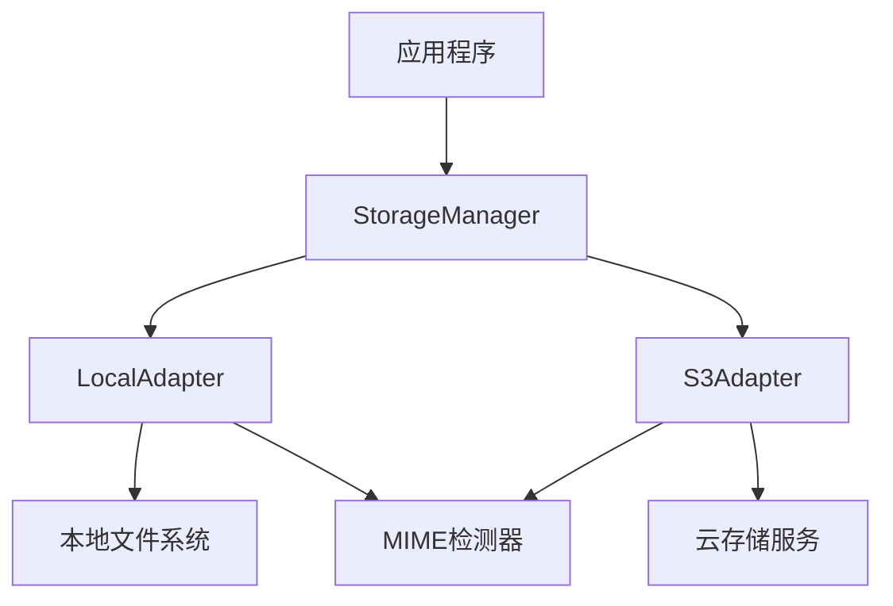

# 文件存储

## 架构概述

Photon文件存储系统是一个受Laravel Storage和Flysystem启发的统一文件系统抽象层，提供了可插拔的存储适配器架构。该系统通过统一的Storage接口支持多种存储后端，包括本地文件系统和S3兼容的云存储服务[^1]。

系统采用分层设计，核心组件包括Storage接口定义、StorageManager多磁盘管理器、LocalAdapter本地适配器、S3Adapter云存储适配器以及MIME类型检测模块。这种设计使得应用程序可以在不同的存储后端之间无缝切换，而无需修改业务逻辑代码[^2]。


图：文件存储系统架构图（类型：架构图）

## 核心接口设计

### Storage接口

Storage接口是整个存储系统的核心抽象，定义了统一的文件操作API。接口方法分为只读操作和可变操作两大类，确保了接口的清晰性和安全性[^3]。

只读操作包括文件读取、存在性检查、大小获取、MIME类型检测、最后修改时间查询、元数据获取、可见性查询、目录列表、URL生成和临时URL生成。这些操作不会修改存储系统状态，因此被定义为不可变方法[^4]。

可变操作包括文件写入、删除、复制、移动、可见性设置、目录创建和删除、流式写入、空文件创建和本地文件上传。这些操作会修改存储系统状态，因此被定义为可变方法[^5]。

### 文件元数据管理

FileMetadata结构体提供了丰富的文件信息描述，包括基本属性（路径、大小、MIME类型、ETag）和可变属性（最后修改时间、可见性、扩展元数据）。这种设计支持适配器特定的元数据扩展，为不同存储后端提供了灵活性[^6]。

```v
pub struct FileMetadata {
pub:
    path      string
    size      i64
    mime_type string
    etag      string
pub mut:
    last_modified i64
    visibility    Visibility = .private_
    extra         map[string]string // adapter-specific metadata
}
```

### 可见性控制

系统通过Visibility枚举提供文件访问控制，支持public和private两种可见性级别。在本地适配器中，public文件设置为644权限，private文件设置为600权限，实现了基于文件系统的访问控制[^7]。

## 本地存储适配器

### 核心功能实现

LocalAdapter实现了Storage接口的本地文件系统版本，提供了完整的文件操作功能。适配器通过root目录进行路径隔离，确保所有操作都在指定范围内执行，防止路径遍历攻击[^8]。

路径解析采用resolve_path方法，将相对路径转换为绝对路径，并处理路径前缀的标准化。这种方法确保了路径的一致性和安全性[^9]。

### 权限管理系统

LocalAdapter实现了一个复杂的权限缓存系统，用于跟踪文件的可见性设置。该系统使用map[string]string存储路径到可见性的映射，并通过perm_access_order数组跟踪插入顺序，支持FIFO淘汰策略[^10]。

权限缓存的最大容量限制为10000条目，当超过限制时会自动淘汰最旧的条目。这种设计防止了内存无限增长，同时保持了最近使用文件的权限信息[^11]。

```v
const max_permissions = 10000

pub fn (mut la LocalAdapter) set_visibility(path string, visibility Visibility) ! {
    la.mu.@lock()
    if path !in la.permissions {
        la.perm_access_order << path
    }
    la.permissions[path] = visibility.str()
    if la.permissions.len > max_permissions {
        evict_count := la.permissions.len - max_permissions / 2
        // FIFO eviction logic
    }
    la.mu.unlock()
}
```

### 并发安全设计

权限管理系统使用sync.RwMutex确保并发安全。写操作获取独占锁，读操作获取共享锁，这种设计在保证数据一致性的同时最大化了并发性能[^12]。

生命周期测试验证了并发场景下的正确性，包括并发设置可见性和并发读取可见性。测试显示系统在高并发环境下能够正确维护数据一致性[^13]。

### 目录操作支持

LocalAdapter提供了完整的目录操作功能，包括创建目录、删除目录、列出目录内容。目录列表操作返回FileMetadata数组，其中目录被表示为大小为0、MIME类型为'inode/directory'的特殊文件[^14]。

## S3云存储适配器

### S3兼容性设计

S3Adapter支持Amazon S3和S3兼容服务（如MinIO、DigitalOcean Spaces、Cloudflare R2等）。适配器通过endpoint和use_path_style参数支持不同的S3兼容服务配置[^15]。

URL构建逻辑根据服务类型自动调整：标准AWS S3使用虚拟主机样式，S3兼容服务使用路径样式。这种灵活性使得适配器能够适应各种S3兼容服务[^16]。

```v
fn (mut sa S3Adapter) build_base_url() {
    if sa.endpoint.len > 0 {
        if sa.use_path_style {
            sa.base_url = '${sa.endpoint}/${sa.bucket}'
        } else {
            sa.base_url = '${sa.endpoint}'
        }
    } else {
        sa.base_url = 'https://${sa.bucket}.s3.${sa.region}.amazonaws.com'
    }
}
```

### 临时URL生成

S3Adapter支持预签名URL生成，为私有文件提供有时限的访问能力。临时URL包含过期时间和签名参数，确保了安全的临时访问[^17]。

### 存根实现说明

当前S3适配器为存根实现，主要提供接口完整性和基本功能验证。生产环境需要集成V的net/http模块实现AWS Signature V4签名和XML API调用[^18]。

## MIME类型检测

### 扩展名映射

MIME类型检测基于文件扩展名映射，支持100多种常见文件类型，包括文本、图像、音频、视频、文档、压缩包、字体、二进制文件和编程语言源码[^19]。

检测逻辑通过extract_extension函数提取文件扩展名，然后在mime_types常量映射中查找对应的MIME类型。对于未知扩展名，返回默认的'application/octet-stream'[^20]。

```v
pub fn detect_mime_type(path string) string {
    ext := extract_extension(path)
    if ext.len > 0 {
        if mime := mime_types[ext] {
            return mime
        }
    }
    return 'application/octet-stream'
}
```

### 类型判断辅助函数

系统提供了is_image、is_video、is_audio、is_text等辅助函数，用于快速判断文件类型。这些函数基于MIME类型前缀匹配，提供了便捷的类型检查能力[^21]。

### 反向查找支持

extension_from_mime函数提供了MIME类型到文件扩展名的反向查找功能，支持从MIME类型推断文件扩展名。这对于文件下载时的默认文件名生成很有用[^22]。

## 存储管理器

### 多磁盘管理

StorageManager实现了多磁盘管理功能，允许应用程序同时管理多个存储后端。通过register方法注册命名磁盘，然后通过disk或get方法获取特定磁盘的存储实例[^23]。

管理器支持默认磁盘概念，当请求的磁盘不存在时自动回退到默认磁盘。这种设计简化了应用程序代码，提高了系统的健壮性[^24]。

```v
pub fn (sm &StorageManager) disk(name string) !&Storage {
    return sm.disks[name] or {
        return sm.disks[sm.default_disk] or { return error('no storage disk registered') }
    }
}
```

### 便捷方法

管理器提供了must_get方法，当磁盘不存在时直接panic，适用于确定磁盘必须存在的场景。has_disk方法检查磁盘是否已注册，disk_names方法返回所有已注册的磁盘名称[^25]。

## 配置集成

### 应用配置

存储系统与应用配置深度集成，通过StorageConfigBlock结构体定义存储驱动、基础路径、最大文件大小和允许的文件扩展名等配置项[^26]。

配置支持环境变量覆盖，包括STORAGE_DRIVER、STORAGE_BASE_PATH、STORAGE_MAX_SIZE和STORAGE_ALLOWED_EXT等。这种设计使得配置在不同环境中可以灵活调整[^27]。

```v
pub fn default_storage_config() StorageConfigBlock {
    allowed_ext_str := env_or('STORAGE_ALLOWED_EXT', 'jpg,jpeg,png,gif,webp')
    allowed_ext := allowed_ext_str.split(',').map(it.trim_space()).filter(it.len > 0)

    return StorageConfigBlock{
        driver: env_or('STORAGE_DRIVER', 'local')
        base_path: env_or('STORAGE_BASE_PATH', './storage/uploads')
        max_size: env_or_int('STORAGE_MAX_SIZE', 5242880)
        allowed_ext: allowed_ext
    }
}
```

## 使用模式

### 基本操作

存储系统的基本使用模式包括创建管理器、注册适配器、执行文件操作。以下示例展示了典型的使用流程[^28]：

```v
mut manager := storage.new_manager()
manager.register('local', storage.new_local_adapter('/var/uploads'))
manager.register('s3', storage.new_s3_adapter('my-bucket', 'us-east-1'))

// 读取文件
content := manager.get('local').read('path/to/file.txt')!

// 写入文件
manager.get('local').write('path/to/new.txt', 'Hello World', .public)!

// 删除文件
manager.get('local').delete('path/to/old.txt')!
```

### 写入选项配置

系统提供了StorageWriteOptions结构体用于配置写入操作，包括可见性、内容类型和自定义元数据。default_options和public_options函数提供了常用的选项预设[^29]。

### 流式操作支持

存储系统支持流式读写操作，通过read_stream和write_stream方法提供。虽然当前实现与普通读写方法相同，但接口设计为未来的流式优化预留了空间[^30]。

## 错误处理

### 统一错误处理

存储系统采用V的错误处理机制，所有可能失败的操作都返回!类型。调用者需要使用!操作符处理错误，确保了错误的显式处理[^31]。

### 边界条件处理

系统对各种边界条件进行了妥善处理，包括文件不存在、权限不足、磁盘空间不足、网络错误等。本地适配器在权限设置失败时记录错误但不中断操作，体现了优雅降级的设计思想[^32]。

## 性能优化

### 权限缓存优化

权限缓存系统采用FIFO淘汰策略，在保证功能完整性的同时控制内存使用。最大容量限制为10000条目，对于大多数应用场景已经足够[^33]。

### 并发性能

通过读写锁的使用，系统在保证数据一致性的同时最大化了并发性能。读操作可以并发执行，写操作需要独占访问，这种设计适合读多写少的文件访问模式[^34]。

### 路径解析优化

路径解析采用字符串操作而非文件系统调用，提高了性能。resolve_path方法只进行字符串拼接和清理，避免了不必要的文件系统访问[^35]。

## 扩展性设计

### 适配器扩展

系统采用接口驱动的设计，新的存储适配器只需实现Storage接口即可无缝集成。这种设计使得系统可以轻松支持新的存储后端[^36]。

### 元数据扩展

FileMetadata结构体的extra字段提供了适配器特定的元数据扩展能力。不同适配器可以添加自己的元数据字段，而不影响核心接口的兼容性[^37]。

### 配置扩展

配置系统采用结构体设计，新的配置项可以轻松添加而不影响现有代码。环境变量覆盖机制使得配置在不同环境中的管理更加灵活[^38]。

## 测试覆盖

### 单元测试

系统提供了全面的单元测试，覆盖MIME检测、本地适配器、S3适配器、存储管理器、可见性控制和文件元数据等所有核心功能[^39]。

### 生命周期测试

专门的生命周期测试验证了权限管理系统的线程安全性和淘汰策略。测试包括并发设置可见性、并发读取可见性、插入顺序跟踪和更新现有条目等场景[^40]。

### 集成测试

测试通过临时目录和清理机制确保了测试的隔离性和可重复性。defer语句确保测试后清理，避免了测试之间的相互影响[^41]。

## 参考文献

[^1]: [存储系统核心接口定义](src/storage/storage.v#L1-L194)
[^2]: [Storage接口完整定义](src/storage/storage.v#L105-L134)
[^3]: [FileMetadata结构体定义](src/storage/storage.v#L52-L72)
[^4]: [Visibility枚举定义](src/storage/storage.v#L34-L45)
[^5]: [StorageWriteOptions结构体定义](src/storage/storage.v#L78-L99)
[^6]: [LocalAdapter结构体和核心方法](src/storage/local_adapter.v#L16-L48)
[^7]: [权限管理系统实现](src/storage/local_adapter.v#L170-L210)
[^8]: [并发安全权限缓存](src/storage/local_adapter.v#L176-L198)
[^9]: [目录操作实现](src/storage/local_adapter.v#L228-L281)
[^10]: [S3Adapter结构体和配置](src/storage/s3_adapter.v#L12-L66)
[^11]: [URL构建逻辑](src/storage/s3_adapter.v#L50-L61)
[^12]: [MIME类型映射表](src/storage/mime.v#L9-L107)
[^13]: [MIME检测核心函数](src/storage/mime.v#L109-L140)
[^14]: [StorageManager实现](src/storage/storage.v#L140-L194)
[^15]: [存储配置结构体](demo/appconfig/storage.v#L7-27)
[^16]: [存储系统单元测试](src/storage/storage_test.v#L1-L265)
[^17]: [生命周期和并发测试](src/storage/storage_lifecycle_test.v#L1-L182)
[^18]: [本地适配器写入操作](src/storage/local_adapter.v#L60-L77)
[^19]: [本地适配器文件操作](src/storage/local_adapter.v#L95-L127)
[^20]: [本地适配器元数据获取](src/storage/local_adapter.v#L149-L164)
[^21]: [S3适配器URL生成](src/storage/s3_adapter.v#L167-L181)
[^22]: [S3适配器临时URL](src/storage/s3_adapter.v#L176-L181)
[^23]: [MIME类型判断函数](src/storage/mime.v#L142-L170)
[^24]: [存储管理器磁盘注册](src/storage/storage.v#L159-L166)
[^25]: [存储管理器磁盘获取](src/storage/storage.v#L168-L184)
[^26]: [权限缓存淘汰策略](src/storage/local_adapter.v#L182-L197)
[^27]: [并发权限设置测试](src/storage/storage_lifecycle_test.v#L62-L100)
[^28]: [路径解析实现](src/storage/local_adapter.v#L41-L48)
[^29]: [文件扩展名提取](src/storage/mime.v#L125-L140)
[^30]: [默认存储配置](demo/appconfig/storage.v#L16-27)
[^31]: [可见性枚举字符串转换](src/storage/storage.v#L40-L45)
[^32]: [文件元数据构造函数](src/storage/storage.v#L64-L72)
[^33]: [默认写入选项](src/storage/storage.v#L86-91)
[^34]: [公开写入选项](src/storage/storage.v#L93-99)
[^35]: [本地适配器存在性检查](src/storage/local_adapter.v#L85-L89)
[^36]: [本地适配器文件大小获取](src/storage/local_adapter.v#L129-L133)
[^37]: [本地适配器MIME类型检测](src/storage/local_adapter.v#L135-L141)
[^38]: [本地适配器最后修改时间](src/storage/local_adapter.v#L143-L147)
[^39]: [本地适配器URL生成](src/storage/local_adapter.v#L287-L291)
[^40]: [本地适配器临时URL](src/storage/local_adapter.v#L293-L297)
[^41]: [本地适配器流式读取](src/storage/local_adapter.v#L303-L306)