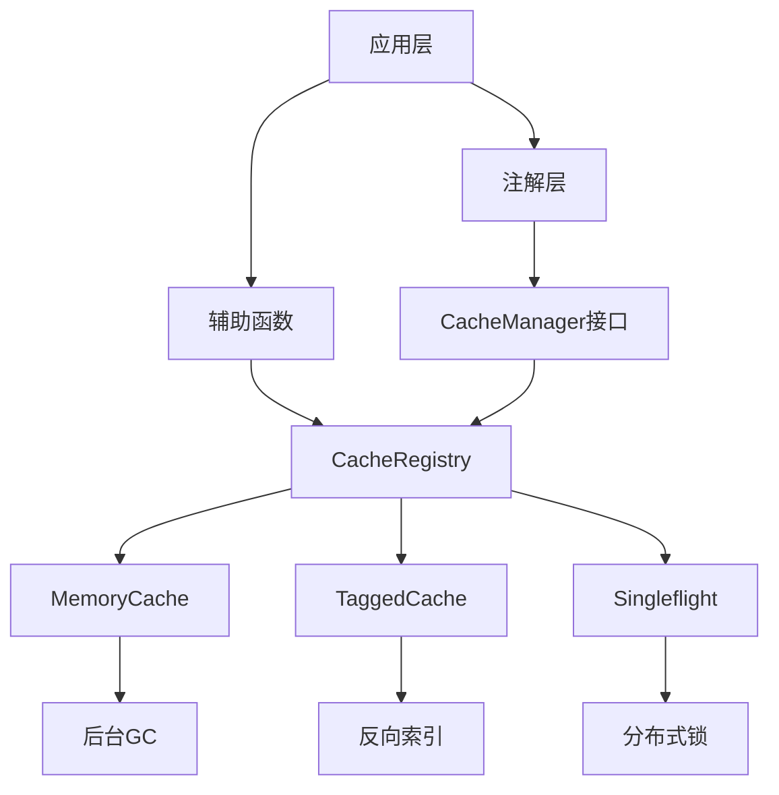
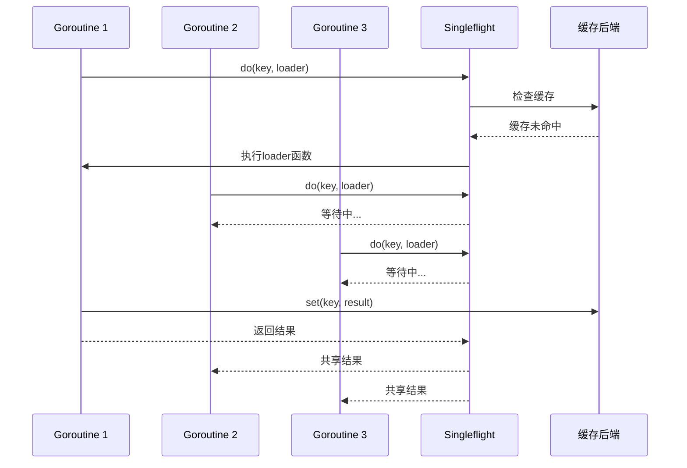

# 缓存系统

## 系统架构概述

Photon缓存系统是一个高性能、多后端支持的统一缓存抽象层，采用分层架构设计，提供企业级缓存解决方案。系统核心基于接口抽象，支持内存缓存、Redis等多种后端实现，并提供丰富的缓存管理功能。

### 核心设计理念

缓存系统遵循**统一抽象、多后端支持、高性能并发**的设计原则。通过`Cache`接口定义标准操作，`CacheRegistry`提供多实例管理，`MemoryCache`实现高性能内存存储，`TaggedCache`支持标签化批量操作，`Singleflight`提供缓存击穿防护[^1]。

### 架构层次


图：缓存系统分层架构（类型：架构图）

## 核心组件设计

### Cache接口抽象

`Cache`接口定义了缓存系统的核心操作契约，提供统一的存储、检索、删除和统计功能[^2]：

```v
pub interface Cache {
mut:
    get(key string) !string
    set(key string, value string, ttl_seconds int) !
    delete(key string) !
    has(key string) bool
    clear() !
    keys() []string
    size() int
}
```

这种设计确保了所有缓存实现的一致性，支持运行时切换不同的缓存后端。

### CacheRegistry注册中心

`CacheRegistry`作为缓存实例的管理中心，支持命名缓存的多实例管理[^3]：

- **多实例支持**：通过`caches`映射管理多个命名缓存实例
- **默认缓存**：提供默认缓存实例，简化使用
- **线程安全**：使用`RwMutex`保护注册表操作
- **Singleflight集成**：内置缓存击穿防护机制

```v
pub struct CacheRegistry {
pub mut:
    caches        map[string]&Cache
    default_cache &Cache = new_memory_cache('default')
    singleflight  &Singleflight = new_singleflight()
mut:
    mu sync.RwMutex
}
```

## MemoryCache高性能实现

### 并发安全设计

`MemoryCache`采用读写分离的并发设计，最大化读取性能[^4]：

- **读操作优化**：`get()`、`has()`、`keys()`、`size()`使用读锁，支持并发读取
- **写操作保护**：`set()`、`delete()`、`clear()`使用写锁，确保数据一致性
- **命中计数分离**：`hit_counts`使用独立`Mutex`，避免读锁下的写操作（修复CRITICAL #4数据竞争）

```v
pub struct MemoryCache {
pub:
    name        string
    max_size    int = 10000
    gc_interval int = 30
pub mut:
    entries map[string]MemCacheEntry
mut:
    mu         sync.RwMutex
    hit_mu     sync.Mutex
    hit_counts map[string]u64
    stop_gc    chan bool = chan bool{cap: 1}
}
```

### TTL过期机制

缓存条目支持灵活的TTL配置[^5]：

- **绝对过期时间**：基于Unix时间戳的精确过期控制
- **永久缓存**：TTL=0表示永不过期
- **后台清理**：独立的GC goroutine定期清理过期条目
- **惰性检查**：访问时实时检查过期状态

```v
pub struct MemCacheEntry {
pub:
    key        string
    value      string
    expires_at i64
    created_at i64
pub mut:
    accessed_at i64
    hit_count   int
}

fn (e &MemCacheEntry) is_expired() bool {
    if e.expires_at == 0 {
        return false
    }
    return time.now().unix() > e.expires_at
}
```

### LRU淘汰策略

当缓存达到容量限制时，系统采用LRU（最近最少使用）策略进行淘汰[^6]：

- **访问时间跟踪**：每次访问更新`accessed_at`时间戳
- **过期优先**：优先淘汰已过期的条目
- **LRU选择**：在非过期条目中选择最久未访问的进行淘汰

```v
fn (mut mc MemoryCache) evict_one_unsafe() {
    mut oldest_key := ''
    mut oldest_time := i64(9223372036854775807)
    
    for key, entry in mc.entries {
        if entry.is_expired() {
            mc.entries.delete(key)
            mc.hit_mu.@lock()
            mc.hit_counts.delete(key)
            mc.hit_mu.unlock()
            return
        }
        if entry.accessed_at < oldest_time {
            oldest_time = entry.accessed_at
            oldest_key = key
        }
    }
    
    if oldest_key.len > 0 {
        mc.entries.delete(oldest_key)
        mc.hit_mu.@lock()
        mc.hit_counts.delete(oldest_key)
        mc.hit_mu.unlock()
    }
}
```

## 缓存击穿防护

### Singleflight机制

`Singleflight`组件实现了缓存击穿防护，通过请求合并机制防止大量并发请求同时穿透缓存[^7]：


图：Singleflight缓存击穿防护流程（类型：序列图）

### 核心实现

Singleflight通过`Call`结构体跟踪进行中的请求，确保同一key的多个请求共享一次执行结果[^8]：

```v
pub struct Singleflight {
mut:
    mu    sync.Mutex
    calls map[string]&Call
}

pub fn (mut sf Singleflight) do(key string, f fn () !string) !string {
    sf.mu.@lock()
    existing := sf.calls[key] or { unsafe { nil } }
    if isnil(existing) {
        // Leader - 创建新的Call并执行
        mut c := &Call{key: key}
        sf.calls[key] = c
        sf.mu.unlock()
        
        result := f() or {
            sf.mu.@lock()
            c.err = err.msg()
            c.done = true
            sf.calls.delete(key)
            sf.mu.unlock()
            return err
        }
        
        sf.mu.@lock()
        c.val = result
        c.done = true
        sf.calls.delete(key)
        sf.mu.unlock()
        return result
    }
    
    // Follower - 等待Leader完成
    sf.mu.unlock()
    for {
        sf.mu.@lock()
        done := existing.done
        sf.mu.unlock()
        if done {
            break
        }
        time.sleep(1 * time.millisecond)
    }
    
    sf.mu.@lock()
    get_val := existing.val
    get_err := existing.err
    sf.mu.unlock()
    
    if get_err.len > 0 {
        return error(get_err)
    }
    return get_val
}
```

## 缓存标签系统

### TaggedCache设计

`TaggedCache`提供基于标签的缓存分组管理，支持批量失效操作[^9]：

- **标签命名空间**：通过标签组合生成唯一的缓存键前缀
- **反向索引**：维护`tag_to_keys`映射，实现O(k)批量失效
- **并发安全**：使用`RwMutex`保护索引操作
- **索引同步**：确保索引与实际缓存状态的一致性

```v
pub struct TaggedCache {
pub mut:
    store       &Cache
    tags        []string
    tag_to_keys map[string][]string
mut:
    mu sync.RwMutex
}
```

### 批量失效机制

标签系统的核心优势是高效的批量失效。通过反向索引，`flush()`操作的时间复杂度从O(n*m)降低到O(k)，其中k是实际标记的键数量[^10]：

```v
pub fn (mut tc TaggedCache) flush() ! {
    // 收集需要删除的键并清理索引
    tc.mu.@lock()
    mut keys_to_delete := []string{}
    for tag in tc.tags {
        if tag !in tc.tag_to_keys {
            continue
        }
        keys := tc.tag_to_keys[tag] or { []string{} }
        keys_to_delete << keys
        tc.tag_to_keys.delete(tag)
    }
    tc.mu.unlock()
    
    // 在不持有tc.mu的情况下从存储中删除
    for key in keys_to_delete {
        tc.store.delete(key) or {}
    }
}
```

### 索引维护

TaggedCache在每次`set()`和`delete()`操作时都会维护反向索引，确保索引的准确性[^11]：

```v
pub fn (mut tc TaggedCache) set(key string, value string, ttl_seconds int) ! {
    full_key := tagged_key(tc.tags, key)
    tc.store.set(full_key, value, ttl_seconds)!
    
    // 维护反向索引
    tc.mu.@lock()
    defer { tc.mu.unlock() }
    for tag in tc.tags {
        if tag !in tc.tag_to_keys {
            tc.tag_to_keys[tag] = []string{}
        }
        mut key_set := tc.tag_to_keys[tag] or { []string{} }
        if full_key !in key_set {
            key_set << full_key
        }
        tc.tag_to_keys[tag] = key_set
    }
}
```

## 分布式锁实现

### CacheLock设计

基于缓存后端实现分布式锁，提供跨进程的互斥访问控制[^12]：

```v
pub struct CacheLock {
pub mut:
    store    &Cache
    name     string
    ttl_sec  int
    owner    string
    acquired bool
mut:
    mu sync.Mutex
}
```

### 锁获取机制

锁的获取采用非阻塞和阻塞两种模式，支持超时控制[^13]：

- **非阻塞获取**：`acquire()`立即返回获取结果
- **阻塞获取**：`block()`等待直到获取成功或超时
- **所有权验证**：只有锁的拥有者才能释放锁
- **强制释放**：提供紧急情况下的强制释放机制

```v
pub fn (mut cl CacheLock) acquire() !bool {
    cl.mu.@lock()
    defer { cl.mu.unlock() }
    
    if cl.store.has(cl.name) {
        return false
    }
    
    cl.store.set(cl.name, cl.owner, cl.ttl_sec)!
    cl.acquired = true
    return true
}

pub fn (mut cl CacheLock) block(timeout_sec int) !bool {
    deadline := time.now().unix() + timeout_sec
    
    for {
        if cl.acquire()! {
            return true
        }
        if time.now().unix() >= deadline {
            return false
        }
        time.sleep(50 * time.millisecond)
    }
}
```

## Spring风格抽象

### CacheManager接口

为提供与Spring Cache兼容的API，系统实现了`CacheManager`和`NamedCache`接口[^14]：

```v
pub interface CacheManager {
    get_cache(name string) !NamedCache
    get_cache_names() []string
}

pub interface NamedCache {
mut:
    get(key string) !ValueWrapper
    put(key string, value ValueWrapper) !
    evict(key string) !
    clear() !
}
```

### 适配器模式

通过适配器模式将底层Cache接口适配为Spring风格的接口[^15]：

```v
pub struct NamedCacheAdapter {
pub mut:
    store &Cache
}

pub fn (mut nca NamedCacheAdapter) get(key string) !ValueWrapper {
    val := nca.store.get(key)!
    return ValueWrapper{value: val}
}
```

## 注解支持

### 缓存注解

系统提供Spring风格的缓存注解支持，包括`@cacheable`、`@cache_evict`、`@cache_put`[^16]：

```v
pub struct CacheableAttribute {
pub mut:
    cache_name  string = 'default'
    key_pattern string
    ttl_seconds int = 300
    condition   string
    unless      string
}
```

### 条件缓存

支持基于条件的缓存操作，提供灵活的缓存策略[^17]：

- **condition**：在方法执行前评估，满足条件才进行缓存操作
- **unless**：在方法执行后评估，满足条件则跳过缓存
- **SpEL表达式**：支持Spring Expression Language风格的动态表达式

## 性能优化策略

### 读写分离优化

MemoryCache采用读写分离设计，最大化并发读取性能[^18]：

- **读操作并发**：多个goroutine可以同时执行读操作
- **写操作独占**：写操作获取独占锁，确保数据一致性
- **命中计数分离**：hit计数更新使用独立锁，避免读锁下的写操作

### 后台GC机制

独立的GC goroutine定期清理过期条目，避免主路径的性能影响[^19]：

```v
fn (mut mc MemoryCache) start_gc() {
    spawn fn (mc &MemoryCache) {
        for {
            select {
                _ := <-mc.stop_gc {
                    return
                }
                else {}
            }
            unsafe { mc.evict_expired() }
            
            // 响应式睡眠，支持快速停止
            for _ in 0 .. mc.gc_interval {
                select {
                    _ := <-mc.stop_gc {
                        return
                    }
                    else {
                        time.sleep(1 * time.second)
                    }
                }
            }
        }
    }(mc)
}
```

### 内存优化

通过多种策略优化内存使用[^20]：

- **容量限制**：支持最大容量配置，防止内存溢出
- **惰性清理**：访问时检查过期，避免频繁扫描
- **批量操作**：支持批量设置和删除，减少锁竞争

## 缓存一致性保证

### TOCTOU防护

系统实现了Time-of-Check-Time-of-Use（TOCTOU）防护，确保过期条目删除的安全性[^21]：

```v
pub fn (mut mc MemoryCache) get(key string) !string {
    mc.mu.@rlock()
    entry := mc.entries[key] or {
        mc.mu.runlock()
        return error('cache miss: key "${key}" not found')
    }
    
    if entry.is_expired() {
        mc.mu.runlock()
        // 重新获取写锁并再次检查（TOCTOU修复）
        mc.mu.@lock()
        if key in mc.entries {
            e := mc.entries[key]
            if e.is_expired() {
                mc.entries.delete(key)
                mc.hit_mu.@lock()
                mc.hit_counts.delete(key)
                mc.hit_mu.unlock()
            }
        }
        mc.mu.unlock()
        return error('cache miss: key "${key}" expired')
    }
    
    value := entry.value
    mc.mu.runlock()
    
    // 在独立锁下更新命中计数
    mc.hit_mu.@lock()
    current := mc.hit_counts[key]
    mc.hit_counts[key] = current + 1
    mc.hit_mu.unlock()
    
    return value
}
```

### 索引一致性

TaggedCache提供`cleanup_stale()`方法，定期清理索引中的过期条目，确保索引与实际缓存状态的一致性[^22]：

```v
pub fn (mut tc TaggedCache) cleanup_stale() ! {
    tc.mu.@lock()
    defer { tc.mu.unlock() }
    
    mut tags_to_delete := []string{}
    mut tags_to_update := map[string][]string{}
    
    for tag, keys in tc.tag_to_keys {
        mut new_keys := []string{}
        for key in keys {
            if tc.store.has(key) {
                new_keys << key
            }
        }
        if new_keys.len == 0 {
            tags_to_delete << tag
        } else if new_keys.len != keys.len {
            tags_to_update[tag] = new_keys
        }
    }
    
    for tag in tags_to_delete {
        tc.tag_to_keys.delete(tag)
    }
    for tag, keys in tags_to_update {
        tc.tag_to_keys[tag] = keys
    }
}
```

## 使用模式与最佳实践

### 基础使用

```v
// 创建缓存注册中心
mut registry := new_cache_registry()

// 基础缓存操作
registry.set("user:123", "John Doe", 3600)!
user := registry.get("user:123")!

// 使用get_or_load防止缓存击穿
user := registry.get_or_load("user:123", 3600, fn () !string {
    return fetch_user_from_db("123")
})!
```

### 标签化缓存

```v
// 创建标签化缓存
mut tagged_cache := new_tagged_cache(registry.default_cache, ["posts", "user:123"])

// 设置带标签的缓存
tagged_cache.set("post:456", "Post Content", 3600)!

// 批量失效标签相关的所有缓存
tagged_cache.flush()!
```

### 分布式锁

```v
// 创建分布式锁
mut lock := new_cache_lock(registry.default_cache, "resource:lock", 30)

// 非阻塞获取
if lock.acquire()! {
    // 执行临界区代码
    lock.release()!
}

// 阻塞获取（带超时）
if lock.block(10)! {
    defer { lock.release()! }
    // 执行临界区代码
}
```

### 辅助函数

```v
// remember模式
result := remember(mut registry, "expensive:calc", 300, fn () !string {
    return expensive_calculation()
})!

// 永久缓存
result := remember_forever(mut registry, "static:data", fn () !string {
    return load_static_data()
})!

// 批量操作
put_many(mut registry, {
    "key1": "value1",
    "key2": "value2"
}, 3600)!

values := get_many(mut registry, ["key1", "key2"])
```

## 监控与统计

### 缓存统计

MemoryCache提供详细的缓存统计信息[^23]：

```v
pub struct CacheStats {
pub:
    total_entries   int
    expired_entries int
    total_hits      int
    max_size        int
}

pub fn (mut mc MemoryCache) stats() CacheStats {
    mc.mu.@rlock()
    mut expired := 0
    for _, entry in mc.entries {
        if entry.is_expired() {
            expired++
        }
    }
    total_entries := mc.entries.len
    mc.mu.runlock()
    
    mc.hit_mu.@lock()
    mut total_hits := u64(0)
    for _, count in mc.hit_counts {
        total_hits += count
    }
    mc.hit_mu.unlock()
    
    return CacheStats{
        total_entries:   total_entries,
        expired_entries: expired,
        total_hits:      int(total_hits),
        max_size:        mc.max_size,
    }
}
```

### 性能监控

通过统计信息可以监控缓存系统的健康状态：

- **命中率计算**：`total_hits / total_entries`
- **内存使用率**：`total_entries / max_size`
- **过期条目比例**：`expired_entries / total_entries`

## 扩展与集成

### 多后端支持

系统设计支持多种缓存后端，通过实现`Cache`接口可以轻松集成：

- **Redis缓存**：通过`RedisCache`接口集成Redis客户端
- **Memcached**：实现Memcached协议适配器
- **分布式缓存**：支持集群化缓存解决方案

### Spring生态集成

通过Spring风格的接口和注解支持，可以无缝集成到Spring应用中：

- **CacheManager抽象**：与Spring Cache抽象兼容
- **注解驱动**：支持声明式缓存配置
- **AOP集成**：通过切面实现透明缓存

## 参考文献

[^1]: [缓存系统核心接口定义](src/cache/cache.v#L13-L22)
[^2]: [CacheRegistry多实例管理](src/cache/cache.v#L24-L40)
[^3]: [CacheRegistry注册中心实现](src/cache/cache.v#L42-L79)
[^4]: [MemoryCache并发安全设计](src/cache/memory.v#L47-L59)
[^5]: [MemCacheEntry结构体和过期检查](src/cache/memory.v#L20-L38)
[^6]: [LRU淘汰策略实现](src/cache/memory.v#L66-L96)
[^7]: [Singleflight缓存击穿防护](src/cache/singleflight.v#L27-L31)
[^8]: [Singleflight.do方法实现](src/cache/singleflight.v#L44-L100)
[^9]: [TaggedCache标签化缓存](src/cache/cache_tags.v#L54-L62)
[^10]: [TaggedCache.flush批量失效](src/cache/cache_tags.v#L133-L151)
[^11]: [TaggedCache.set索引维护](src/cache/cache_tags.v#L81-L98)
[^12]: [CacheLock分布式锁实现](src/cache/cache_tags.v#L14-L24)
[^13]: [CacheLock锁获取机制](src/cache/cache_tags.v#L36-L65)
[^14]: [Spring风格CacheManager接口](src/cache/manager.v#L26-L31)
[^15]: [NamedCacheAdapter适配器实现](src/cache/manager.v#L43-76)
[^16]: [缓存注解属性定义](src/cache/annotation.v#L10-L41)
[^17]: [注解属性解析逻辑](src/cache/annotation.v#L45-L81)
[^18]: [MemoryCache读写分离设计](src/cache/memory.v#L8-16)
[^19]: [后台GC机制实现](src/cache/memory.v#L97-L123)
[^20]: [容量限制和惰性清理](src/cache/memory.v#L187-L190)
[^21]: [TOCTOU防护实现](src/cache/memory.v#L145-L168)
[^22]: [索引一致性维护](src/cache/cache_tags.v#L159-L186)
[^23]: [缓存统计信息结构](src/cache/memory.v#L150-L157)